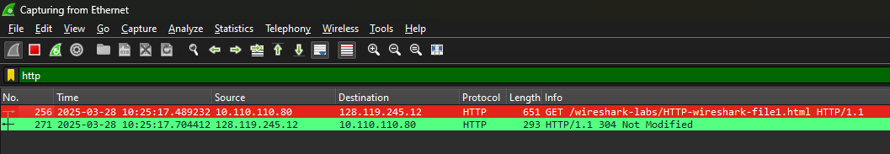
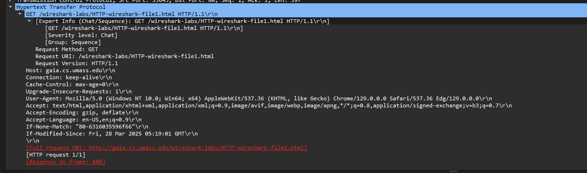
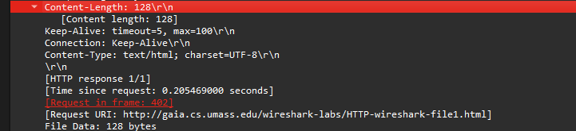

# Part 1 (HTTP)

## A. The Basic HTTP GET/RESPONSE Interaction

### Instructions:

1.  Download a very simple HTML file—one that is very short and contains no embedded objects. Do the following:
    
    -   **Start up your web browser**
        
    -   **Start up the Wireshark packet sniffer** (but don’t yet begin packet capture). Enter “http” (just the letters, not the quotation marks) in the display-filter-specification window, so that only captured HTTP messages will be displayed later in the packet-listing window. (We’re only interested in the HTTP protocol here, and don’t want to see the clutter of all captured packets).
        
    -   **Wait a bit more than one minute** (you’ll see why shortly), and then begin Wireshark packet capture.
        
    -   **Enter the following to your browser:**
        
        ```
        http://gaia.cs.umass.edu/wireshark-labs/HTTP-wireshark-file1.html
        ```
        
    -   **Stop Wireshark packet capture**.
        
    
    If you are unable to run Wireshark on a live network connection, you can download a packet trace that was created when the steps above were followed.


***
 
### Questions:

By looking at the information in the HTTP GET and response messages, answer the following questions. When answering these questions, you should print out the GET and response messages and indicate where in the message you’ve found the information that answers the following questions.
 


1.  **Is your browser running HTTP version 1.0 or 1.1? What version of HTTP is the server running? What languages (if any) does your browser indicate that it can accept to the server?**
    
    -   **Browser HTTP Version:** HTTP/1.1 (`GET /wireshark-labs/HTTP-wireshark-file1.html HTTP/1.1`)
        
    -   **Accepted Languages:** `en-US,en;q=0.9` 
        
2.  **What is the IP address of your computer? Of the gaia.cs.umass.edu server?**
    
-   **Your Computer's IP:** `10.110.110.80` 
    
-   **Server’s IP (gaia.cs.umass.edu):** `128.119.245.12`
        
3.  **What is the status code returned from the server to your browser?**
    
    -   **Status Code:** `408 Request Timeout` 
        
4.  **When was the HTML file that you are retrieving last modified at the server?**
    
    -   **Last Modified Date:** `Fri, 28 Mar 2005 05:19:01 GMT` 

        
5.  **How many bytes of content are being returned to your browser?**
     
 **Content-Length:** `128 bytes`