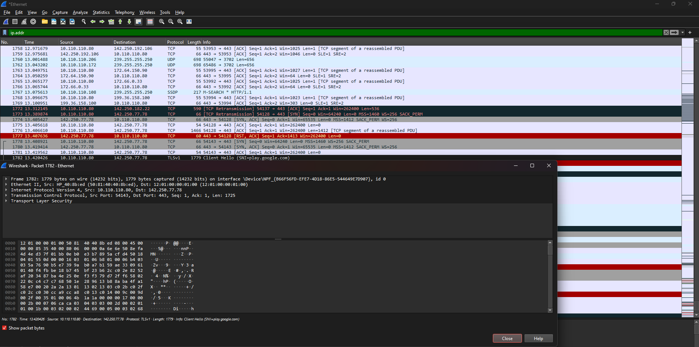
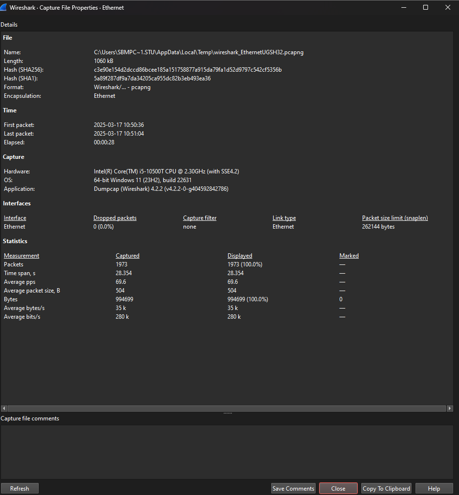
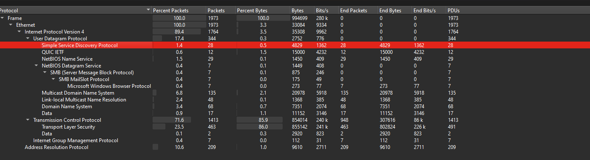

 
***

# 1.    LAB WORK REPORT

Lab Work 06 Report:

Wireshark. Network Traffic Capture and Analyze.

|     |     |     |
| --- | --- | --- |
| **Student Name Surname:** | **Student ID:** | **Date:** |
| Dev Mandora | 57480230046 | 17/03/2025 |

 
| **Nr** | **Parameter** | **Value** |
| --- | --- | --- |
| 1   | Time of capture, min | 0.47 min (28.354 seconds) |
| 2   | Packets | 1973 packets |
| 3   | Bytes, MiB | 0.948 MiB (994,699 bytes) |
| 4   | Average packet size, B | 504 bytes |
| 5   | Average packets per second, pps | 69.6 pps |
| 6   | Average bytes per second, B/s | 35 kB/s (35,000 bytes per second) |
| 7   | Relative network load (L) | **L = (Traffic [Mbits] / T [sec]) / Bandwidth [Mbits/sec]**   **Bandwidth** = 100 Mbits/sec   **Traffic** = 994,699 bytes = 7.957592 Mbits (1 byte = 8 bits)   **L** = (7.957592 Mbits / 28.354 sec) / 100 Mbits/sec ≈ **0.0028** (0.28%) |

***
 
| **Nr** | **Protocol** | **Traffic, MiB** | **Traffic, %** |
| --- | --- | --- | --- |
| 1   | IPv6 | 0   | 0%  |
| 2   | IPv4 | 33.5 MiB | 3.5% |
| 3   | --UDP | 2.7 MiB | 0.3% |
| 4   | --TCP | 85.5 MiB | 86.0% |
| 5   | --ICMP | 0   | 0%  |
| 6   | ARP | 9.6 MiB | 10.6% |
| 7   | 802.1X | 0   | 0%  |
|     | **SUMM** | **99.3 MiB** | **100%** |

 8. What is the ratio of the numbers of application (http, mail, ftp, …) to numbers of service (dns, icmp, arp, …) protocols?  Anr 
-   **SMB (Server Message Block Protocol)**: 7 packets
-   **Microsoft Windows Browser Protocol**: 7 packets
-   **Total Anr** = **7 + 7 = 14 packets**
  
***

|     |     |     |     |     |     |     |     |     |
| --- | --- | --- | --- | --- | --- | --- | --- | --- |
| 3.3. Ethernet Traffic Distribution by Nodes  Fill in the table (for the 5 most active network nodes by Bytes). For initial data use the  **Statistics/Endpoints/Ethernet**. |     |     |     |     |     |     |     |     |
| **Nr** | **MAC-address** | **IP- address** | **Traffic** |     |     |     |     |     |
| Rx input |     | Tx output |     | Overall |     |
| МiB | %   | МiB | %   | МiB | %   |
| 1.  |     |     |     |     |     |     |     |     |
| 2.  |     |     |     |     |     |     |     |     |
| 3.  |     |     |     |     |     |     |     |     |
| 4.  |     |     |     |     |     |     |     |     |
| 5.  |     |     |     |     |     |     |     |     |
|     | **SUM** |     |     | **100** |     | **100** |     | **100** |
| 6. Which IP nodes are the most loaded, given the direction of traffic? Incoming –  Outgoing – Overall – |     |     |     |     |     |     |     |     |

|     |     |     |
| --- | --- | --- |
| 3.4. Display Filters  Fill in the table. Write and test in Wireshark 5 simple search filters (Display Filters) using AND, OR, NO to display packets from (to) a specific node generated by ICMP, DNS, ARP requests (responses) when accessing any server of your choice. |     |     |
| **Nr** | **Display Filter** | **Description** |
| 1   |     |     |
| 2   |     |     |
| 3   |     |     |
| 4   |     |     |
| 5   |     |     |

|     |     |     |     |
| --- | --- | --- | --- |
| 3.5. Network Problem Analyze  Analyze the 5 note/warning/error problems existing on the network. Find and read information about network problems on the Internet.  For initial data use the **Analyze/Expert Information**. |     |     |     |
| **Nr** | **Expert Information** | **Severity** | **Your Short Description (Problem Analyse)** |
| 1   | Connection reset (RST) | Warning |     |
| 2   | TCP keep-alive segment | Note |     |
| 3   | ... | Error |     |
| 4   |     |     |     |
| 5   |     |     |     |

***
     
3.6. Exporting File from Traffic Stream

**Tasks.**

You need to find and export the N-th (by size) JPEG file, where N is your number in the class list (the 1st by number takes the largest file, the 2nd takes the next, etc.).

Determine the starting packet number, source IP, destination IP, Jpeg file size. Paste this image into your Report

**Instruction.**

For initial data use **File / Export Object / HTTP ...** / sort information by file size (large to small) / find the N-th file content-jpeg / read interesting information / save this file.

**Answer.**

1.  Your variant Nr: ??

2.  Starting packet number:

3.  Source IP:

4.  Destination IP, jpeg file size:

5.  Jpeg file size:

6.  Picture