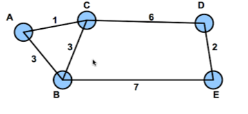
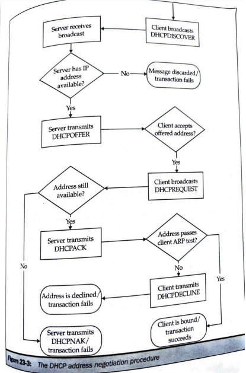
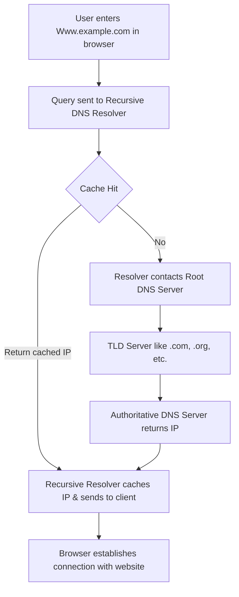
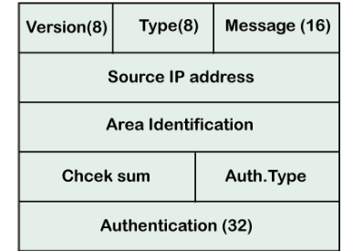

## questions not solved from qb
> [!abstract] mention routing table for wlan / soho questions
> include more explnation for count to infinity problem question


***Q.12 Problems on IP Addressing (4/6)***  
#answer  
***
***
***Q.27 Explain dijkstra algorithm with example (4/6)***  
#answer  

***
***Q.28 List the features of OSPF, explain the states of the OSPF (6/8)***  
#answer  

***
***Q.32 Define the following · Count to infinity problem · Split Horizon · Split Horizon and poison reverse (4/6/8)***  
#answer  

***Q.29 List and explain DNS resource Records or define any specific(given) Record (6/8)***  
#answer  

***
***Q.30 Explain/compare Link state and Distance vector Routing Algorithm (6/8)***  
#answer  

***
***Q.31 In the figure below, there is a topology of an AS, Discuss how the shortest path tree for node A using Link state and distance vector. (Topology may vary) (6/8)***  
 
#answer  


# NWA pt 1 qb solution
***Q.1 Illustrate the network related job and list the jobs available in the market (4/6)***  
#answer  
-   **Network-related jobs** primarily focus on managing, maintaining, designing, and optimizing computer networks to ensure efficient data communication and secure connectivity.

**(Any 4 for 4 marks)**

-   Network Administrator
-   Network Engineer
-   Wireless Network Engineer
-   Cloud Network Engineer
-   Network Support Technician
-   Network Architect

**(6 mark version, add one-line definition)**

1.  **Network Administrator** - Manages network hardware, software, and security.
2.  **Network Engineer** - Designs and implements network infrastructure.
3.  **Wireless Network Engineer** - Manages and optimizes Wi-Fi networks.
4.  **Cloud Network Engineer** - Builds and secures cloud-based networks.
5.  **Network Support Technician** - Troubleshoots and maintains network issues.
6.  **Network Architect** - Designs scalable and secure network systems.

***

***Q.2 List the responsibility and skills required for the Network Administrator (4/6/8 marks)***

#solvify:

Network Administrator is responsible for managing network infrastructure, ensuring smooth connectivity, and maintaining security.

Responsibilities:

1. Installation & Configuration – Set up and configure network hardware (routers, switches, firewalls) and software.


2. Monitoring & Troubleshooting – Regularly monitor network performance, identify issues, and troubleshoot failures to prevent downtime.


3. Security Management – Implement security policies, manage firewalls, VPNs, and intrusion detection/prevention systems.


4. Network Maintenance – Perform regular updates, patch vulnerabilities, and ensure network devices function optimally.


5. User Access Control – Manage authentication, permissions, and ensure only authorized users can access network resources.


6. Documentation & Backup – Maintain records of network configurations, topologies, and implement data backup strategies.


7. Disaster Recovery Planning – Ensure network resilience by planning for failover, redundancy, and recovery mechanisms.


8. Collaboration with IT Teams – Work alongside other IT professionals to integrate network solutions with applications and services.


Skills Needed:

1. Networking Fundamentals – Understanding of OSI model, TCP/IP, DNS, DHCP, and subnetting.


2. Hardware & Vendor Knowledge – Proficiency with Cisco, Juniper, and other network equipment.


3. Troubleshooting Expertise – Diagnosing network issues using tools like Wireshark, Ping, Traceroute.


4. Network Security Skills – Knowledge of firewalls, IDS/IPS, VPNs, and cybersecurity best practices.


5. Cloud Networking – Familiarity with AWS, Azure, or Google Cloud networking concepts.


6. Automation & Scripting – Using Python, Bash, or PowerShell for network automation.


7. Certifications (Preferred) – CCNA, CCNP, CompTIA Network+, or similar networking certifications.


***
***Q.3 List the responsibility and skills required for the Network Architect/designer (4/6/8 marks)***

#sovify

A Network Architect/Designer is responsible for designing and building complex, scalable, and secure network systems to meet an organization’s requirements.

Responsibilities:

1. Network Infrastructure Planning – Develop long-term strategies for network scalability, resilience, and performance optimization.


2. Network Design & Implementation – Design LAN, WAN, cloud, and hybrid network architectures with redundancy and security considerations.


3. Technology Selection – Evaluate and recommend networking hardware and software (routers, switches, firewalls, SD-WAN).


4. Security & Compliance – Implement security best practices, firewalls, VPNs, and ensure compliance with industry standards.


5. Performance Monitoring & Optimization – Analyze traffic patterns, ensure minimal latency, and optimize data routing.


6. Collaboration & Documentation – Work with IT teams for network deployment and maintain network design documentation.


Skills Needed:

1. Advanced Network Design – Expertise in designing enterprise-level networks with high availability.


2. Routing & Switching Expertise – Deep knowledge of routing protocols (OSPF, BGP, EIGRP) and switching technologies.


3. Cloud & Virtualization – Proficiency in AWS, Azure, SDN (Software-Defined Networking), and virtualization tools.


4. Security & Compliance – Knowledge of cybersecurity best practices, firewall configurations, and network segmentation.


5. Analytical & Problem-Solving Skills – Ability to troubleshoot complex network issues and optimize performance.


6. Certifications (Preferred) – CCIE, CCDE, AWS Certified Advanced Networking, or equivalent.


---


***Q.4 List the jobs related to Computer Network and certification required (4 marks)***
#solvify:

| **Job Role**                   | **Description**                                              | **Required Certification**                     |  
|---------------------------------|--------------------------------------------------------------|----------------------------------------------|  
| **Network Administrator**       | Manages daily network operations, security, and troubleshooting.  | **CCNA (Cisco Certified Network Associate)** |  
| **Network Engineer**            | Designs, implements, and maintains network infrastructures.  | **CCNP (Cisco Certified Network Professional)** |  
| **Network Security Specialist** | Protects network systems from cyber threats and vulnerabilities. | **CEH (Certified Ethical Hacker)** |  
| **Cloud Network Engineer**      | Works with cloud-based networking solutions and security.  | **AWS Certified Advanced Networking** |

---
***Q.5 List and explain the devices connected on the Network (4/6 marks)***
#answer
> [!attention] there might be topology given and from that topology we might need to list and explain (i have included major devices considering what may ask in topology, if no topology is given then just list our any 4-6)
> Contents


- **Router** – Directs data packets between networks and manages traffic efficiently.  
- **Switch** – Connects multiple devices within a network and forwards data to the intended recipient.  
- **Hub** – Broadcasts data to all connected devices, operating at the physical layer.  
- **Modem** – Converts digital data to analog for transmission over telephone lines and vice versa.  
- **Bridge** – Connects two or more network segments, improving efficiency.  
- **Access Point (AP)** – Provides wireless connectivity by extending the wired network.  
- **Firewall** – Monitors and controls incoming and outgoing network traffic for security.  
- **Repeater** – Amplifies signals to extend network coverage.
- **Server** – A high-performance computer that provides various network services such as dhcp, file storage, web hosting, email management, and database access. 
***
***Q.6 Explain the Goals for the Network design (4)***  
#answer  
### following are the goals for network design

- **Performance** – Ensure high-speed and low-latency connectivity for optimal data transmission.  

- **Scalability** – Design a flexible network that can expand seamlessly with organizational growth.  

- **Reliability** – Minimize downtime by implementing redundancy and failover mechanisms.  

- **Security** – Safeguard data and systems against unauthorized access, threats, and cyber-attacks.  

- **Cost-Efficiency** – Maintain a balance between performance and budget without compromising quality.  

- **Compliance** – Ensure adherence to industry standards, legal regulations, and best practices.  
***

***Q.7 Design a WLAN/VLAN (6/8)***  
#answer  


## **VLAN Configuration Based on Topology**


***

## **Updated VLAN Configuration with Renamed PCs**

### **Network Topology Overview**

-   **Devices Used:**
    -   **1 Router (`Router1`)**
    -   **1 Switch (`Switch42`)**
    -   **4 PCs (`PC-A`, `PC-B`, `PC-C`, `PC-D`)**
-   **VLAN Assignments:**
    -   **VLAN 10:** `PC-A` and `PC-B`
    -   **VLAN 20:** `PC-C` and `PC-D`
-   **Connections:**
    -   **Router to Switch:** Trunk link (`fa0/0` on Router1 to `fa0/5` on Switch)
    -   **Switch to PCs:** Access links
        -   `fa0/1` → **PC-A** (VLAN 10)
        -   `fa0/2` → **PC-B** (VLAN 10)
        -   `fa0/3` → **PC-C** (VLAN 20)
        -   `fa0/4` → **PC-D** (VLAN 20)

***

### **1. VLAN Configuration on Switch**

```cisco
enable
configure terminal

! Create VLANs
vlan 10
 name Management
vlan 20
 name HR

! Assign ports to VLANs
interface fa0/1
 switchport mode access
 switchport access vlan 10

interface fa0/2
 switchport mode access
 switchport access vlan 10

interface fa0/3
 switchport mode access
 switchport access vlan 20

interface fa0/4
 switchport mode access
 switchport access vlan 20

! Configure trunk link to the router
interface fa0/5
 switchport mode trunk
 switchport trunk allowed vlan 10,20

exit
write memory
```

***

### **2. Router Configuration (Router-on-a-Stick)**

```cisco
enable
configure terminal

! Create subinterfaces for VLANs
interface GigabitEthernet0/0.10
 encapsulation dot1Q 10
 ip address 192.168.10.1 255.255.255.0

interface GigabitEthernet0/0.20
 encapsulation dot1Q 20
 ip address 192.168.20.1 255.255.255.0

exit
write memory
```

***

### **3. IP Addressing Plan for PCs**

| **Device** | **IP Address** | **Subnet Mask** | **Default Gateway** |
| --- | --- | --- | --- |
| **PC-A** (VLAN 10) | `192.168.10.2` | `255.255.255.0` | `192.168.10.1` |
| **PC-B** (VLAN 10) | `192.168.10.3` | `255.255.255.0` | `192.168.10.1` |
| **PC-C** (VLAN 20) | `192.168.20.2` | `255.255.255.0` | `192.168.20.1` |
| **PC-D** (VLAN 20) | `192.168.20.3` | `255.255.255.0` | `192.168.20.1` |

***

### **4. Testing VLAN Configuration**

1.  **Verify VLANs on Switch**
    
    ```cisco
    show vlan brief
    ```
    
2.  **Check Trunk Configuration**
    
    ```cisco
    show interfaces trunk
    ```
    
3.  **Test Connectivity:**
    -   **PC-A → PC-B (Ping Test)** → Should work (Same VLAN 10)
    -   **PC-C → PC-D (Ping Test)** → Should work (Same VLAN 20)
    -   **PC-A → PC-C (Ping Test)** → Should **not** work (Different VLANs)
    -   **PC-A → Router (192.168.10.1)** → Should work
    -   **PC-C → Router (192.168.20.1)** → Should work
    -   **PC-A → PC-C (After Routing)** → Should work once inter-VLAN routing is enabled.

***


***Q.8 Design a SOHO network (6/8)***  
#answer  

> [!attention] There can be toplogy given and from that topology you need to identify and then list and explain

 
### **Implementation Steps**

### **1. Physical Layout in Packet Tracer**

1.  Open **Cisco Packet Tracer** and create the topology as shown in the image.
2.  Place the following devices:
    -   **1 Router** (Router0)
    -   **1 Switch**
    -   **6 PCs** (PC0, PC1, PC2, PC3, PC4, PC5)
    -   **1 Network Printer (Printer0)**
3.  Use the following cables to connect the devices:
    -   **Router to Switch** → **Straight-through cable** (GigabitEthernet0/1 on Router0 to FastEthernet0/1 on Switch)
    -   **Switch to PCs** → **Straight-through cable** (FastEthernet ports on Switch to Ethernet ports on PCs)
    -   **Switch to Printer** → **Straight-through cable** (FastEthernet0/7 on Switch to Printer0)

***

### **2. Router Configuration**

1.  Access the router's CLI (`enable` → `configure terminal`).
2.  Assign an IP address to the **GigabitEthernet 0/1** interface:
    
    ```
    interface GigabitEthernet0/1
    ip address 192.168.1.1 255.255.255.0
    no shutdown
    exit
    ```
    
3.  Enable **DHCP** to assign IP addresses dynamically:

   ```cisco
ip dhcp pool SOHO-Network
 network 192.168.1.0 255.255.255.0
 default-router 192.168.1.1
 dns-server 8.8.8.8
 address range 192.168.1.100 192.168.1.200
```


    

***

### **3. Printer Configuration**

1.  Assign a **static IP address** to Printer0: **192.168.1.2**

***

### **4. IP Addressing Plan for PCs**

| **Device** | **IP Address** | **Subnet Mask** | **Default Gateway** | **DNS Server** |
| --- | --- | --- | --- | --- |
| **PC0** | Assigned by DHCP (e.g., 192.168.1.100) | 255.255.255.0 | 192.168.1.1 | 8.8.8.8 |
| **PC1** | Assigned by DHCP (e.g., 192.168.1.101) | 255.255.255.0 | 192.168.1.1 | 8.8.8.8 |
| **PC2** | Assigned by DHCP (e.g., 192.168.1.102) | 255.255.255.0 | 192.168.1.1 | 8.8.8.8 |
| **PC3** | Assigned by DHCP (e.g., 192.168.1.103) | 255.255.255.0 | 192.168.1.1 | 8.8.8.8 |
| **PC4** | Assigned by DHCP (e.g., 192.168.1.104) | 255.255.255.0 | 192.168.1.1 | 8.8.8.8 |
| **PC5** | Assigned by DHCP (e.g., 192.168.1.105) | 255.255.255.0 | 192.168.1.1 | 8.8.8.8 |

***

### **5. Test Connectivity**

1.  **Check DHCP Assignment**
    
    -   Use `ipconfig` on any PC to verify that it receives an IP dynamically.
2.  **Ping Tests**
    
    -   **From any PC**, ping **192.168.1.1** (Router) to confirm LAN connectivity.
    -   **From any PC**, ping **192.168.1.2** (Printer) to verify printer access.

***
***Q.9 State the difference between Hub and Switch (Min Four points) (4 marks)***
#answer
(do any 4, i have added 6 for flexbility)
### **Difference Between Hub and Switch**

| **Aspect** | **Hub** | **Switch** |
| --- | --- | --- |
| **Definition** | Hub is **not an intelligent device** as it forwards data to all connected devices without analyzing the destination. | Switch is **an intelligent device** as it forwards data only to the intended recipient using MAC address learning. |
| **Data Transmission & Collisions** |Can lead to network congestion and collisions. | Sends data only to the intended device, reducing congestion and preventing collisions. |
| **Speed & Bandwidth** | Works at a lower speed as bandwidth is shared among all devices. | Faster as each device gets dedicated bandwidth, improving performance. |
| **Duplex Mode & Network Efficiency** | Supports only **Half-Duplex**, allowing data to be sent or received but not both at the same time. | Supports **Full-Duplex**, enabling simultaneous sending and receiving of data, improving efficiency. |
| **Cost & Usage** | Cheaper and suitable for **small networks** with minimal data traffic. | More expensive but ideal for **large networks** requiring efficient data transfer. |
| **OSI Layer** | Operates at the **Physical Layer (Layer 1)**. | Operates at the **Data Link Layer (Layer 2)** or sometimes **Layer 3**. |
******

***Q.10 Explain Bridge, Switch and Router (4)***  
#answer  


A **Bridge** operates at the **Data Link Layer (Layer 2)** and connects multiple network segments, forwarding data based on **MAC addresses**. It helps reduce unnecessary traffic and improves network efficiency.

A **Switch** is an advanced bridge that also works at **Layer 2 (or Layer 3)**. It **intelligently forwards data** only to the intended device, preventing collisions and supporting **Full-Duplex communication** for better performance.

A **Router** operates at the **Network Layer (Layer 3)** and directs data between networks using **IP addresses**. It enables internet communication and provides **NAT, traffic filtering, and firewall functionalities**, making it essential for WANs.

***Q.11 Define ARP , RARP BOOTP and DHCP (4/6/8)***  
#answer  

**ARP (Address Resolution Protocol)** maps IP addresses to MAC addresses, allowing devices to communicate within the same network. It works by broadcasting a request to find the MAC address of a given IP address. Once received, the sender updates its ARP cache for future use. For example, when a device wants to send data on a local network, it uses ARP to find the recipient's MAC address.

**RARP (Reverse Address Resolution Protocol)** performs the reverse of ARP by mapping MAC addresses to IP addresses. It is mainly used by diskless devices that do not have a stored IP address. The device sends a request, and a RARP server responds with the correct IP address. For example, a diskless workstation at startup uses RARP to get its IP address from a network server.


**BOOTP (Bootstrap Protocol)** is a network protocol used to manually assign fixed IP addresses to devices, primarily for diskless computer systems and workstations. It does not support automatic configuration or temporary IP addressing, which can lead to errors due to manual setup. BOOTP is incompatible with DHCP users and has a lease period of 30 days. It is mainly utilized to provide essential network data to diskless systems.

**DHCP (Dynamic Host Configuration Protocol)** is a more advanced protocol that automatically assigns and manages IP addresses. It supports temporary IP allocation with a lease period (e.g., 1 day for Cisco routers and 8 days for Microsoft). Unlike BOOTP, DHCP prevents configuration errors, supports mobile devices, and is compatible with BOOTP users. It is widely used in networks to dynamically allocate and manage IP addresses efficiently.

***
***Q.12 Problems on IP Addressing (4/6)***  
#answer  


***
***Q.13 What are private and public addresses? Where do we use them? (4 marks)***
#answer
**Private IP addresses** are a set of IP addresses that are reserved for use within local networks (such as a home or an office). These addresses are not routable on the public internet, meaning devices with private IPs cannot be accessed directly from outside the local network.

- Network Address Translation (NAT) is often used to allow these devices to access the internet by mapping them to a public IP address.

the private address range is
    -   `10.0.0.0` to `10.255.255.255`
    -   `172.16.0.0` to `172.31.255.255`
    -   `192.168.0.0` to `192.168.255.255`


-   **Public Addresses** are unique IP addresses that are accessible over the internet. Any IP address that falls outside the private address ranges is considered public. These addresses are assigned to devices that need to be accessed from anywhere on the internet, such as web servers, email servers, or any other internet-facing service.
    

***
***Q.14 Compare BOOTP and DHCP (at least 6 points) (6 marks)***
#answer
 

|     |     |     |
| --- | --- | --- |
| Features | BOOTP | DHCP |
| Full Forms | BOOTP is an abbreviation for Bootstrap Protocol. | DHCP is an abbreviation for Dynamic Host Configuration Protocol. |
| Auto configuration | It only supports manual configuration, not auto configuration. | It automatically gets and allocates IP addresses. |
| Compatibility | It is not compatible with DHCP users. | It is compatible with BOOTP users. |
| Temporary IP addressing | It doesn't provide a temporary IP address. | It provides a temporary IP address but for a limited time. |
| Mobile Devices | It doesn't support mobile devices. | It supports mobile devices. |
| Error Probability | It may cause errors because of the manual configuration. | It prevents the chances of errors because of the automatic configuration. |
| Lease timing | The lease period of the BOOTP protocol is 30 days. | The lease time is 1 day for Cisco routers and 8 days for Microsoft. |
| Usage | It is utilized to provide data to diskless computer systems and workstations. | It is utilized to forward and store the required information on the needed disks. |
***
***Q.15 Draw and Explain the Format of DHCP (6 marks)***
#answer
![The DHCP Message Format - Special Edition Using TCP/IP, Second Edition  [Book]](https://www.oreilly.com/api/v2/epubs/0789727099/files/0789727099_ch14lev1sec7_image01.gif)
### **Explanation of DHCP Message Format Fields**  

1. **Op Code (Operation Code)** – Specifies whether the message is a request (1) from the client or a reply (2) from the server.  

2. **HTYPE (Hardware Type)** – Identifies the type of network hardware (e.g., Ethernet = 1).  

3. **HLEN (Hardware Address Length)** – Defines the length of the hardware (MAC) address.  

4. **HOPS** – Used by DHCP relay agents to track the number of times a request has been forwarded.  

5. **Transaction ID (XID)** – A unique identifier used to match DHCP requests and responses.  

6. **Seconds Elapsed** – Indicates the time (in seconds) since the client started the DHCP request process.  

7. **Flags** – Determines whether the response should be broadcast (1) or unicast (0).  

8. **Client IP Address (CIADDR)** – Filled by the client when requesting renewal of an existing IP lease.  

9. **Your IP Address (YIADDR)** – Contains the IP address assigned by the server to the client.  

10. **Server IP Address (SIADDR)** – Specifies the IP address of the DHCP server offering the lease.  

11. **Gateway IP Address (GIADDR)** – Used by DHCP relay agents to forward messages between clients and servers.  

12. **Client MAC Address (CHADDR)** – Stores the physical MAC address of the client device requesting an IP.  

13. **Server Hostname** – Optional field that can contain the DHCP server’s hostname.  

14. **Boot File Name** – Used for bootstrapping devices that require an OS or firmware download from a remote server.  

15. **Options Field** – Contains additional network configuration parameters, such as subnet mask, gateway, lease time, and DNS servers.  
***

***Q.16 Explain with neat diagram the DORA process of DHCP (6 marks)***
#answer

### **DHCP DORA Process**

The **DORA** process consists of four steps that enable a DHCP client to obtain an IP address dynamically from a DHCP server.

1.  **Discover (D)**
    
    -   The **DHCP Client** broadcasts a **DHCP Discover** message to locate an available DHCP server.
    -   This message is sent as a broadcast because the client does not yet have an IP address.
2.  **Offer (O)**
    
    -   The **DHCP Server** responds with a **DHCP Offer** message, which contains an available IP address, subnet mask, gateway, lease duration, and other configuration details.
    -   The **Offer** is sent as a **unicast** directly to the client.
3.  **Request (R)**
    
    -   The **DHCP Client** sends a **DHCP Request** message to indicate that it accepts the offered IP address.
    -   This message is broadcast to inform other DHCP servers that it is accepting an offer from a specific server.
4.  **Acknowledge (A)**
    
    -   The **DHCP Server** sends a **DHCP Acknowledgment (ACK)** message, confirming the lease of the IP address to the client.
    -   The client can now use the assigned IP address to communicate on the network.


***
***Q.17 Draw and explain with flowchart the Address Negotiation Process of DHCP (8 marks)***
#answer
 

The DHCP address negotiation process is crucial for network connectivity which  automates IP address assignment by using the DORA sequence (Discover, Offer, Request, Acknowledge), a client initiates a broadcast (Discover) to locate DHCP servers. Servers respond with offered IP addresses (Offer). The client selects an offer and requests it specifically (Request), and the server confirms the assignment (Acknowledge). This dynamic negotiation prevents IP conflicts and streamlines network management.


1.  **Client Broadcasts Discovery:** A new device joins the network and sends a "DHCPDISCOVER" message to find a DHCP server.
    
2.  **Server Offers an IP:** A DHCP server receives the request and, if it has an available IP, sends a "DHCPOFFER" with a proposed IP address.
    
3.  **Client Requests the Offer:** The client chooses an offer and broadcasts a "DHCPREQUEST" to accept that specific IP address.
    
4.  **Server Confirms Assignment:** The server verifies the IP is still available and sends a "DHCPACK" to confirm the assignment to the client.
    
5.  **Client Checks for Conflicts:** The client uses ARP to make sure no other device is already using the assigned IP address.
    
6.  **Successful Binding or Decline:** If no conflict is found, the client uses the IP. If a conflict is detected, the client sends a "DHCPDECLINE" and the process restarts.


***
***Q.18 Draw and explain with flowchart the Lease Renewal Process of DHCP (8 marks)***
#answer

 

This flowchart describes the process of DHCP (Dynamic Host Configuration Protocol) lease renewal, which allows a network device (client) to maintain its IP address without interruption. The process is designed to be robust, handling various scenarios including server availability and lease expiration.
 * Renewing State (T1): The client first attempts to renew its lease at time T1, before it expires. It unicasts a DHCPREQUEST directly to the server that originally granted the lease (binding server).
 * Binding Server Response:
   * Success: If the binding server is available and can renew the address, it responds with a DHCPACK, confirming the renewal and resetting the lease timer.
   * Failure: If the server is unavailable or cannot renew the address (e.g., the address is no longer available), it responds with a DHCPNAK, terminating the lease.
 * Rebinding State (T2): If the initial renewal attempt fails or the client doesn't receive a response before time T2 (a later time before lease expiration), it enters the rebinding state.
 * Broadcast Request: In the rebinding state, the client broadcasts a DHCPREQUEST, seeking any DHCP server that can renew its lease. This is crucial for handling situations where the original server is down.
 * Server Response:
   * Success: If any server responds with a DHCPACK, the client's lease is renewed.
   * Failure: If no server responds, the lease eventually expires, requiring the client to go through the initial DHCP discovery process to obtain a new IP address.
   ***


***Q.19 How is a DNS query resolved? (4/6 marks)***
#answer

***
A **DNS query** follows a structured process. When a user enters a domain name in a browser, the request goes to a **recursive DNS resolver**, which checks its cache. If not found, it queries a **root DNS server**, which directs it to the **TLD server** (e.g., `.com`). The **TLD server** provides the **authoritative DNS server**, which returns the domain’s IP address. The resolver caches the response and sends the IP to the client, allowing the browser to connect to the destination server.

***
***Q.20 Define DNS and explain its working (explain all steps with example) (6/8 marks)***
#answer
The **Domain Name System (DNS)** is a process  that translates human-readable domain names (e.g., `example.com`) into numerical IP addresses (e.g., `192.168.1.1`). This process allows users to access websites without memorizing complex IP addresses.


***
When a user types **`www.example.com`** in a browser, the query is sent to a **recursive DNS resolver**, which first checks its **cache** for a stored IP address. If the IP is found (**Yes - Cache Hit**), the resolver immediately returns the IP to the browser, allowing the website to load without further queries. If the IP is not found (**No - Cache Miss**), the resolver forwards the query to a **root DNS server**, which directs it to the relevant **Top-Level Domain (TLD) server** (e.g., `.com`). The **TLD server** then points to the **authoritative DNS server**, which provides the correct IP address. The resolver caches this IP for future use and sends it to the browser, which then establishes a connection with the destination server, successfully loading the website.

***


***Q.21 State the Role of Root DNS server, Authoritative DNS server, and TLD DNS Server (4/6/8 marks)***
#answer
```8 marks version```

The Domain Name System (DNS) is a process that translates human-readable domain names into IP addresses, allowing users to access websites easily. It operates through a hierarchical structure involving multiple DNS servers, each playing a specific role in resolving domain names efficiently. The three key components of this system are the Root DNS Server, TLD DNS Server, and Authoritative DNS Server.

The Root DNS Server is the first step in the DNS resolution process. It does not store domain-specific IP addresses but directs queries to the appropriate Top-Level Domain (TLD) DNS Server based on the domain extension, such as .com, .org, or .edu. There are 13 globally distributed root servers, ensuring redundancy, fault tolerance, and efficient query handling. This server forms the backbone of the internet's DNS infrastructure, enabling the proper routing of domain resolution requests.

The TLD DNS Server manages domain names within a specific top-level domain (TLD), such as .com, .net, or .org. When a query reaches the TLD server, it does not provide the final IP address but instead directs the request to the Authoritative DNS Server responsible for the specific domain. This classification helps organize and streamline domain resolution, ensuring faster responses and reducing DNS query loads.

The Authoritative DNS Server is the final authority for a domain name. It stores and maintains the actual DNS records, including A (IPv4 address), AAAA (IPv6 address), MX (Mail Exchange), and CNAME (Canonical Name) records. When a request reaches the authoritative DNS server, it provides the correct IP address associated with the domain name, allowing the user's browser to establish a connection. This ensures that the domain resolution process is accurate, secure, and up to date.

Example of DNS Query Flow:

A user enters www.example.com in a web browser.

The request is sent to a Root DNS Server, which directs it to the .com TLD DNS Server.

The TLD DNS Server forwards the query to the Authoritative DNS Server for example.com.

The Authoritative DNS Server responds with the IP address of example.com.

The browser uses the IP address to establish a connection and load the website.


This structured DNS hierarchy ensures efficient, scalable, and secure domain resolution, enabling seamless access to websites across the internet.

*** 

***Q.22 Define routing and explain different types of Routing (4)***  
#answer  
### **Routing**

**Routing** is the process of determining the best path for data packets to travel from the source to the destination across networks. It ensures efficient communication between devices in different networks.

#### **Types of Routing:**

-   **Static Routing:** Manually configured routes that do not change. Suitable for **small, stable networks** but lacks adaptability.
-   **Dynamic Routing:** Uses routing protocols to update routes **automatically**. Common protocols include **RIP, OSPF, and EIGRP**. Ideal for **large, changing networks**.
-   **Default Routing:** A single predefined route used to forward packets when no specific route is found. Useful for **smaller networks connecting to a larger network**.
***
***Q.23 Define the terms Delivery, forwarding and Routing on Network Layer (4/6)***  
#answer  


#### **1. Delivery**

Delivery refers to the process of transferring data packets to their intended **final destination**. It can be classified into two types:

-   **Direct Delivery:** Occurs when the sender and receiver are on the **same network**, allowing the packet to reach the destination without intermediaries.
-   **Indirect Delivery:** Happens when the sender and receiver are on **different networks**, requiring packets to pass through one or more **routers**.

#### **2. Forwarding**

Forwarding is the process of **moving a packet** from one network interface to another **within a router**. It ensures that packets reach the correct next hop towards their destination. Key aspects include:

-   **Routing Table Lookup:** The router checks its **routing table** to determine the next hop.
-   **Efficient Packet Switching:** Forwarding ensures packets are sent through the most **efficient path** within a network.

#### **3. Routing**

Routing is the process of determining the **best path** for a packet to travel across multiple networks. It involves:

-   **Routing Protocols:** Such as **RIP, OSPF, and BGP**, which help routers build and maintain **dynamic routing tables**.
-   **Path Selection:** Choosing the most **efficient and reliable route** to ensure optimal data transmission.

***
***Q.24 Classify the routing protocols and explain IGP and EGP (4/6)***  
#answer  


Routing protocols are classified into two main types based on their area of operation:

#### **1. Interior Gateway Protocols (IGP)**

IGP operates **within a single Autonomous System (AS)**, such as an organization's internal network. It helps in efficient communication between routers inside the same AS. Common IGP protocols include:

-   **RIP (Routing Information Protocol)** – Uses **distance vector** routing.
-   **OSPF (Open Shortest Path First)** – Uses **link-state** routing for better scalability.
-   **EIGRP (Enhanced Interior Gateway Routing Protocol)** – A hybrid protocol combining features of both distance vector and link-state protocols.

#### **2. Exterior Gateway Protocols (EGP)**

EGP operates **between different Autonomous Systems**, facilitating communication across the internet. It helps in establishing connections between networks owned by **different organizations**. The most widely used EGP protocol is:

-   **BGP (Border Gateway Protocol)** – Ensures efficient routing and traffic management between ISPs and large networks globally.

By using IGP for internal routing and EGP for external routing, networks maintain efficient **data transmission and internet connectivity**.
***
***Q.25 Explain the concept of metric routing (4)***  
#answer  

Metric routing is a method used by **routing protocols** to determine the **best path** for data packets based on specific criteria. A **metric** is a numerical value assigned to different paths, with the **lowest metric indicating the most efficient route**.

#### **Common Routing Metrics:**

-   **Hop Count:** Number of routers a packet passes through. _(Used in RIP)_
-   **Bandwidth:** Available data transfer rate on a path. _(Used in OSPF)_
-   **Delay:** Time taken for a packet to traverse the route.
-   **Cost:** Custom value set by network administrators based on network policies.
-   **Reliability:** Stability and consistency of a route over time.

#### **Example:**

Suppose a packet needs to travel from **Router A to Router D**, and there are two possible paths:

1.  **Path 1:** A → B → D (Hop Count = 2, Bandwidth = 100 Mbps)
2.  **Path 2:** A → C → D (Hop Count = 2, Bandwidth = 50 Mbps)

If **RIP** is used, both paths have the same **hop count**, so either can be chosen. However, if **OSPF** is used, **Path 1** will be preferred because it has a **higher bandwidth (100 Mbps)**, making it more efficient.
***
***Q.26 Explain RIP, write steps to configure it. (6/8)***  
#answer  

Routing Information Protocol (RIP) is a **distance-vector routing protocol** used in IPv4 (**RIPv1, RIPv2**) and IPv6 (**RIPng**) networks. It determines the best route using **hop count** as a metric, with a **maximum hop limit of 15** to prevent routing loops. RIP updates its routing table **every 30 seconds** by broadcasting its table to neighboring routers.

#### **Example:**

Consider a network with three routers (**R1, R2, and R3**). If **R1** needs to send data to **R3**, it checks its **routing table**:


   `R1 -------- R2 -------- R3                 `

#### **Routing Table for R1**

| **Destination** | **Next Hop** | **Hop Count** |
| --- | --- | --- |
| R2  | Direct | 1   |
| R3  | R2  | 2   |

#### **Routing Table for R2**

| **Destination** | **Next Hop** | **Hop Count** |
| --- | --- | --- |
| R1  | Direct | 1   |
| R3  | Direct | 1   |

#### **Routing Table for R3**
| **Destination** | **Next Hop** | **Hop Count** |
| --- | --- | --- |
| R2  | Direct | 1   |
| R1  | R2  | 2   |

-   If **R3 is reachable via R2** with a hop count of **1**, R1 forwards the data to R2.
-   If **R3 is directly connected to R1**, the hop count is **0**, and data is sent directly.
-   If multiple paths exist, **RIP selects the route with the fewest hops**.

Though **RIP is simple**, it suffers from **slow convergence** and the **count-to-infinity problem**. These issues are addressed in **RIP v2** and alternative protocols like **OSPF**, which offer better scalability and efficiency.

***
***Q.27 Explain dijkstra algorithm with example (4/6)***  
#answer  

***
***Q.28 List the features of OSPF, explain the states of the OSPF (6/8)***  
#answer  

***

***Q.29 List and explain DNS resource Records or define any specific(given) Record (6/8)***  
#answer  

***
***Q.30 Explain/compare Link state and Distance vector Routing Algorithm (6/8)***  
#answer  

***
***Q.31 In the figure below, there is a topology of an AS, Discuss how the shortest path tree for node A using Link state and distance vector. (Topology may vary) (6/8)***  
 
#answer  

***
***Q.32 Define the following · Count to infinity problem · Split Horizon · Split Horizon and poison reverse (4/6/8)***  
#answer  


***
***Q.33 Draw and explain the Message Format of OSPF (4/6)***  
#answer  

 
The **Open Shortest Path First (OSPF)** protocol is a link-state routing protocol used in **IP networks**. It ensures efficient routing by maintaining a complete topology of the network within an autonomous system (AS). The OSPF message format consists of multiple fields to facilitate communication between routers.

***

### **OSPF Message Format:**


1.  **Version (8 bits)** – Indicates the OSPF version being used. (e.g., OSPFv2 = 2, OSPFv3 = 3)
2.  **Type (8 bits)** – Specifies the OSPF packet type (Hello, Database Description, Link State Request, etc.).
3.  **Message Length (16 bits)** – Defines the total length of the OSPF message, including the header.
4.  **Source IP Address** – The IP address of the router sending the OSPF message.
5.  **Area Identification** – Identifies the OSPF area the router belongs to, ensuring correct routing updates.
6.  **Checksum** – Provides error detection to ensure data integrity.
7.  **Authentication Type (Auth. Type)** – Specifies the method used for authentication (e.g., Null, Simple Password, MD5).
8.  **Authentication (32 bits)** – Contains the authentication information required for secure OSPF communication.

***