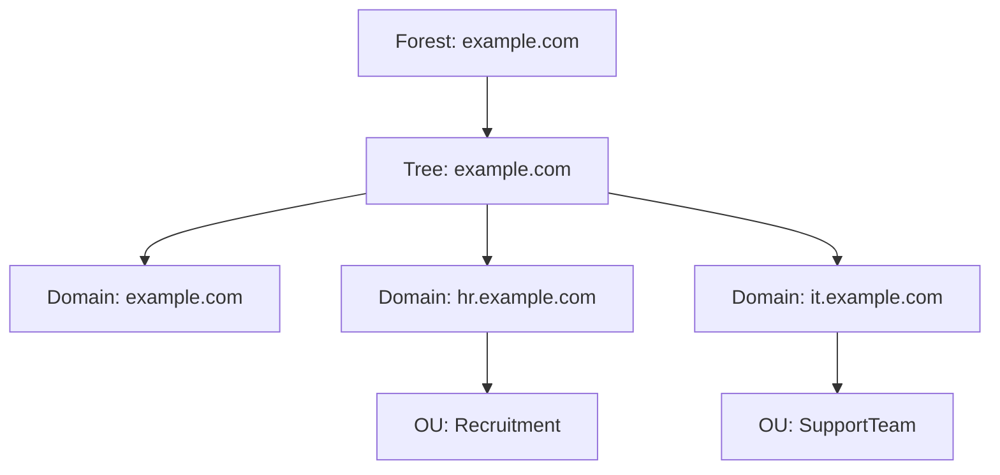

### ***Q. Define Active Directory and list its three important functions.***  
#solvify:

- **Active Directory (AD)** is a directory service developed by Microsoft for Windows domain networks.  
  - It is used for storing information about members of the domain, including devices and users.  
  - It helps in managing permissions and access to networked resources.

**Three important functions of Active Directory:**
- **Authentication and Authorization:**  
  Verifies user credentials and controls access to network resources based on those credentials.

- **Centralized Resource Management:**  
  Allows administrators to manage users, computers, and other resources from a central location.

- **Policy Enforcement:**  
  Uses Group Policy to apply security and configuration settings across all devices in the domain.

  ***

###  ***Q. Draw and explain the Logical Architecture of Active Directory with an example.***  
#solvify:

**Logical Architecture of Active Directory:**

- The logical architecture defines how the directory is structured logically (not physically), focusing on how objects are grouped and managed.

**Key Components:**
- **Forest:**  
  The topmost logical container that holds one or more domain trees. It provides a security boundary and a global catalog.

- **Tree:**  
  A collection of one or more domains that share a contiguous namespace (e.g., example.com, hr.example.com).

- **Domain:**  
  A logical group of network objects (users, groups, devices). It shares a common directory database and security policies.

- **Organizational Unit (OU):**  
  A container within a domain used to organize users, groups, and computers for easier management and application of Group Policies.

**Example:**  

**Diagram (to be drawn):**

***

  

1. Wireshark –
An open-source packet analyzer used to capture, display data packets in real time, allowing users to inspect network traffic 

2. Nmap (Network Mapper) –
A  network scanning tool used for discovering hosts, open ports, running services, and potential vulnerabilities in a network.

3. Tcpdump –
A command-line packet sniffer that captures network traffic on an interface, allowing filtering and protocol analysis directly from the terminal.

4. Netstat –
A command-line utility that displays current network connections, routing tables, interface stats, and helps diagnose network issues.

5. Nslookup –
A command-line DNS lookup tool used to query domain name system records like IP addresses, MX records, and more for troubleshooting DNS issues.

6. NS2 (Network Simulator 2) –
A discrete-event simulator widely used in academic research to model and analyze network protocols, routing algorithms, and network performance.

---

Let me know if you want these formatted into bullet points or a table for notes.
