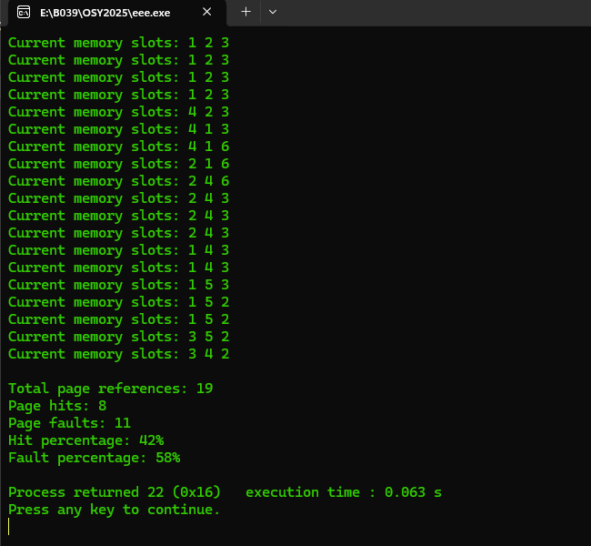
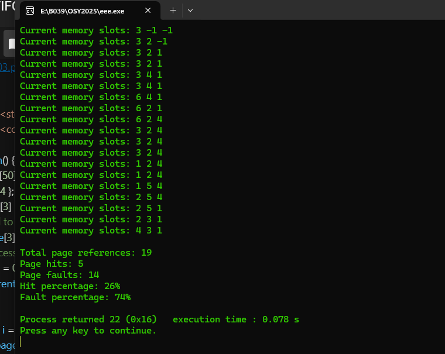

FIFO pagging (pre defined input)
```c
#include <stdio.h>
#include <conio.h>

void main() {
    char pro[50] = { 3, 2, 1, 3, 4, 1, 6, 2, 4, 3, 4, 2, 1, 4, 5, 2, 1, 3, 4 };  // Page reference string
    int slot[20] = { 1, 2, 3 };
    int hits = 0;
    int page_faults = 0;
    int front = 0;

    for (int i = 0; i < 19; i++) {
        int page = pro[i];
        int found = 0;

        // Check if the page is already in memory (in the slot array)
        for (int j = 0; j < 3; j++) {
            if (slot[j] == page) {
                found = 1;
                hits++;  // Page is already in memory, so increment the hit counter
                break;  // No page fault
            }
        }

        if (!found) {  // Page fault occurred
            page_faults++;

            // If there is space in memory (empty slot), insert the page
            int inserted = 0;
            for (int j = 0; j < 3; j++) {
                if (slot[j] == -1) {  // Empty slot found
                    slot[j] = page;
                    inserted = 1;
                    break;  // Insert the page and exit the loop
                }
            }

            // If no space is available, replace the oldest page using FIFO
            if (!inserted) {
                slot[front] = page;  // Replace the oldest page
                front = (front + 1) % 3;  // Move the 'front' to the next page (circular)
            }
        }

        printf("Current memory slots: ");
        for (int j = 0; j < 3; j++) {
            printf("%d ", slot[j]);
        }
        printf("\n");
    }


    int total_pages = 19;
    int hit_percentage = (hits * 100) / total_pages;
    int fault_percentage = 100 - hit_percentage;

    printf("\nTotal page references: %d\n", total_pages);
    printf("Page hits: %d\n", hits);
    printf("Page faults: %d\n", page_faults);
    printf("Hit percentage: %d%%\n", hit_percentage);
    printf("Fault percentage: %d%%\n", fault_percentage);
}


```
 
LRU
```c
#include <stdio.h>
#include <conio.h>

void main() {
    int pro[50] = { 3, 2, 1, 3, 4, 1, 6, 2, 4, 3, 4, 2, 1, 4, 5, 2, 1, 3, 4 };  // Page reference string
    int slot[3] = { -1, -1, -1 };  // Memory slots, initialized to -1 (empty)
    int time[3] = { 0, 0, 0 };  // Array to store the time of last access for each slot
    int hits = 0, page_faults = 0;
    int current_time = 0;  // Keeps track of the time for LRU

    for (int i = 0; i < 19; i++) {
        int page = pro[i];
        int found = 0;
        int oldest = 0;

        // Check if the page is already in memory
        for (int j = 0; j < 3; j++) {
            if (slot[j] == page) {
                found = 1;
                hits++;
                time[j] = current_time;  // Update the last access time for this page
                break;
            }
        }

        // If the page is not found, it's a page fault
        if (!found) {
            page_faults++;
            
            // Find the least recently used (LRU) page by checking the time array
            // If there's an empty slot, insert the page there
            int inserted = 0;
            for (int j = 0; j < 3; j++) {
                if (slot[j] == -1) {
                    slot[j] = page;
                    time[j] = current_time;  // Assign the current time as last access time
                    inserted = 1;
                    break;
                }
            }

            // If no empty slots, replace the LRU page
            if (!inserted) {
                for (int j = 0; j < 3; j++) {
                    if (time[j] < time[oldest]) {
                        oldest = j;
                    }
                }
                slot[oldest] = page;
                time[oldest] = current_time;  // Update last access time for the replaced page
            }
        }

        // Increment current time for each page access
        current_time++;

        // Print the current state of memory slots after each page reference
        printf("Current memory slots: ");
        for (int j = 0; j < 3; j++) {
            printf("%d ", slot[j]);
        }
        printf("\n");
    }

    // Calculate hit percentage and fault percentage
    int total_pages = 19;
    int hit_percentage = (hits * 100) / total_pages;
    int fault_percentage = 100 - hit_percentage;

    // Display results
    printf("\nTotal page references: %d\n", total_pages);
    printf("Page hits: %d\n", hits);
    printf("Page faults: %d\n", page_faults);
    printf("Hit percentage: %d%%\n", hit_percentage);
    printf("Fault percentage: %d%%\n", fault_percentage);
}


```
 