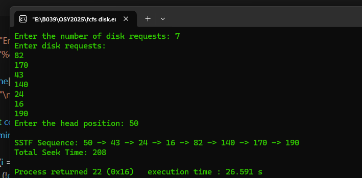

fcfs
```c
#include <stdio.h>
#include <conio.h>

int main(){
int n,i,head;
int total =0;

printf("enter the number of disk request:");
scanf("%d",&n);

int request[n];
printf("enter disk requests\n");
for(i=0;i<n;i++){
    scanf("%d",&request[i]);
}
printf("enter the head position");
scanf("%d",&head);

for(i=0;i<n;i++){
    total += abs(request[i]-head);
    head = request[i];
}

printf("total movement: %d",total);

}


```
 


```c
#include <stdio.h>
#include <conio.h>
#include <stdlib.h>

void main() {
    int n, i, head, total = 0;

    printf("Enter the number of disk requests: ");
    scanf("%d", &n);

    int request[n];
    printf("Enter disk requests:\n");
    for (i = 0; i < n; i++) {
        scanf("%d", &request[i]);
    }

    printf("Enter the head position: ");
    scanf("%d", &head);

    int done[100] = {0};
    printf("\nSSTF Sequence: %d", head);

    for (int count = 0; count < n; count++) {
        int minDist = 9999, idx = -1;

        for (i = 0; i < n; i++) {
            if (!done[i] && abs(request[i] - head) < minDist) {
                minDist = abs(request[i] - head);
                idx = i;
            }
        }

        total += minDist;
        head = request[idx];
        done[idx] = 1;

        printf(" -> %d", head);
    }

    printf("\nTotal Seek Time: %d\n", total);
}


```
 
