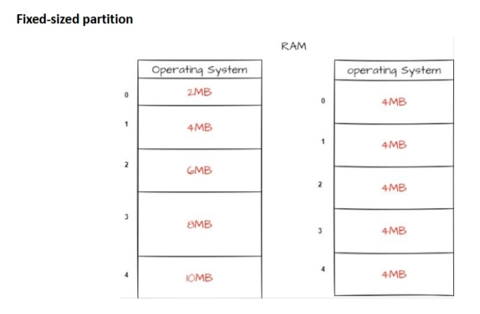
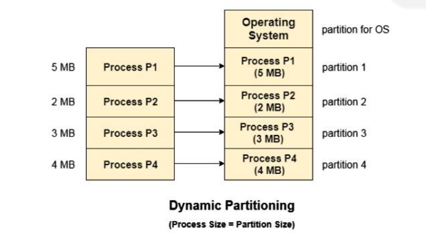
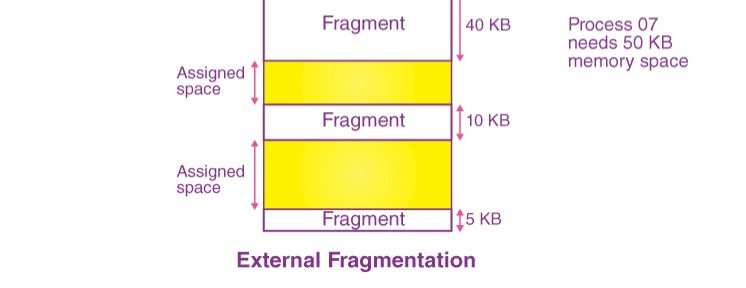
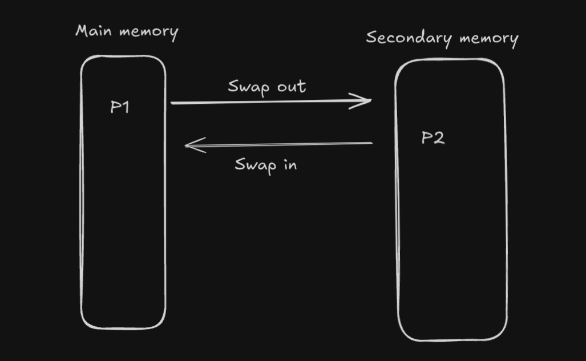
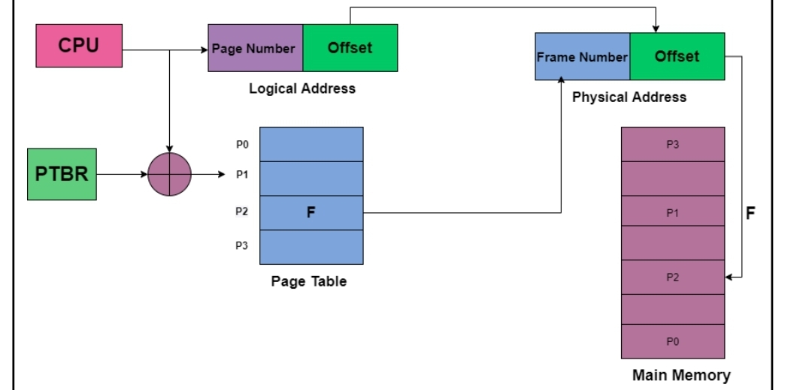
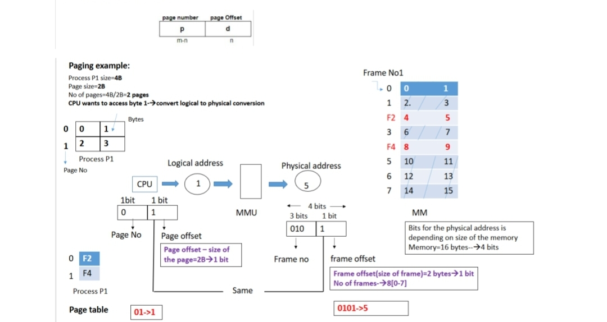
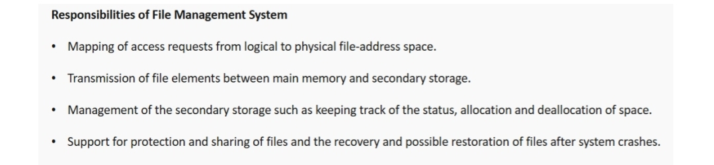
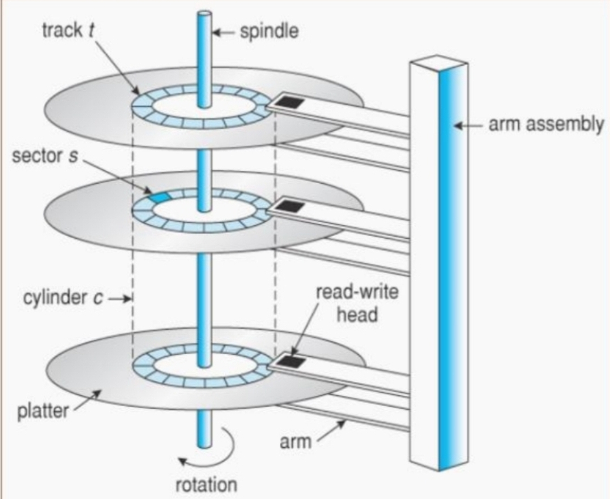
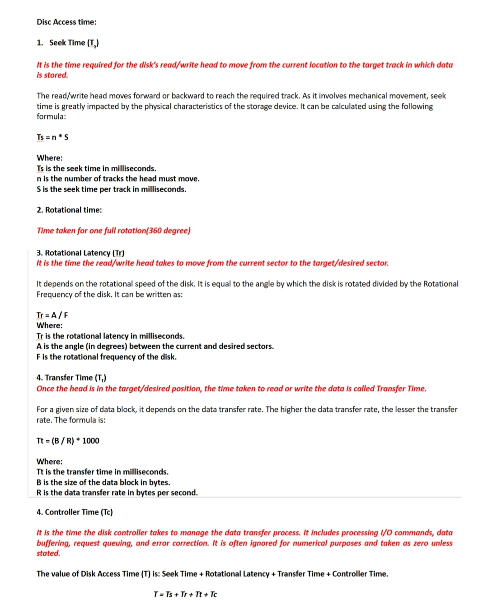
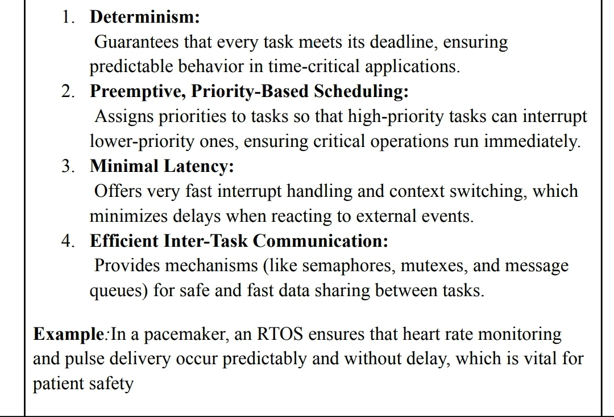

## Chapter 4: Memory Management

- [x] Describe fixed size multiple partitioning with neat diagram along with its advantages and disadvantages. *(3/4/6)*
     #answer
- In fixed-size partitioning, the **main memory is divided into a number of fixed-size partitions** at system startup.
- Each partition can hold **exactly one process**.
- The size of each partition is **fixed and predefined**.
- A process is loaded into the smallest available partition that fits.
- In the above diagram, the left side has the fixed partitioning of different sizes, and the right side has the fixed partitioning of equal sizes, i.e., 4MB.
   **Advantages of Fixed-Size Partitioning**

1. **Easy to implement**  
   - Implementing a division or partition is not a difficult task.  
   - Whether internal or external fragmentation occurs, it must process the specific partitions.

2. **Little OS overhead**  
   - Fixed partitions require a relatively low amount of computing power.

---

 **Disadvantages of Fixed-Size Partitioning**

1. **Internal Fragmentation**  
   - Inefficient use of main memory.  
   - No matter how small the program, it occupies the entire partition.  
   - This increases the chances of internal fragmentation.

2. **Limited process size**  
   - Typically, the main memory cannot accommodate larger processes than their partition size.  
   - It is impossible to resize the partition according to the size of incoming processes.
---

***

- [x] Describe dynamic partitioning with neat diagram along with its advantages and disadvantages. *(3/4/6)*
#answer

- In dynamic partitioning, the **main memory is not divided in advance**.
- Instead, memory is **allocated dynamically to processes** as they arrive, based on their size.
- The memory block is created **exactly equal to the size of the process**, minimizing internal fragmentation.
- When a process terminates, its memory is released and can be reused.

 

 **Advantages:**

1. **Efficient memory utilization**  
   - Memory is allocated as per the process size, reducing internal fragmentation.

2. **No fixed-size limitation**  
   - Processes of any size can be loaded as long as there is enough free memory.

  **Disadvantages:**

1. **External Fragmentation**  
   - As processes are loaded and removed, small gaps (holes) form, leading to inefficient space usage.

2. **Complex memory allocation**  
   - The allocation and deallocation is very complex since the partition size will be varied every time when it is assigned to a new process. OS has to keep track of all the partitions.
   
***
- [x] Explain internal and external fragmentation with the help of example. *(4/6)*
#answer

Internal fragmentation occurs when unused space remains within an allocated memory block because the process is smaller than the block size.
| **Allocation Overview**                          |
|--------------------------------------------------|
| Block Size: 4 MB → Process Size: 1 MB → Unused: 3 MB |
| Block Size: 8 MB → Process Size: 7 MB → Unused: 1 MB |
| Block Size: 8 MB → Process Size: 7 MB → Unused: 1 MB |
| Block Size: 16 MB → Process Size: 12 MB → Unused: 4 MB |
(fixed partitioning)
***

External fragmentation occurs as processes are loaded and removed from memory, leaving small gaps (holes) of unused space between allocated memory blocks, which makes it difficult to find contiguous space for new processes.

  
(dynamic partitioning )
***

- [x] Explain swapping with its advantages and disadvantages / Need of swapping / Example of swapping with diagram. *(4)*
    #answer
Swapping is a memory management technique where a process is temporarily moved from main memory to secondary storage and brought back later for execution.

Swap-Out – Moves a process from RAM to the hard disk (swap space).
Swap-In – Brings a process back from the hard disk to RAM.

Need for Swapping:
To free up RAM for other processes.
To increase multiprogramming.

 
Advantages

Better memory utilization by freeing unused space.
Supports multiprogramming, allowing more processes to run.

Disadvantages

Increased disk I/O, causing slower performance.
Swapping overhead may lead to execution delays.

***
- [x] Explain Paging with neat diagram in detail. Give advantages and disadvantages. *(6/8)*

Paging is a memory management technique where logical memory is divided into pages and physical memory into frames.
both pages and frames are of equal size

The operating system maps pages to frames using a page table, allowing non-contiguous memory allocation.

PTBR (Page Table Base Register) holds the starting address of the page table.
Page Number: Identifies the page in memory.

Page Offset: Locates data within that page.

Logical Address = Page Number + Offset
 
 

Advantages:

No external fragmentation
Efficient use of memory

Disadvantages:

Internal fragmentation in the last page
Extra memory needed for page tables

***

- [ ] Explain the concept of virtual memory and its working. *(4/6)*
- [ ] Explain demand paging *(4/6/8)*
- [ ] Explain Segmentation with neat diagram in detail with advantages and disadvantages. *(4/6)*
- [x] Describe the page replacement algorithm / Given a problem statement, Identify the number of page faults in any given algorithm. *(4)*

---

## Chapter 5: File Management

- [x] List the responsibilities of file management system. *(2/3/4)*
    
***

- [x] Draw and explain disk organization in OS *(3/4)*

  

A disk has multiple platters that rotate around a spindle. Each platter surface is divided into tracks, which are further split into sectors—the smallest storage unit. Tracks at the same position on all platters form a cylinder. A read/write head moves across the disk to access data. This structure allows the OS to store and retrieve data efficiently.

***
- [ ] Describe disc access time – Seek time, rotational time, Rotational latency, Transfer time, Controller time *(3/4)*
 
  ***    
- [x] Explain the different types of disk space management:
  - Contiguous allocation  
  - Non-contiguous allocation  
  - Chaining  
  - Indexing *(4/6/8)*
- [x] Examples based on Disk Scheduling algorithm:
  - FCFS  
  - SSTF  
  - SCAN  
  - CSCAN  
  - LOOK  
  - C-LOOK *(2/3/4)*

---

## Chapter 6: Case Studies – GUI Operating System and RTOS

- [x] Describe features of RTOS *(3/4)*
 
***
- [ ] Explain design principles of LINUX operating system *(3/4)*
- [ ] Draw and explain Linux architecture *(4/6)*
- [ ] Draw and Explain Linux file system *(4/6)*
- [ ] Describe networking in Linux *(6)*