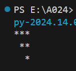
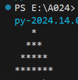
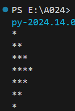

```python 
# pattern
for x in range(4):
    space = x
    star = 3-x
    print(" " * space + "*" * star)
```
 
***
```python
# pattern 3
r = 4
for x in range(r):
    space = r - x -1 
    
    star = 2 * x + 1
    print(" " * space +"*" * star)
   
```
 
***
```python
# pattern 5
r = 3
for x in range(r):
  
    star =  x + 1
    print( "*" * star)
   
for w in range(r -1):
  
    star = r - 2 - w
    print( "*" * (star+1))
```
 