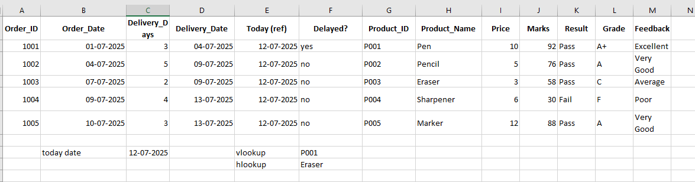

# Exercise 1: Excel Activity — `Data_for_Personal_Monthly_Expenditure`


- [x] **Section A: Freeze/Unfreeze Panes**

  1. **Freeze Top Row:**
     - Go to the **View** tab → Click **Freeze Panes** → Select **Freeze Top Row**.

  2. **Unfreeze Panes:**
     - Go to **View** tab → Click **Freeze Panes** → Select **Unfreeze Panes**.

  3. **Freeze First Column:**
     - Go to **View** tab → Click **Freeze Panes** → Select **Freeze First Column**.

  4. **Unfreeze Panes Again:**
     - Go to **View** tab → Click **Freeze Panes** → Select **Unfreeze Panes**.

  5. **Freeze Both First Row & First Column:**
     - Click on **cell B2**, then go to **View** tab → Click **Freeze Panes** → Select **Freeze Panes** from dropdown.

---

- [x] **Section B: Formatting**

  1. **Format as Table**
     - Select the range **A1:G13**.
     - Go to the **Home** tab → In the **Styles** group, click **Format as Table**.
     - Choose a table style.
     - In the dialog box, make sure **"My table has headers"** is checked → Click **OK**.

  2. **Font Styling for Category Column**
     - Select the range **A2:A13**.
     - On the **Home** tab:
       - In the **Font** group, click **Italic**.
       - Set **Font Size** to **10**.
       - Change **Font Style** to **Arial**.

  3. **Convert Column Data Types (B to G)**
     - Select columns **B to G**.
     - On the **Home** tab → In the **Number** group:
       - Change format to **Number**.
       - Click **Decrease Decimal** once.

  4. **Apply Accounting Number Format**
     - Select columns **B to G** again.
     - In the **Number** group → Choose **Accounting Number Format**.
     - Select **English (United Kingdom)** as the format locale.

***
output
 

***


# Exercise 2: Excel Activity — `Customer_demographics_and_sales`

🔗 [Open Excel File](https://view.officeapps.live.com/op/view.aspx?src=https%3A%2F%2Fcf-courses-data.s3.us.cloud-object-storage.appdomain.cloud%2FIBMDeveloperSkillsNetwork-DA0130EN-SkillsNetwork%2FHands-on%2520Labs%2FLab%25206%2520-%2520Filtering%2520and%2520Sorting%2520Data%2520using%2520Functions%2520for%2520Data%2520Analysis%2FCustomer_demographics_and_sales_Lab6.xlsx&wdOrigin=BROWSELINK)

---

- [x] **Section A: Filter Operations**

  1. Apply **Filter** on the sheet.
  2. Click the filter dropdown on **“Purchase_Status”** and select **“Frequent”**.
  3. Clear filter from **“Purchase_Status”**, then click the filter dropdown on **“T_Type”** and select **“Cancelled”**.
  4. Click the filter dropdown on **“Purchase_Touchpoint”** and select **“Desktop”**.
  5. Clear all filters. Then, apply a **custom number filter** on **“Order_Value”** to display values **from 10 to 50**.

 

---

- [x] **Section B: Sorting**

  1. Sort **“Order_Ship_Date”** in **ascending order** (earlier date first).
  2. Then sort **“Order_Value”** by **descending order**.

 

---

- [x] **Section C: Student Merit List Task**

  1. Prepare a new sheet with the following columns:
     - `ID`, `Name`, `Maths`, `Science`, `English`

  2. Enter marks for **at least 5 students**.

  3. Add a new column **Total** that calculates the sum of all 3 subject marks using:
     ```excel
     =SUM(C2:E2)
     ```

  4. Generate a **Merit List**:
     - Sort students by:
       - **Total** (highest to lowest)
       - If totals match, sort by **Maths** (highest first)
       - Then by **Science**, and then **English**
 
***


# Exercise 3: Excel Activity — Functions and Conditions

---

- [x] **Section A: Date Functions**

  1. Use the sample table with columns: `Order_ID`, `Order_Date`, `Delivery_Days`, `Delivery_Date`, `Today`, and `Delayed?`.
  2. In the `Delivery_Date` column, calculate:
     ```excel
     =Order_Date + Delivery_Days
     ```
  3. In a separate cell, show today’s date using:
     ```excel
     =TODAY()
     ```
  4. In the `Delayed?` column, use:
     ```excel
     =IF(TODAY() > Delivery_Date, "Yes", "No")
     ```

 

---

- [x] **Section B: Lookup Functions (VLOOKUP & HLOOKUP)**

  1. Use a `Products` table with columns: `Product_ID`, `Product_Name`, and `Price`.
  2. Use the following VLOOKUP formula to find the name of product ID "P002":
     ```excel
     =VLOOKUP("P002", Products_Table_Range, 2, FALSE)
     ```
  3. Use an HLOOKUP formula to find the price of "Eraser" from a horizontal table:
     ```excel
     =HLOOKUP("Eraser", Horizontal_Table_Range, 2, FALSE)
     ```
 

---

- [x] **Section C: Logical Conditions (IF, IFS, SWITCH)**

  1. Use a student marks table with columns: `Student`, `Marks`, `Result`, `Grade`, and `Feedback`.
  2. For the `Result` column:
     ```excel
     =IF(Marks >= 40, "Pass", "Fail")
     ```
  3. For the `Grade` column using `IFS`:
     ```excel
     =IFS(
       Marks >= 90, "A+",
       Marks >= 75, "A",
       Marks >= 60, "B",
       Marks >= 40, "C",
       Marks < 40, "F"
     )
     ```
  4. For the `Feedback` column using `SWITCH`:
     ```excel
     =SWITCH(Grade,
       "A+", "Excellent",
       "A", "Very Good",
       "B", "Good",
       "C", "Average",
       "F", "Poor"
     )
     ```
 

---


