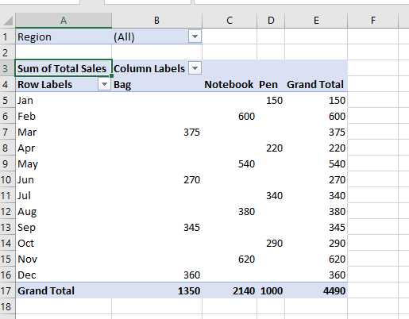
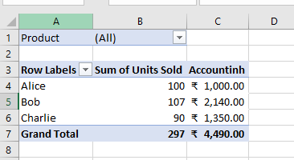
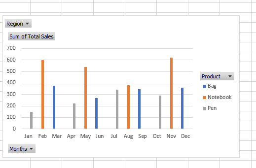

##  Exercise 4: Excel Activity — `Pivot Table Analysis (Sales Data)`

| Date | Month | Region | Salesperson | Product | Units Sold | Unit Price | Total Sales |
| --- | --- | --- | --- | --- | --- | --- | --- |
| 2023-01-31 | Jan | North | Alice | Pen | 15  | 10  | 150 |
| 2023-02-28 | Feb | South | Bob | Notebook | 30  | 20  | 600 |
| 2023-03-31 | Mar | East | Charlie | Bag | 25  | 15  | 375 |
| 2023-04-30 | Apr | West | Alice | Pen | 22  | 10  | 220 |
| 2023-05-31 | May | North | Bob | Notebook | 27  | 20  | 540 |
| 2023-06-30 | Jun | South | Charlie | Bag | 18  | 15  | 270 |
| 2023-07-31 | Jul | East | Alice | Pen | 34  | 10  | 340 |
| 2023-08-31 | Aug | West | Bob | Notebook | 19  | 20  | 380 |
| 2023-09-30 | Sep | North | Charlie | Bag | 23  | 15  | 345 |
| 2023-10-31 | Oct | South | Alice | Pen | 29  | 10  | 290 |
| 2023-11-30 | Nov | East | Bob | Notebook | 31  | 20  | 620 |
| 2023-12-31 | Dec | West | Charlie | Bag | 24  | 15  | 360 |

***

### 🔹 **Section A: Create a Basic Pivot Table**

1.  Select data range: `A1:J13`.
    
2.  Go to **Insert** tab → Click **PivotTable**.
    
3.  Choose **New Worksheet** → Click **OK**.
    
4.  In Pivot Table:
    
    -   **Rows** → `Month`
        
    -   **Columns** → `Product`
        
    -   **Values** → `Total Sales` (Sum)
        
    -   **Filter** → `Region`
        
 
***

### 🔹 **Section B: Pivot Table – Salesperson Summary**

1.  In a new Pivot Table:
    
    -   **Rows** → `Salesperson`
        
    -   **Values** → `Units Sold` (Sum), `Total Sales` (Sum)
        
    -   **Filter** → `Product`
        
2.  Apply number format:
    
    -   Select Total Sales column → Format as **Accounting (₹)**.
        
 
***

### 🔹 **Section C: Pivot Chart**

1.  Click inside **Pivot Table 1**.
    
2.  Go to **Insert** → Choose **Column Chart**.
    
3.  Add Chart Title: `Monthly Product Sales`.
    
4.  Enable Data Labels.
    
5.  Change color scheme for better visuals.
    
 

***

### 🔹 **Section D: Filter with Slicer**

1.  Click on any Pivot Table.
    
2.  Go to **PivotTable Analyze** → **Insert Slicer**.
    
3.  Select **Salesperson** and **Region**.
    
4.  Arrange slicers next to the table.
    
5.  Use slicers to dynamically filter the pivot.
    

***

### 🔹 **Section E: Timeline Filter**

1.  Click inside Pivot Table.
    
2.  Go to **PivotTable Analyze** → **Insert Timeline**.
    
3.  Select **Date** column.
    
4.  Drag slider to filter by month or period.
    
5.  Customize timeline style from Timeline Tools.
    

***

### 🔹 **Section F: Region-wise Product Sales Summary**

1.  Create a new Pivot Table:
    
    -   **Rows** → `Region`
        
    -   **Columns** → `Product`
        
    -   **Values** → `Units Sold` (Sum)
        
2.  Rename worksheet: `Region_Sales_Summary`
    
3.  Add conditional formatting:
    
    -   Highlight cells where `Units Sold` > 25 with green fill.