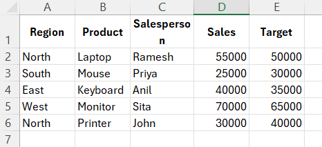
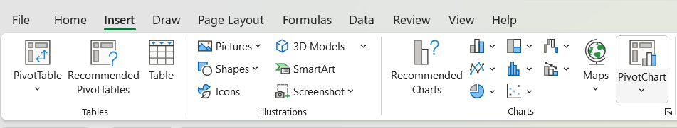
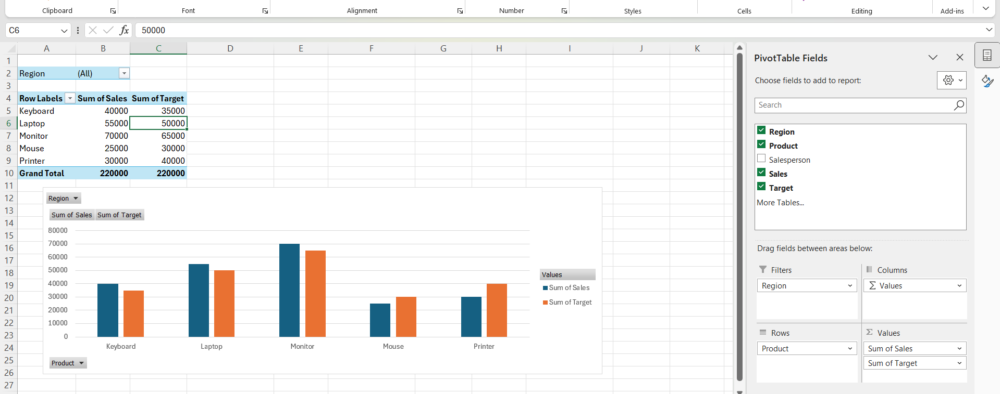

- [ ] 1.  
## Data analytics in Excel – Lookup functions (H, V & Xlookup)  

### **HLOOKUP**

**Purpose:**  
Used to look up a value in the first row of a table and return a value from a specified row below it.

**Transposed Example Dataset**

| Product ID | P001 | P002 | P003 | P004 | P005 |
| --- | --- | --- | --- | --- | --- |
| Product Name | Laptop | Mouse | Keyboard | Monitor | Printer |
| Price | 60000 | 800 | 1500 | 12000 | 7000 |

**Formula Example:**

```excel
=HLOOKUP("P004", B1:F3, 3, FALSE)
```

**Explanation:**

-   `"P004"` → Lookup value.
    
-   `B1:F3` → Table range.
    
-   `3` → Row index (Price).
    
-   `FALSE` → Exact match.
    

**Before:** You have only the Product ID.  
**After:** The function returns **12000**, the price of Monitor.

### VLOOKUP function in Excel

The **VLOOKUP function** is one of the most popular functions in **Excel**. This page contains many easy to follow VLOOKUP examples.

#### Exact Match

Most of the time you are looking for an exact match when you use the VLOOKUP function in Excel. Let's take a look at the arguments of the VLOOKUP function.

1. The VLOOKUP function below looks up the value 53 (first argument) in the leftmost column of the red table (second argument).


2. The value 4 (third argument) tells the VLOOKUP function to return the value in the same row from the fourth column of the red table.


Note: the Boolean FALSE (fourth argument) tells the VLOOKUP function to return an exact match. If the VLOOKUP function cannot find the value 53 in the first column, it will return a [#N/A error](https://www.excel-easy.com/examples/vlookup.html#na-error).

3. Here's another example. Instead of returning the salary, the VLOOKUP function below returns the last name (third argument is set to 3) of ID 79.


#### Approximate Match

Let's take a look at an example of the VLOOKUP function in approximate match mode (fourth argument set to TRUE).

1. The VLOOKUP function below looks up the value 85 (first argument) in the leftmost column of the red table (second argument). There's just one problem. There's no value 85 in the first column.


2. Fortunately, the Boolean TRUE (fourth argument) tells the VLOOKUP function to return an approximate match. If the VLOOKUP function cannot find the value 85 in the first column, it will return the largest value smaller than 85. In this example, this will be the value 80.


3. The value 2 (third argument) tells the VLOOKUP function to return the value in the same row from the second column of the red table.


Note: always sort the leftmost column of the red table in ascending order if you use the VLOOKUP function in approximate match mode (fourth argument set to TRUE).
***


### XLOOKUP function in Excel

If you have Excel 365 or Excel 2021, use XLOOKUP instead of [VLOOKUP](https://www.excel-easy.com/examples/vlookup.html). The **XLOOKUP function** is easier to use and has some additional advantages.

#### Exact Match

By default, the XLOOKUP function in **Excel 365/2021** performs an exact match.

1. The XLOOKUP function below looks up the value 53 (first argument) in the range B3:B9 (second argument).


2. Next, it simply returns the value in the same row from the range E3:E9 (third argument).


3. Here's another example. Instead of returning the salary, the XLOOKUP function below returns the last name (replace E3:E9 with D3:D9) of ID 79.


***

- [ ] 2.  
## Pivot tables in Excel, dashboard and slicer in Excel  

**Pivot tables** are one of **Excel**'s most powerful features. A pivot table allows you to extract the significance from a large, detailed data set.

Our data set consists of 213 records and 6 fields. Order ID, Product, Category, Amount, Date and Country.


#### Insert a Pivot Table

To insert a **pivot table**, execute the following steps.

1. Click any single cell inside the data set.

2. On the Insert tab, in the Tables group, click PivotTable.


The following dialog box appears. Excel automatically selects the data for you. The default location for a new pivot table is New Worksheet.

3. Click OK.


#### Drag fields

The **PivotTable Fields pane** appears. To get the total amount exported of each product, drag the following fields to the different areas.

1. Product field to the Rows area.

2. Amount field to the Values area.

3. Country field to the Filters area.


Below you can find the pivot table. Bananas are our main export product. That's how easy pivot tables can be!


#### Sort a Pivot Table

To get Banana at the top of the list, sort the pivot table.

1. Click any cell inside the Sum of Amount column.

2. Right click and click on Sort, Sort Largest to Smallest.


Result:


#### Filter a Pivot Table

Because we added the Country field to the Filters area, we can filter this pivot table by Country. For example, which products do we export the most to France?

1. Click the filter drop-down and select France.

Result: Apples are our main export product to France.


Note: you can use the standard filter (triangle next to Row Labels) to only show the amounts of specific products.

#### Change Summary Calculation

By default, Excel summarizes your data by either summing or counting the items. To change the type of calculation that you want to use, execute the following steps.

1. Click any cell inside the Sum of Amount column.

2. Right click and click on Value Field Settings.


3. Choose the type of calculation you want to use. For example, click Count.


4. Click OK.

Result: 16 out of the 28 orders to France were 'Apple' orders.


> [!attention] below part is not asked  in question but just for info i have added

#### Two-dimensional Pivot Table

If you drag a field to the Rows area and Columns area, you can create a two-dimensional pivot table. First, [insert a pivot table](https://www.excel-easy.com/data-analysis/pivot-tables.html#insert-pivot-table). Next, to get the total amount exported to each country, of each product, drag the following fields to the different areas.

1. Country field to the Rows area.

2. Product field to the Columns area.

3. Amount field to the Values area.

4. Category field to the Filters area.


Below you can find the two-dimensional pivot table.


#### Insert Pivot Chart

To insert a pivot chart, execute the following steps.

1. Click any cell inside the pivot table.

2. On the PivotTable Analyze tab, in the Tools group, click PivotChart.


The Insert Chart dialog box appears.

3. Click OK.

Below you can find the pivot chart.


Note: any changes you make to the pivot chart are immediately reflected in the pivot table and vice versa.

#### Filter Pivot Chart

To filter this pivot chart, execute the following steps.

1. Use the standard filters (triangles next to Product and Country). For example, use the Country filter to only show the total amount of each product exported to the United States.


2. Remove the Country filter.

3. Because we added the Category field to the Filters area, we can filter this pivot chart (and pivot table) by Category. For example, use the Category filter to only show the vegetables exported to each country.


#### Change Pivot Chart Type

You can change to a different type of pivot chart at any time.

1. Select the chart.

2. On the Design tab, in the Type group, click Change Chart Type.


3. Choose Pie.


4. Click OK.

Result:


Note: pie charts always use one data series (in this case, Beans). To get a pivot chart of a country, swap the data over the axis. First, select the chart. Next, on the Design tab, in the Data group, click Switch Row/Column.

 
> [!hint]   same stuffs as above  but fast 
 
data ^
 
select pivot chart on right side of insert tab 
rest figure out urself
 

***

### slicer
Use **slicers in Excel** to quickly and easily filter pivot tables. Connect multiple slicers to multiple pivot tables to create awesome reports.

Below you can find a pivot table. Go back to [Pivot Tables](https://www.excel-easy.com/data-analysis/pivot-tables.html) to learn how to create this pivot table.


To **insert a slicer**, execute the following steps.

1. Click any cell inside the pivot table.

2. On the PivotTable Analyze tab, in the Filter group, click Insert Slicer.


3. Check Country and click OK.


4. Click United States to find out which products we export the most to the United States.


Conclusion: bananas are our main export product to the United States. The report filter (cell B1) changes to United States.


***

- [ ] 3.  
### What if analysis in MS Excel  

**What-If Analysis** in **Excel** allows you to try out different values (scenarios) for formulas. The following example helps you master what-if analysis quickly and easily.

Assume you own a book store and have 100 books in storage. You sell a certain % for the highest price of $50 and a certain % for the lower price of $20.


If you sell 60% for the highest price, cell D10 calculates a total profit of 60 * $50 + 40 * $20 = $3800.

### Create Different Scenarios

But what if you sell 70% for the highest price? And what if you sell 80% for the highest price? Or 90%, or even 100%? Each different percentage is a different **scenario**. You can use the Scenario Manager to create these scenarios.

Note: you can simply type in a different percentage into cell C4 to see the corresponding result of a scenario in cell D10. However, what-if analysis enables you to easily compare the results of different scenarios. Read on.

1. On the Data tab, in the Forecast group, click What-If Analysis.


2. Click Scenario Manager.


The Scenario Manager dialog box appears.

3. Add a scenario by clicking on Add.


4. Type a name (60% highest), select cell C4 (% sold for the highest price) for the Changing cells and click on OK.


5. Enter the corresponding value 0.6 and click on OK again.


6. Next, add 4 other scenarios (70%, 80%, 90% and 100%).

Finally, your Scenario Manager should be consistent with the picture below:


Note: to see the result of a scenario, select the scenario and click on the Show button. Excel will change the value of cell C4 accordingly for you to see the corresponding result on the sheet.

### Scenario Summary

To easily compare the results of these scenarios, execute the following steps.

1. Click the Summary button in the Scenario Manager.

2. Next, select cell D10 (total profit) for the result cell and click on OK.


Result:


Conclusion: if you sell 70% for the highest price, you obtain a total profit of $4100, if you sell 80% for the highest price, you obtain a total profit of $4400, etc. That's how easy what-if analysis in Excel can be.

### Goal Seek

What if you want to know how many books you need to sell for the highest price, to obtain a total profit of exactly $4700? You can use **Excel's Goal Seek** feature to find the answer.

1. On the Data tab, in the Forecast group, click What-If Analysis.


2. Click Goal Seek.


The Goal Seek dialog box appears.

3. Select cell D10.

4. Click in the 'To value' box and type 4700.

5. Click in the 'By changing cell' box and select cell C4.

6. Click OK.


Result: you need to sell 90% of the books for the highest price to obtain a total profit of exactly $4700.


> [!check] more examples below
> If you know the result you want from a formula, use **Goal Seek** in **Excel** to find the input value that produces this formula result.

### Goal Seek Example 1

Use Goal Seek in Excel to find the grade on the fourth exam that produces a final grade of 70.

1. The formula in cell B7 calculates the final grade.


2. The grade on the fourth exam in cell B5 is the input cell.


3. On the Data tab, in the Forecast group, click What-If Analysis.


4. Click Goal Seek.


The Goal Seek dialog box appears.

5. Select cell B7.

6. Click in the 'To value' box and type 70.

7. Click in the 'By changing cell' box and select cell B5.

8. Click OK.


Result: a grade of 90 on the fourth exam produces a final grade of 70.


### Goal Seek Example 2

Use Goal Seek in Excel to find the loan amount that produces a monthly payment of $1500.

1. The formula in cell B5 calculates the monthly payment.


Explanation: the [PMT function](https://www.excel-easy.com/examples/pmt.html) calculates the payment for a loan. If you've never heard of this function before, that's OK. The higher the loan amount, the higher the monthly payment. Assume, you can only afford $1500 a month. What is your maximum loan amount?

2. The loan amount in cell B3 is the input cell.


3. On the Data tab, in the Forecast group, click What-If Analysis.


4. Click Goal Seek.


The Goal Seek dialog box appears.

5. Select cell B5.

6. Click in the 'To value' box and type -1500 (negative, you are paying out money).

7. Click in the 'By changing cell' box and select cell B3.

8. Click OK.


Result: a loan amount of $250,187 produces a monthly payment of $1500.


***

- [ ] 4.  
### Data structures in R – Vectors, Lists, Arrays, Matrices, Factors, Data Frames  

***

- [ ] 5.  
### To import, clean & transform raw data in R  

***

- [ ] 6.  
### To perform data manipulation using dplyr in R  

***

- [ ] 7.  
### To perform data visualization with ggplot2  

***

- [ ] 8.  
### Data transformation using Power Query Editor in Power BI  

***

- [ ] 9.  
### Creating various charts and map visualization in Power BI  

***

- [ ] 10.  
### Slicers and filters in Power BI  

***

- [ ] 11.  
### To generate and publish dashboards and reports in Power BI  

***


