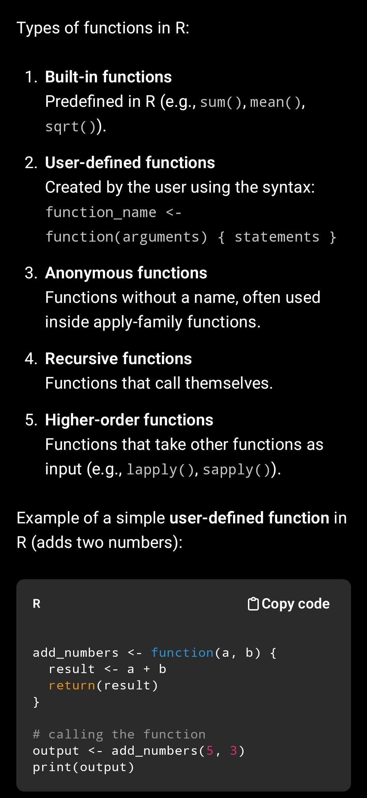

### Q.4 Write an R program to demonstrate working with operators (arithmetic, logical, relational, and assignment operators).
```r
# ----------------------------------------------------------
# ARITHMETIC OPERATORS
# ----------------------------------------------------------

a <- 10
b <- 3

# Addition
add_result <- a + b      # Output: 13
# Subtraction
sub_result <- a - b      # Output: 7


# ----------------------------------------------------------
# RELATIONAL OPERATORS
# ----------------------------------------------------------

# Greater than
rel1 <- a > b            # Output: TRUE
# Equal to
rel2 <- a == b           # Output: FALSE


# ----------------------------------------------------------
# LOGICAL OPERATORS
# ----------------------------------------------------------

x <- TRUE
y <- FALSE

# Logical AND
log1 <- x & y            # Output: FALSE
# Logical OR
log2 <- x | y            # Output: TRUE


# ----------------------------------------------------------
# ASSIGNMENT OPERATORS
# ----------------------------------------------------------

# Left assignment
num1 <- 50               # Output: 50
# Right assignment
75 -> num2               # Output: 75


# Display all results
add_result; sub_result
rel1; rel2
log1; log2
num1; num2
```
### Explain types of vectors with examples in R programming
In R, vectors are the most basic data structure, and they store elements of the same data type.
Here are the main types of vectors with simple explanations and examples:

---

1. **Numeric Vector**

Stores numeric values (integers or doubles).

num_vec <- c(10, 20, 30)
print(num_vec)
> Output: 10 20 30

---

2. **Integer Vector**

Created using the L suffix.

int_vec <- c(1L, 2L, 3L)
print(int_vec)
> Output: 1 2 3

---

3. **Character Vector**

Stores text strings.

char_vec <- c("apple", "banana", "mango")
print(char_vec)
> Output: "apple" "banana" "mango"

---

4. **Logical Vector**

Contains TRUE/FALSE values.

log_vec <- c(TRUE, FALSE, TRUE)
print(log_vec)
> Output: TRUE FALSE TRUE

---

5. **Complex Vector**

Stores complex numbers.

comp_vec <- c(2+3i, 4-1i)
print(comp_vec)
> Output: 2+3i 4-1i

---

6. **Raw Vector**

Stores raw bytes (uninterpreted data).

raw_vec <- charToRaw("ABC")
print(raw_vec)
> Output: 41 42 43

---

> Summary Table

| Vector Type | Example            |
|-------------|--------------------|
| Numeric     | c(1.2, 3.5, 4.8)    |
| Integer     | c(1L, 2L, 3L)       |
| Character   | c("a", "b", "c")    |
| Logical     | c(TRUE, FALSE)      |
| Complex     | c(5+2i, 3-1i)       |
| Raw         | charToRaw("Hi")     |

---

### Sample Program: Demonstrating Conversion Functions in R
```r
# Original values
num_char <- "50"
decimal_num <- 12.7
logic_num <- 1
char_vec <- c("A", "B", "C")
num_vec <- c(1, 2, 3)

# Type Conversions
num_value <- as.numeric(num_char)
print(num_value)            # 50

int_value <- as.integer(decimal_num)
print(int_value)            # 12

char_value <- as.character(200)
print(char_value)           # "200"

log_value <- as.logical(logic_num)
print(log_value)            # TRUE

complex_value <- as.complex(7)
print(complex_value)        # 7+0i

# Structure Conversions
vector_value <- as.vector(num_vec)
print(vector_value)         # 1 2 3

matrix_value <- as.matrix(num_vec)
print(matrix_value)         # Converts vector → matrix

list_value <- as.list(num_vec)
print(list_value)           # List of 3 elements

factor_value <- as.factor(char_vec)
print(factor_value)         # Factor: A B C

date_value <- as.Date("2025-01-20", "%Y-%m-%d")
print(date_value)           # 2025-01-20

```


### array add elements using c, append and length 
```r
a <- c(1, 2)
arr <- array(a)
arr
# Output:
# [1] 1 2


# Add using c()
arr <- c(arr, 3, 4)
arr
# Output:
# [1] 1 2 3 4


# Add using append()
arr <- append(arr, c(5, 6))
arr
# Output:
# [1] 1 2 3 4 5 6


# Add using length()
length(arr) <- length(arr) + 2
arr[7:8] <- c(7, 8)
arr
# Output:
# [1] 1 2 3 4 5 6 7 8

```
 


***
### State any four features of List data structure in R. Write an R program to create a list containing a vector, a matrixand a list. 
> Perform: 
(i) Update elements
(ii) Merge two lists
(iii) Count number of objects in given list (8m)
***
- **Heterogeneous storage**  
  A list can store different data types (numeric, character, logical, vectors, matrices, data frames, other lists).

- **Indexed and named access**  
  Elements can be accessed using indices (`list[[1]]`) or names (`list$name`).

- **Dynamic size**  
  Elements can be added, removed, or modified at any time.

- **Nested structures allowed**  
  A list can contain another list inside it.

*** 
```r
# Create a vector
v <- c(10, 20, 30)                # vector

# Create a matrix
m <- matrix(c(1, 2, 3, 4), nrow = 2)   # matrix

# Create an inner list
inner <- list(5, 15)              # list

# Create main list
my_list <- list(v, m, inner)

# (i) Update elements using direct index
my_list[[1]][2] <- 200      # updating vector element
my_list[[3]][[1]] <- 50     # updating inner list element

# (ii) Merge two lists
list2 <- list("new element")
merged_list <- c(my_list, list2)

# (iii) Count number of objects
count_objects <- length(my_list)

# Output
print(my_list)
# [[1]] (vector)
# [1]  10 200  30
#
# [[2]] (matrix)
#      [,1] [,2]
# [1,]    1    3
# [2,]    2    4
#
# [[3]] (inner list)
# [[3]][[1]]
# [1] 50
#
# [[3]][[2]]
# [1] 15

print(merged_list)
# Same as my_list plus 4th element "new element"

print(count_objects)
# [1] 3

```


```