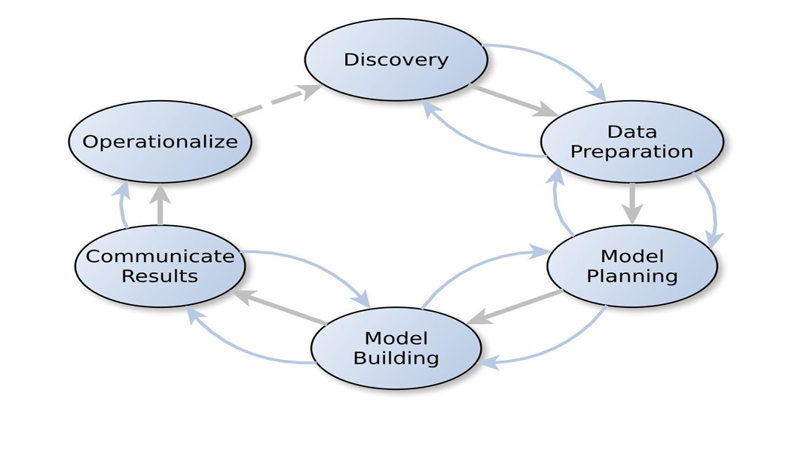

# Chapter 1: Data Analytics & Business Analytics — CO1

- [x] Q.1  

### Discuss the need of Data Analytics. **4/6M**

Data analytics is the process of **turning raw data into useful information**. It's how businesses find trends, solve problems, and make smarter, more confident decisions.
> [!abstract] Key Needs of Data Analytics
> 
> -   **Smarter Decisions**: Data analytics helps organizations make choices based on facts and evidence, not just on intuition. This leads to better, more reliable results.
>     
> -   **Improved Efficiency**: It allows companies to find and fix problems in their operations, which helps them work faster, be more productive, and save money.
>     
> -   **Understanding Customers**: By looking at customer data, businesses can learn what people want. This helps them create personalized offers and make customers feel more valued.
>     
> -   **Predicting the Future**: It helps businesses spot emerging trends and unusual events, giving them a chance to prepare for future opportunities and risks.
>
Example : A retail company analyzes past sales data to predict which products will be most popular next season.
***

- [x] Q.2  #p
### Explain the various phases of data analytics life cycle. **4/6M**  

The **data analytics life cycle** is a step-by-step guide for doing a data project. It's a structured plan that turns raw data into useful information and smart decisions.

 

> [!abstract] Key Phases of the Data Analytics Life Cycle
> 
> -   **Discovery**: Understand the problem and define the project goals. This involves figuring out what questions need to be answered and what data is required.
>     
> -   **Data Preparation**: Clean and organize the raw data. This step is critical to fix errors, handle missing values, and prepare the data for analysis.
>     
> -   **Model Planning**: Choose the best method or algorithm for the analysis. The team explores the data to decide on the right approach.
>     
> -   **Model Building**: Develop and train the model using the prepared data. This is where the actual analysis is performed to find patterns and insights.
>     
> -   **Communicate Results**: Share the findings with others in a clear way, often using charts and reports. The goal is to tell a compelling story with the data.
>     
> -   **Operationalize**: Put the final solution or model into action. This makes the insights available for daily use and helps improve business processes.
>
***

- [x] Q.3  #p
### Enlist Data Visualization tools. **4M**  

> **Data visualization** tools are software applications that help users create visual representations of data, such as charts, graphs, and maps.

> [!abstract] Key Data Visualization Tools

-   **MS Excel**: Used for creating graphs, charts, and pivot tables.
    
-   **Python**: Used for data visualization with libraries such as **Matplotlib** and **Seaborn**.
    
-   **R**: A statistical language with libraries like **ggplot2** for creating interactive visualizations.
    
-   **Tableau**: A business intelligence tool for creating powerful dashboards and visualizations.
    
-   **Power BI**: A Microsoft service for creating and analyzing visual reports.
    
-   **DBMS (Database Management System)**: A system that uses **SQL** to visualize data stored in databases.
***

- [x] Q.4  
### Differentiate between Business Intelligence and Business Analytics. **4/6M**  
| Feature | Business Intelligence (BI) | Business Analytics (BA) |
| :--- | :--- | :--- |
| **Primary Goal** | Describes the past and present. | Predicts the future and guides decisions. |
| **Nature of Questions** | What happened? How did it happen? | Why will it happen? What if we change something? |
| **Scope** | Retrospective (looks backward). | Prospective (looks forward). |
| **Analysis Type** | Descriptive and Diagnostic. | Predictive and Prescriptive. |
| **Tools Used** | Dashboards, reporting tools, query software. | Statistical models, data mining, machine learning. |
| **Data Focus** | Structured data from internal systems. | Both structured and unstructured data, internal and external. |
| **User Role** | Business users, managers, analysts. | Data scientists, statisticians, advanced analysts. |
| **Example** | A sales dashboard showing monthly revenue. | A model predicting next quarter's sales based on market trends. |
***

- [ ] Q.5  
### Explain the role of Data Analyst and Business Analyst with example. **4M**  

> [!abstract] Data Analyst
> 
> -   A **Data Analyst's** role is to **process raw data into valuable information**. They use technical skills to **clean data**, find important trends, and create **reports and visuals** that provide **insights** for decision-making.
>     
> -   **Example**: A Data Analyst for an online store analyzes website traffic data to show which pages have the most visitors and where people leave the site.

> [!abstract] Business Analyst
> -  A  **Business Analyst** focuses on **business needs**. They are responsible for taking a company's goals and turning them into specific **data requirements**, making sure that any data analysis directly helps the business improve.
>     
> -   **Example**: A Business Analyst at the same online store might notice a drop in sales. They would then work with the Data Analyst to find the specific data needed (like traffic sources and product page views) to figure out the cause.
>
***

- [ ] Q.6  
### Describe various methods/types of Business Analytics with suitable example. **6M**  

***

- [ ] Q.7  
### Identify the appropriate method of business analytics for the following. **4/6M**  

***

- [ ] Q.8  
### Explain in detail about nature of data. **4/6M**  

***

- [ ] Q.9  
### Case Study on Stock Market Prediction. **4M**  

***

- [ ] Q.10  
### State features of Business Analytics. **4M**  

***

- [ ] Q.11  
### Write short note on Data driven decision making in business analytics. **6/8M**  

***

- [ ] Q.12  
### Explain any 5 data driven decision making examples. **6/8M**  

***

---

# Chapter 2: Data Analytics with Excel — CO2

- [ ] Q.1  
### Explain the role of Excel in data analytics. **4M**  

***

- [ ] Q.2  
### Compare Pivot table with Pivot Chart. **4M**  

***

- [ ] Q.3  
### Explain any 6 text functions with its syntax. **4/6M**  

***

- [ ] Q.4  
### Explain any 6 Date functions with its syntax. **4/6M**  

***

- [ ] Q.5  
### Write Steps of Data Validation in Excel. **4M**  

***

- [ ] Q.6  
### Discuss the need of What-if analysis tool in Excel with suitable example. **6/8M**  

***

- [ ] Q.7  
### Example on Conditional Formatting. **6M**  

***

- [ ] Q.8  
### Example on Lookup Functions. **6/8M**  

***

- [ ] Q.9  
### Example on Data Cleaning. **6M**  

***

- [ ] Q.10  
### Example on Sorting & Filtering. **4/6M**  

***

- [ ] Q.11  
### Enlist various charts in Excel. Describe its function, advantage and applications. **6M**  

***

- [ ] Q.12  
### Write syntax of following functions: Datedif, If, Sumif, Countif, Averageif, Iferror. **4M**  

***

- [ ] Q.13  
### List the steps to create dashboard in MS Excel. **4/6M**  

***

- [ ] Q.14  
### Compare Vlookup, Hlookup and Xlookup. **4M**  

***

- [ ] Q.15  
### Explain the role of Slicer. Enlist properties of slicer. **4M**  

***

---

# Chapter 3: Introduction to R Programming — CO3

- [ ] Q.1  
### Write features of R programming. **4M**  

***

- [ ] Q.2  
### Write Application of R programming. **4M**  

***

- [ ] Q.3  
### Compare R programming and Python. **4**  

***

- [ ] Q.4  
### Write R program to demonstrate working with operators (arithmetic, logical, relational and assignment operators). **6/8M**  

***

- [ ] Q.5  
### Write short note on built-in functions in R programming. **4/6M**  

***

- [ ] Q.6  
### Explain types of vectors with examples in R Programming. **4/6M**  

***

- [ ] Q.7  
### Program on List. **6/8M**  

***

- [ ] Q.8  
### Program on Vector operations. **6/8M**  

***

- [ ] Q.9  
### Explain control structures with an example in R programming. **6/8M**  

***

- [ ] Q.10  
### Write disadvantages of R programming. **4M**  

***

- [ ] Q.11  
### Explain Conversion functions for data types and data structures with syntax. **6/8M**  

***

