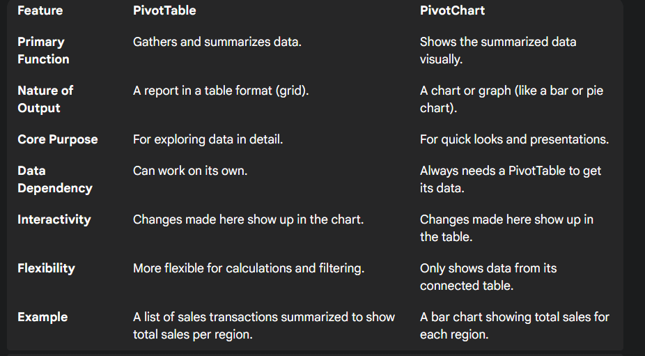

# Chapter 1: Data Analytics & Business Analytics — CO1
> [!check] Type hints for me
> #p = partially done / similar already covered so i can write it using my own words likewise
- [x] Q.1  

### Discuss the need of Data Analytics. **4/6M**

Data analytics is the process of **turning raw data into useful information**. It's how businesses find trends, solve problems, and make smarter, more confident decisions.
> [!abstract] Key Needs of Data Analytics
> 
> -   **Smarter Decisions**: Data analytics helps organizations make choices based on facts and evidence, not just on intuition. This leads to better, more reliable results.
>     
> -   **Improved Efficiency**: It allows companies to find and fix problems in their operations, which helps them work faster, be more productive, and save money.
>     
> -   **Understanding Customers**: By looking at customer data, businesses can learn what people want. This helps them create personalized offers and make customers feel more valued.
>     
> -   **Predicting the Future**: It helps businesses spot emerging trends and unusual events, giving them a chance to prepare for future opportunities and risks.
>
Example : A retail company analyzes past sales data to predict which products will be most popular next season.
***

- [x] Q.2  #p
### Explain the various phases of data analytics life cycle. **4/6M**  

The **data analytics life cycle** is a step-by-step guide for doing a data project. It's a structured plan that turns raw data into useful information and smart decisions.

 

> [!abstract] Key Phases of the Data Analytics Life Cycle
> 
> -   **Discovery**: Understand the problem and define the project goals. This involves figuring out what questions need to be answered and what data is required.
>     
> -   **Data Preparation**: Clean and organize the raw data. This step is critical to fix errors, handle missing values, and prepare the data for analysis.
>     
> -   **Model Planning**: Choose the best method or algorithm for the analysis. The team explores the data to decide on the right approach.
>     
> -   **Model Building**: Develop and train the model using the prepared data. This is where the actual analysis is performed to find patterns and insights.
>     
> -   **Communicate Results**: Share the findings with others in a clear way, often using charts and reports. The goal is to tell a compelling story with the data.
>     
> -   **Operationalize**: Put the final solution or model into action. This makes the insights available for daily use and helps improve business processes.
>
***

- [x] Q.3  #p
### Enlist Data Visualization tools. **4M**  

> **Data visualization** tools are software applications that help users create visual representations of data, such as charts, graphs, and maps.

> [!abstract] Key Data Visualization Tools

-   **MS Excel**: Used for creating graphs, charts, and pivot tables.
    
-   **Python**: Used for data visualization with libraries such as **Matplotlib** and **Seaborn**.
    
-   **R**: A statistical language with libraries like **ggplot2** for creating interactive visualizations.
    
-   **Tableau**: A business intelligence tool for creating powerful dashboards and visualizations.
    
-   **Power BI**: A Microsoft service for creating and analyzing visual reports.
    
-   **DBMS (Database Management System)**: A system that uses **SQL** to visualize data stored in databases.
***

- [x] Q.4  
### Differentiate between Business Intelligence and Business Analytics. **4/6M**  
| Feature | Business Intelligence (BI) | Business Analytics (BA) |
| :--- | :--- | :--- |
| **Primary Goal** | Describes the past and present. | Predicts the future and guides decisions. |
| **Nature of Questions** | What happened? How did it happen? | Why will it happen? What if we change something? |
| **Scope** | Retrospective (looks backward). | Prospective (looks forward). |
| **Analysis Type** | Descriptive and Diagnostic. | Predictive and Prescriptive. |
| **Tools Used** | Dashboards, reporting tools, query software. | Statistical models, data mining, machine learning. |
| **Data Focus** | Structured data from internal systems. | Both structured and unstructured data, internal and external. |
| **User Role** | Business users, managers, analysts. | Data scientists, statisticians, advanced analysts. |
| **Example** | A sales dashboard showing monthly revenue. | A model predicting next quarter's sales based on market trends. |
***

- [x] Q.5  
### Explain the role of Data Analyst and Business Analyst with example. **4M**  

> [!abstract] Data Analyst
> 
> -   A **Data Analyst's** role is to **process raw data into valuable information**. They use technical skills to **clean data**, find important trends, and create **reports and visuals** that provide **insights** for decision-making.
>     
> -   **Example**: A Data Analyst for an online store analyzes website traffic data to show which pages have the most visitors and where people leave the site.

> [!abstract] Business Analyst
> -  A  **Business Analyst** focuses on **business needs**. They are responsible for taking a company's goals and turning them into specific **data requirements**, making sure that any data analysis directly helps the business improve.
>     
> -   **Example**: A Business Analyst at the same online store might notice a drop in sales. They would then work with the Data Analyst to find the specific data needed (like traffic sources and product page views) to figure out the cause.
>
***

- [x] Q.6  #p
### Describe various methods/types of Business Analytics with suitable example. **6M**  

> [!abstract] 1. Descriptive Analytics
> 
> This is about looking at what already happened. It answers the question, "What happened?" by summarizing past data into easy-to-read reports and dashboards.
> 
> -   **Example**: A bakery looks at its sales data from last month to see which bread was the most popular.
>     

***

> [!abstract] 2. Diagnostic Analytics
> 
> This type explains why something happened. It digs into the data to find the root cause of an event. It answers the question, "Why did it happen?"
> 
> -   **Example**: The bakery's sales dropped. Diagnostic analytics would show that the drop was because a key ingredient for their most popular bread was unavailable.
>     

***

> [!abstract] 3. Predictive Analytics
> 
> This is about forecasting what will happen next. It uses historical data to predict future outcomes. It answers the question, "What will happen?"
> 
> -   **Example**: The bakery uses past sales data to predict how many loaves of bread they will sell next week.
>     

***

> [!abstract] 4. Prescriptive Analytics
> 
> This is the most advanced type. It not only predicts what will happen but also recommends the best action to take. It answers the question, "What should we do?"
> 
> -   **Example**: The bakery's system analyzes upcoming weather, local events, and past sales to recommend the exact number of each type of bread to bake to avoid waste and maximize profit.
>
***

- [x] Q.7  
### Identify the appropriate method of business analytics for the following. **4/6M**  

> [!hint] Hint: How to Identify Each Type
> 
> -   **Descriptive Analytics**: Look for words that describe past events, like **"what happened,"** **"total,"** **"count,"** or **"report."**
>     
> -   **Diagnostic Analytics**: Look for words that explain a past event, like **"why,"** **"reason,"** or **"cause."**
>     
> -   **Predictive Analytics**: Look for words that forecast future outcomes, like **"what will happen,"** **"predict,"** **"forecast,"** or **"likelihood."**
>     
> -   **Prescriptive Analytics**: Look for words that recommend an action, like **"what should be done,"** **"recommend,"** **"optimize,"** or **"advise."**
>

> [!check] Exercise
> 
1.  A company creates a dashboard showing its total sales revenue and the number of new customers for the last fiscal year.
    
2.  A ride-sharing app uses an algorithm to recommend the best fare to offer a customer to increase the chance of them accepting a ride.
    
3.  A marketing team analyzes past ad campaign data to determine why one campaign had a higher return on investment than others.
    
4.  A credit card company uses a customer's spending history and payment behavior to forecast the likelihood of them defaulting on a loan.
    
5.  An airline's system suggests which flights to offer a discount on to maximize profit based on current bookings and historical demand patterns.
    
6.  A healthcare provider reviews patient records to find the number of patients readmitted to the hospital within 30 days of discharge.
    
7.  A social media platform analyzes user engagement data to understand why a specific video went viral.
    
8.  An e-commerce website uses a visitor's browsing history to recommend what products they are most likely to buy next.
    
9.  A manufacturer analyzes production data to determine the cause of a recent increase in product defects on one of its assembly lines.
    
10.  A logistics company's software provides the optimal delivery route for a fleet of trucks to minimize fuel consumption and delivery time.
    
11.  A university reviews student enrollment records from the past five years to identify the total number of students in each academic program.
    
12.  A company analyzes customer feedback to understand why customer satisfaction scores have been falling over the last three months.
    
13.  A retail store analyzes sales data to predict the inventory they will need to stock for the upcoming holiday season.
    
14.  An investment firm uses a complex model to suggest the best portfolio allocation to maximize returns for a client based on their risk tolerance.
    
15.  A customer support team creates a report showing the average call duration and the number of support tickets closed per day last week.
    
16.  A bank investigates why a large number of credit card transactions were declined in a specific geographic region last month.
    
17.  A supermarket chain uses past purchasing data and seasonal trends to forecast how much fresh produce they will need to order for next week.
    
18.  A mobile app uses real-time user data to recommend a personalized user interface layout to increase engagement.
    
19.  A website manager reviews a report showing the number of unique visitors and page views on their site from last month.
    
20.  A company's system analyzes historical product returns to recommend specific improvements to the manufacturing process to reduce future returns.

***

> [!abstract] Answers & Justification
> 
> -   **Q1: Descriptive Analytics**: This is suited because the goal is to summarize past sales and customer data to understand "what happened."
>     
> -   **Q2: Prescriptive Analytics**: This method is appropriate as the app is not just predicting a good price, but actively recommending the **best course of action** to achieve a specific outcome (increased acceptance rate).
>     
> -   **Q3: Diagnostic Analytics**: This is the correct method as the team is investigating **why** one ad campaign performed better than another, looking for the root cause.
>     
> -   **Q4: Predictive Analytics**: This is the correct method because it uses past data to **forecast a future outcome** (the likelihood of loan default).
>     
> -   **Q5: Prescriptive Analytics**: This is the correct method because the system is recommending a specific action (offering discounts) to achieve an optimal result (maximizing profit).
>     
> -   **Q6: Descriptive Analytics**: This is suited because it involves reviewing past data to simply count and report "what happened" (the number of readmissions).
>     
> -   **Q7: Diagnostic Analytics**: This is the correct method because the manufacturer is trying to determine the **cause** of a problem (the increase in defects).
>     
> -   **Q8: Predictive Analytics**: This is the correct method because it uses historical data to **forecast a future outcome** (the likelihood of a new product being successful).
>     
> -   **Q9: Diagnostic Analytics**: This is the correct method because the manufacturer is trying to determine the **cause** of a problem (the increase in product defects).
>     
> -   **Q10: Prescriptive Analytics**: This is the correct method because the software is not just analyzing, but actively **recommending the optimal action** (the best route) to achieve a goal (minimizing fuel).
>     
> -   **Q11: Descriptive Analytics**: This is suited because it is simply summarizing and reporting on "what happened" in the past, without an analytical question.
>     
> -   **Q12: Diagnostic Analytics**: This is the correct method because the team is trying to determine the **cause** of a problem (the drop in customer satisfaction).
>     
> -   **Q13: Predictive Analytics**: This is the correct method because it uses a user's past data to **forecast** a future action or preference (what they might want to watch next).
>     
> -   **Q14: Prescriptive Analytics**: This is the correct method because it is recommending a specific, optimal action (the portfolio allocation) to achieve the best result for the client.
>     
> -   **Q15: Descriptive Analytics**: This is suited because it is simply summarizing and reporting on past performance without any further analysis.
>     
> -   **Q16: Diagnostic Analytics**: This is the correct method because the bank is trying to determine the **reason** (the root cause) behind the declined transactions.
>     
> -   **Q17: Predictive Analytics**: This is the correct method because the store is using past data to **forecast** a future need (inventory stock levels).
>     
> -   **Q18: Prescriptive Analytics**: This is the correct method as the app is not just predicting what the user likes but **recommending an action** (the best layout) to drive a specific behavior (engagement).
>     
> -   **Q19: Descriptive Analytics**: This is suited because the goal is to summarize and report on past events ("what happened" last month).
>     
> -   **Q20: Prescriptive Analytics**: This is the correct method because the system is **recommending a course of action** (process improvements) to prevent a future negative outcome (returns).
>

***

- [x] Q.8  #p
### Explain in detail about nature of data. **4/6M**  

***

> [!abstract]  Characteristics & Structural Types
> 
> -   **Volume**: The massive **amount of data** generated, requiring specialized storage and processing.
>     
> -   **Velocity**: The **speed** at which data is created and collected, from real-time streams to periodic updates.
>     
> -   **Variety**: The different **types and formats** of data, including:
>     
>     -   **Structured Data**: Organized, fixed-format data like an Excel spreadsheet.
>         
>     -   **Unstructured Data**: Data with no predefined format, like emails or videos.
>         
>     -   **Semi-structured Data**: Data with some organizational tags, like XML or JSON files.
>         
> -   **Veracity**: The **quality and trustworthiness** of the data, as inaccurate data can lead to poor decisions.
>     

***

> Types of Data based on Scale

> [!abstract] Nominal Scale
> 
> Nominal: Categories with no order or value.
> 
> -   **Example**: Genders (male, female).
>     

***

> [!abstract] Ordinal Scale
> 
> Ordinal: Categories with a meaningful order.
> 
> -   **Example**: Survey ratings (Poor, Good, Excellent).
>     

***

> [!abstract] Interval Scale
> 
> Interval: Data with order and equal distances, but no true zero.
> 
> -   **Example**: Temperature in Celsius.
>     

***

> [!abstract] Ratio Scale
> 
> Ratio: Data with a true zero and equal distances.
> 
> -   **Example**: Height, weight, or income.
>

***
- [x] Q.9  #p
### Case Study on Stock Market Prediction. **4M**  

> **Objective:** To predict future stock prices using historical data to assist investors in making informed trading decisions.

> [!abstract] Methodology & Application
> 
> -   **Data**: **Historical stock data** (prices, trading volume) is collected and prepared for analysis.
>     
> -   **Modeling**: A **predictive model** is built using machine learning to analyze past trends.
>     
> -   **Prediction**: The model **forecasts** the future stock price based on the identified patterns.
>     
> -   **Outcome**: The prediction provides a **data-driven insight** that helps investors decide when to buy or sell.
>     

This is how we can use predictive analytics to turns raw financial data into a  useful tool for making smart decisions in a changing market.
***

- [x] Q.10  #p
### State features of Business Analytics. **4M**  

> [!abstract] Forward-Looking
> 
> Unlike traditional reporting, BA is prospective (looks forwards). It uses past data to predict what will happen, allowing businesses to plan for the future.
> 
> -   **Example**: A bakery uses past sales data to predict how many loaves of bread they will sell next week.
>     

***

> [!abstract] Data-Driven Decision Making
> 
> It enables businesses to move from making choices based on intuition to making them based on facts and evidence, leading to smarter decisions.
> 
> -   **Example**: The bakery uses analytics to determine the optimal price for a new cake, based on market and cost data.
>     

***

> [!abstract] Identifies Root Causes
> 
> Through diagnostic analytics, a key feature of BA, it can investigate why past events happened, allowing a business to understand the reasons behind a problem.
> 
> -   **Example**: The bakery's sales dropped. Diagnostic analytics would show that the drop was because a key ingredient for their most popular bread was unavailable.
>     

***

> [!abstract] Recommends Action
> 
> The most advanced feature of BA is its ability to suggest optimal actions. It not only predicts outcomes but also recommends what a business should do to achieve its goals.
> 
> -   **Example**: The bakery's system analyzes upcoming weather and past sales to recommend the exact number of each type of bread to bake to avoid waste and maximize profit.
>

***

- [x] Q.11  #p
### Write short note on Data driven decision making in business analytics. **6/8M**  

**Data-driven decision-making (DDDM)** is the practice of using data and facts to make business choices instead of relying on intuition or a "gut feeling."
This approach helps companies make smarter, more reliable decisions by using analytics to turn raw data into valuable insights.
***

> [!abstract] Why DDDM is Crucial
> 
> -   **Improved Accuracy**: Decisions are based on solid evidence, which significantly reduces the risk of human error and bias.
>     
> -   **Strategic Advantage**: Businesses can respond faster to market changes, identify new opportunities, and stay ahead of competitors.
>     
> -   **Enhanced Performance**: It leads directly to better business results, such as increased revenue, operational efficiency, and higher customer satisfaction.
>     
> -   **Accountability**: DDDM provides a clear, measurable basis for every decision, making it easier to evaluate success and hold teams accountable.
>     

***

>The Process with an Example

> [!abstract] How It Works
> 
> -   **Identify a Problem**: A clothing retailer notices a decline in sales for a specific product line.
>     
> -   **Collect Data**: They collect relevant data, including past sales figures, customer demographics, social media feedback, and competitor pricing.
>     
> -   **Analyze & Gain Insights**: Using business analytics, they discover that the product's color palette is outdated and that a competitor is offering a similar product at a lower price.
>     
> -   **Make a Data-Driven Decision**: Based on the insights, the company decides to update the product's color options and launch a targeted marketing campaign for a new, younger demographic.
>

***

- [x] Q.12  #p
### Explain any 5 data driven decision making examples. **6/8M**  

***

> [!abstract] Retail: Personalized Product Recommendations
> 
> A major e-commerce company analyzes a customer’s past purchase history, browsing behavior, and wish lists. Using this data, the company makes a data-driven decision to recommend specific products a customer is most likely to buy. This targeted approach significantly increases sales and customer satisfaction.

***

> [!abstract] Finance: Real-Time Fraud Detection
> 
> A bank uses historical transaction data, location information, and spending patterns to monitor customer accounts in real time. When a transaction deviates from a customer's normal behavior, the system makes a data-driven decision to flag the transaction as potentially fraudulent. This proactive measure minimizes financial losses and protects customers.

***

> [!abstract] Human Resources: Employee Retention
> 
> A company analyzes employee data such as tenure, performance reviews, and salary. The analytics team identifies a pattern showing that employees with a certain set of characteristics are likely to leave within a year. The HR department then makes a data-driven decision to offer targeted mentorship programs or salary adjustments to these specific employees, improving retention.

***

> [!abstract] Healthcare: Predicting Patient Readmissions
> 
> A hospital collects and analyzes patient data, including past medical history and current diagnoses. A predictive model is used to identify patients who are at a high risk of being readmitted shortly after discharge. The hospital's staff then makes a data-driven decision to provide these high-risk patients with enhanced follow-up care, reducing readmission rates and improving patient outcomes.

***

> [!abstract] Logistics: Optimal Delivery Route Planning
> 
> A large delivery service analyzes real-time traffic data, weather conditions, and delivery addresses. The system makes a data-driven decision to recommend the most efficient route for a driver's daily deliveries. This optimization leads to significant savings in fuel costs and time, while also allowing the company to meet its delivery promises more reliably.

---

# Chapter 2: Data Analytics with Excel — CO2

- [x] Q.1  
### Explain the role of Excel in data analytics. **4M**  

> **Microsoft Excel** is a foundational tool in data analytics, widely used for its accessible spreadsheet format and powerful built-in functions that enable users to store, clean, and analyze data.

***

> [!abstract] Data Organization
> 
> Excel helps in storing and organizing data in a structured way.
> 
> -   **Example**: A company tracks its monthly expenses by entering each item into a new row with columns for date, category, and cost.
>     

***

> [!abstract] Data Cleaning
> 
> It provides basic functions to handle data errors and duplicates.
> 
> -   **Example**: Using the "Remove Duplicates" feature to clean up a list of customer email addresses before a marketing campaign.
>     

***

> [!abstract] Calculations
> 
> It can perform a variety of calculations to get initial insights.
> 
> -   **Example**: Using the `SUM()` function to calculate total sales for the last quarter.
>     

***

> [!abstract] Data Visualization
> 
> Excel has built-in charting tools to visualize data.
> 
> -   **Example**: Creating a bar chart to compare the sales performance of different products.
>
***

- [ ] Q.2  
### Compare Pivot table with Pivot Chart. **4M**  
 
***

- [ ] Q.3  
### Explain any 6 text functions with its syntax. **4/6M**  

***

> [!abstract] CONCAT
> 
> Joins two or more text strings into one. It's a modern, easier-to-use version of CONCATENATE.
> 
> -   **Syntax**: `=CONCAT(text1, [text2], ...)`
>     
> -   **Example**:
>     
>     -   **Before**: "Data" & "Analytics"
>         
>     -   **After**: `=CONCAT("Data", "Analytics")` returns `"DataAnalytics"`
>         

***

> [!abstract] TRIM
> 
> Removes all extra spaces from text, leaving only single spaces between words.
> 
> -   **Syntax**: `=TRIM(text)`
>     
> -   **Example**:
>     
>     -   **Before**: `" Hello World "`
>         
>     -   **After**: `=TRIM(" Hello World ")` returns `"Hello World"`
>         

***

> [!abstract] UPPER
> 
> Converts a text string to all uppercase letters.
> 
> -   **Syntax**: `=UPPER(text)`
>     
> -   **Example**:
>     
>     -   **Before**: `"excel"`
>         
>     -   **After**: `=UPPER("excel")` returns `"EXCEL"`
>         

***

> [!abstract] LOWER
> 
> Converts a text string to all lowercase letters.
> 
> -   **Syntax**: `=LOWER(text)`
>     
> -   **Example**:
>     
>     -   **Before**: `"EXCEL"`
>         
>     -   **After**: `=LOWER("EXCEL")` returns `"excel"`
>         

***

> [!abstract] PROPER
> 
> Capitalizes the first letter of each word in a text string.
> 
> -   **Syntax**: `=PROPER(text)`
>     
> -   **Example**:
>     
>     -   **Before**: `"data analytics"`
>         
>     -   **After**: `=PROPER("data analytics")` returns `"Data Analytics"`
>         

***

> [!abstract] CLEAN
> 
> Removes non-printable characters from a text string, such as line breaks.
> 
> -   **Syntax**: `=CLEAN(text)`
>     
> -   **Example**:
>     
>     -   **Before**: `"Data"`, followed by a line break, then `"Analytics"`
>         
>     -   **After**: `=CLEAN("Data"&CHAR(10)&"Analytics")` returns `"DataAnalytics"`
>
***

- [ ] Q.4  
### Explain any 6 Date functions with its syntax. **4/6M**  

***

> [!abstract] TODAY
> 
> Returns the current date. It updates automatically whenever the worksheet is opened or changed.
> 
> -   **Syntax**: `=TODAY()`
>     
> -   **Example**: `=TODAY()` returns the current date, e.g., `19-Aug-2025`.
>     

***

> [!abstract] NOW
> 
> Returns the current date and time. Like TODAY, it updates automatically.
> 
> -   **Syntax**: `=NOW()`
>     
> -   **Example**: `=NOW()` returns the current date and time, e.g., `19-Aug-2025 21:26`.
>     

***

> [!abstract] DAY
> 
> Extracts the day of the month from a date.
> 
> -   **Syntax**: `=DAY(serial_number)`
>     
> -   **Example**: `=DAY("15-Jan-2025")` returns `15`.
>     

***

> [!abstract] MONTH
> 
> Extracts the month from a date as a number (1-12).
> 
> -   **Syntax**: `=MONTH(serial_number)`
>     
> -   **Example**: `=MONTH("15-Jan-2025")` returns `1`.
>     

***

> [!abstract] YEAR
> 
> Extracts the year from a date.
> 
> -   **Syntax**: `=YEAR(serial_number)`
>     
> -   **Example**: `=YEAR("15-Jan-2025")` returns `2025`.
>     

***

> [!abstract] DATE
> 
> Combines a year, month, and day into a single date.
> 
> -   **Syntax**: `=DATE(year, month, day)`
>     
> -   **Example**: `=DATE(2025, 1, 15)` returns `15-Jan-2025`.
>
***

- [ ] Q.5  
### Write Steps of Data Validation in Excel. **4M**  

***

- [ ] Q.6  
### Discuss the need of What-if analysis tool in Excel with suitable example. **6/8M**  

***

- [ ] Q.7  
### Example on Conditional Formatting. **6M**  

***

- [ ] Q.8  
### Example on Lookup Functions. **6/8M**  

***

- [ ] Q.9  
### Example on Data Cleaning. **6M**  

***

- [ ] Q.10  
### Example on Sorting & Filtering. **4/6M**  

***

- [ ] Q.11  
### Enlist various charts in Excel. Describe its function, advantage and applications. **6M**  

***

- [ ] Q.12  
### Write syntax of following functions: Datedif, If, Sumif, Countif, Averageif, Iferror. **4M**  

***

- [ ] Q.13  
### List the steps to create dashboard in MS Excel. **4/6M**  

***

- [ ] Q.14  
### Compare Vlookup, Hlookup and Xlookup. **4M**  

***

- [ ] Q.15  
### Explain the role of Slicer. Enlist properties of slicer. **4M**  

***

---

# Chapter 3: Introduction to R Programming — CO3

- [ ] Q.1  
### Write features of R programming. **4M**  

***

- [ ] Q.2  
### Write Application of R programming. **4M**  

***

- [ ] Q.3  
### Compare R programming and Python. **4**  

***

- [ ] Q.4  
### Write R program to demonstrate working with operators (arithmetic, logical, relational and assignment operators). **6/8M**  

***

- [ ] Q.5  
### Write short note on built-in functions in R programming. **4/6M**  

***

- [ ] Q.6  
### Explain types of vectors with examples in R Programming. **4/6M**  

***

- [ ] Q.7  
### Program on List. **6/8M**  

***

- [ ] Q.8  
### Program on Vector operations. **6/8M**  

***

- [ ] Q.9  
### Explain control structures with an example in R programming. **6/8M**  

***

- [ ] Q.10  
### Write disadvantages of R programming. **4M**  

***

- [ ] Q.11  
### Explain Conversion functions for data types and data structures with syntax. **6/8M**  

***

