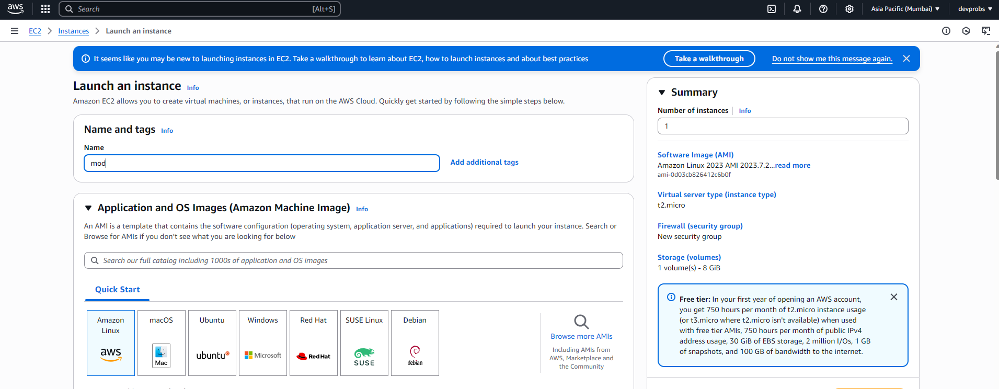
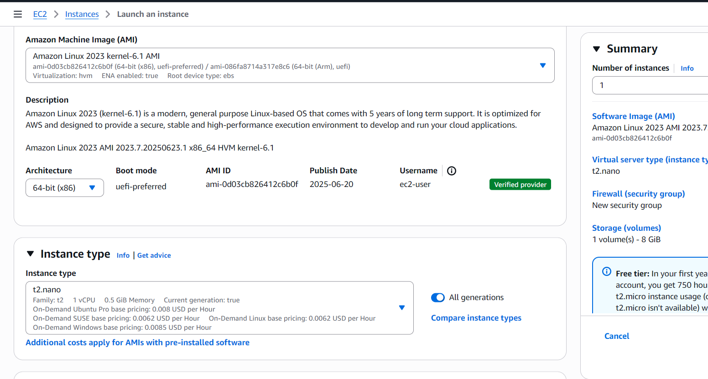
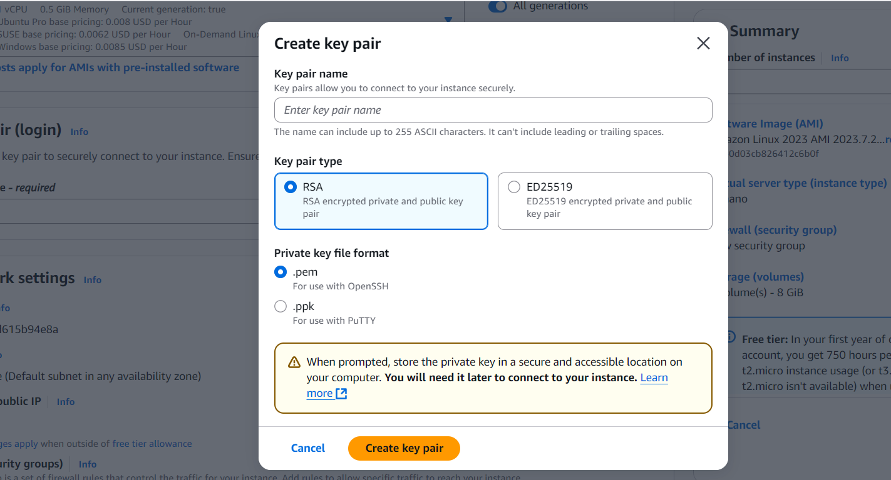
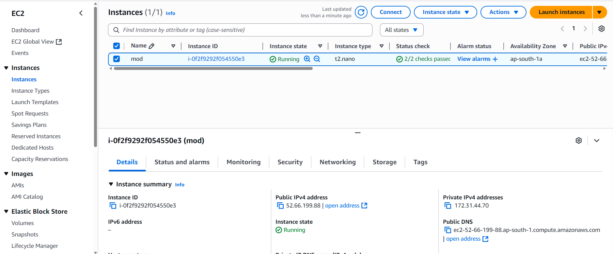

## ✅ EC2 Instance Launch Steps (AWS Console — Mumbai Region)

> 🚩 **Region:** `ap-south-1` (Asia Pacific - Mumbai)

---

### 1️⃣ **Create instance**

* Go to the **AWS Management Console**
* In the **top-right corner**, ensure region is set to:

  ```
  Asia Pacific (Mumbai) – ap-south-1
  ```
* Go to the **EC2 Dashboard**
* Click the **“Launch Instance”** button

---

### 2️⃣ **Launch instance**

* This opens the **instance configuration page**

---

### 3️⃣ **Name the instance**

* In the **Name** field, enter:

  ```
  mod
  ```

---

### 4️⃣ **Create security key pair (RSA)**

* Under **Key pair (login)**:

  * Click **“Create new key pair”**
  * Name it something like: `propz`
  * **Key pair type:** RSA
  * **Private key file format:** `.pem`
  * Click **“Create key pair”** → this will **download `propz.pem`**
  * 🔒 **Store it safely** (you'll need this for SSH later)

---

### 5️⃣ **Leave instance type as default**

* Default is **t3.micro** or **t3.nano**
* ✅ No need to change anything

---

### 6️⃣ **Click on Launch**

* Scroll to the bottom
* Click the **“Launch Instance”** button
* Wait for the **green success message**

---

### 7️⃣ **Open the Instances tab**

* In the left sidebar, click **“Instances”**

---

### 8️⃣ **Refresh and check status**

* Wait a few seconds
* Click **Refresh**
* ✅ Make sure:

  * **Instance state = Running**
  * **Status check = 2/2 checks passed**

---

### ✅ Done!

Your EC2 instance is now up and running in the **Mumbai (ap-south-1)** region.


 
 
  

***

rest of the images are deleted for security reasons