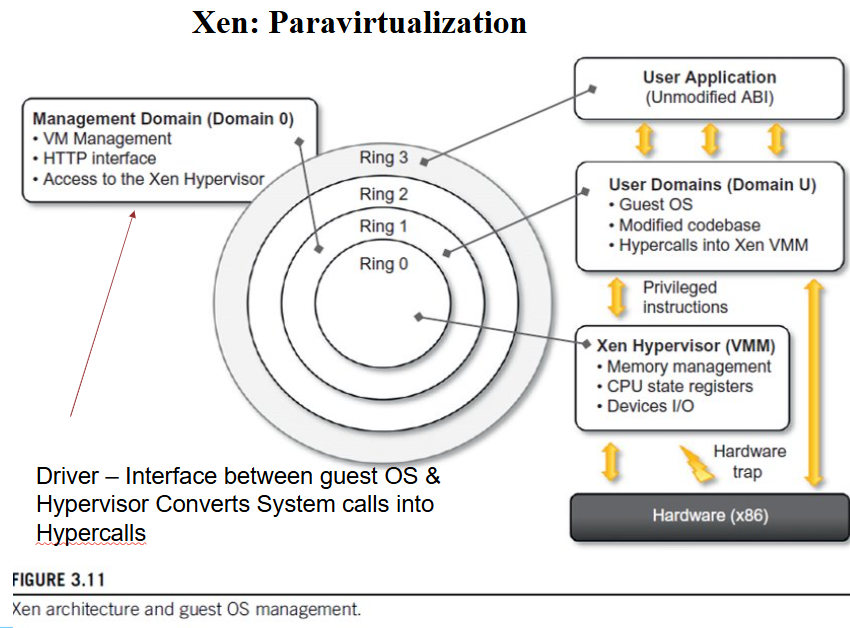
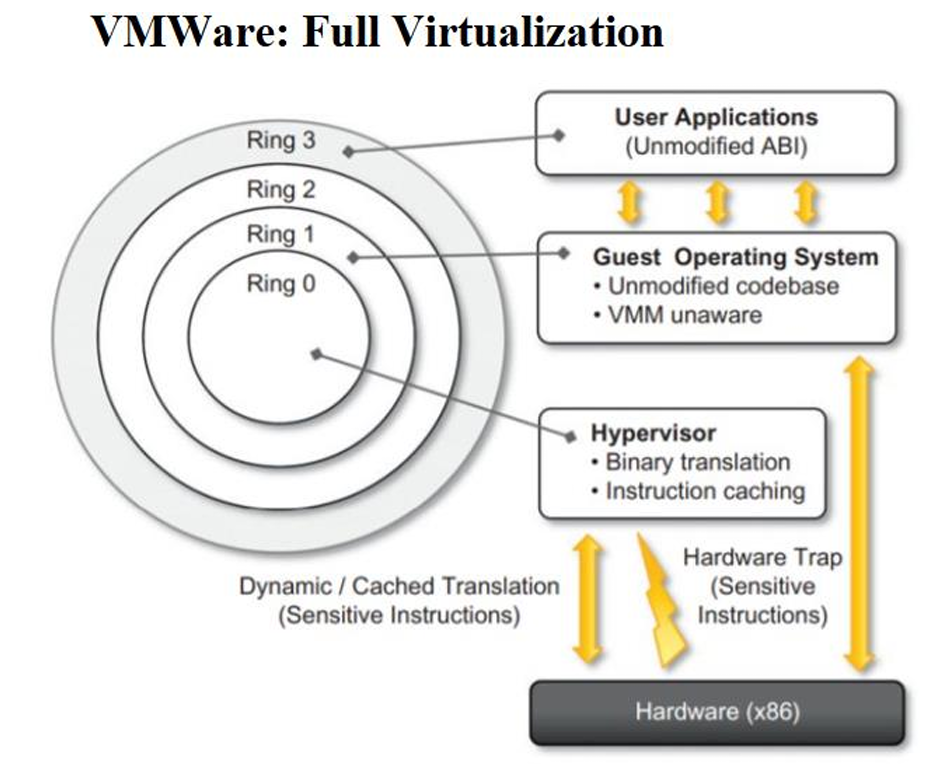

# Final QB CLD pt 1

> [!hint] type hints (for me)
> #p = partially done stuffs 
# Chapter 1

- [x]   Q.1) 
### Define the term virtualization. Enlist and describe any 4 advantages of virtualization in brief.   **4M**
**Virtualization:**  is the ability of a computer program  (which can be combination of software and hardware)  emulation of a physical computer or server or enviornment that runs its own operating system and applications independently.
_Example:_ We can run Linux OS in Windows OS itself through a virtual Machines

**Advantages of Virtualization:**

1.  **Cost Savings** – Virtualization allows multiple operating systems and applications to run on a single physical server, reducing the need for extra hardware, lowering electricity consumption, and minimizing maintenance expenses.
    
2.  **Efficient Resource Utilization** – Physical hardware resources like CPU, RAM, and storage are shared among virtual machines, ensuring higher utilization rates and avoiding idle resources.
    
3.  **Scalability & Flexibility** – Virtual machines can be easily created, modified, or migrated to meet changing workload requirements without purchasing new hardware.
    
4.  **Disaster Recovery** – Virtual machines can be quickly backed up, replicated, and restored on other servers, In case of system crashes or site failures.

***
- [x] Q.2) 
### Describe the following terms in brief with suitable examples **4M**  
  (i) Server Consolidation  
  (ii) Virtual Machine (VM)  
  (iii) Virtual Machine Manager (VMM)  
  (iv) Binary Translation  
  (v) VM migration  
  (vi) Data center  

-   **Server Consolidation** – It is the process of combining multiple underutilized physical servers into fewer, more powerful servers by using virtualization.  
    _Example:_ Running multiple virtual servers on a single physical machine instead of having separate servers for each.
    
-   **Virtual Machine (VM)** – A software-based emulation of a physical computer that runs its own operating system and applications independently.  
    _Example:_ Running Linux as a VM inside Windows.
    
-   **Virtual Machine Manager (VMM)** – Also called a hypervisor, it is software that creates, manages, and monitors virtual machines.  
    _Example:_ VMware ,  Oracle VirtualBox.
    
-   **Binary Translation** – A technique used by hypervisors to convert guest OS instructions into host OS instructions for execution.  
    _Example:_ Running Windows software on a virtual machine even if the processor doesn’t directly support it.
    
-   **VM Migration** – The process of moving a running virtual machine from one physical host to another with minimal downtime.  
    _Example:_ Live migration in VMware vMotion.
    
-   **Data Center** – A facility consisting of many servers and storage systems used to store, manage, and share data and applications. 
    _Example:_ Google or Amazon cloud data centers.
***
- [x] Q.3) 

### Classify hardware instructions in terms of privilege modes with their working. Draw Security rings diagram for the same. **6M**
 
-   **Security Rings Explanation:**
    
    -   **Ring 0 (Kernel – Highest Privilege):** Executes privileged instructions, manages hardware and OS core.
        
    -   **Ring 1 (Device Drivers):** Runs device drivers that need hardware access.
        
    -   **Ring 2 (System Services):** Runs OS-level services like file systems and communication.
        
    -   **Ring 3 (User Applications – Lowest Privilege):** Runs user programs; only non-privileged instructions allowed.

-   **Privileged Instructions** – Special instructions that can **directly control hardware or critical system resources**. Since they can affect the entire system, they are executed only in **Kernel Mode (Ring 0)**.  
    These include **behavior-sensitive instructions** (like I/O operations) and **control-sensitive instructions** (like changing CPU registers or memory settings).  
    _Example:_ I/O control, memory management, enabling/disabling interrupts.
    
-   **Non-Privileged Instructions** – Normal instructions that **do not compromise system security**. They run safely in **User Mode (Ring 3)** and cannot access hardware or kernel resources directly.  
    These cover everyday operations like arithmetic, logical, and data movement, which don’t interfere with other programs.  
    _Example:_ Arithmetic (add, subtract), logical (AND, OR), and data movement (move, load).


***
- [x] Q.4) 
### State the role of hypervisor. Enlist and describe the working of types of hypervisors with suitable examples.  **6-8M**

-   **Role of Hypervisor:**  
    A **hypervisor** (Virtual Machine Monitor – VMM) is a software layer that allows multiple **virtual machines (VMs)** to run on a single physical system.  
    It manages allocation of CPU, memory, storage, and I/O devices among VMs, while ensuring **isolation, security, and efficient resource utilization**.  
    Hypervisors are the backbone of **virtualization and cloud computing**.
    
-   **Types of Hypervisors:**
    
    1.  **Type 1 – Bare-Metal Hypervisor:**
        
        -   Runs **directly on the hardware** without a host operating system.
            
        -   The hypervisor itself handles resource allocation and VM scheduling.
            
        -   Provides **high performance, scalability, and security**, making it suitable for **enterprise servers and data centers**.
            
        -   **Working:** Each VM runs a guest OS on the hypervisor, which **directly communicates with hardware** to allocate CPU, memory, and I/O.
            
        -   **Examples:** VMware ESXi, Microsoft Hyper-V .
            
    2.  **Type 2 – Hosted Hypervisor:**
        
        -   Installed **on top of an existing host operating system**.
            
        -   Relies on the host OS for device drivers, hardware communication, and resource management.
            
        -   Easier to install and use, but performance is slightly lower due to the **extra OS layer**.
            
        -  **Working:** Each VM runs a guest OS on the hypervisor, but all hardware requests **go through the host OS first**, then reach the hardware.
            
        -   **Examples:** Oracle VirtualBox, VMware Workstation.
> [!abstract] If 8 marks = draw diagram both
  

***
- [x] Q.5)  #p
### Draw & Explain Para virtualization Technology with its advantages and disadvantages.   **6-8M**
Paravirtualization is a virtualization technique in which the guest operating system is modified to replace sensitive instructions with hypercalls, so it can work efficiently with the hypervisor.

> [!abstract] only if 8 marks
> **Working :**
    1.  The **hypervisor provides special APIs**, called **hypercalls**, for critical operations.    
> 2.  The **guest OS is modified** to replace sensitive or privileged instructions with these **hypercalls**.  
>3.  When the guest OS needs resources like **CPU, memory, or I/O**, it makes a hypercall.  
>4.  The **hypervisor handles the request** and communicates with the physical hardware to allocate resources efficiently.
        
-   **Diagram:** 
 
    > [!abstract] any 2 if 6 marks    **Advantages:** 
    > 1.  High performance and efficiency (less overhead)
       >2.  Better resource utilization than full virtualization
    >3.  Suitable for large-scale cloud environments 


    > [!abstract] any 2 if 6 marks    **Disadvantages:**
    >1.  Needs guest OS modification, limiting OS choice
      >2.  Compatibility issues with proprietary or closed-source OS
      >3.  More complex to implement than full virtualization

***
- [x] Q.6) #p
### Draw & Explain Microsoft Hyper-V Technology with its advantages and disadvantages  **6-8M**
**Microsoft Hyper-V** is a **Type-1 hypervisor** developed by Microsoft that allows running multiple virtual machines on Windows servers. It enables efficient use of hardware resources by isolating and managing VMs.

***

> [!abstract] only if 8 marks  
> Working:
> 
> 1.  Hyper-V runs directly on the **host hardware** as a bare-metal hypervisor.
>     
> 2.  The **root partition** (Windows OS) manages hardware access and controls Hyper-V.
>     
> 3.  **Child partitions (VMs)** run guest operating systems and applications.
>     
> 4.  Hyper-V manages CPU, memory, storage, and networking requests between VMs and hardware.
>     

***

-   Diagram:  
    
    

***

> [!abstract] any 2 if 6 marks  
> Advantages:
> 
> 1.  Cost-effective and comes built into Windows Server.
>     
> 2.  Provides strong isolation and security between VMs.
>     
> 3.  Supports live migration and scalability for enterprise use.
>     

> [!abstract] any 2 if 6 marks  
> Disadvantages:
> 
> 1.  Works best only in Windows-based environments.
>     
> 2.  Requires significant hardware resources.
>     
> 3.  Limited support for some Linux distributions compared to VMware.
>
***
- [x] Q.7) #p
### Draw & Explain Full Virtualization Technology with its advantages and disadvantages  **6-8M**

Full Virtualization is a technique where the **hypervisor fully emulates the underlying hardware**, allowing **unmodified guest operating systems** to run as if they have direct access to the physical hardware.

***

> [!abstract] only if 8 marks  
> Working:
> 
> 1.  The **hypervisor (VMM)** allocates CPU, memory, storage, and I/O resources to each VM.
>     
> 2.  **Guest OS** runs unmodified on virtual hardware, unaware of other VMs.
>     
> 3.  **Applications** operate normally on each guest OS as if on real hardware.
>     

***

-   Diagram:
    
    
    

***

> [!abstract] any 3 if 6 marks  
> Advantages:
> 
> 1.  **OS Independence** – Any guest OS can run without modification.
>     
> 2.  **Strong Isolation** – Failures in one VM do not affect others.
>     
> 3.  **Efficient Resource Utilization** – Multiple OS instances share hardware efficiently.
>     
> 4.  **Flexibility** – Easy to deploy or test different OS environments.
>     
> 5.  **Migration & Snapshots** – VMs can be paused, copied, or migrated easily.
>     

> [!abstract] any 3 if 6 marks  
> Disadvantages:
> 
> 1.  **Performance Overhead** – Slight slowdown in CPU and I/O operations.
>     
> 2.  **Resource Intensive** – Each VM consumes memory, CPU, and storage.
>     
> 3.  **Complexity** – Requires a strong hypervisor and management tools.
>     
> 4.  **Hardware Compatibility** – Some devices may not fully work in virtualized mode.
>
***
- [x] Q.8) 
### Explain Elements of Parallel Computing. **4M**
-   **Concurrency** – Executing multiple instructions or tasks simultaneously.
    
-   **Granularity** – Level of task division:
    
    -   **Fine-grain:** Smaller, detailed tasks.
        
    -   **Coarse-grain:** Larger, fewer tasks.
        
-   **Synchronization** – Coordination between processes to ensure correct results.
    
-   **Scalability** – Ability to efficiently utilize additional resources as the system grows.

***
- [x] Q.9) 
### Explain Elements of distributed Computing. **4M**

-   **Nodes** – Individual computing units such as computers or virtual machines (VMs).
    
-   **Network** – Communication backbone that connects all nodes for data exchange.
    
-   **Middleware** – Software layer that manages communication, resource sharing, and task execution.
    
-   **Replication and Consistency** – Mechanisms to ensure reliability and uniformity of data across nodes
***
- [x] Q.10) #p
### Explain types of virtualization (Any 4) **4-6M**
> [!check] i have only mentioned those types which are previously covered so no need to learn diffrent stuffs seperatly

-   **Full Virtualization** – Hypervisor fully emulates the hardware, allowing unmodified guest OS to run as if it has direct access to physical hardware.  
    _Example:_ VMware Workstation, Oracle VirtualBox
    
    > [!abstract] any 2 if 6 marks  
    > Advantages:
    > 
    > 1.  OS Independence – Any guest OS can run without modification.
    >     
    > 2.  Strong Isolation – Failures in one VM do not affect others.
    >     
    > 3.  Efficient Resource Utilization – Multiple OS instances share hardware efficiently.

    > [!abstract] any 2 if 6 marks  
    > Disadvantages:
    > 
    > 1.  Performance Overhead – Slight slowdown in CPU and I/O operations.
    >     
    > 2.  Resource Intensive – Each VM consumes memory, CPU, and storage.
    >     
    > 3.  Complexity – Requires strong hypervisor and management tools.
    >     
    
-   **Paravirtualization** – Guest OS is modified to work efficiently with the hypervisor using hypercalls instead of sensitive instructions.  
    _Example:_ Xen, VMware ESXi (paravirtualized mode)
    
    > [!abstract] any 2 if 6 marks  
    > Advantages:
    > 
    > 1.  Higher performance than full virtualization.
    >     
    > 2.  Efficient resource utilization.
    >     
    > 3.  Suitable for large-scale cloud environments.
   
    > [!abstract] any 2 if 6 marks  
    > Disadvantages:
    > 
    > 1.  Requires guest OS modification, limiting OS choice.
    >     
    > 2.  Compatibility issues with some proprietary OS.
    >     
    > 3.  More complex to implement than full virtualization.
    >     
    
-   **Microsoft Hyper-V (Type-1 / Hardware Virtualization)** – Runs directly on host hardware, managing VMs with strong isolation and security.  
    _Example:_ Microsoft Hyper-V
    
    > [!abstract] any 2 if 6 marks  
    > Advantages:
    > 
    > 1.  Cost-effective, comes built into Windows Server.
    >     
    > 2.  Strong isolation and security between VMs.
    >     
    > 3.  Supports live migration and enterprise scalability.
   
    > [!abstract] any 2 if 6 marks  
    > Disadvantages:
    > 
    > 1.  Works best only in Windows environments.
    >     
    > 2.  Requires significant hardware resources.
    >     
    > 3.  Limited support for some Linux distributions.
    >     
    
-   **Application / Desktop / Programming Virtualization** – Runs apps, desktops, or runtimes in isolated environments.
    
    -   **Application Virtualization:** Runs applications without installation on host OS. _Example:_ Microsoft App-V
        
    -   **Desktop Virtualization:** Provides remote or VM-based desktop access. _Example:_ Citrix VDI
        
    -   **Programming / Language Virtualization:** Virtual runtime environments for programming languages. _Example:_ JVM, .NET CLR
        
    
    > [!abstract] any 2 if 6 marks  
    > Advantages:
    > 
    > 1.  Easy deployment and testing of software environments.
    >     
    > 2.  Reduces conflicts between applications or versions.
    >     
    > 3.  Improves portability and management.
    
    > [!abstract] any 2 if 6 marks  
    > Disadvantages:
    > 
    > 1.  Some performance overhead.
    >     
    > 2.  Requires additional software layers or licenses.
    >     
    > 3.  Limited access to host-specific hardware features.
    >
***
- [x] Q.11) 
### Define the term server virtualization with one example. **4M**

The process of dividing a physical server into multiple virtual servers, each running its own operating system and applications independently. This allows better **resource utilization, isolation, and management**.

_Example:_ Using **VMware ESXi** to run multiple virtual machines on a single physical server.

Diagram:
```java
        Physical Server
        +------------------+
        |  CPU / RAM / Disk |
        +------------------+
                │
        +------------------+
        | Hypervisor (VMM) |
        +------------------+
          /       |       \
         /        |        \
+-----------+ +-----------+ +-----------+
|   VM 1    | |   VM 2    | |   VM 3    |
| OS + Apps | | OS + Apps | | OS + Apps |
+-----------+ +-----------+ +-----------+


```
***
- [x] Q.12) #p
### Difference between parallel and distributed computing. **4M**

| Feature | Parallel Computing | Distributed Computing |
| --- | --- | --- |
| **Execution** | Multiple tasks run simultaneously on a **single computer** | Multiple tasks run on **multiple computers (nodes)** |
| **Communication** | Through **shared memory** | Through **network connections** |
| **Scalability** | Limited by the resources of one machine | Can scale easily by adding more nodes |
| **Fault Tolerance** | Low – if one processor fails, task may fail | High – if one node fails, others can continue |
| **Goal** | Increase speed and efficiency inside one system | Coordinate tasks across multiple systems |
***
- [x] Q.13) #p
### Define VMM with diagram. **4M**


 
A **hypervisor** (Virtual Machine Monitor – VMM) is a software layer that allows multiple **virtual machines (VMs)** to run on a single physical system.  
It manages allocation of CPU, memory, storage, and I/O devices among VMs, while ensuring **isolation, security, and efficient resource utilization**.  
Hypervisors are the backbone of **virtualization and cloud computing**.
**Example:** VMware ESXi, Microsoft Hyper-V, Oracle VirtualBox.

***
- [ ] Q.14) 
### Draw and explain the components of Machine Reference Model. **4M**


-   **Applications** – Programs or software that users run.
    
-   **Libraries** – Reusable code that applications call to perform common tasks.
    
-   **API (Application Programming Interface)** – Defines how applications interact with libraries.
    
-   **ABI (Application Binary Interface)** – Interface between compiled applications/libraries and the OS.
    
-   **Operating System (OS)** – Manages hardware resources and provides system services to applications.
    
-   **ISA (Instruction Set Architecture)** – The hardware instruction interface exposed to software.
    
-   **Hardware** – Physical components of the computer (CPU, memory, I/O devices).
***
# Chapter 2
- [x] Q.1  
### Give the NIST definition of cloud computing, also explain the principles (5-4-3) of cloud computing. **4M**  
(Enlist characteristics, enlist deployment and service models.  )


The **NIST definition** describes cloud computing as a way to get easy, on-demand access to a shared pool of computing power, like servers and storage, that can be quickly given to you with almost no effort.
***


> [!abstract] Principles of Cloud Computing
> 
> -   **Five Essential Characteristics:**
>     
>     -   **On-demand self-service:** Get what you need, when you need it, without asking anyone.
>         
>     -   **Broad network access:** Access the cloud from anywhere with an internet connection.
>         
>     -   **Resource pooling:** Cloud providers share a large pool of resources among many customers.
>         
>     -   **Rapid elasticity:** Scale resources up or down quickly and automatically.
>         
>     -   **Measured service:** Pay for exactly what you use.
>         
> -   **Four Deployment Models:**
>     
>     -   **Private cloud:** Cloud for a single company.
>         
>     -   **Community cloud:** Shared cloud for organizations with a common goal.
>         
>     -   **Public cloud:** Cloud services open to everyone.
>         
>     -   **Hybrid cloud:** A mix of different cloud types working together.
>         
> -   **Three Service Models:**
>     
>     -   **SaaS (Software as a Service):** Use a provider's application over the internet.
>         
>     -   **PaaS (Platform as a Service):** Build and run your apps on a provider's platform.
>         
>     -   **IaaS (Infrastructure as a Service):** Rent computing resources like servers and storage.
>
***

- [ ] Q.2  
### Describe 5 principle characteristics of cloud computing with examples. **4M**  


> [!abstract] Key Characteristics of Cloud Computing
> 
> -   **On-Demand Self-Service:** Users can get computing resources like servers and storage on their own, without needing to contact a service provider.
>     
>     -   **Example:** An AWS user can log into the console and launch a new virtual server in minutes.
>         
> -   **Broad Network Access:** Cloud services are available over the network and can be accessed by various devices.
>     
>     -   **Example:** You can access your files on Google Drive from a laptop, tablet, or smartphone.
>         
> -   **Resource Pooling:** The provider's resources are shared among many customers, with resources assigned and reassigned as needed.
>     
>     -   **Example:** A cloud provider uses one large data center to host servers for hundreds of different companies.
>         
> -   **Rapid Elasticity:** Resources can be scaled up or down quickly and automatically to meet demand.
>     
>     -   **Example:** An e-commerce website automatically adds more servers on Black Friday to handle the traffic surge and then removes them afterward.
>         
> -   **Measured Service:** Resource usage is tracked and monitored, allowing for a pay-per-use model.
>     
>     -   **Example:** A customer is billed only for the amount of data stored or the hours a server was running.
>
***

- [x] Q.3  
### Describe 4 cloud deployment models with suitable example of each. (Draw diagram + eg). **6-8M**  


#### **1. Public Cloud**

A **public cloud** is a shared platform available to the general public over the internet. It is owned and managed by a third-party cloud service provider. This model operates on a pay-per-use basis, where resources are shared among many users, making it highly scalable and cost-effective.
 
-   **Example:** A small business uses **Google Drive** or **Microsoft OneDrive** to store and share documents. The service is managed by the provider, and the business only pays for the storage it uses. The underlying infrastructure is shared with countless other users.
    

#### **2. Private Cloud**

A **private cloud** is an environment used exclusively by a single organization. It can be hosted on-site or by a third-party provider, but the resources are dedicated to one user. This model offers a high level of **security** and **privacy**, as data and operations are isolated from the public. It is often called an "internal" or "corporate" cloud.
 
-   **Example:** A bank stores confidential customer data on a private cloud to ensure sensitive financial information is kept separate from other users and complies with strict security regulations.
    

***

#### **3. Hybrid Cloud**

A **hybrid cloud** combines two or more distinct cloud environments, typically a **public cloud** and a **private cloud**, that are linked together. This model allows organizations to run non-critical tasks on the more cost-effective public cloud while keeping sensitive or critical applications and data on the private cloud.
 
-   **Example:** A university stores student records and sensitive research data on a private cloud while using a public cloud for its website and online learning platform, which experience unpredictable traffic spikes.
    

***

#### **4. Community Cloud**

A **community cloud** is a cloud infrastructure shared by several organizations that have a common interest, such as security requirements or compliance standards. It is owned and operated by one or more of the community organizations or a third party.
 
-   **Example:** Multiple government agencies or healthcare organizations collaborate on a shared project and use a community cloud to securely share classified documents and data while adhering to specific regulations like HIPAA (Health Insurance Portability and Accountability Act).
    

***


- [x] Q.4  
### Compare cloud deployment models. **6M**  


***

| Feature | Public Cloud | Private Cloud | Hybrid Cloud | Community Cloud |
| --- | --- | --- | --- | --- |
| **Ownership** | Third-party provider (e.g., AWS, Azure) | Single organization | Combination of private and public | Shared by a specific group of organizations |
| **Users** | General public | A single organization and its authorized users | A mix of the organization's users and the general public | Several organizations with common interests |
| **Security & Privacy** | Lower. Resources are shared, making it less suitable for highly sensitive data. | Highest. Resources are dedicated and isolated. | High for sensitive data (kept private); lower for less critical data (on public cloud). | High. Customized to meet the security and compliance needs of the shared community. |
| **Cost** | Most cost-effective. Pay-as-you-go model with no upfront capital investment. | Most expensive. High upfront costs for infrastructure and maintenance. | Varies. Balances the cost-effectiveness of the public cloud with the security of the private cloud. | Cost is shared among the community members, making it more affordable than a private cloud. |
| **Scalability** | Highest. Elastic and on-demand scaling with almost unlimited resources. | Limited. Scalability is capped by the organization's own infrastructure. | High. Can leverage the public cloud's scalability for non-critical workloads. | Limited. Fixed to the community's resources. |
| **Management** | Managed entirely by the cloud provider. | Managed by the organization's IT staff. | Complex management, as it requires expertise to integrate and manage both environments. | Managed by one or more organizations within the community or a third party. |


***

- [x] Q.5  + 6 + 7
### Explain SaaS / PaaS /  IaaS with suitable example + diagram. **4M**  

### Explain SaaS with suitable example. (4M)


**SaaS (Software as a Service)** is a cloud service model that gives users access to a software application over the internet. The provider manages all aspects of the application, including the data, operating system, and hardware. Users simply use the software through a web browser without needing to install or manage it.

-   **Example:** **Google Docs** is a SaaS application. You can create and edit documents in your web browser without installing any software. Google handles all the updates, maintenance, and storage, and you simply use the service.
    

***

### Explain PaaS with suitable example. (4M)

**PaaS (Platform as a Service)** provides developers with a complete platform to build, run, and manage applications without dealing with the underlying infrastructure. The cloud provider handles the servers, OS, and middleware, while developers focus on writing and deploying their application code.

-   **Example:** **Google App Engine** is a PaaS. A developer can upload their code, and the platform automatically handles the deployment, scaling, and server management. The developer only has to worry about the application code itself, not the hardware it runs on.
    

***

### Explain IaaS with suitable example. (4M)


**IaaS (Infrastructure as a Service)** is the most basic cloud service model. It provides fundamental computing resources like virtual servers, storage, and networking. The user has full control over the operating system, applications, and middleware, while the provider manages the physical hardware.

-   **Example:** **Amazon EC2** is an IaaS. Users can rent a virtual server from AWS, choose its operating system, and then install and manage their own applications on it. The user has complete control over the virtual machine, but AWS takes care of the physical hardware, data center, and networking.


***

- [x] Q.8  
### Give service models for the following services. **4M**  
EC2, ELB, Google sheet, Google app engine  
VPC, Netflix, Hadoop, SalesForce  
S3, Google documents, Heroku, Facebook  

***
-   **EC2 (Elastic Compute Cloud):** **IaaS** - It provides virtual servers (infrastructure) that you manage.
    
-   **ELB (Elastic Load Balancer):** **IaaS** - It is a networking service that manages traffic distribution, a core piece of infrastructure.
    
-   **Google Sheets:** **SaaS** - It is a complete, ready-to-use application accessible via a browser.
    
-   **Google App Engine:** **PaaS** - It provides a platform for developers to build and deploy applications without managing the underlying servers.
    
-   **VPC (Virtual Private Cloud):** **IaaS** - It gives you a logically isolated network (infrastructure) within a public cloud.
    
-   **Netflix:** **SaaS** - It is a finished application that provides video streaming to end-users.
    
-   **Hadoop:** **PaaS** - Cloud providers offer Hadoop as a platform to run big data jobs, managing the clusters for you.
    
-   **SalesForce:** **SaaS** - It is a complete, ready-to-use customer relationship management application.
    
-   **S3 (Simple Storage Service):** **IaaS** - It provides raw storage (infrastructure) for files and data.
    
-   **Google Documents:** **SaaS** - It is a fully-featured word processing application used directly by the end-user.
    
-   **Heroku:** **PaaS** - It is a platform for building and running applications, abstracting the server management.
    
-   **Facebook:** **SaaS** - It is a complete application that provides a social network to its users.
***

- [ ] Q.9  
### Explain cloud architecture with suitable diagram. **4-6M**  
 


***

-   Layer 1: User/Client Layer
    
    This layer is the front-end, representing the devices and interfaces used by end-users to access cloud services (e.g., web browsers, mobile apps).
    
    -   **Example:** A user's laptop or smartphone running the Google Docs website.
        
-   Layer 2: Network Layer
    
    This layer is the communication backbone that connects the client to the cloud, managing all data transfer and routing.
    
    -   **Example:** The internet connection and protocols that allow a browser to connect to a cloud service.
        
-   Layer 3: Cloud Management Layer
    
    This is the control plane of the cloud. It's the software that manages and automates resource allocation, provisioning, and monitoring.
    
    -   **Example:** Using the AWS Management Console to launch a new virtual server.
        
-   Layer 4: Hardware Resource Layer
    
    This is the physical foundation of the cloud, including the servers, storage, and networking hardware located in data centers. It provides the raw computing power.
    
    -   **Example:** The physical servers and network equipment in a Google or Amazon data center.
***

- [ ] Q.10  
### Describe Google Cloud Platform with its features and various services offered by GCP. **4-6M**  
> [!caution] skip
> i hate this one
***

- [ ] Q.11  
### Elaborate in brief cloud economy models. **4M**  


> [!abstract] On-Demand Pricing
> 
> You pay for what you use, when you use it, without any long-term contracts.
> 
> -   **Example:** A developer uses a server for a few hours and pays only for that time.
>     

***

> [!abstract] Subscription-Based Pricing
> 
> You get a big discount by agreeing to use a service for a fixed period, like one or three years.
> 
> -   **Example:** A company buys a "Reserved Instance" for one year to save money.
>     

***

> [!abstract] Tiered Pricing
> 
> The more you use, the less you pay per unit. The price drops after you reach certain usage levels.
> 
> -   **Example:** The first 100 GB costs one price, and the next 400 GB costs a lower price.
>     

***

> [!abstract] Per-Unit Pricing
> 
> You pay a single, fixed price for every unit of a service, no matter how much you use.
> 
> -   **Example:** Every GB of data costs the same flat rate.
>

***

- [ ] Q.12  
### Explain architecture of Microsoft Azure along with its example. **6M**  

> [!attention] skip
> too difficult
***

# Chapter 3

- [x] Q.1  
### Describe the working of “AWS EC2” service with any 3 advantages in brief. **4M**  


 **Amazon EC2 (Elastic Compute Cloud)** provides **virtual servers**, called **instances**, in the cloud. These can be rented to run applications instead of buying and managing physical hardware.

> **Working of EC2**
-   You select a pre-configured template (**Amazon Machine Image** or AMI) and an instance type.
    
-   You then launch an instance, which acts as a virtual computer in the cloud.
    
-   You can connect to this instance to install and run your applications.
    
-   EC2 allows you to easily scale up by launching more instances during high traffic or scale down by terminating them when demand is low.
>     


> **Advantages of EC2**

-   **Elasticity**: Computing capacity can be quickly scaled up or down to match demand, preventing wasted resources.
    
-   **Cost-Effective**: It operates on a **pay-as-you-go** model, meaning payment is only for the consumed resources, eliminating large upfront hardware costs.
    
-   **Reliability**: Instances can be launched in different **Availability Zones** to ensure high availability and fault tolerance.

> Example of EC2

A developer needs to host a website. Instead of buying a physical server, they launch an **EC2 instance** to host their website. When a flash sale causes a surge in traffic, they can quickly launch more instances to handle the increased load. When the sale ends, they terminate the extra instances to save money.
***

- [x] Q.2  #p
### With suitable diagram explain the working of Elastic Load Balancer (ELB) with its types. **4-6M**  
 


 An **Elastic Load Balancer (ELB)** acts as a single point of contact for all incoming traffic. It **automatically distributes** this traffic across multiple healthy targets, such as **EC2 instances**.

The ELB constantly **monitors** the health of its targets and reroutes traffic away from any that fail. This ensures the application remains **highly available** and **fault-tolerant** by preventing any single server from being overwhelmed.


> [!abstract] Types of ELB
>  write example for each if 6m else defination is fine


> **Application Load Balancer (ALB)**

-   **Layer 7 (Application Layer):** Routes HTTP/S traffic based on content like the URL. Ideal for web applications.
    
-   **Example:** An online store uses an ALB to route traffic. Requests for `store.example.com/products` are sent to a server group that handles product listings, while requests for `store.example.com/checkout` are sent to a different server group that manages payment processing.
    

>  **Network Load Balancer (NLB)**

-   **Layer 4 (Transport Layer):** Operates at the transport layer, handling massive volumes of TCP/UDP traffic with very low latency.
    
-   **Example:** A video streaming service uses an NLB to handle high-volume TCP traffic. The NLB forwards the entire incoming TCP connection to a single streaming server, ensuring a stable, low-latency connection for the user.
    

> **Gateway Load Balancer (GLB)**

-   **Layer 3 (Network Layer):** Distributes traffic to a fleet of virtual appliances, such as firewalls, for security and third-party inspection.
    
-   **Example:** A company routes all its internet traffic through a GLB. The GLB forwards the traffic to a fleet of firewall appliances for deep inspection before it is allowed to reach the internal application servers.
***

- [x] Q.3  #p
### Explain working of AWS CloudFront with example. **4-6M**  

AWS CloudFront is a global Content Delivery Network (CDN) that speeds up content delivery by bringing data closer to users.

> [!abstract] How it Works (ONLY WRITE THIS IS 4M AND GO NEXT TO EXAMPLE)
> 
> 1.  A user's request is routed to the **nearest AWS edge location**.
>     
> 2.  The edge location checks its cache for the content.
>     
> 3.  **If the content is found (a 'cache hit'),** it is delivered instantly to the user.
>     
> 4.  **If not found (a 'cache miss'),** the content is fetched from the **origin server**, cached at the edge location, and then delivered to the user.
>     
> 5.  Future requests for that content in the same area are then served from the local cache.
>
 **How it Works**

1.  A user requests content (like a video or an image) from your website or application. This request is automatically routed to the **nearest AWS edge location** .
    
2.  The edge location checks its cache to see if it already has a copy of the content.
    
3.  **If the content is in the cache (a 'cache hit'),** CloudFront delivers it instantly to the user from the edge location.
    
4.  **If the content is not in the cache (a 'cache miss'),** CloudFront retrieves it from the original source (**origin server**), such as an Amazon S3 bucket or an EC2 instance.
    
5.  After fetching the content, CloudFront saves a copy at the edge location. This ensures that any future requests for the same content from users in that area are served directly from the local cache, significantly reducing loading time.
    

***

 **Example**

Imagine a website hosted in the US. A user in India wants to view a video on that site. Instead of getting the video directly from the US server, CloudFront routes the request to a server in a nearby location in India. The video is then delivered from that local server, making it load much faster and providing a better user experience.

 
***

- [x] Q.4  #p
### Describe in brief CDN with one example. **4M**


> A **Content Delivery Network (CDN)** is a geographically distributed network of **servers**. Its purpose is to deliver web content—like videos, images, and other static files—to users faster and more reliably. By placing content on servers in many different locations (called **edge locations**), a CDN reduces the physical distance between the server and the user, which minimizes latency and speeds up page load times.

***

### **Example**

A great example of a CDN is a service like **Netflix** or **Amazon Prime Video**. When you start streaming a movie or TV show, the video file is not being delivered directly from a single central server located far away, for instance, in the US. Instead, a copy of that video is stored on a CDN server located in a data center close to your city. This allows the video to be delivered from a nearby source, ensuring a smooth, buffer-free viewing experience even during peak hours and reducing the load on the main servers.
***
