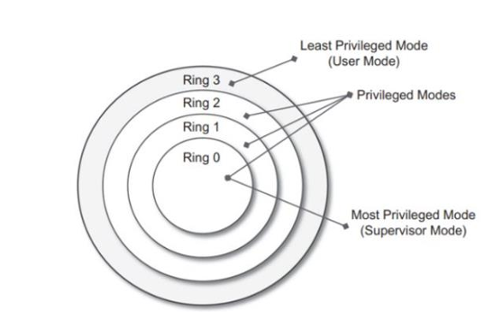
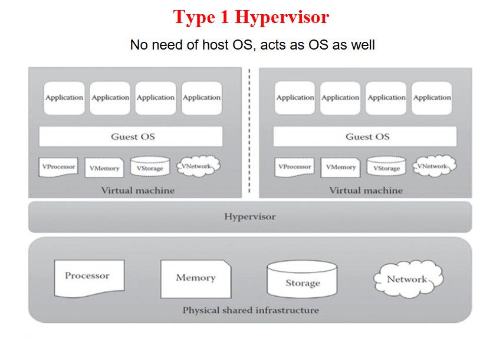
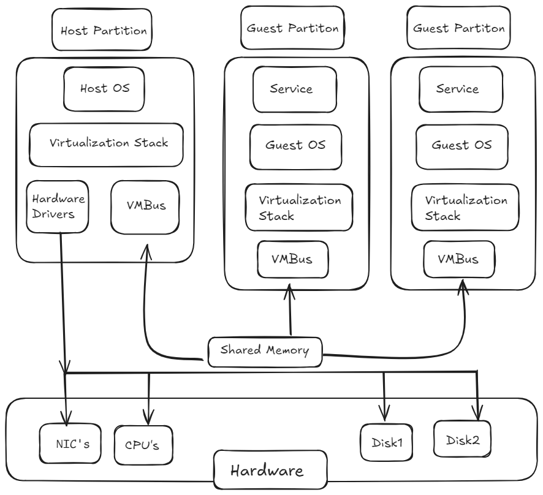

# Final QB CLD pt 1

> [!hint] type hints (for me)
> #p = partially done stuffs 
# Chapter 1

- [x]   Q.1) 
### Define the term virtualization. Enlist and describe any 4 advantages of virtualization in brief.   **4M**
**Virtualization:**  is the ability of a computer program  (which can be combination of software and hardware)  emulation of a physical computer or server or enviornment that runs its own operating system and applications independently.
_Example:_ We can run Linux OS in Windows OS itself through a virtual Machines

**Advantages of Virtualization:**

1.  **Cost Savings** – Virtualization allows multiple operating systems and applications to run on a single physical server, reducing the need for extra hardware, lowering electricity consumption, and minimizing maintenance expenses.
    
2.  **Efficient Resource Utilization** – Physical hardware resources like CPU, RAM, and storage are shared among virtual machines, ensuring higher utilization rates and avoiding idle resources.
    
3.  **Scalability & Flexibility** – Virtual machines can be easily created, modified, or migrated to meet changing workload requirements without purchasing new hardware.
    
4.  **Disaster Recovery** – Virtual machines can be quickly backed up, replicated, and restored on other servers, In case of system crashes or site failures.

***
- [x] Q.2) 
### Describe the following terms in brief with suitable examples **4M**  
  (i) Server Consolidation  
  (ii) Virtual Machine (VM)  
  (iii) Virtual Machine Manager (VMM)  
  (iv) Binary Translation  
  (v) VM migration  
  (vi) Data center  

-   **Server Consolidation** – It is the process of combining multiple underutilized physical servers into fewer, more powerful servers by using virtualization.  
    _Example:_ Running multiple virtual servers on a single physical machine instead of having separate servers for each.
    
-   **Virtual Machine (VM)** – A software-based emulation of a physical computer that runs its own operating system and applications independently.  
    _Example:_ Running Linux as a VM inside Windows.
    
-   **Virtual Machine Manager (VMM)** – Also called a hypervisor, it is software that creates, manages, and monitors virtual machines.  
    _Example:_ VMware ,  Oracle VirtualBox.
    
-   **Binary Translation** – A technique used by hypervisors to convert guest OS instructions into host OS instructions for execution.  
    _Example:_ Running Windows software on a virtual machine even if the processor doesn’t directly support it.
    
-   **VM Migration** – The process of moving a running virtual machine from one physical host to another with minimal downtime.  
    _Example:_ Live migration in VMware vMotion.
    
-   **Data Center** – A facility consisting of many servers and storage systems used to store, manage, and share data and applications. 
    _Example:_ Google or Amazon cloud data centers.
***
- [x] Q.3) 

### Classify hardware instructions in terms of privilege modes with their working. Draw Security rings diagram for the same. **6M**
 
-   **Security Rings Explanation:**
    
    -   **Ring 0 (Kernel – Highest Privilege):** Executes privileged instructions, manages hardware and OS core.
        
    -   **Ring 1 (Device Drivers):** Runs device drivers that need hardware access.
        
    -   **Ring 2 (System Services):** Runs OS-level services like file systems and communication.
        
    -   **Ring 3 (User Applications – Lowest Privilege):** Runs user programs; only non-privileged instructions allowed.

-   **Privileged Instructions** – Special instructions that can **directly control hardware or critical system resources**. Since they can affect the entire system, they are executed only in **Kernel Mode (Ring 0)**.  
    These include **behavior-sensitive instructions** (like I/O operations) and **control-sensitive instructions** (like changing CPU registers or memory settings).  
    _Example:_ I/O control, memory management, enabling/disabling interrupts.
    
-   **Non-Privileged Instructions** – Normal instructions that **do not compromise system security**. They run safely in **User Mode (Ring 3)** and cannot access hardware or kernel resources directly.  
    These cover everyday operations like arithmetic, logical, and data movement, which don’t interfere with other programs.  
    _Example:_ Arithmetic (add, subtract), logical (AND, OR), and data movement (move, load).


***
- [x] Q.4) 
### State the role of hypervisor. Enlist and describe the working of types of hypervisors with suitable examples.  **6-8M**

-   **Role of Hypervisor:**  
    A **hypervisor** (Virtual Machine Monitor – VMM) is a software layer that allows multiple **virtual machines (VMs)** to run on a single physical system.  
    It manages allocation of CPU, memory, storage, and I/O devices among VMs, while ensuring **isolation, security, and efficient resource utilization**.  
    Hypervisors are the backbone of **virtualization and cloud computing**.
    
-   **Types of Hypervisors:**
    
    1.  **Type 1 – Bare-Metal Hypervisor:**
        
        -   Runs **directly on the hardware** without a host operating system.
            
        -   The hypervisor itself handles resource allocation and VM scheduling.
            
        -   Provides **high performance, scalability, and security**, making it suitable for **enterprise servers and data centers**.
            
        -   **Working:** Each VM runs a guest OS on the hypervisor, which **directly communicates with hardware** to allocate CPU, memory, and I/O.
            
        -   **Examples:** VMware ESXi, Microsoft Hyper-V .
            
    2.  **Type 2 – Hosted Hypervisor:**
        
        -   Installed **on top of an existing host operating system**.
            
        -   Relies on the host OS for device drivers, hardware communication, and resource management.
            
        -   Easier to install and use, but performance is slightly lower due to the **extra OS layer**.
            
        -  **Working:** Each VM runs a guest OS on the hypervisor, but all hardware requests **go through the host OS first**, then reach the hardware.
            
        -   **Examples:** Oracle VirtualBox, VMware Workstation.
> [!abstract] If 8 marks = draw diagram both
  

***
- [x] Q.5)  #p
### Draw & Explain Para virtualization Technology with its advantages and disadvantages.   **6-8M**
Paravirtualization is a virtualization technique in which the guest operating system is modified to replace sensitive instructions with hypercalls, so it can work efficiently with the hypervisor.

> [!abstract] only if 8 marks
> **Working :**
    1.  The **hypervisor provides special APIs**, called **hypercalls**, for critical operations.    
> 2.  The **guest OS is modified** to replace sensitive or privileged instructions with these **hypercalls**.  
>3.  When the guest OS needs resources like **CPU, memory, or I/O**, it makes a hypercall.  
>4.  The **hypervisor handles the request** and communicates with the physical hardware to allocate resources efficiently.
        
-   **Diagram:** 
 
    > [!abstract] any 2 if 6 marks    **Advantages:** 
    > 1.  High performance and efficiency (less overhead)
       >2.  Better resource utilization than full virtualization
    >3.  Suitable for large-scale cloud environments 


    > [!abstract] any 2 if 6 marks    **Disadvantages:**
    >1.  Needs guest OS modification, limiting OS choice
      >2.  Compatibility issues with proprietary or closed-source OS
      >3.  More complex to implement than full virtualization

***
- [x] Q.6) #p
### Draw & Explain Microsoft Hyper-V Technology with its advantages and disadvantages  **6-8M**
**Microsoft Hyper-V** is a **Type-1 hypervisor** developed by Microsoft that allows running multiple virtual machines on Windows servers. It enables efficient use of hardware resources by isolating and managing VMs.

***

> [!abstract] only if 8 marks  
> Working:
> 
> 1.  Hyper-V runs directly on the **host hardware** as a bare-metal hypervisor.
>     
> 2.  The **root partition** (Windows OS) manages hardware access and controls Hyper-V.
>     
> 3.  **Child partitions (VMs)** run guest operating systems and applications.
>     
> 4.  Hyper-V manages CPU, memory, storage, and networking requests between VMs and hardware.
>     

***

-   Diagram:  
    
    

***

> [!abstract] any 2 if 6 marks  
> Advantages:
> 
> 1.  Cost-effective and comes built into Windows Server.
>     
> 2.  Provides strong isolation and security between VMs.
>     
> 3.  Supports live migration and scalability for enterprise use.
>     

> [!abstract] any 2 if 6 marks  
> Disadvantages:
> 
> 1.  Works best only in Windows-based environments.
>     
> 2.  Requires significant hardware resources.
>     
> 3.  Limited support for some Linux distributions compared to VMware.
>
***
- [x] Q.7) #p
### Draw & Explain Full Virtualization Technology with its advantages and disadvantages  **6-8M**

Full Virtualization is a technique where the **hypervisor fully emulates the underlying hardware**, allowing **unmodified guest operating systems** to run as if they have direct access to the physical hardware.

***

> [!abstract] only if 8 marks  
> Working:
> 
> 1.  The **hypervisor (VMM)** allocates CPU, memory, storage, and I/O resources to each VM.
>     
> 2.  **Guest OS** runs unmodified on virtual hardware, unaware of other VMs.
>     
> 3.  **Applications** operate normally on each guest OS as if on real hardware.
>     

***

-   Diagram:
    
    
    

***

> [!abstract] any 3 if 6 marks  
> Advantages:
> 
> 1.  **OS Independence** – Any guest OS can run without modification.
>     
> 2.  **Strong Isolation** – Failures in one VM do not affect others.
>     
> 3.  **Efficient Resource Utilization** – Multiple OS instances share hardware efficiently.
>     
> 4.  **Flexibility** – Easy to deploy or test different OS environments.
>     
> 5.  **Migration & Snapshots** – VMs can be paused, copied, or migrated easily.
>     

> [!abstract] any 3 if 6 marks  
> Disadvantages:
> 
> 1.  **Performance Overhead** – Slight slowdown in CPU and I/O operations.
>     
> 2.  **Resource Intensive** – Each VM consumes memory, CPU, and storage.
>     
> 3.  **Complexity** – Requires a strong hypervisor and management tools.
>     
> 4.  **Hardware Compatibility** – Some devices may not fully work in virtualized mode.
>
***
- [x] Q.8) 
### Explain Elements of Parallel Computing. **4M**
-   **Concurrency** – Executing multiple instructions or tasks simultaneously.
    
-   **Granularity** – Level of task division:
    
    -   **Fine-grain:** Smaller, detailed tasks.
        
    -   **Coarse-grain:** Larger, fewer tasks.
        
-   **Synchronization** – Coordination between processes to ensure correct results.
    
-   **Scalability** – Ability to efficiently utilize additional resources as the system grows.

***
- [x] Q.9) 
### Explain Elements of distributed Computing. **4M**

-   **Nodes** – Individual computing units such as computers or virtual machines (VMs).
    
-   **Network** – Communication backbone that connects all nodes for data exchange.
    
-   **Middleware** – Software layer that manages communication, resource sharing, and task execution.
    
-   **Replication and Consistency** – Mechanisms to ensure reliability and uniformity of data across nodes
***
- [x] Q.10) #p
### Explain types of virtualization (Any 4) **4-6M**
> [!check] i have only mentioned those types which are previously covered so no need to learn diffrent stuffs seperatly

-   **Full Virtualization** – Hypervisor fully emulates the hardware, allowing unmodified guest OS to run as if it has direct access to physical hardware.  
    _Example:_ VMware Workstation, Oracle VirtualBox
    
    > [!abstract] any 2 if 6 marks  
    > Advantages:
    > 
    > 1.  OS Independence – Any guest OS can run without modification.
    >     
    > 2.  Strong Isolation – Failures in one VM do not affect others.
    >     
    > 3.  Efficient Resource Utilization – Multiple OS instances share hardware efficiently.

    > [!abstract] any 2 if 6 marks  
    > Disadvantages:
    > 
    > 1.  Performance Overhead – Slight slowdown in CPU and I/O operations.
    >     
    > 2.  Resource Intensive – Each VM consumes memory, CPU, and storage.
    >     
    > 3.  Complexity – Requires strong hypervisor and management tools.
    >     
    
-   **Paravirtualization** – Guest OS is modified to work efficiently with the hypervisor using hypercalls instead of sensitive instructions.  
    _Example:_ Xen, VMware ESXi (paravirtualized mode)
    
    > [!abstract] any 2 if 6 marks  
    > Advantages:
    > 
    > 1.  Higher performance than full virtualization.
    >     
    > 2.  Efficient resource utilization.
    >     
    > 3.  Suitable for large-scale cloud environments.
   
    > [!abstract] any 2 if 6 marks  
    > Disadvantages:
    > 
    > 1.  Requires guest OS modification, limiting OS choice.
    >     
    > 2.  Compatibility issues with some proprietary OS.
    >     
    > 3.  More complex to implement than full virtualization.
    >     
    
-   **Microsoft Hyper-V (Type-1 / Hardware Virtualization)** – Runs directly on host hardware, managing VMs with strong isolation and security.  
    _Example:_ Microsoft Hyper-V
    
    > [!abstract] any 2 if 6 marks  
    > Advantages:
    > 
    > 1.  Cost-effective, comes built into Windows Server.
    >     
    > 2.  Strong isolation and security between VMs.
    >     
    > 3.  Supports live migration and enterprise scalability.
   
    > [!abstract] any 2 if 6 marks  
    > Disadvantages:
    > 
    > 1.  Works best only in Windows environments.
    >     
    > 2.  Requires significant hardware resources.
    >     
    > 3.  Limited support for some Linux distributions.
    >     
    
-   **Application / Desktop / Programming Virtualization** – Runs apps, desktops, or runtimes in isolated environments.
    
    -   **Application Virtualization:** Runs applications without installation on host OS. _Example:_ Microsoft App-V
        
    -   **Desktop Virtualization:** Provides remote or VM-based desktop access. _Example:_ Citrix VDI
        
    -   **Programming / Language Virtualization:** Virtual runtime environments for programming languages. _Example:_ JVM, .NET CLR
        
    
    > [!abstract] any 2 if 6 marks  
    > Advantages:
    > 
    > 1.  Easy deployment and testing of software environments.
    >     
    > 2.  Reduces conflicts between applications or versions.
    >     
    > 3.  Improves portability and management.
    
    > [!abstract] any 2 if 6 marks  
    > Disadvantages:
    > 
    > 1.  Some performance overhead.
    >     
    > 2.  Requires additional software layers or licenses.
    >     
    > 3.  Limited access to host-specific hardware features.
    >
***
- [x] Q.11) 
### Define the term server virtualization with one example. **4M**

The process of dividing a physical server into multiple virtual servers, each running its own operating system and applications independently. This allows better **resource utilization, isolation, and management**.

_Example:_ Using **VMware ESXi** to run multiple virtual machines on a single physical server.

Diagram:
```java
        Physical Server
        +------------------+
        |  CPU / RAM / Disk |
        +------------------+
                │
        +------------------+
        | Hypervisor (VMM) |
        +------------------+
          /       |       \
         /        |        \
+-----------+ +-----------+ +-----------+
|   VM 1    | |   VM 2    | |   VM 3    |
| OS + Apps | | OS + Apps | | OS + Apps |
+-----------+ +-----------+ +-----------+


```
***
- [x] Q.12) #p
### Difference between parallel and distributed computing. **4M**

| Feature | Parallel Computing | Distributed Computing |
| --- | --- | --- |
| **Execution** | Multiple tasks run simultaneously on a **single computer** | Multiple tasks run on **multiple computers (nodes)** |
| **Communication** | Through **shared memory** | Through **network connections** |
| **Scalability** | Limited by the resources of one machine | Can scale easily by adding more nodes |
| **Fault Tolerance** | Low – if one processor fails, task may fail | High – if one node fails, others can continue |
| **Goal** | Increase speed and efficiency inside one system | Coordinate tasks across multiple systems |
***
- [x] Q.13) #p
### Define VMM with diagram. **4M**


A **hypervisor** (Virtual Machine Monitor – VMM) is a software layer that allows multiple **virtual machines (VMs)** to run on a single physical system.  
It manages allocation of CPU, memory, storage, and I/O devices among VMs, while ensuring **isolation, security, and efficient resource utilization**.  
Hypervisors are the backbone of **virtualization and cloud computing**.
**Example:** VMware ESXi, Microsoft Hyper-V, Oracle VirtualBox.

***
- [ ] Q.14) 
### Draw and explain the components of Machine Reference Model. **4M**


-   **Applications** – Programs or software that users run.
    
-   **Libraries** – Reusable code that applications call to perform common tasks.
    
-   **API (Application Programming Interface)** – Defines how applications interact with libraries.
    
-   **ABI (Application Binary Interface)** – Interface between compiled applications/libraries and the OS.
    
-   **Operating System (OS)** – Manages hardware resources and provides system services to applications.
    
-   **ISA (Instruction Set Architecture)** – The hardware instruction interface exposed to software.
    
-   **Hardware** – Physical components of the computer (CPU, memory, I/O devices).
***
# Chapter 2
- [ ] Q.1  
### Give the NIST definition of cloud computing, also explain the principles (5-4-3) of cloud computing. **4M**  
Enlist characteristics, enlist deployment and service models.  
***

- [ ] Q.2  
### Describe 5 principle characteristics of cloud computing with examples. **4M**  
***

- [ ] Q.3  
### Describe 4 cloud deployment models with suitable example of each. (Draw diagram + eg). **6-8M**  
***

- [ ] Q.4  
### Compare cloud deployment models. **6M**  
***

- [ ] Q.5  
### Explain SaaS with suitable example + diagram. **4M**  
***

- [ ] Q.6  
### Explain PaaS with suitable example + diagram. **4M**  
***

- [ ] Q.7  
### Explain IaaS with suitable example + diagram. **4M**  
***

- [ ] Q.8  
### Give service models for the following services. **4M**  
EC2, ELB, Google sheet, Google app engine  
VPC, Netflix, Hadoop, SalesForce  
S3, Google documents, Heroku, Facebook  
***

- [ ] Q.9  
### Explain cloud architecture with suitable diagram. **4-6M**  
***

- [ ] Q.10  
### Describe Google Cloud Platform with its features and various services offered by GCP. **4-6M**  
***

- [ ] Q.11  
### Elaborate in brief cloud economy models. **4M**  
***

- [ ] Q.12  
### Explain architecture of Microsoft Azure along with its example. **6M**  
***

# Chapter 3

- [x] Q.1  
### Describe the working of “AWS EC2” service with any 3 advantages in brief. **4M**  


 **Amazon EC2 (Elastic Compute Cloud)** provides **virtual servers**, called **instances**, in the cloud. These can be rented to run applications instead of buying and managing physical hardware.

> **Working of EC2**
-   You select a pre-configured template (**Amazon Machine Image** or AMI) and an instance type.
    
-   You then launch an instance, which acts as a virtual computer in the cloud.
    
-   You can connect to this instance to install and run your applications.
    
-   EC2 allows you to easily scale up by launching more instances during high traffic or scale down by terminating them when demand is low.
>     


> **Advantages of EC2**

-   **Elasticity**: Computing capacity can be quickly scaled up or down to match demand, preventing wasted resources.
    
-   **Cost-Effective**: It operates on a **pay-as-you-go** model, meaning payment is only for the consumed resources, eliminating large upfront hardware costs.
    
-   **Reliability**: Instances can be launched in different **Availability Zones** to ensure high availability and fault tolerance.

> Example of EC2

A developer needs to host a website. Instead of buying a physical server, they launch an **EC2 instance** to host their website. When a flash sale causes a surge in traffic, they can quickly launch more instances to handle the increased load. When the sale ends, they terminate the extra instances to save money.
***

- [x] Q.2  #p
### With suitable diagram explain the working of Elastic Load Balancer (ELB) with its types. **4-6M**  
 


 An **Elastic Load Balancer (ELB)** acts as a single point of contact for all incoming traffic. It **automatically distributes** this traffic across multiple healthy targets, such as **EC2 instances**.

The ELB constantly **monitors** the health of its targets and reroutes traffic away from any that fail. This ensures the application remains **highly available** and **fault-tolerant** by preventing any single server from being overwhelmed.


> [!abstract] Types of ELB
>  write example for each if 6m else defination is fine


> **Application Load Balancer (ALB)**

-   **Layer 7 (Application Layer):** Routes HTTP/S traffic based on content like the URL. Ideal for web applications.
    
-   **Example:** An online store uses an ALB to route traffic. Requests for `store.example.com/products` are sent to a server group that handles product listings, while requests for `store.example.com/checkout` are sent to a different server group that manages payment processing.
    

>  **Network Load Balancer (NLB)**

-   **Layer 4 (Transport Layer):** Operates at the transport layer, handling massive volumes of TCP/UDP traffic with very low latency.
    
-   **Example:** A video streaming service uses an NLB to handle high-volume TCP traffic. The NLB forwards the entire incoming TCP connection to a single streaming server, ensuring a stable, low-latency connection for the user.
    

> **Gateway Load Balancer (GLB)**

-   **Layer 3 (Network Layer):** Distributes traffic to a fleet of virtual appliances, such as firewalls, for security and third-party inspection.
    
-   **Example:** A company routes all its internet traffic through a GLB. The GLB forwards the traffic to a fleet of firewall appliances for deep inspection before it is allowed to reach the internal application servers.
***

- [ ] Q.3  
### Explain working of AWS CloudFront with example. **4-6M**  

AWS CloudFront is a global Content Delivery Network (CDN) that speeds up content delivery by bringing data closer to users.

> [!abstract] How it Works (ONLY WRITE THIS IS 4M AND GO NEXT TO EXAMPLE)
> 
> 1.  A user's request is routed to the **nearest AWS edge location**.
>     
> 2.  The edge location checks its cache for the content.
>     
> 3.  **If the content is found (a 'cache hit'),** it is delivered instantly to the user.
>     
> 4.  **If not found (a 'cache miss'),** the content is fetched from the **origin server**, cached at the edge location, and then delivered to the user.
>     
> 5.  Future requests for that content in the same area are then served from the local cache.
>
 **How it Works**

1.  A user requests content (like a video or an image) from your website or application. This request is automatically routed to the **nearest AWS edge location** .
    
2.  The edge location checks its cache to see if it already has a copy of the content.
    
3.  **If the content is in the cache (a 'cache hit'),** CloudFront delivers it instantly to the user from the edge location.
    
4.  **If the content is not in the cache (a 'cache miss'),** CloudFront retrieves it from the original source (**origin server**), such as an Amazon S3 bucket or an EC2 instance.
    
5.  After fetching the content, CloudFront saves a copy at the edge location. This ensures that any future requests for the same content from users in that area are served directly from the local cache, significantly reducing loading time.
    

***

 **Example**

Imagine a website hosted in the US. A user in India wants to view a video on that site. Instead of getting the video directly from the US server, CloudFront routes the request to a server in a nearby location in India. The video is then delivered from that local server, making it load much faster and providing a better user experience.

 
***

- [ ] Q.4  
### Describe in brief CDN with one example. **4M**


> A **Content Delivery Network (CDN)** is a geographically distributed network of **servers**. Its purpose is to deliver web content—like videos, images, and other static files—to users faster and more reliably. By placing content on servers in many different locations (called **edge locations**), a CDN reduces the physical distance between the server and the user, which minimizes latency and speeds up page load times.

***

### **Example**

A great example of a CDN is a service like **Netflix** or **Amazon Prime Video**. When you start streaming a movie or TV show, the video file is not being delivered directly from a single central server located far away, for instance, in the US. Instead, a copy of that video is stored on a CDN server located in a data center close to your city. This allows the video to be delivered from a nearby source, ensuring a smooth, buffer-free viewing experience even during peak hours and reducing the load on the main servers.
***
