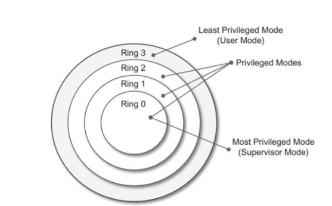
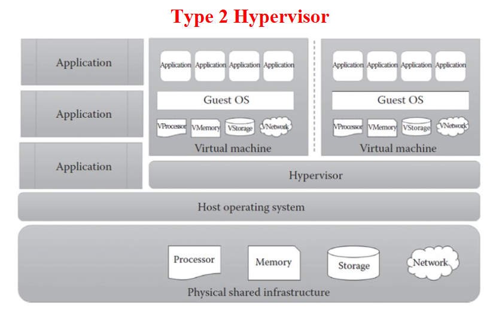
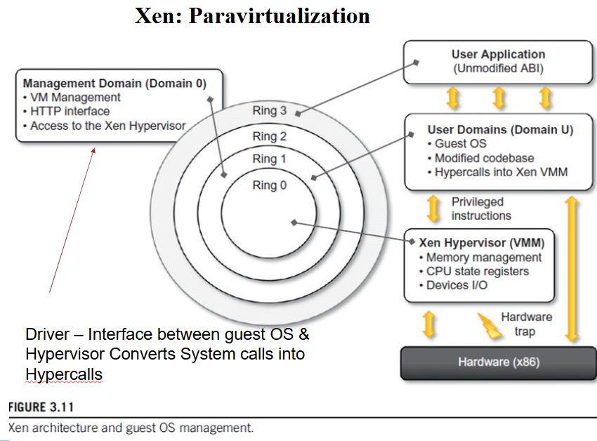
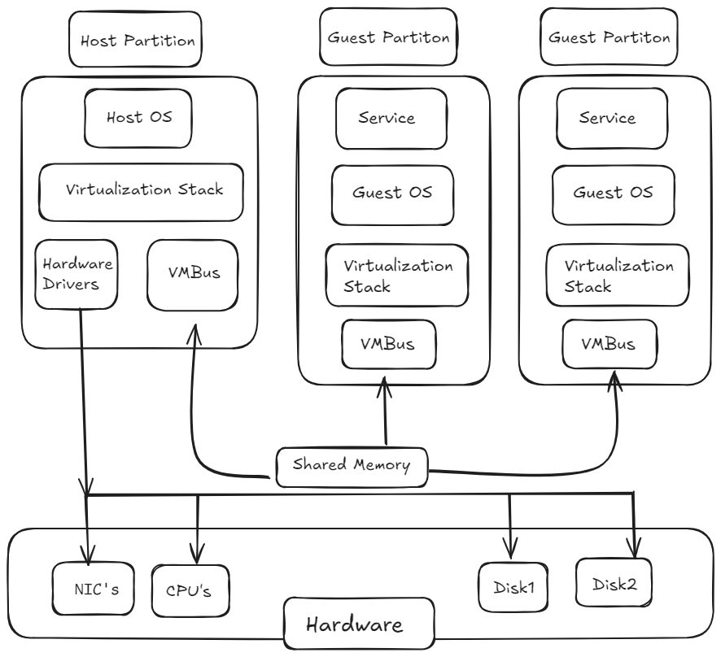
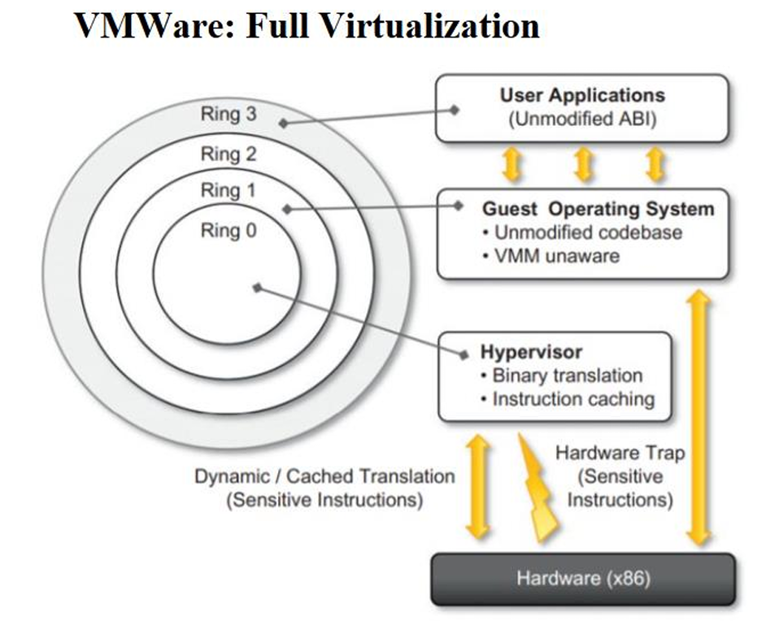

# Final QB CLD pt 1

## Chapter 1

- [x]   Q.1) 
### Define the term virtualization. Enlist and describe any 4 advantages of virtualization in brief.   **4M**
**Virtualization:**  is the ability of a computer program  (which can be combination of software and hardware)  emulation of a physical computer or server or enviornment that runs its own operating system and applications independently.
_Example:_ We can run Linux OS in Windows OS itself through a virtual Machines

**Advantages of Virtualization:**

1.  **Cost Savings** – Virtualization allows multiple operating systems and applications to run on a single physical server, reducing the need for extra hardware, lowering electricity consumption, and minimizing maintenance expenses.
    
2.  **Efficient Resource Utilization** – Physical hardware resources like CPU, RAM, and storage are shared among virtual machines, ensuring higher utilization rates and avoiding idle resources.
    
3.  **Scalability & Flexibility** – Virtual machines can be easily created, modified, or migrated to meet changing workload requirements without purchasing new hardware.
    
4.  **Disaster Recovery** – Virtual machines can be quickly backed up, replicated, and restored on other servers, In case of system crashes or site failures.

***
- [x] Q.2) 
### Describe the following terms in brief with suitable examples **4M**  
  (i) Server Consolidation  
  (ii) Virtual Machine (VM)  
  (iii) Virtual Machine Manager (VMM)  
  (iv) Binary Translation  
  (v) VM migration  
  (vi) Data center  

-   **Server Consolidation** – It is the process of combining multiple underutilized physical servers into fewer, more powerful servers by using virtualization.  
    _Example:_ Running multiple virtual servers on a single physical machine instead of having separate servers for each.
    
-   **Virtual Machine (VM)** – A software-based emulation of a physical computer that runs its own operating system and applications independently.  
    _Example:_ Running Linux as a VM inside Windows.
    
-   **Virtual Machine Manager (VMM)** – Also called a hypervisor, it is software that creates, manages, and monitors virtual machines.  
    _Example:_ VMware ,  Oracle VirtualBox.
    
-   **Binary Translation** – A technique used by hypervisors to convert guest OS instructions into host OS instructions for execution.  
    _Example:_ Running Windows software on a virtual machine even if the processor doesn’t directly support it.
    
-   **VM Migration** – The process of moving a running virtual machine from one physical host to another with minimal downtime.  
    _Example:_ Live migration in VMware vMotion.
    
-   **Data Center** – A facility consisting of many servers and storage systems used to store, manage, and share data and applications. 
    _Example:_ Google or Amazon cloud data centers.
***
- [x] Q.3) 

### Classify hardware instructions in terms of privilege modes with their working. Draw Security rings diagram for the same. **6M**
 
-   **Security Rings Explanation:**
    
    -   **Ring 0 (Kernel – Highest Privilege):** Executes privileged instructions, manages hardware and OS core.
        
    -   **Ring 1 (Device Drivers):** Runs device drivers that need hardware access.
        
    -   **Ring 2 (System Services):** Runs OS-level services like file systems and communication.
        
    -   **Ring 3 (User Applications – Lowest Privilege):** Runs user programs; only non-privileged instructions allowed.

-   **Privileged Instructions** – Special instructions that can **directly control hardware or critical system resources**. Since they can affect the entire system, they are executed only in **Kernel Mode (Ring 0)**.  
    These include **behavior-sensitive instructions** (like I/O operations) and **control-sensitive instructions** (like changing CPU registers or memory settings).  
    _Example:_ I/O control, memory management, enabling/disabling interrupts.
    
-   **Non-Privileged Instructions** – Normal instructions that **do not compromise system security**. They run safely in **User Mode (Ring 3)** and cannot access hardware or kernel resources directly.  
    These cover everyday operations like arithmetic, logical, and data movement, which don’t interfere with other programs.  
    _Example:_ Arithmetic (add, subtract), logical (AND, OR), and data movement (move, load).

***
- [x] Q.4) 
### State the role of hypervisor. Enlist and describe the working of types of hypervisors with suitable examples.  **6-8M**

-   **Role of Hypervisor:**  
    A **hypervisor** (Virtual Machine Monitor – VMM) is a software layer that allows multiple **virtual machines (VMs)** to run on a single physical system.  
    It manages allocation of CPU, memory, storage, and I/O devices among VMs, while ensuring **isolation, security, and efficient resource utilization**.  
    Hypervisors are the backbone of **virtualization and cloud computing**.
    
-   **Types of Hypervisors:**
    
    1.  **Type 1 – Bare-Metal Hypervisor:**
        
        -   Runs **directly on the hardware** without a host operating system.
            
        -   The hypervisor itself handles resource allocation and VM scheduling.
            
        -   Provides **high performance, scalability, and security**, making it suitable for **enterprise servers and data centers**.
            
        -   **Working:** Each VM runs a guest OS on the hypervisor, which **directly communicates with hardware** to allocate CPU, memory, and I/O.
            
        -   **Examples:** VMware ESXi, Microsoft Hyper-V .
            
    2.  **Type 2 – Hosted Hypervisor:**
        
        -   Installed **on top of an existing host operating system**.
            
        -   Relies on the host OS for device drivers, hardware communication, and resource management.
            
        -   Easier to install and use, but performance is slightly lower due to the **extra OS layer**.
            
        -  **Working:** Each VM runs a guest OS on the hypervisor, but all hardware requests **go through the host OS first**, then reach the hardware.
            
        -   **Examples:** Oracle VirtualBox, VMware Workstation.
> [!abstract] If 8 marks = draw diagram both
  

***
- [x] Q.5)  #p
### Draw & Explain Para virtualization Technology with its advantages and disadvantages.   **6-8M**
Paravirtualization is a virtualization technique in which the guest operating system is modified to replace sensitive instructions with hypercalls, so it can work efficiently with the hypervisor.

> [!abstract] only if 8 marks
> **Working :**
    1.  The **hypervisor provides special APIs**, called **hypercalls**, for critical operations.    
> 2.  The **guest OS is modified** to replace sensitive or privileged instructions with these **hypercalls**.  
>3.  When the guest OS needs resources like **CPU, memory, or I/O**, it makes a hypercall.  
>4.  The **hypervisor handles the request** and communicates with the physical hardware to allocate resources efficiently.
        
-   **Diagram:** 
 
    > [!abstract] any 2 if 6 marks    **Advantages:** 
    > 1.  High performance and efficiency (less overhead)
       >2.  Better resource utilization than full virtualization
    >3.  Suitable for large-scale cloud environments 

    > [!abstract] any 2 if 6 marks    **Disadvantages:**
    >1.  Needs guest OS modification, limiting OS choice
      >2.  Compatibility issues with proprietary or closed-source OS
      >3.  More complex to implement than full virtualization

***
- [x] Q.6) #p
### Draw & Explain Microsoft Hyper-V Technology with its advantages and disadvantages  **6-8M**
**Microsoft Hyper-V** is a **Type-1 hypervisor** developed by Microsoft that allows running multiple virtual machines on Windows servers. It enables efficient use of hardware resources by isolating and managing VMs.

***

> [!abstract] only if 8 marks  
> Working:
> 
> 1.  Hyper-V runs directly on the **host hardware** as a bare-metal hypervisor.
>     
> 2.  The **root partition** (Windows OS) manages hardware access and controls Hyper-V.
>     
> 3.  **Child partitions (VMs)** run guest operating systems and applications.
>     
> 4.  Hyper-V manages CPU, memory, storage, and networking requests between VMs and hardware.
>     

***

-   Diagram:  
    
    

***

> [!abstract] any 2 if 6 marks  
> Advantages:
> 
> 1.  Cost-effective and comes built into Windows Server.
>     
> 2.  Provides strong isolation and security between VMs.
>     
> 3.  Supports live migration and scalability for enterprise use.
>     

> [!abstract] any 2 if 6 marks  
> Disadvantages:
> 
> 1.  Works best only in Windows-based environments.
>     
> 2.  Requires significant hardware resources.
>     
> 3.  Limited support for some Linux distributions compared to VMware.
>
***
- [x] Q.7) #p
### Draw & Explain Full Virtualization Technology with its advantages and disadvantages  **6-8M**

Full Virtualization is a technique where the **hypervisor fully emulates the underlying hardware**, allowing **unmodified guest operating systems** to run as if they have direct access to the physical hardware.

***

> [!abstract] only if 8 marks  
> Working:
> 
> 1.  The **hypervisor (VMM)** allocates CPU, memory, storage, and I/O resources to each VM.
>     
> 2.  **Guest OS** runs unmodified on virtual hardware, unaware of other VMs.
>     
> 3.  **Applications** operate normally on each guest OS as if on real hardware.
>     

***

-   Diagram:
    
    
    

***

> [!abstract] any 3 if 6 marks  
> Advantages:
> 
> 1.  **OS Independence** – Any guest OS can run without modification.
>     
> 2.  **Strong Isolation** – Failures in one VM do not affect others.
>     
> 3.  **Efficient Resource Utilization** – Multiple OS instances share hardware efficiently.
>     
> 4.  **Flexibility** – Easy to deploy or test different OS environments.
>     
> 5.  **Migration & Snapshots** – VMs can be paused, copied, or migrated easily.
>     

> [!abstract] any 3 if 6 marks  
> Disadvantages:
> 
> 1.  **Performance Overhead** – Slight slowdown in CPU and I/O operations.
>     
> 2.  **Resource Intensive** – Each VM consumes memory, CPU, and storage.
>     
> 3.  **Complexity** – Requires a strong hypervisor and management tools.
>     
> 4.  **Hardware Compatibility** – Some devices may not fully work in virtualized mode.
>
***
- [x] Q.8) 
### Explain Elements of Parallel Computing. **4M**
-   **Concurrency** – Executing multiple instructions or tasks simultaneously.
    
-   **Granularity** – Level of task division:
    
    -   **Fine-grain:** Smaller, detailed tasks.
        
    -   **Coarse-grain:** Larger, fewer tasks.
        
-   **Synchronization** – Coordination between processes to ensure correct results.
    
-   **Scalability** – Ability to efficiently utilize additional resources as the system grows.

***
- [ ] Q.9) 
### Explain Elements of distributed Computing. **4M**

-   **Nodes** – Individual computing units such as computers or virtual machines (VMs).
    
-   **Network** – Communication backbone that connects all nodes for data exchange.
    
-   **Middleware** – Software layer that manages communication, resource sharing, and task execution.
    
-   **Replication and Consistency** – Mechanisms to ensure reliability and uniformity of data across nodes
***
- [ ] Q.10) Explain types of virtualization (Any 4) **4-6M**
- [ ] Q.11) Define the term server virtualization with one example. **4M**
- [ ] Q.12) Difference between parallel and distributed computing. **4M**
- [ ] Q.13) Define VMM with diagram. **4M**
- [ ] Q.14) Draw and explain the components of Machine Reference Model. **4M**

---

## Chapter 2

- [ ] Q.1) Give the NIST definition of cloud computing, also explain the principles (5-4-3) of cloud computing. **4M**  
  Enlist characteristics, enlist deployment and service models
- [ ] Q.2) Describe 5 principles characteristics of cloud computing with examples. **4M**
- [ ] Q.3) Describe 4 cloud deployment models with suitable example of each. (Draw diagram + eg) **6-8M**
- [ ] Q.4) Compare cloud deployment models. **6M**
- [ ] Q.5) Explain SaaS with suitable Eg + diagram. **4M**
- [ ] Q.6) Explain PaaS with suitable Eg + diagram. **4M**
- [ ] Q.7) Explain IaaS with suitable Eg + diagram. **4M**
- [ ] Q.8) Give service models for the following services. **4M**  
  EC2, ELB, Google sheet, Google app engine  
  VPC, Netflix, Hadoop, SalesForce  
  S3, Google documents, Heroku, Facebook
- [ ] Q.9) Explain cloud architecture with suitable diagram. **4-6M**
- [ ] Q.10) Describe Google Cloud Platform with its features and various services offered by GCP. **4-6M**
- [ ] Q.11) Elaborate in brief cloud economy models. **4M**
- [ ] Q.12) Explain architecture of Microsoft Azure along with its example. **6M**

---

## Chapter 3

- [ ] Q.1) Describe the working of “AWS EC2” service with any 3 advantages in brief. **4M**
- [ ] Q.2) With suitable diagram explain the working of Elastic Load Balancer (ELB) with its types. **4-6M**
- [ ] Q.3) Explain working of AWS CloudFront with example. **4-6M**
- [ ] Q.4) Describe in brief CDN with one example. **4M**