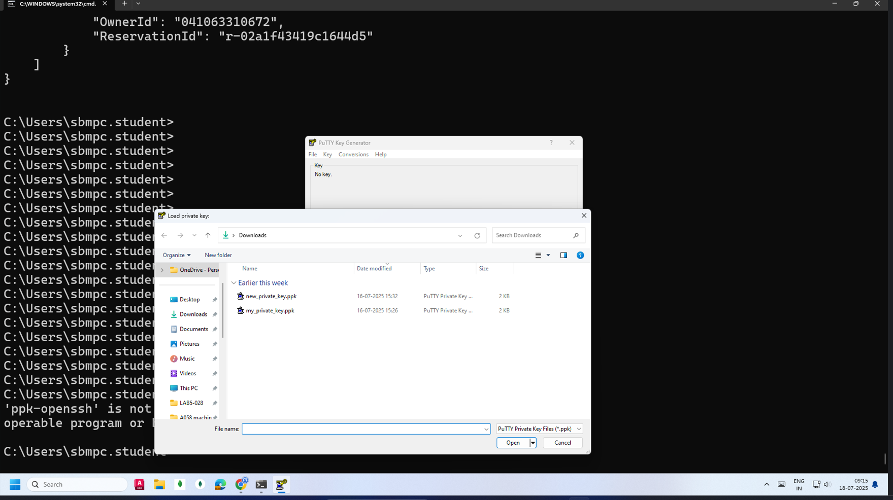
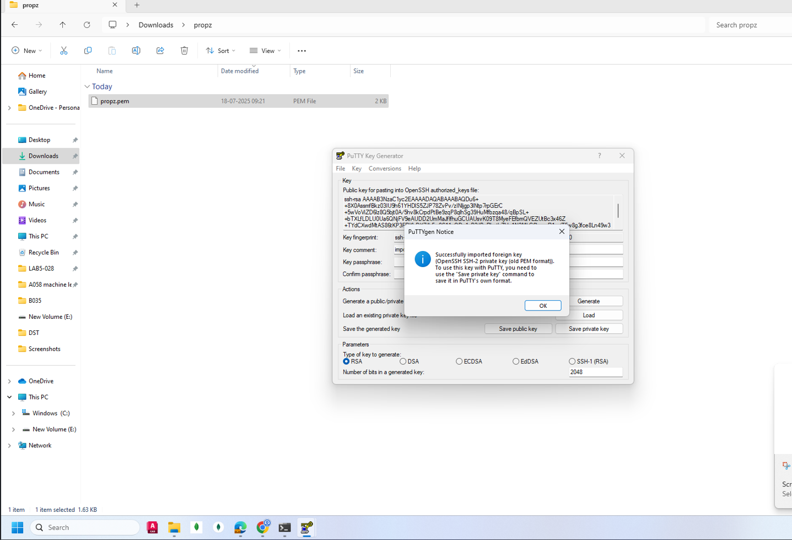
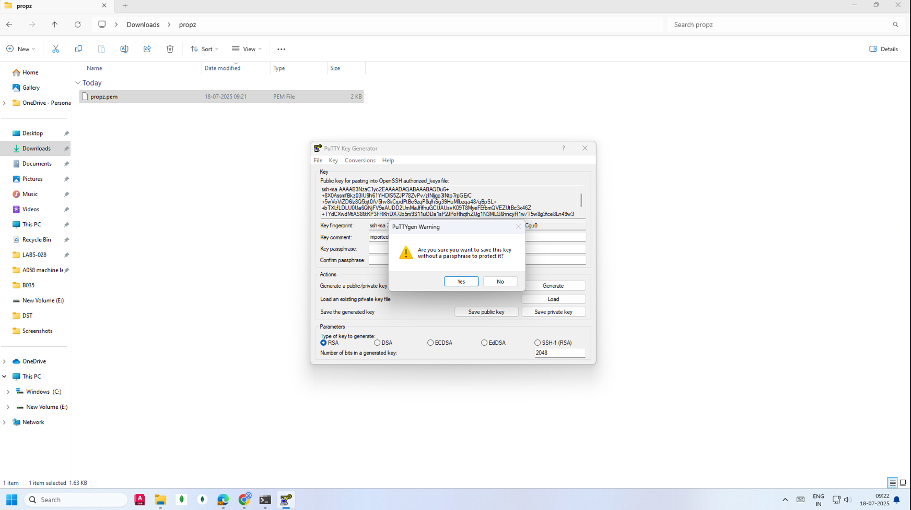
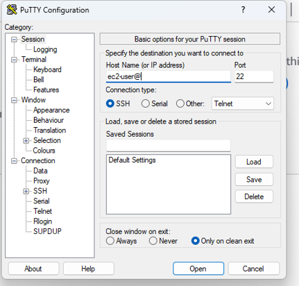

2nd practical stuffs
```bash
C:\Users\sbmpc.student>aws configure
AWS Access Key ID [****************F7F\]:  hidden
AWS Secret Access Key [****************F+DZ]: hidden
Default region name [ap-south-1]: ap-south-1
Default output format [json]: json

C:\Users\sbmpc.student>aws ec2 describe-instances
{
    "Reservations": [
        {
            "Groups": [],
            "Instances": [
                {
                    "AmiLaunchIndex": 0,
                    "ImageId": "ami-0d03cb826412c6b0f",
                    "InstanceId": "i-0f2f9292f054550e3",
                    "InstanceType": "t2.nano",
                    "KeyName": "propz",
                    "LaunchTime": "2025-07-11T03:16:46+00:00",
                    "Monitoring": {
                        "State": "disabled"
                    },
                    "Placement": {
                        "AvailabilityZone": "ap-south-1a",
                        "GroupName": "",
                        "Tenancy": "default"
                    },
                    "PrivateDnsName": "ip-172-31-44-70.ap-south-1.compute.internal",
                    "PrivateIpAddress": "172.31.44.70",
                    "ProductCodes": [],
                    "PublicDnsName": "",
                    "State": {
                        "Code": 80,
                        "Name": "stopped"
                    },
                    "StateTransitionReason": "User initiated (2025-07-11 03:24:24 GMT)",
                    "SubnetId": "subnet-068baf1aa698dc7d6",
                    "VpcId": "vpc-0b0f96ad615b94e8a",
                    "Architecture": "x86_64",
                    "BlockDeviceMappings": [
                        {
                            "DeviceName": "/dev/xvda",
                            "Ebs": {
                                "AttachTime": "2025-07-11T03:16:46+00:00",
                                "DeleteOnTermination": true,
                                "Status": "attached",
                                "VolumeId": "vol-02253f8b0e65afa61"
                            }
                        }
                    ],
                    "ClientToken": "b3f9b444-6319-4d69-a31b-8ff4c671d2f8",
                    "EbsOptimized": false,
                    "EnaSupport": true,
                    "Hypervisor": "xen",
                    "NetworkInterfaces": [
                        {
                            "Attachment": {
                                "AttachTime": "2025-07-11T03:16:46+00:00",
                                "AttachmentId": "eni-attach-0a60fce1f632d377e",
                                "DeleteOnTermination": true,
                                "DeviceIndex": 0,
                                "Status": "attached",
                                "NetworkCardIndex": 0
                            },
                            "Description": "",
                            "Groups": [
                                {
                                    "GroupName": "launch-wizard-1",
                                    "GroupId": "sg-08680184160e48b4f"
                                }
                            ],
                            "Ipv6Addresses": [],
                            "MacAddress": "02:4f:6e:3e:f9:23",
                            "NetworkInterfaceId": "eni-021fc929e78b07fee",
                            "OwnerId": "041063310672",
                            "PrivateDnsName": "ip-172-31-44-70.ap-south-1.compute.internal",
                            "PrivateIpAddress": "172.31.44.70",
                            "PrivateIpAddresses": [
                                {
                                    "Primary": true,
                                    "PrivateDnsName": "ip-172-31-44-70.ap-south-1.compute.internal",
                                    "PrivateIpAddress": "172.31.44.70"
                                }
                            ],
                            "SourceDestCheck": true,
                            "Status": "in-use",
                            "SubnetId": "subnet-068baf1aa698dc7d6",
                            "VpcId": "vpc-0b0f96ad615b94e8a",
                            "InterfaceType": "interface"
                        }
                    ],
                    "RootDeviceName": "/dev/xvda",
                    "RootDeviceType": "ebs",
                    "SecurityGroups": [
                        {
                            "GroupName": "launch-wizard-1",
                            "GroupId": "sg-08680184160e48b4f"
                        }
                    ],
                    "SourceDestCheck": true,
                    "StateReason": {
                        "Code": "Client.UserInitiatedShutdown",
                        "Message": "Client.UserInitiatedShutdown: User initiated shutdown"
                    },
                    "Tags": [
                        {
                            "Key": "Name",
                            "Value": "mod"
                        }
                    ],
                    "VirtualizationType": "hvm",
                    "CpuOptions": {
                        "CoreCount": 1,
                        "ThreadsPerCore": 1
                    },
                    "CapacityReservationSpecification": {
                        "CapacityReservationPreference": "open"
                    },
                    "HibernationOptions": {
                        "Configured": false
                    },
                    "MetadataOptions": {
                        "State": "applied",
                        "HttpTokens": "required",
                        "HttpPutResponseHopLimit": 2,
                        "HttpEndpoint": "enabled",
                        "HttpProtocolIpv6": "disabled",
                        "InstanceMetadataTags": "disabled"
                    },
                    "EnclaveOptions": {
                        "Enabled": false
                    },
                    "BootMode": "uefi-preferred",
                    "PlatformDetails": "Linux/UNIX",
                    "UsageOperation": "RunInstances",
                    "UsageOperationUpdateTime": "2025-07-11T03:16:46+00:00",
                    "PrivateDnsNameOptions": {
                        "HostnameType": "ip-name",
                        "EnableResourceNameDnsARecord": true,
                        "EnableResourceNameDnsAAAARecord": false
                    },
                    "MaintenanceOptions": {
                        "AutoRecovery": "default"
                    }
                }
            ],
            "OwnerId": "041063310672",
            "ReservationId": "r-02a1f43419c1644d5"
        }
    ]
}


C:\Users\sbmpc.student>
C:\Users\sbmpc.student>

```


THEN open windows logo and search for putty gen


## ✅ Step-by-Step: Use PuTTY to Connect to EC2 via `.pem` File (Windows)

---

### 🔹 Step 1: Install Required Tools

Make sure you have:

* **PuTTY** – SSH client
* **PuTTYgen** – for converting `.pem` to `.ppk`

➡️ Download: [https://www.putty.org](https://www.putty.org)

---

### 🔹 Step 2: Convert `.pem` to `.ppk` using PuTTYgen

1. Press **Windows key** and search **“PuTTYgen”** → Open it.

2. Click **Load** (bottom-right)

3. In the file dialog:

   * Change file type to **All Files (\*.\*)**
   * Select your downloaded **`.pem`** file (e.g., `propz.pem`)

4. It will show:

   > Successfully imported foreign key...

5. (✅ *Do not* enter passphrase unless you manually set one earlier)

6. Click **Save private key**

   * Confirm: *“Are you sure you want to save without a passphrase?”* → Yes
   * Save as: `propz.ppk`

✅ Your `.ppk` file is now ready to be used in PuTTY.

---
> [!attention] done till above only
> not sure how to do below part
> 
### 🔹 Step 3: Connect to EC2 using PuTTY

1. Open **PuTTY**

2. In the **Host Name (or IP address)** box, enter your EC2's public IP:

   ```
   ec2-user@43.204.22.91
   ```

3. In the **left sidebar**, go to:

   ```
   SSH → Auth
   ```

4. Under **“Private key file for authentication”**, click **Browse**

   → Select your `propz.ppk` file from earlier

5. \[Optional but clean] Go to:

   ```
   Session (top left)
   ```

   → Give a name in “Saved Sessions” like: `MyEC2` → click **Save**

6. Now click **Open**

---

### 🔹 Step 4: First-Time Confirmation

* A prompt will appear: *“The server’s host key is not cached...”*
  → Click **Yes**

* You’ll now see:

  ```
  ec2-user@ip-172-31-xx-xx:~$
  ```

🎉 You're now **logged into your EC2 instance** via PuTTY!

---

### 💡 Notes

| Item       | Value                      |
| ---------- | -------------------------- |
| Username   | `ec2-user`                 |
| OS         | Amazon Linux 2             |
| IP Address | `43.204.22.91`             |
| Key Format | `.ppk` (PuTTY Private Key) |

---
outputs
 
   
