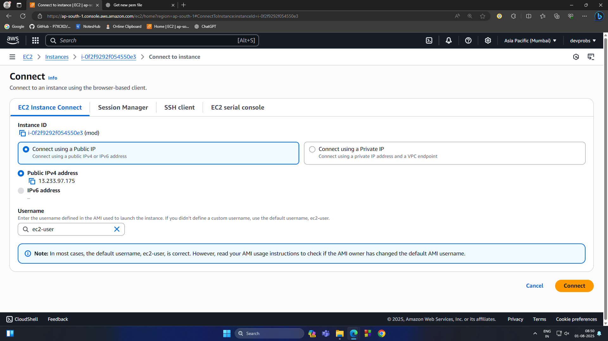
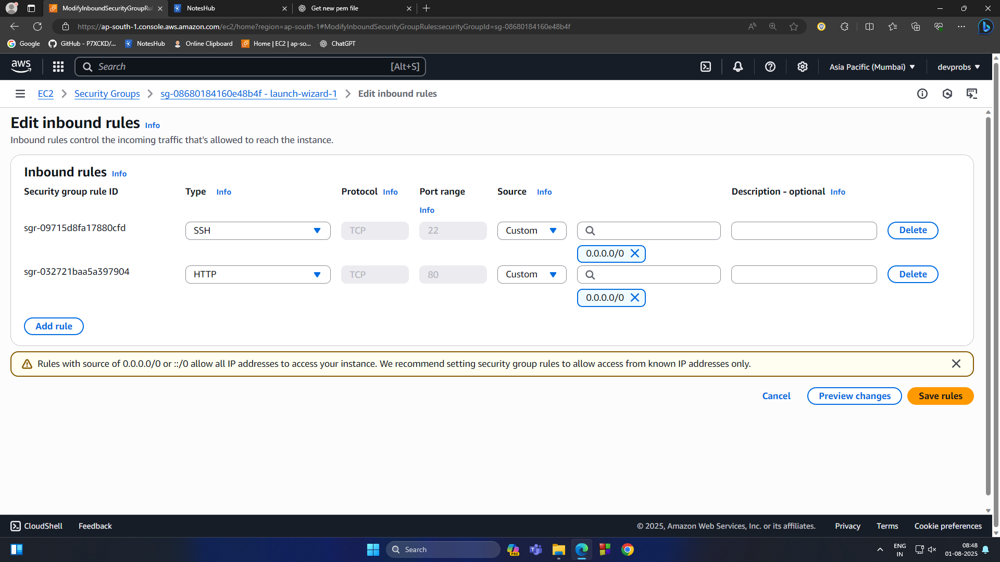
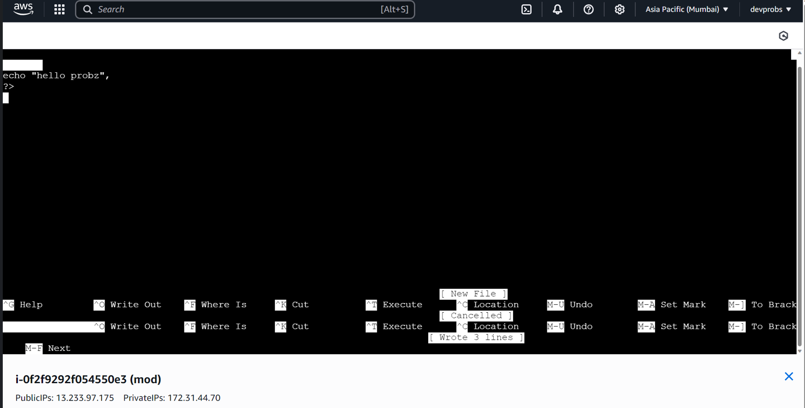
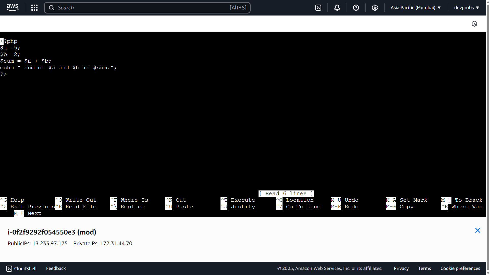
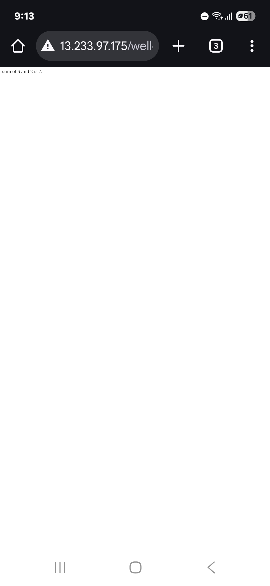
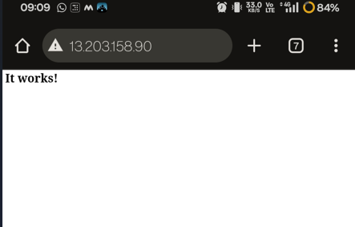

### 🔓 Allow HTTP Access to EC2 + Connect to Instance

#### ✅ Step 1: Add HTTP Inbound Rule

1.  Go to the **EC2 Dashboard** on AWS.
    
2.  Click on your running **EC2 Instance ID**.
    
3.  In the bottom panel, click the **"Security"** tab.
    
4.  Click on the **Security Group** listed (e.g., `sg-xxxxxxxxxx`).
    
5.  In the Security Group page, go to the **Inbound Rules** tab.
    
6.  Click **"Edit Inbound Rules"**.
    
7.  Add a new rule:
    
    -   **Type:** HTTP
        
    -   **Protocol:** TCP
        
    -   **Port Range:** 80
        
    -   **Source:** `0.0.0.0/0`
        
8.  Click **"Save rules"**.
    

✅ Now your instance allows incoming HTTP traffic from anywhere.
#### 💻 Step 2: Connect to Your EC2 Instance

1.  Go back to the **EC2 Instances** page.
    
2.  Select your instance → Click the **"Connect"** button.

3.  connect using public ip and click connect again
***
### outputs
  

 

```bash
 ,     #_
   ~\_  ####_        Amazon Linux 2023
  ~~  \_#####\
  ~~     \###|
  ~~       \#/ ___   https://aws.amazon.com/linux/amazon-linux-2023
   ~~       V~' '->
    ~~~         /
      ~~._.   _/
         _/ _/
       _/m/'
[ec2-user@ip-172-31-8-41 ~]$ sudo yum update -y
Amazon Linux 2023 Kernel Livepatch repository                                                                     
==================================================================================================================================================================================================================

Installed:
  apr-1.7.5-1.amzn2023.0.4.x86_64                apr-util-1.6.3-1.amzn2023.0.1.x86_64          apr-util-openssl-1.6.3-1.amzn2023.0.1.x86_64          generic-logos-httpd-18.0.0-12.amzn2023.0.3.noarch         
  httpd-2.4.62-1.amzn2023.x86_64                 httpd-core-2.4.62-1.amzn2023.x86_64           httpd-filesystem-2.4.62-1.amzn2023.noarch             httpd-tools-2.4.62-1.amzn2023.x86_64                      
  libbrotli-1.0.9-4.amzn2023.0.2.x86_64          mailcap-2.1.49-3.amzn2023.0.3.noarch          mod_http2-2.0.27-1.amzn2023.0.3.x86_64                mod_lua-2.4.62-1.amzn2023.x86_64                          

Complete!
[ec2-user@ip-172-31-8-41 ~]$ sudo systemctl start httpd
[ec2-user@ip-172-31-8-41 ~]$ sudo systemctl enable httpd
Created symlink /etc/systemd/system/multi-user.target.wants/httpd.service → /usr/lib/systemd/system/httpd.service.
[ec2-user@ip-172-31-8-41 ~]$ sudo systemctl status httpd
● httpd.service - The Apache HTTP Server
     Loaded: loaded (/usr/lib/systemd/system/httpd.service; enabled; preset: disabled)
     Active: active (running) since Fri 2025-08-01 03:22:14 UTC; 1min 14s ago
       Docs: man:httpd.service(8)
   Main PID: 26308 (httpd)
     Status: "Total requests: 0; Idle/Busy workers 100/0;Requests/sec: 0; Bytes served/sec:   0 B/sec"
      Tasks: 177 (limit: 1111)
     Memory: 13.0M
        CPU: 95ms
     CGroup: /system.slice/httpd.service
             ├─26308 /usr/sbin/httpd -DFOREGROUND
             ├─26309 /usr/sbin/httpd -DFOREGROUND
             ├─26310 /usr/sbin/httpd -DFOREGROUND
             ├─26311 /usr/sbin/httpd -DFOREGROUND
             └─26312 /usr/sbin/httpd -DFOREGROUND

==================================================================================================================================================================================================================

Installed:
  libsodium-1.0.19-4.amzn2023.x86_64                 libxslt-1.1.43-1.amzn2023.0.1.x86_64              nginx-filesystem-1:1.28.0-1.amzn2023.0.1.noarch         php8.4-8.4.8-1.amzn2023.0.1.x86_64                 
  php8.4-cli-8.4.8-1.amzn2023.0.1.x86_64             php8.4-common-8.4.8-1.amzn2023.0.1.x86_64         php8.4-fpm-8.4.8-1.amzn2023.0.1.x86_64                  php8.4-mbstring-8.4.8-1.amzn2023.0.1.x86_64        
  php8.4-opcache-8.4.8-1.amzn2023.0.1.x86_64         php8.4-pdo-8.4.8-1.amzn2023.0.1.x86_64            php8.4-process-8.4.8-1.amzn2023.0.1.x86_64              php8.4-sodium-8.4.8-1.amzn2023.0.1.x86_64          
  php8.4-xml-8.4.8-1.amzn2023.0.1.x86_64            

Complete!
[ec2-user@ip-172-31-8-41 ~]$ sudo systemctl restart httpd
[ec2-user@ip-172-31-8-41 ~]$ sudo nano /var/www/html/abc.php
[ec2-user@ip-172-31-8-41 ~]$ sudo systemctl restart httpd
[ec2-user@ip-172-31-8-41 ~]$ sudo nano /var/www/html/add.php
[ec2-user@ip-172-31-8-41 ~]$ sudo systemctl restart httpd
[ec2-user@ip-172-31-8-41 ~]$ 
Broadcast message from root@ip-172-31-8-41.ap-south-1.compute.internal (Fri 2025-08-01 03:45:21 UTC):

The system will power off now!
```
***
### wello.php
```php
<?php
$a = 5;
$b = 3;
$sum = $a + $b;

echo "The sum of $a and $b is $sum.";
?>
```
***
  

 