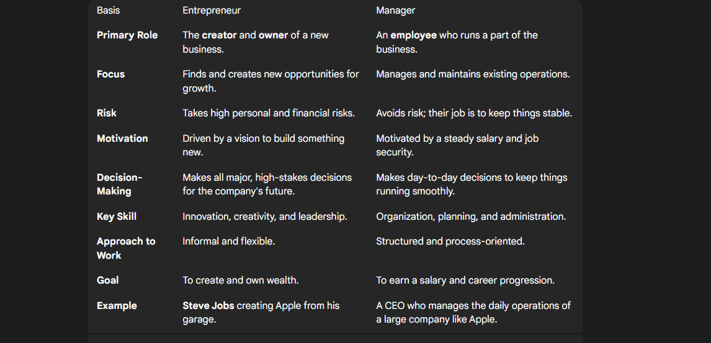
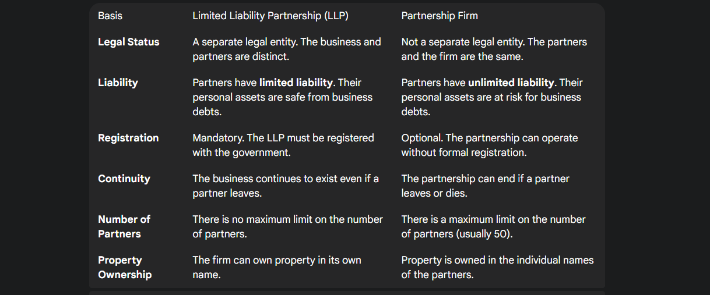
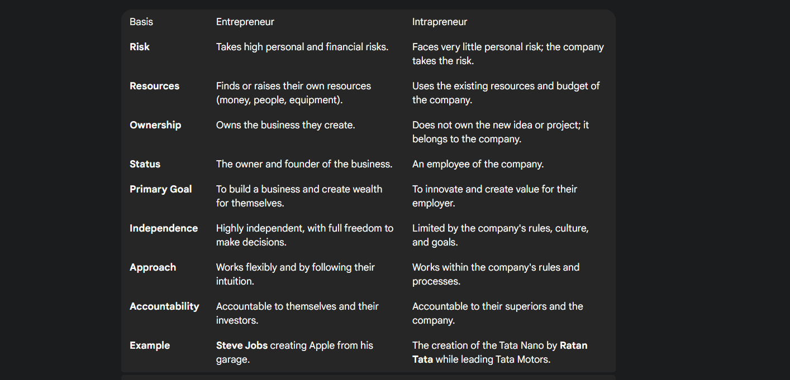

# EDS QUESTION BANK PT-1

## CHAPTER 1: Entrepreneurship & Start-ups (CO 1) {10 Marks}

---

- [x] Q.1  #p
### Define Entrepreneurship and Start-up. **4M**

> **Entrepreneurship** is the act of starting and running a business to earn a profit. It's about a person who identifies a need or a problem and creates a business to solve it for people.

> **Example:** A person sees a local need for fresh, homemade food and decides to open a small food truck. They are an **entrepreneur** because they are taking on the risk and work to create a new, self-owned business.

***

> A **start-up** is a new company built with the goal of growing extremely fast and becoming a big, impactful business, often using technology.

> **Example:** **Flipkart**, which started as a small online bookstore, is a famous Indian start-up. The founders weren't just trying to run one small shop; they built a platform with the goal of becoming the largest e-commerce company in the country, which they eventually did.

---

- [x] Q.2  #p
### List any three qualities of an entrepreneur. **4M**  

> [!abstract] Key Qualities of an Entrepreneur

-   **Risk-Taking:** An entrepreneur is willing to take calculated risks and invest time and resources without a guarantee of success.
    
    -   **Example:** **Ratan Tata** risked acquiring the struggling Jaguar and Land Rover brands, turning them into a major success.
        
-   **Vision and Innovation:** Entrepreneurs have a clear vision and are driven by an idea or solution to a problem. They think creatively to stay ahead.
    
    -   **Example:** **Steve Jobs** had the vision to combine a music player, phone, and internet device into a single product, which led to the innovative creation of the iPhone.
        
-   **Perseverance and Resilience:** An entrepreneur must be able to push through difficulties, learn from failures, and not give up.
    
    -   **Example:** **Walt Disney** faced multiple rejections and failures before his animation studio found success, showing his resilience.
---

- [x] Q.3  #p
### Define intrapreneurship? How is it different from entrepreneurship? **4M**  

**Intrapreneurship** is the process of creating new products or services **within a large company**.it's about a company or its employees acting like entrepreneurs by using the company's resources to create something innovative.
***

> [!abstract] Key Differences from Entrepreneurship

-   **Risk:** An **entrepreneur** takes all the personal financial risk. An **intrapreneur** does not; the company takes on the financial risk of the project.
    
-   **Resources:** An **entrepreneur** has to find or raise their own resources. An **intrapreneur** uses the existing resources, budget, and employees of their company.
    
-   **Ownership:** An **entrepreneur** fully owns the business they create. An **intrapreneur** does not own the project; it belongs to the company they work for.
---

- [x] Q.4  #p
### Mention three major functions of an entrepreneur. **4M**  

> [!abstract] Major Functions of an Entrepreneur

-   **Innovation:** An entrepreneur's main function is to find new ideas and opportunities to create a product, service, or business model.
    
    -   **Example:** A person who invents a new type of eco-friendly packaging is performing the function of innovation.
        
-   **Risk-Taking:** An entrepreneur takes on the personal and financial risk of the business. They must be able to make decisions under uncertainty and be ready to handle potential losses.
    
    -   **Example:** A person who invests their life savings to start a new company is performing the function of risk-taking.
        
-   **Organizing:** An entrepreneur is responsible for bringing together all the resources needed to start and run a business, including money, people, and equipment.
    
    -   **Example:** A person who hires a team, finds an office space, and secures funding is performing the function of organizing.
---

- [x] Q.6  #p
### Define a Sole Proprietorship. Mention one advantage and one disadvantage. **4M**  

A **sole proprietorship** is a business owned and run by just one person. The owner and the business are not legally separate, so the owner is responsible for all business profits and debts.

> [!abstract] Key Points

-   **Advantage: Easy to Start**
    
    -   It is the simplest and cheapest business to set up. There is very little paperwork or legal work needed.
        
    -   **Example:** A baker who starts selling cakes from their home kitchen is a sole proprietor. They can begin simply by baking and selling, without complex legal steps.
        
-   **Disadvantage: Unlimited Liability**
    
    -   The owner is personally responsible for all business debts. If the business fails, the owner's personal money and property are at risk.
        
    -   **Example:** If the baker takes out a large loan for an oven but their business fails, they would have to pay back the loan using their own personal savings.

***
- [x] Q.8  #p
### Explain any four qualities of a successful entrepreneur. **6M**  

> [!abstract] Qualities of a Successful Entrepreneur

-   **Risk-Taking:** An entrepreneur must be comfortable with taking calculated risks. They invest their time, money, and effort into a new venture, knowing there's a chance it might fail. This willingness to take risks is essential for innovation and growth.
    
    -   **Example:** **Ratan Tata** took a huge risk by acquiring the struggling Jaguar Land Rover brands, which later became a key part of Tata Group's success.
        
-   **Vision and Innovation:** Entrepreneurs are not just business managers; they are visionaries. They are driven by a novel idea or a unique solution to a problem and have a clear vision for what they want to achieve.
    
    -   **Example:** **Steve Jobs** had the vision to create a simple, integrated device that combined music, a phone, and the internet, which led to the innovative creation of the iPhone.
        
-   **Perseverance and Resilience:** Starting a business is a challenging journey full of setbacks and failures. A successful entrepreneur must be resilient, able to learn from mistakes, and keep going despite the obstacles.
    
    -   **Example:** **Walt Disney** faced numerous rejections and business failures, including the loss of his first successful character, before building the successful animation studio and theme park empire we know today.
        
-   **Leadership:** An entrepreneur must be a strong leader to guide their team toward a common goal. They inspire and motivate others, make difficult decisions, and build a positive and productive work culture.
    
    -   **Example:** The founders of **Flipkart**, Sachin and Binny Bansal, demonstrated strong leadership by not only building a successful e-commerce business but also by shaping a company culture focused on customer obsession and fast-paced innovation, which was critical to their growth.
---

- [x] Q.10  #p
### Differentiate between an entrepreneur and a manager. **6M**  
 
---

- [x] Q.14  
### Explain Limited Liability Partnership (LLP)? How is it different from a partnership firm? **6M**  

A **Limited Liability Partnership (LLP)** is a business run by partners where the company itself is legally responsible for its debts, not the partners. This protects the owners' personal assets.

>**Example:** If a group of friends starts a consulting business as an LLP and the business fails, their personal money and homes are safe.
***

 

---

- [x] Q.15  #p
### Differentiate between an Entrepreneur and Intrapreneur. **6M**  
 
---

- [x] Q.18  
### Explain Maslow’s Need Hierarchy and its relevance in motivating entrepreneurs and employees. **8M**  

**Maslow's Need Hierarchy** is a psychological theory that says people are motivated by five levels of needs. They work to meet the most basic needs first before moving on to the next level.

***
> [!caution] Just write the headings
>  no need to write subtitles of headings in diagram

> [!abstract] Five Levels of Needs

> [!abstract] Physiological Needs
> 
> The most basic needs for survival, like food, water, and shelter. These are the fundamental requirements for the human body to function.
> 
> -   **Employee Example:** A fair salary that helps an employee buy food and pay rent.
>     
> -   **Entrepreneur Example:** An entrepreneur works long hours with little income at the start, sacrificing comfort to build their business.
>     

***

> [!abstract] Safety Needs
> 
> The need to feel safe and secure from physical or financial harm. It's about having a sense of security and control over your circumstances.
> 
> -   **Employee Example:** Having a steady job with a regular salary and health insurance.
>     
> -   **Entrepreneur Example:** Taking a huge financial risk with the hope of building a secure future for themselves.
>     

***

> [!abstract] Social Needs
> 
> The need to feel a sense of belonging and connection to others. This involves forming relationships and being part of a group or community.
> 
> -   **Employee Example:** Enjoying a friendly team and positive work environment.
>     
> -   **Entrepreneur Example:** Building a strong network of partners and a loyal community of customers.
>     

***

> [!abstract] Esteem Needs
> 
> The need for respect, recognition, and a sense of achievement. This can be internal (self-worth) or external (from others).
> 
> -   **Employee Example:** Receiving an award or a promotion for good work.
>     
> -   **Entrepreneur Example:** Gaining public recognition or winning an award for their business success.
>     

***

> [!abstract] Self-Actualization Needs
> 
> The desire to become the best version of oneself and achieve one's full potential. This is the highest level of need, focused on personal growth and self-fulfillment.
> 
> -   **Employee Example:** Getting a challenging project that allows them to use their skills to the fullest.
>     
> -   **Entrepreneur Example:** An entrepreneur starts a business not just for money, but to solve a major problem and create a lasting impact on the world.
>
---

- [ ] Q.19  
### Compare and contrast LLP, Private Limited Company and PLC. **8M**  

| Feature | **Limited Liability Partnership (LLP)** | **Private Limited Company** | **Public Limited Company (PLC)** |
| --- | --- | --- | --- |
| **Governing Law** | Limited Liability Partnership Act, 2008 | Companies Act, 2013 | Companies Act, 2013 |
| **Liability** | Limited liability for partners, up to their contribution. Each partner is not liable for the misconduct of other partners. | Limited liability for shareholders, up to the value of their shares. | Limited liability for shareholders, up to the value of their shares. |
| **Ownership** | Owned and managed by the partners. | Owned by shareholders but managed by a Board of Directors. | Owned by shareholders (including the public) and managed by a Board of Directors. |
| **Number of Members** | Minimum 2, no maximum limit. | Minimum 2, maximum 200. | Minimum 7, no maximum limit. |
| **Raising Capital** | Cannot issue shares. Funding is typically from partners or private loans. | Can raise funds by issuing shares to private investors. Cannot invite the public. | Can raise large amounts of capital by issuing shares to the public through an IPO. |
| **Transferability of Ownership** | Partnership rights are not easily transferable and require consent from other partners. | Shares are not freely transferable; they are restricted by the company's Articles of Association. | Shares are freely transferable and can be traded on a stock exchange. |
| **Compliance & Audit** | Low compliance requirements. Audit is not mandatory unless turnover exceeds ₹40 lakh. | Stricter compliance and reporting. Audit is mandatory. | Very high compliance and regulatory burden. Audit and public disclosure of financial reports are mandatory. |
| **Public Trust & Credibility** | Lower public trust compared to companies. | Higher credibility than an LLP, but less than a PLC. | Highest level of public trust and credibility. |

---

# CHAPTER 2: Business Idea Generation & Evaluation (CO 2) {12 Marks}

- [x] Q.1  
### Define innovation and explain its role in business. **4M**  

> **Innovation** is the process of successfully introducing a new idea, product, service, or process that creates value for a business or its customers. It is the practical application of creativity.

***

> [!abstract] Role of Innovation in Business

-   **Staying Competitive:** Innovation helps a business stand out in the market by offering unique products or services that competitors do not have.
    
-   **Solving Customer Problems:** It allows a business to better meet the evolving needs and expectations of its customers.
    
-   **Driving Growth:** Innovation can lead to new revenue streams, market expansion, and increased profitability.
    

    

**Example:** When **Netflix** started, it innovated the way people rented movies. By introducing a subscription service where DVDs were delivered by mail, it solved customer problems like late fees and provided greater convenience, which ultimately allowed it to dominate the market and drive massive growth.

***
- [x] Q.4  
### Mention three ways to search for a business opportunity. **4M**  

> [!abstract] Identify Pain Points
> 
> Find problems that people face in their daily lives. A business idea is often a solution to a common frustration.
> 
> -   **Example:** A baker who starts selling cakes from home is acting on a pain point: people wanting fresh, homemade food.
>     

***

> [!abstract] Analyze Trends
> 
> Look at new or growing social, technological, and economic changes. Trends create new needs that you can meet.
> 
> -   **Example:** **Flipkart** was a start-up that took advantage of the trend of e-commerce to become a big business, solving the problem of having to physically go to bookstores to buying everything online
>     

***

> [!abstract] Study the Competition
> 
> See what other businesses are doing well and where they are failing. You can create a better product or service by filling their gaps.
> 
> -   **Example:** **Netflix** innovated the way people rented movies by noticing the problems with traditional stores, like late fees and limited selection.
>

- [x] Q.5  
### Define prototyping. Why is it important for a start-up? **4M**  

> **Prototyping** is the process of creating a  early version of a product to test its design and functionality before it's fully developed. It can be a simple sketch, a physical model, or a basic digital mockup.

***

> [!abstract] Importance of Prototyping for a Start-up

-   **Saves Time and Money:** It helps a start-up find and fix flaws in a product's design early, which is much cheaper than correcting mistakes after full production has started.
    
-   **Gathers Feedback:** A prototype can be shown to potential customers and investors to get valuable feedback, ensuring the final product meets market needs.
    

-   **Secures Investment:** A working prototype is a powerful tool to convince investors to fund the project by showing its potential.
    

> [!abstract] Example of Prototyping
> 
> When Apple was developing the iPhone, they created numerous prototypes of different sizes and materials to test the user experience, weight, and feel. This process helped them validate the design and gather feedback before committing to mass production, saving millions in potential redesign costs.
---

---

- [x] Q.7  
### Differentiate between creativity and innovation with examples. **6M**  

| Basis of Difference | **Creativity** | **Innovation** |
| --- | --- | --- |
| **Meaning** | Coming up with a new idea. | Making that new idea happen and work. |
| **Nature** | A **thinking** process; it is a mental activity. | A **doing** process; it is a productive activity. |
| **Output** | An idea, thought, or concept. The output may not be tangible or have immediate use. | A new product, service, or business model. The output is tangible and creates value. |
| **Risk** | Involves little to no risk, as it's a mental exercise. | Involves financial and business risk, as it requires investment and resources. |
| **Measurement** | Cannot be easily measured. Its value is subjective and hard to quantify. | Can be measured by metrics like profitability, market share, or efficiency. |
| **Timeline** | Can happen instantly in a "lightbulb moment." | Is a process that unfolds over time and requires structured steps. |
| **Focus** | Focuses on imagination and conceiving new possibilities. | Focuses on execution and delivering tangible results. |
| **Relationship** | Serves as the raw material or spark that fuels innovation. | Is the practical application of creative ideas. |

***

- [x] Q.9  
### Explain the concept of value creation with an example. **6M**  

> **Value creation** is the process of providing a product or service that is worth more to a customer than the cost and effort it took to produce it. It's about solving a customer's problem in a way they are willing to pay for. The value a customer gets minus the cost to make the product is the **profit** for the business.

***

> [!abstract] Example
> 
> The business idea of Flipkart, starting as an online bookstore, was a form of value creation. It created value for customers who found it inconvenient to go to physical bookstores by providing:
> 
> -   **Convenience:** Books could be ordered from home and delivered to their doorstep.
>     
> -   **Selection:** Customers had access to a much larger inventory than any single physical store could offer.
>     
> -   **Time Savings:** Customers could find and purchase a book in minutes, rather than spending hours traveling to and browsing stores.
>     
>     Because these benefits were valuable to customers, they were willing to pay for the service, allowing Flipkart to grow and create immense value for its founders and investors.
>
---

- [x] Q.10  
### Define: Design Thinking? Explain its five stages. **6M**  

**Design Thinking** is a way to solve problems by focusing on what people need. It's a step-by-step process that helps create new, useful solutions by putting the user at the very heart of the design.

> [!abstract] Five Stages of Design Thinking

-   **Empathize:** Understand your user's needs and problems by observing them.
    
    -   **Example:** A team watches customers in a grocery store to see how they struggle with self-checkout machines.
        
-   **Define:** Clearly state the user's main problem based on what you've learned.
    
    -   **Example:** The team defines the problem as, "Customers need a faster, simpler way to scan their groceries without errors."
        
-   **Ideate:** Brainstorm many creative ideas to solve the problem.
    
    -   **Example:** The team quickly sketches ideas for a new checkout machine, including a voice-controlled scanner and a a mobile app.
        
-   **Prototype:** Create a simple, low-cost model of the chosen solution to test it.
    
    -   **Example:** They build a cardboard model of a new checkout machine to test button placement and screen size.
        
-   **Test:** Get feedback on your prototype from real users and refine the solution.
    
    -   **Example:** They have a few customers try out the cardboard model and ask them for suggestions on what works and what doesn't.

***

- [x] Q.11  
### Explain SWOT analysis help in evaluating a business idea? **6M**  

**SWOT analysis** is a strategic tool used to evaluate a business idea's **S**trengths, **W**eaknesses, **O**pportunities, and **T**hreats. 

***

> [!abstract] How SWOT Analysis Helps (Bakery Idea Example)

-   **Strengths (Internal):** These are the internal advantages of the business.
    

> -   **Example:** The baker has a special, secret family recipe for their popular cake.
>     

-   **Weaknesses (Internal):** These are the internal disadvantages of the business.
    

> -   **Example:** The bakery has a weakness in that it can only produce a small number of items per day due to limited oven space.
>     

-   **Opportunities (External):** These are favorable outside factors the business can use.
    

> -   **Example:** The bakery has an opportunity in the growing local demand for unique, handmade desserts.
>     

-   **Threats (External):** These are outside risks that could harm the business.
    

> -   **Example:** A new, large commercial bakery is opening nearby, which could pose a threat by offering much lower prices.
>
>
---

- [x] Q.12  
### Explain value proposition? Why is it important for start-ups? **6M**  

A **value proposition** is what makes a customer choose your business. It's the unique promise you make about the benefits you offer that solve a customer's problem better than anyone else.

***

> [!abstract] Importance for a Start-up

-   **Attracts Customers:** Helps a new business stand out by telling customers why they should buy from them.
    
    -   **Example:** A bakery's promise of "custom cakes delivered fast" attracts customers seeking convenience.
        
-   **Secures Funding:** Proves to investors that the business idea is viable and has a competitive edge.
    
    -   **Example:** The bakery owner can show investors they will profit by offering a premium, unique product.
        
-   **Guides Strategy:** Keeps the business focused on its main promise.
    
    -   **Example:** The bakery will invest in delivery logistics, not a physical store, because its value is in convenience.
- **Builds Brand Loyalty:** It helps build a strong relationship with customers by consistently delivering on your unique promise, which is critical for long-term growth.

  -   **Example:** The bakery's reputation for on-time delivery and delicious, fresh cakes creates a loyal customer base who will keep coming back.
---

- [x] Q.14  
### Explain the process of business idea generation in detail. **8M**  
> [!abstract] 1. Idea Generation
> 
> This is the initial stage of brainstorming to find a wide range of potential ideas without judging them. It's about looking for problems to solve or needs to meet.
> 
> -   **Identifying Pain Points:** Find frustrations or problems in everyday life. A pain point is a great opportunity for a new business.
>     
>     -   **Example:** Noticing how hard it is to get a healthy, quick lunch near the office could lead to a healthy meal delivery service idea.
>         
> -   **Analyzing Trends:** Observe current social, technological, or economic trends. New trends often create new markets.
>     
>     -   **Example:** The rise of remote work created opportunities for businesses that sell office furniture or productivity software.
>         
> -   **Studying the Competition:** Look at what existing businesses are doing well and, more importantly, where they are failing. This reveals gaps in the market.
>     
>     -   **Example:** A popular coffee shop with long lines could inspire a new shop that focuses on speed and efficiency.
>         

***

> [!abstract] 2. Idea Evaluation
> 
> Once you have a list of ideas, this stage involves using analytical tools to filter out the weak ones and find the most promising concept.
> 
> -   **SWOT Analysis:** This tool helps evaluate the idea's internal **S**trengths and **W**eaknesses, and external **O**pportunities and **T**hreats.
>     
>     -   **Example:** For a new bakery idea:
>         
>         -   **Strength:** A unique family recipe.
>             
>         -   **Weakness:** Limited oven space.
>             
>         -   **Opportunity:** A local trend for artisanal desserts.
>             
>         -   **Threat:** A new commercial bakery opening nearby.
>             
> -   **Feasibility Study:** This analysis determines if the idea is technically, economically, and operationally possible.
>     

***

> [!abstract] 3. Idea Refinement
> 
> The final stage involves developing the selected idea into a detailed concept and a clear plan.
> 
> -   **Value Proposition:** Define the unique value your business will offer. It answers the question, "Why should a customer choose us?"
>     
>     -   **Example:** A new bakery's value proposition might be "custom, gourmet cakes delivered within two hours," which sets it apart from competitors.
>         
> -   **Prototyping:** Create a basic, early version of your product to test its design and functionality.
>     
>     -   **Example:** You might bake a few sample cakes and share them with potential customers for feedback on taste and packaging before launching.
>         
> -   **Business Plan:** Create a formal document that outlines the business's goals, strategies, and financial projections. It serves as a roadmap to turn the idea into a reality.
>
---

- [x] Q.17  
### Describe prototyping and its type in detail with appropriate example? **8M**  

**Prototyping** is the process of creating an early version of a product to test its design and functionality before it is fully developed. It is a physical or digital model used to visualize ideas, get feedback, and find any design problems early on.

***

> [!abstract] Types of Prototypes

-   **Low-Fidelity Prototype:** This is a basic and simple model, often created with minimal time and resources. It focuses on the core concept and structure rather than visual details.
    
    -   **Example:** For a new mobile app, a low-fidelity prototype could be a simple paper drawing of each screen with notes on what happens when a button is tapped. This quickly tests the user flow and overall idea.
        
-   **High-Fidelity Prototype:** This is a more advanced and detailed model that looks and feels very close to the final product. It often includes interactive elements, realistic visuals, and a complete user experience.
    
    -   **Example:** For the same mobile app, a high-fidelity prototype would be a clickable digital version that looks exactly like the finished app. Users can tap through the screens, see animations, and experience the app as if it were real.
        

***

> [!abstract] Importance of Prototyping for a Start-up

-   **Saves Time and Money:** It helps a start-up find and fix flaws in a product's design early, which is much cheaper than correcting mistakes after full production has started.
    
-   **Gathers Feedback:** A prototype can be shown to potential customers and investors to get valuable feedback, ensuring the final product meets market needs.
    
-   **Validates the Idea:** A tangible prototype helps to prove that the business idea is practical and can be developed into a real product.
    
-   **Secures Investment:** A working prototype is a powerful tool to convince investors to fund the project by showing its potential.
****
# CHAPTER 3: Business Plan (CO 2) {12 Marks}

---

- [x] Q.1  
### Describe the key contents of a Project Report? **4M**  

-   **Information about the Entrepreneur:** Details the entrepreneur's background, including their education, experience, and skills. It also includes their vision for the business and past achievements.
    
-   **Information about the Project/Business:** Describes the core business concept, the product or service, the target market, and the business's main objectives and goals.
    
-   **Technical Details of the Proposed Project:** Outlines the production process, technology requirements, and information about sourcing raw materials and suppliers.
    
-   **Financial Details of the Proposed Project:** Provides a financial analysis, including the required capital investment, projected revenues, and estimated operating costs.
---

- [ ] Q.3  
### Name any three authorities that provide business clearance certificates. **4M**  

-   **Registrar of Companies (RoC):** Provides business registration certificates.
    
    -   **Example:** A bakery business registered as a Private Limited Company must get a Certificate of Incorporation from the RoC to legally operate.
        
-   **Local Municipal Corporation:** Grants permits and licenses for local business operations.
    
    -   **Example:** A baker who starts a business must get a trade license from their local Municipal Corporation to legally run the shop.
        
-   **Directorate of Industries:** Provides a registration certificate for industrial units.
    
    -   **Example:** A small-scale bakery that produces goods in bulk for other shops needs to register with the Directorate of Industries for a manufacturing license.
---

- [x] Q.4  
### Define Balance Sheet? List its key components. **4M**  

A **Balance Sheet** is a financial statement that provides a snapshot of a company's financial position at a specific point in time. It is based on the fundamental accounting equation:

 

***

> [!abstract] Key Components

-   **Assets:** These are all the things the business owns that have value.
    
    -   **Example:** Cash, equipment, buildings, and money owed to the business by customers.
        
-   **Liabilities:** These are all the financial obligations or debts the business owes to others.
    
    -   **Example:** Loans from a bank, money owed to suppliers, and any unpaid bills.
        
-   **Owner's Equity:** This represents the amount of money invested in the business by its owners.
    
    -   **Example:** The owner's initial investment and any accumulated profits that have been kept in the business.
---

- [x] Q.5  
### Explain various types of GST in India? **4M**  

Goods and Services Tax (**GST**) is a unified, indirect tax levied on the supply of goods and services in India. It replaced multiple other taxes to simplify the tax system.

-   **Central GST (CGST):** This is a tax levied by the **Central Government** on all goods and services supplied within a state.
    
    -   **Example:** A shirt sold in Mumbai will have both CGST and SGST applied to its price.
        
-   **State GST (SGST):** This is a tax levied by the **State Government** on all goods and services supplied within the same state.
    
    -   **Example:** A shirt sold in Mumbai will have both SGST and CGST applied to its price.
        
-   **Integrated GST (IGST):** This is a tax collected by the **Central Government** on all inter-state (between states) supplies of goods and services.
    
    -   **Example:** A shirt sold from Mumbai to Delhi will have only IGST applied.
---

- [ ] Q.11  
### Compare CPM and PERT in project management. **6M**  

> [!abstract] Key Differences between CPM and PERT

| Basis of Difference | **CPM (Critical Path Method)** | **PERT (Program Evaluation and Review Technique)** |
| --- | --- | --- |
| **Focus** | Finds the longest path to finish a project on time. | Manages the uncertainty of project times. |
| **Time Estimate** | Uses a single, definite time for each task. | Uses three time estimates: **best-case**, **worst-case**, and **most common**. |
| **Nature** | Deterministic (task times are known and predictable). | Probabilistic (task times are uncertain). |
| **Use** | For projects with familiar tasks, like construction. | For projects with new, uncertain tasks, like R&D. |
| **Cost** | Focuses on controlling project costs. | Focuses on controlling time. |
| **Example** | Used to schedule a project to build a bridge, as the time for each step is well-known. | Used to schedule a project to design and build a new type of satellite, as the time for each step is unknown. |

---

- [ ] Q.13  
### Explain Project Appraisal? Explain its key steps. **6M**  

Project appraisal is checking if a new project is a good idea. It's about looking at the pros and cons to decide if it's worth the time and money.

***

> [!abstract] Key Steps in Project Appraisal

-   **Technical Appraisal:** Checks if the project is technically possible.
    

> -   **Bakery Example:** This step would assess if the bakery has access to the right ovens, equipment, and skilled bakers to produce its products.
>     

-   **Financial Appraisal:** Evaluates if the project will be profitable.
    

> -   **Bakery Example:** This step would involve estimating the cost of equipment and ingredients and then projecting the expected revenue from cake sales to see if the business will make a profit.
>     

-   **Economic Appraisal:** Measures the project's benefits to society.
    

> -   **Bakery Example:** This step would look at how the bakery benefits the community, such as by creating local jobs and providing a new product that people want.
>     

-   **Managerial Appraisal:** Assesses if the management team has the right skills to run the project.
    

> -   **Bakery Example:** This step would evaluate if the owner and their team have the necessary experience in baking and business management to succeed.
>
---

- [ ] Q.14  
### Explain any four authorities that provide clearance certificates for businesses. **6M**  

-   **Registrar of Companies (RoC):** Provides business registration certificates.
    
    -   **Example:** A bakery business registered as a Private Limited Company must get a Certificate of Incorporation from the RoC to legally operate.
        
-   **Local Municipal Corporation:** Grants permits and licenses for local business operations.
    
    -   **Example:** A baker who starts a business must get a trade license from their local Municipal Corporation to legally run the shop.
        
-   **Directorate of Industries:** Provides a registration certificate for industrial units.
    
    -   **Example:** A small-scale bakery that produces goods in bulk for other shops needs to register with the Directorate of Industries for a manufacturing license.
        
-   **Pollution Control Board:** Issues a No Objection Certificate (NOC) for businesses whose operations might cause environmental pollution.
    
    -   **Example:** A bakery that uses large, fuel-based ovens for mass production may need a clearance from the Pollution Control Board to ensure its emissions are within legal limits.
---

- [ ] Q.17  
### Explain the key components of a Project Report with relevant examples. **8M**  
> [!caution] skip
> i hate this

---

- [ ] Q.18  
### Describe the importance of selecting the right business location. What factors influence this decision? **8M**  

Selecting the **right business location** is crucial because it can directly impact a business's success and profitability. A good location helps attract customers, manage costs, and ensures smooth operations. A poor location can lead to low sales, high expenses, and major logistical challenges.

> Factors Influencing Location Selection

-   **Target Market & Accessibility:** The location should be easily accessible to your target customers.
    
    -   **Example:** A bakery should be in a busy market area or near a residential neighborhood to attract daily customers.
        
-   **Proximity to Suppliers & Resources:** Being close to your suppliers reduces transportation costs. Access to a skilled labor pool is also essential.
    
    -   **Example:** A bakery would benefit from a location close to its flour suppliers to cut down on delivery costs.
        
-   **Competition:** Analyze the number and type of competitors in the area.
    
    -   **Example:** A new bakery might choose a street with a few other cafes but must offer something different, like specialized custom cakes, to stand out.
        
-   **Business Costs:** Evaluate the costs associated with the location, including rent, utilities, and local taxes.
    
    -   **Example:** A bakery might choose a slightly less busy location with lower rent to keep its operating costs down, especially in the initial years.
        
-   **Government Regulations & Incentives:** Research local zoning laws, licenses, and permits.
    
    -   **Example:** A bakery might look for a location in a business-friendly zone that offers tax breaks for new small businesses.
  

---
