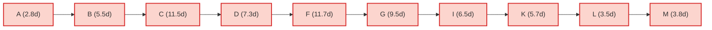

# **EDS SLA – 2 (Lanvan File Transfer System)**

## **Section A — CPM (Critical Path Method)**

### Theory (same as Rapid Warn)

-   Deterministic durations, single fixed time per activity.
    
-   Forward/Backward pass → ES, EF, LS, LF.
    
-   Slack = LS – ES.
    
-   Slack = 0 → Critical Path.
    

***

### CPM Calculations

**Project duration (deterministic CPM) = 72 days**

| ID  | Description | Duration_days | ES  | EF  | LS  | LF  | Slack | Critical |
| --- | --- | --- | --- | --- | --- | --- | --- | --- |
| A   | Project kickoff & environment setup | 3   | 0   | 3   | 0   | 3   | 0   | YES |
| B   | Requirement analysis & system design | 6   | 3   | 9   | 3   | 9   | 0   | YES |
| C   | Core FastAPI backend (routes, middleware) | 12  | 9   | 21  | 9   | 21  | 0   | YES |
| D   | Encryption/security layer (AES-256, HTTPS) | 8   | 21  | 29  | 21  | 29  | 0   | YES |
| E   | Clipboard module (real-time API, history) | 7   | 29  | 36  | 31  | 38  | 2   |     |
| F   | File transfer engine (chunked + direct uploads) | 12  | 29  | 41  | 29  | 41  | 0   | YES |
| G   | Frontend (vanilla JS PWA, UI/UX) | 10  | 41  | 51  | 41  | 51  | 0   | YES |
| H   | Mobile optimization + QR LAN discovery | 6   | 51  | 57  | 52  | 58  | 1   |     |
| I   | Integration & security testing | 7   | 51  | 58  | 51  | 58  | 0   | YES |
| J   | Performance & load testing | 5   | 58  | 63  | 59  | 64  | 1   |     |
| K   | Bug fixes & polish | 6   | 58  | 64  | 58  | 64  | 0   | YES |
| L   | Deployment & rollout | 4   | 64  | 68  | 64  | 68  | 0   | YES |
| M   | Post-launch monitoring & support | 4   | 68  | 72  | 68  | 72  | 0   | YES |

***

### Identified CPM Critical Path

**A → B → C → D → F → G → I → K → L → M**

**Critical Duration = 72 days**

***

### **Summary Findings (CPM)**

-   **Deterministic project duration** = **72 days**.
    
-   **Critical Path**: 10 activities → covers kickoff, backend, security, transfer engine, frontend, testing, fixes, deployment, monitoring.
    
-   Non-critical tasks (Clipboard, QR, perf test) have **slack**, safe to delay slightly.
    
-   Any delay on **backend/security/transfer/frontend/testing** → directly delays delivery.
    

***

## **Section B — PERT (Program Evaluation and Review Technique)**

### Theory

-   O = Optimistic, M = Most likely, P = Pessimistic.
    
-   TE = (O + 4M + P)/6
    
-   Variance = ((P – O)/6)²
    

***

### PERT Calculations

**Expected project duration (PERT, TE-based) = 63.8 days**  
**Critical Path same as CPM:** A → B → C → D → F → G → I → K → L → M  
**Critical-path variance ≈ 19.36 days² → σ ≈ 4.40 days**

***

### Example TE (Activity F: File Transfer Engine)

-   O = 8, M = 12, P = 18
    
-   TE = (8 + 4×12 + 18)/6 = 11.67 days
    
-   Variance = ((18–8)/6)² = 2.78
    

***

### Probability (target = TE project duration = 63.8 days)

-   Z = 0 → Probability = **50%** (expected baseline).
    
-   For tighter deadlines (<60d) → Z < 0 → lower probability.
    

***

## **Section C — CPU (Cost-Per-Unit / Cost Analysis)**

### Theory

-   CPU_feature = Total cost ÷ Deliverables
    
-   CostPerDay_i = Cost_i ÷ Duration_i
    
-   AvgBurn = TotalCost ÷ CPM duration
    

***

### Example Cost Analysis for Lanvan

(assume **Total dev cost = ₹55,650**. Approx allocation by modules.)

-   Major Deliverables = **7** (Backend, Security, Clipboard, Transfer Engine, Frontend, Testing, Deployment).
    
-   CPU_feature = 55,650 ÷ 7 ≈ **₹7,950 per deliverable**.
    
-   Example CostPerDay:
    
    -   **Core backend (₹12,000, 12d)** → 1,000/day
        
    -   **File Transfer Engine (₹15,000, 12d)** → 1,250/day
        
    -   **Frontend PWA (₹8,000, 10d)** → 800/day
        
-   AvgBurnPerDay = 55,650 ÷ 72 ≈ **₹773/day**
    

***

## **Section D — PMT (Project Mgmt Tools & Metrics)**

**Agile Metrics for Lanvan**

1.  **Sprint Velocity**
    

-   Suppose 4 sprints: story points = 35, 32, 36, 37
    
-   Total = 140 → Velocity = 35 pts/sprint
    

2.  **Cycle Time (ticket avg)**
    

-   50 tickets closed, sum(C–O)=200 days → CT=200/50=4 days/ticket
    

3.  **Defect Escape Rate**
    

-   Production bugs = 8, Total bugs = 90 → DER = 8.9%
    

4.  **MTTR (Mean Time To Recover)**
    

-   5 incidents, total resolution = 20 hours → MTTR=4h
    

5.  **Release Readiness Checklist (Lanvan)**
    

-   ✅ CI/CD passing
    
-   ✅ File size & MIME validation
    
-   ✅ Encryption tests OK
    
-   ✅ UAT signed off
    
-   ✅ Rollback & monitoring ready
    

***

🔑 **Final Interpretation for Lanvan:**

-   CPM = 72 days, PERT = 63.8 days → probabilistic planning better.
    
-   Avg burn = ₹773/day, highest costs in backend + transfer engine.
    
-   Agile metrics show stable throughput (~35 SP/sprint).
    
-   Risk = delays in **backend/security/transfer** chain.
    

***
