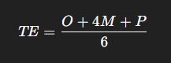
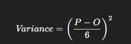
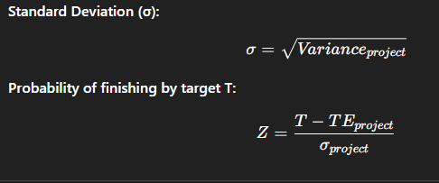
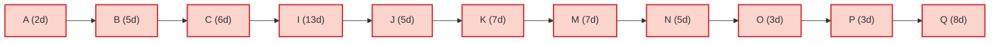
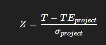

# EDS SLA - 2

 ### Section A — CPM (Critical Path Method)

### Theory

-   **Duration:** Use a single fixed duration per activity.
    
-   **Forward Pass:**
    
    -   ES (Earliest Start) = max(EF of all predecessors)
        
    -   EF (Earliest Finish) = ES + Duration
        
-   **Backward Pass:**
    
    -   LF (Latest Finish) = min(LS of successors) (or project duration for end activities)
        
    -   LS (Latest Start) = LF - Duration
        
-   **Slack:** Slack = LS - ES
    
-   Activities with **Slack = 0** are on the **critical path**.
    

### CPM Calculations

Deterministic durations were chosen as the **rounded-up PERT expected times (CEIL of TE)**.  
This gives a conservative fixed-duration schedule.

**Project duration (CPM, deterministic) = 64 days**

| ID  | Description | Duration_days | ES  | EF  | LS  | LF  | Slack | Critical |
| --- | --- | --- | --- | --- | --- | --- | --- | --- |
| A   | Project kickoff & planning | 2   | 0   | 2   | 0   | 2   | 0   | YES |
| B   | Requirements & use-cases | 5   | 2   | 7   | 2   | 7   | 0   | YES |
| C   | UI/UX design | 6   | 7   | 13  | 7   | 13  | 0   | YES |
| D   | Firebase & Supabase setup | 3   | 7   | 10  | 8   | 11  | 1   |     |
| E   | Google Sign-In integration | 2   | 10  | 12  | 11  | 13  | 1   |     |
| F   | Image upload pipeline (Supabase) | 4   | 10  | 14  | 19  | 23  | 9   |     |
| G   | ML model integration (image analysis) | 8   | 14  | 22  | 23  | 31  | 9   |     |
| H   | Android home screen widget | 6   | 13  | 19  | 25  | 31  | 12  |     |
| I   | Core app development (frontend/backend) | 13  | 13  | 26  | 13  | 26  | 0   | YES |
| J   | Authentication & security testing | 5   | 26  | 31  | 26  | 31  | 0   | YES |
| K   | Integration & system testing | 7   | 31  | 38  | 31  | 38  | 0   | YES |
| L   | Performance & load testing | 5   | 38  | 43  | 45  | 50  | 7   |     |
| M   | Bug fixes & polish | 7   | 38  | 45  | 38  | 45  | 0   | YES |
| N   | User acceptance testing (UAT) | 5   | 45  | 50  | 45  | 50  | 0   | YES |
| O   | Launch prep & documentation | 3   | 50  | 53  | 50  | 53  | 0   | YES |
| P   | Deployment to stores / rollout | 3   | 53  | 56  | 53  | 56  | 0   | YES |
| Q   | Post-launch monitoring & bugfix sprint | 8   | 56  | 64  | 56  | 64  | 0   | YES |

### Selected CPM Forward/Backward Calculations

-   **Activity A:** Duration = 2 days → ES=0, EF=2, LS=0, LF=2, Slack=0
    
-   **Activity B:** Duration = 5 days → ES=2, EF=7, LS=2, LF=7, Slack=0
    
-   **Activity C:** Duration = 6 days → ES=7, EF=13, LS=7, LF=13, Slack=0
    
-   **Activity I:** Duration = 13 days → ES=13, EF=26, LS=13, LF=26, Slack=0
    
-   **Activity K:** Duration = 7 days → ES=31, EF=38, LS=31, LF=38, Slack=0
    
-   **Activity P:** Duration = 3 days → ES=53, EF=56, LS=53, LF=56, Slack=0
    

### Identified CPM Critical Path

`A → B → C → I → J → K → M → N → O → P → Q`

### **Summary Findings (CPM)**

-   The **deterministic duration** of the project is **64 days**.
    
-   The **critical path** includes 11 activities: kickoff, requirements, design, development, testing, polish, UAT, launch prep, rollout, and monitoring.
    
-   Non-critical tasks (like Firebase setup, Sign-In integration, image upload, widget, performance testing) have slack, meaning they can be delayed without affecting project completion.
    
-   The schedule is **tight** along the critical path — any delay in those activities directly delays the project.
    

***

### Section B — PERT (Program Evaluation and Review Technique)

### Theory

-   Each activity requires **three time estimates:**
    
    -   Optimistic (**O**)
        
    -   Most Likely (**M**)
        
    -   Pessimistic (**P**)
        
-   **Expected Time (TE):**
    
 

-   **Variance:**
    
 

-   TE values are used as activity durations for the expected schedule.
    
-   **Project Variance** = sum of variances of activities on the critical path.
    
 

### PERT Calculations

**Project expected duration (PERT, TE-based) = 56.25 days**  
**PERT critical path:** `A → B → C → I → J → K → M → N → O → P → Q`  
**Critical-path variance = 16.0903 (days²); σ = 4.0113 days**

***

| ID  | Description | O   | M   | P   | TE_days | Variance | ES  | EF  | Slack | Critical |
| --- | --- | --- | --- | --- | --- | --- | --- | --- | --- | --- |
| A   | Project kickoff & planning | 0.5 | 1   | 2   | 1.08 | 0.0625 | 0.00 | 1.08 | 0.00 | YES |
| B   | Requirements & use-cases | 2.0 | 4   | 7   | 4.17 | 0.6944 | 1.08 | 5.25 | 0.00 | YES |
| C   | UI/UX design | 3.0 | 5   | 8   | 5.17 | 0.6944 | 5.25 | 10.42 | 0.00 | YES |
| D   | Firebase & Supabase setup | 1.0 | 2   | 4   | 2.17 | 0.2500 | 5.25 | 7.42 | 1.00 |     |
| E   | Google Sign-In integration | 1.0 | 2   | 3   | 2.00 | 0.1111 | 7.42 | 9.42 | 1.00 |     |
| F   | Image upload pipeline (Supabase) | 2.0 | 3   | 5   | 3.17 | 0.2500 | 7.42 | 10.58 | 8.83 |     |
| G   | ML model integration (image analysis) | 4.0 | 7   | 14  | 7.67 | 2.7778 | 10.58 | 18.25 | 8.83 |     |
| H   | Android home screen widget | 3.0 | 5   | 9   | 5.33 | 1.0000 | 10.42 | 15.75 | 11.33 |     |
| I   | Core app development (frontend/backend) | 7.0 | 12  | 20  | 12.50 | 4.6944 | 10.42 | 22.92 | 0.00 | YES |
| J   | Authentication & security testing | 2.0 | 4   | 7   | 4.17 | 0.6944 | 22.92 | 27.08 | 0.00 | YES |
| K   | Integration & system testing | 3.0 | 6   | 12  | 6.50 | 2.2500 | 27.08 | 33.58 | 0.00 | YES |
| L   | Performance & load testing | 2.0 | 4   | 8   | 4.33 | 1.0000 | 33.58 | 37.92 | 6.33 |     |
| M   | Bug fixes & polish | 3.0 | 6   | 12  | 6.50 | 2.2500 | 33.58 | 40.08 | 0.00 | YES |
| N   | User acceptance testing (UAT) | 2.0 | 4   | 7   | 4.17 | 0.6944 | 40.08 | 44.25 | 0.00 | YES |
| O   | Launch prep & documentation | 1.0 | 2   | 4   | 2.17 | 0.2500 | 44.25 | 46.42 | 0.00 | YES |
| P   | Deployment to stores / rollout | 1.0 | 2   | 5   | 2.33 | 0.4444 | 46.42 | 48.75 | 0.00 | YES |
| Q   | Post-launch monitoring & bugfix sprint | 3.0 | 7   | 14  | 7.50 | 3.3611 | 48.75 | 56.25 | 0.00 | YES |

### PERT Example Calculation

-   O=4.0, M=7, P=14
    
-   TE = (O + 4M + P) / 6 = (4.0 + 4×7 + 14) / 6 = **7.67 days**
    
-   Variance = ((P - O) / 6)² = ((14 - 4.0) / 6)² = **2.7778 days²**
    

### Probability Calculations

-   Z formula:
    

 

-   For target = expected TE project (56.25):
    
    -   Z = 0
        
    -   Probability = **50%** (by definition)
        

### **Summary Findings (PERT)**

-   The **expected project duration** using PERT is **56.25 days**, shorter than the deterministic CPM estimate (64 days).
    
-   The **critical path** is the same as CPM, confirming stability in project sequencing.
    
-   The **variance (16.09 days²)** and **σ = 4.01 days** allow risk-based analysis of deadlines.
    
-   Probability analysis shows:
    
    -   **50% chance** of completion within 56.25 days.
        
    -   If a stricter or looser deadline is set, Z-scores can quickly estimate probability.
        
-   PERT thus provides a **probabilistic buffer** over the deterministic CPM timeline, making it more realistic for planning under uncertainty.
    
***

### Section C — CPU (Cost-Per-Unit / Cost Analysis)

**Theory :**
CPU measures cost efficiency — either cost per deliverable (feature/unit) or cost per time. Use CPU to spot expensive activities and to estimate burn rate.

**Formulas:**

1. Cost per feature (deliverable):

$$
\text{CPU}_{\text{feature}} = \frac{\text{Total Project Cost}}{\text{Number of Major Deliverables}}
$$

2. Cost per day for activity $i$:

$$
\text{CostPerDay}_i = \frac{\text{Cost}_i}{\text{Duration}_i}
$$

3. Average project burn (over CPM duration $D_{CPM}$):

$$
\text{AvgBurnPerDay} = \frac{\sum_i \text{Cost}_i}{D_{CPM}}
$$

**Solve (Rapid Warn example):**

* Given: total cost $=$ **\$12,200**, CPM duration $D_{CPM} =$ **64 days**.
* If we treat **8 major deliverables** as baseline (example), then:

$$
\text{CPU}_{\text{feature}} = \frac{12{,}200}{8} = 1{,}525\ \text{USD per deliverable}
$$

* Per-activity CostPerDay (selected examples; formula applied):

  * Activity I (Core dev): Cost = \$3,000, Duration = 13 days
    $$\text{CostPerDay}_I = 3000 / 13 \approx \$230.77/\text{day}$$
  * Activity G (ML integration): Cost = \$1,500, Duration = 8 days
    $$\text{CostPerDay}_G = 1500 / 8 = \$187.50/\text{day}$$
  * Activity A (Kickoff): Cost = \$200, Duration = 2 days
    $$\text{CostPerDay}_A = 200 / 2 = \$100/\text{day}$$
* Average project burn:

$$
\text{AvgBurnPerDay} = \frac{12{,}200}{64} \approx \$190.63/\text{day}
$$

**Quick interpretation:** focus cost-control on activities with highest CostPerDay (I, G). Add \~10% contingency to handle overruns.

***

### Section D — PMT (Project Management Tools & Key Metrics)

**Theory :**
PMT = tools + practices that plan, execute, monitor and control. For measuring performance, use simple KPI formulas.

**Useful formulas / KPIs:**

 Agile Metrics

1. **Sprint Velocity**

$$
V = \frac{SP}{S}
$$

Where:  
- \(SP\) = total story points completed  
- \(S\) = number of sprints  
Example data (Rapid Warn sample):

- Story points completed over 4 sprints: 28, 32, 30, 30

- Total 
𝑆𝑃=28+32+30+30=120
𝑆=4

Compute:
$$
𝑉=12/04 =30 story points per sprint
$$
- Interpretation: at this pace expect ~30 story points delivered per 2-week sprint.

---

2. **Cycle Time**

$$
CT = \frac{\sum (C - O)}{N}
$$

Where:  
- \(C\) = closed date  
- \(O\) = open date  
- \(N\) = number of closed tickets  
- Suppose 40 tickets closed. Sum of (C - O) across those tickets = 160 days.

Compute:
$$
𝐶𝑇 =160/40=4 days per ticket
$$
- Interpretation: on average a ticket moves from open → resolved in 4 days.
---

3. **Defect Escape Rate**

$$
DER = \frac{B_p}{B_t} \times 100
$$

Where:  
- \(B_p\) = production bugs  
- \(B_t\) = total bugs found  
- Compute:
$$
𝐷𝐸𝑅=550/100 *100% = 10%
$$
- Interpretation: 10% of all found bugs are escaping to production — acceptable in early releases but target is <5% over time.

---

4. **Mean Time To Recover (MTTR)**

$$
MTTR = \frac{\sum T_r}{N}
$$

Where:  
- \(T_r\) = time to resolve each incident  
- \(N\) = number of incidents  
- Compute:
$$
𝑀𝑇𝑇𝑅=11/4=2.75hours
$$
- Interpretation: average time to fix incidents is 2.75 hours — good target to improve toward <1 hour for critical issues.

---

5. **Release Readiness**  

Checklist → if **all pass → Release OK**

**Solve (quick examples using Rapid Warn numbers):**

* If sprint velocity = 30 story points / 2-week sprint, expected throughput = 30 points per sprint. Use this to plan how many sprints to finish backlog.
* Using AvgBurnPerDay from CPU: \$190.63/day → for a 14-day sprint, projected sprint burn ≈ \$2,668.8. Use this in sprint budgeting.

**Actionable PMT checklist before first release:**

* CI passing, tests >= threshold, UAT signed, rollback plan, monitoring configured, release notes ready.

***
