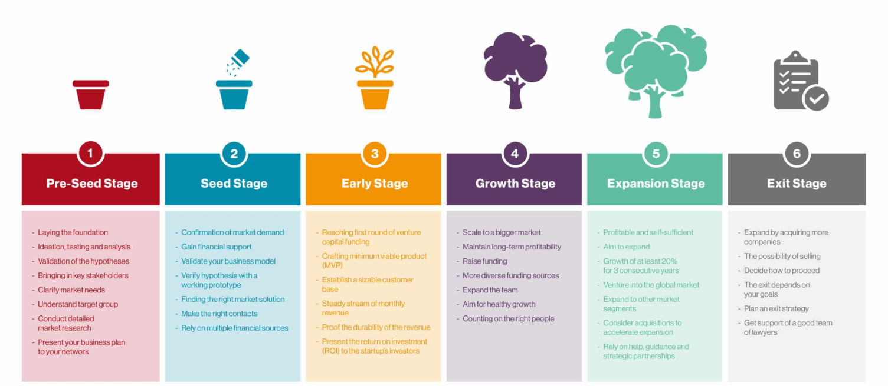

## EDS ASSIGNMENT 5 

### Aim: To Identify Startup Funding Stages and the Role of Institutional Finance

### Theory:

In today's economy, startups are powerful engines of innovation and disruption. The journey of a startup from a nascent idea to a market-leading enterprise is a challenging one, critically dependent on a steady flow of capital. This process is not random; it follows a structured path through distinct funding stages, each tailored to the startup's level of maturity and specific needs. This report explores the lifecycle of startup funding, from the founder's initial investment to a public offering, and examines the ecosystem of institutional finance that supports this journey.

> [!abstract]   The Lifecycle of Startup Funding
A startup's funding journey can be viewed as a series of milestones. Each stage unlocks the capital needed to reach the next level of growth.
 
#### 1. The Foundation Stage (Pre-Seed & Seed)

This is where it all begins. Initially, most startups are **bootstrapped**, meaning the founders use their own savings or take informal loans from friends and family. This phase is about survival and building a basic prototype or Minimum Viable Product (MVP). Following this, a startup might seek **pre-seed** or **seed funding**. This is the first external capital, typically raised from **angel investors**—wealthy individuals who are often successful entrepreneurs themselves—and **incubators**. The goal of seed funding isn't profit, but to achieve **product-market fit** and demonstrate that the business idea is viable and has a potential customer base.

#### 2. The Growth Stage (Series A, B, and C)

Once a startup has a proven concept and some initial traction, it enters the venture capital rounds.

-   **Series A** is the first institutional venture capital round. The focus here is on scaling the business, optimizing the product, and building a solid user base. The funds are used to hire key personnel and establish formal business processes.
    
-   **Series B** funding is about aggressive expansion. Startups at this stage have a proven business model and are looking to grow their market share, expand into new cities or countries, and outpace competitors.
    
-   **Series C** and beyond are typically for well-established startups looking to solidify their market leadership, develop new products, or even acquire smaller companies. Funding at this stage often comes from late-stage VCs, private equity firms, and investment banks.
    

#### 3. The Maturity Stage (IPO)

The final milestone for many successful startups is the **Initial Public Offering (IPO)**. By listing on a stock exchange, the company offers its shares to the public for the first time. An IPO raises substantial capital for further growth and provides an "exit" for early investors and founders, allowing them to cash in on their equity. It marks the transition of a private startup into a mature, publicly-traded company.

#### ✦ The Ecosystem of Institutional Finance

Startups are supported by a diverse network of financial institutions, each playing a specific role.

-   **Venture Capital (VC) Firms:** These are the most well-known players. Firms like **Sequoia Capital** and **Accel** provide large amounts of capital in exchange for equity. Beyond money, they offer invaluable strategic guidance, mentorship, and access to their extensive networks.
    
-   **Angel Investors and Networks:** Acting at a much earlier stage than VCs, angel investors and networks like the **Indian Angel Network** bridge the critical funding gap between bootstrapping and Series A. They take higher risks on unproven ideas.
    
-   **Government and Public Sector Bodies:** Recognizing the economic importance of startups, the government has launched several initiatives. **SIDBI (Small Industries Development Bank of India)** manages a **Fund of Funds for Startups**, which invests in VC funds rather than directly in startups, thereby boosting the entire ecosystem. Schemes like **Startup India** offer tax benefits, grants, and simplified compliance.
    
-   **Banks and NBFCs:** While traditional banks are generally risk-averse and hesitant to fund early-stage startups with no assets, they play a role for more mature startups. They can provide **debt financing** or working capital loans once a company has stable revenue streams.
    

***

### ✦ Real-World Case Studies

#### 1. Falguni Nayar (Nykaa)

The story of Nykaa is a powerful example of successful bootstrapping. Falguni Nayar launched the company using her own funds, allowing her to retain control and build a solid foundation. Only after proving the business model did she seek venture capital from firms like **TPG Growth**. This carefully staged approach culminated in a blockbuster **IPO in 2021**, demonstrating how a blend of self-funding and institutional support can create a market leader.

#### 2. Ritesh Agarwal (OYO Rooms)

OYO's journey showcases the power of venture capital in enabling rapid, aggressive scaling. After a brief period of bootstrapping, Ritesh Agarwal secured critical seed funding. The turning point was the massive investments from large VCs, most notably **SoftBank**, during its later funding rounds. This capital injection fueled OYO’s breakneck expansion across India and into international markets, transforming it into a global hospitality brand.

***

###  Conclusion: Hence, we  Identified Startup Funding Stages and the Role of Institutional Finance
