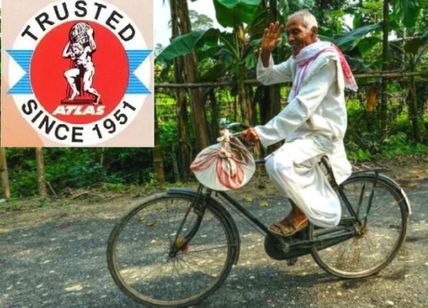

 ### EDS Experiment 1                                   
<text align="right"> 

#### Date: 09/07/2025
#### Roll No. A025
 

</text>

**Aim:**  to gather information on entrepreneurship and startup 

**Theory**
#### **1. Entrepreneur Case: Janki Das Kapur (Atlas Cycles)**
 
Atlas Cycles was once a household name in India, widely recognized as one of the largest and oldest cycle manufacturers in the country. Founded in 1951 by Shri Janki Das Kapur in a modest tin shed in Sonepat, Haryana, the company eventually grew into a giant, exporting bicycles to over 50 countries. At its peak, Atlas was an iconic brand, serving generations of Indian customers.

However, despite its longstanding legacy, Atlas Cycles was forced to shut down its operations in recent years. One of the key reasons behind this decline was the influx of cheaper bicycle imports, particularly from China. These imports made it difficult for Atlas to compete, as the cost of production in India continued to rise. Moreover, the company failed to modernize its equipment and manufacturing processes in time, which left it lagging behind in a fast-evolving market.

The company also faced severe financial struggles due to a lack of working capital, which hindered its ability to maintain operations or invest in technological upgrades. Despite the availability of government schemes like _Make in India_, Atlas struggled to access the necessary support when it was most needed.

#### **2. Failed Startup Case: InoVVorX**

InoVVorX was a promising tech startup that aimed to revolutionize the education sector using Virtual Reality (VR). The startup had a groundbreaking concept: using VR headsets to create immersive learning experiences. It even secured over $400,000 in funding—a significant achievement for an early-stage startup.

However, InoVVorX faced a series of challenges that ultimately led to its downfall. One of the main issues was the company’s lack of focus. It spread its efforts across too many sectors—education, entertainment, and B2B applications—which diluted its impact in each market. Additionally, the Indian education sector was not ready to adopt VR technology at scale. Schools lacked the infrastructure for such advanced tech, and the high cost of VR equipment made it unaffordable for most institutions.

While InoVVorX was part of the _Startup India_ initiative, the benefits they received were limited to basic regulatory support, such as tax exemptions and simplified business registration. What the startup needed most—mentorship, market access, and strategic guidance—was not available to them.

#### 3. initiatives taken by the government 

The Indian government has launched several initiatives aimed at promoting startups and entrepreneurship. Two of the key schemes are _Startup India_ and _Make in India_.

-   **Make in India**: This initiative, launched in 2014, focuses on boosting manufacturing and reducing dependence on imports. It aims to make India a global manufacturing hub by encouraging both foreign and domestic investments. The program provides a range of incentives, including tax breaks, financial support for MSMEs, and infrastructure development. While Atlas Cycles could have benefited from this initiative, it struggled to access the financial and infrastructural support it needed. The inefficiencies in implementation of government schemes highlight that while these policies look good on paper, their execution and accessibility often leave much to be desired.

-   **Startup India**: Launched in 2016, this initiative is designed to make it easier for entrepreneurs to start and grow their businesses. It offers a range of benefits, such as a three-year tax holiday for startups, faster patent filing processes, and simpler registration procedures. Despite these advantages, startups like InoVVorX found that the scheme didn’t provide the in-depth support required to build a sustainable business. The initiative’s benefits mostly revolved around compliance and tax relief, but did not offer strategic mentoring or operational guidance, which are crucial for early-stage startups.
    

    

#### **4. Intrapreneurship Example: Tata Nano**

Launched by Tata Motors, the Tata Nano was intended to be the world’s cheapest car, targeting middle-class families in India who aspired to own a vehicle. The project, initiated by an intrapreneurial team within Tata Motors, showcased the potential of large companies to act like startups from within, fostering innovation and creativity.

Despite the ambition and innovation behind the Nano, the car did not succeed commercially due to various factors, including marketing mistakes, quality concerns, and a mismatch between the product and consumer perceptions. Nevertheless, the project remains a landmark example of intrapreneurship. It demonstrated how large organizations can support their employees in pursuing bold ideas, even if those ideas don’t always achieve market success.

Intrapreneurship, much like entrepreneurship, involves risk, but it can lead to innovative products and ideas that have the potential to disrupt markets.

***

**Conclusion**:  hence we successfully gathered information on entrepreneurship and startup and understood it
