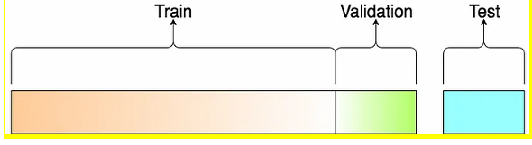

## Chapter 1: Introduction to Machine Learning – CO1

- [ ] 1  
### Compare AI, ML, and DL – 3/4 Marks  


| Feature        | Artificial Intelligence (AI)                                      | Machine Learning (ML)                                          | Deep Learning (DL)                                          |
|----------------|------------------------------------------------------------------|---------------------------------------------------------------|-------------------------------------------------------------|
| Definition     | AI is the simulation of human intelligence by machines.          | ML is a part of AI where machines learn from data.           | DL is a part of ML that uses neural networks to learn patterns automatically. |
| Approach       | AI uses rules, logic, or learning to solve problems.             | ML uses algorithms to improve performance from data.         | DL uses multi-layered neural networks to learn features automatically. |
| Data Required  | AI can work with or without data.                                | ML requires structured data.                                  | DL requires large amounts of data.                         |
| Examples       | Chatbots and expert systems are examples of AI.                  | Spam detection and predictive analytics are examples of ML.   | Image and speech recognition are examples of DL.           |
***

- [ ] 2  
### Explain Supervised Learning – Working, Types, Advantages, and Disadvantages – 4/6 Marks  

**Supervised Learning** is a machine learning approach that uses **labeled data**, where each input is paired with the correct output. The algorithm learns the relationship between inputs and outputs by building a mapping function. Once trained, the model can predict results for unseen data. For example, it can predict a student’s marks based on the number of study hours.

> **Working**
 
 -   The algorithm is trained on a dataset that is already labeled, meaning each piece of data is tagged with the correct answer.
    
 -   The goal is to learn a function that maps input variables to an output variable.
     
 -   After training, the model can make predictions on new, unlabeled data.
     

> **Types**

1.  **Regression:** In regression problems, the output is a **continuous value**.
    
    -   _Example:_ Predicting house prices, stock values, or temperature.
        
2.  **Classification:** In classification problems, the output belongs to a **category or label**.
    
    -   _Example:_ Classifying emails as spam or not spam, or diagnosing whether a patient has a disease.
        

> [!abstract] any 3 if 6 marks else 2 **Advantages of Supervised Learning**
> 
> -   The model can predict the output on the basis of prior experiences, which improves accuracy in decision-making.
>     
> -   We can have a clear and exact idea about the classes of objects since the data is already labeled.
>     
> -   Supervised learning models help us solve various real-world problems such as fraud detection, spam filtering, and medical diagnosis.
>     

> [!abstract] any 3 if 6 marks else 2 **Disadvantages of Supervised Learning**
> 
> -   The models are not suitable for handling very complex tasks because they require a large amount of high-quality labeled data.
>     
> -   Supervised learning cannot always predict the correct output if the test data is significantly different from the training dataset.
>     
> -   Training supervised models requires a lot of computation time and processing resources, especially with large datasets.
>     
> -   We need sufficient knowledge about the classes of objects to prepare accurate labeled datasets.
>
***

- [ ] 3  
### Applications of Supervised / Unsupervised / Reinforcement Learning – 3/4 Marks  
**Supervised Learning** is used for tasks where the data is already labeled.

> [!abstract] Applications
> 
> -   **Image & Spam Recognition:** Classifying emails as spam or not, or identifying objects in images.
>     
> -   **Fraud Detection:** Flagging fraudulent transactions based on past data.
>     
> -   **Predictive Analysis:** Forecasting weather, stock prices, or house prices.
>     

**Unsupervised Learning** is used to find hidden patterns in unlabeled data.

> [!abstract] Applications
> 
> -   **Customer Segmentation:** Grouping customers with similar behaviors for marketing.
>     
> -   **Anomaly Detection:** Identifying unusual patterns in data for security or diagnostics.
>     
> -   **Recommendation Systems:** Suggesting products or content to users based on their browsing history.
>     

**Reinforcement Learning** is a machine learning technique where an agent learns to make decisions by receiving **rewards** and **penalties** for its **actions**, improving through trial and error.

> [!abstract] Applications
> 
> -   **Robotics:** Training robots to perform complex tasks like walking or grabbing objects.
>     
> -   **Autonomous Driving:** Helping self-driving cars make real-time decisions.
>     
> -   **Game AI:** Developing AI agents that can play games and beat human players (e.g., AlphaGo).
>
***

- [ ] 4  
### Explain Unsupervised Learning – Working, Types, Advantages, and Disadvantages – 4 Marks  

**Unsupervised Learning** is a machine learning technique used to find hidden patterns and structures in unlabeled data without any human guidance. The algorithm works on its own to discover insights.

> **Working**
> 
> -   The model is given data that has not been labeled or categorized.
>     
> -   It uses algorithms to identify similarities and differences in the data points.
>     
> -   The model then groups the data based on these relationships, revealing hidden patterns or structures.
>     

**Types**

1.  **Clustering:** Groups similar data points into clusters.
    
    -   _Example:_ Grouping customers into different segments based on their purchasing behavior.
        
2.  **Association:** Finds relationships between different items in a dataset.
    
    -   _Example:_ Identifying that customers who buy milk also tend to buy bread.
        

> [!abstract] any 2 if 4 marks **Advantages of Unsupervised Learning**
> 
> -   It can find hidden patterns in data that a human might miss.
>     
> -   It is highly useful for exploring data without requiring any prior knowledge or labels.
>     
> -   It can be used for more complex problems than supervised learning.
>     

> [!abstract] any 2 if 4 marks **Disadvantages of Unsupervised Learning**
> 
> -   The output can be less accurate because there is no labeled data to check against.
>     
> -   The results can be hard to interpret or explain.
>     
> -   The model's training process can be very complex and computationally intensive.
>
***

- [ ] 5  
### Explain Reinforcement Learning – Advantages and Disadvantages – 4 Marks  
> [!abstract] any 2 if 4 marks **Advantages of Reinforcement Learning**
> 
> -   It can learn the best course of action in complex, dynamic environments without a predefined dataset.
>     
> -   The model can make decisions in real-time, making it ideal for tasks like robotics and autonomous systems.
>     
> -   It can solve problems that are too complex for other machine learning techniques by learning from experience.
>     

> [!abstract] any 2 if 4 marks **Disadvantages of Reinforcement Learning**
> 
> -   The training process can be very time-consuming and computationally expensive.
>     
> -   It often requires a large amount of data from trial and error, which can be difficult or risky to collect in the real world.
>     
> -   The results can be unpredictable, and it can be challenging to guarantee the agent's behavior in a new situation.
>
***

- [ ] 6  
### Explain Train, Testing, and Validation Data – With Example – 4/6 Marks  
> [!abstract] write this para if 6 marks
> Training, testing, and validation data are three separate groups of data. They're used to build and check a machine learning model. By splitting the data, we make sure the model is accurate and works well on new information it hasn't seen before.

> -   **Training Data:** This is the largest portion of the dataset, used to **train** the model. The algorithm learns the patterns and relationships in the data from this set.
>     
> -   **Validation Data:** This set is used **during** the training process to fine-tune the model's settings (hyperparameters) and check its performance. It helps to prevent the model from overfitting to the training data.
>     
> -   **Testing Data:** This is a completely new, unseen dataset used **after** the model has been trained and validated. Its purpose is to give a final, unbiased evaluation of the model's performance and accuracy.
>     

**Example**
 
Imagine you want to build a model to predict a student's final exam marks based on their study hours.
> [!info] shortify below example if 4 marks else write it fully

-   **Training Data:** You use **70%** of your student records (e.g., 70 students) to train the model. The model learns the relationship between study hours and marks from this data.
    
-   **Validation Data:** You use **15%** of the student records (e.g., 15 students) to check the model's performance while it's learning. If the model starts performing poorly on this data, you can adjust its settings.
    
-   **Testing Data:** After the model is fully trained, you use the remaining **15%** of student records (e.g., the final 15 students) to test it. The accuracy on this data gives you a reliable measure of how well the model will perform in the real world on new students.
***

- [ ] 7  
### Issues in Machine Learning – 3/4/6 Marks  

> [!abstract] any 4 if 4 marks **Common Issues**
> 
> -   **Inadequate Data:** The model doesn't have enough data to learn a reliable pattern.
>     
>     -   **_Example:_** _Training a model on only 10 houses to predict all house prices._
>         
> -   **Poor Data Quality:** The data has too many errors, inconsistencies, or missing values.
>     
>     -   **_Example:_** _A sales model gets confused by a mix of dollar and euro symbols._
>         
> -   **Overfitting:** The model learns the training data and its noise too well.
>     
>     -   **_Example:_** _A model memorizes specific training pictures of cats and can't identify new ones._
>         
> -   **Underfitting:** The model is too simple to capture the underlying data's pattern.
>     
>     -   **_Example:_** _Using a simple straight line to predict a complex, curvy pattern._
>         
> -   **Bias:** The model learns human biases present in the data, leading to unfair results.
>     
>     -   **_Example:_** _A hiring model unfairly favors male candidates due to biased past data._
>         
> -   **Lack of Interpretability:** It's hard to understand how the model makes its decisions, like a "black box."
>     
>     -   **_Example:_** _A doctor's AI gives a diagnosis without explaining why._
>         
> -   **Computational Cost:** Training large models is both very expensive and requires a lot of time.
>     
>     -   **_Example:_** _Training a large language model can cost millions of dollars._
>
***

- [ ] 8  
### Explain Overfitting and Underfitting – With Example – 3/4 Marks  
**Overfitting** and **Underfitting** are two common problems that prevent a machine learning model from performing well. They represent a model that is either too complex or too simple for the task.

-   **Overfitting:** This happens when a model learns the **training data** too well, including its noise and random fluctuations. It performs perfectly on the training data but poorly on **new data** because it has essentially "memorized" the answers instead of learning the general pattern.
    
    -   **_Example:_** _A student who memorizes every single practice test question and answer gets a perfect score on the practice test but fails the real exam because the questions are slightly different._
        
-   **Underfitting:** This occurs when a model is too simple to capture the underlying patterns in the data. The model performs poorly on both the **training data** and **new data** because it has not learned enough to make accurate predictions.
    
    -   **_Example:_** _A student who only skims their notes and doesn't study enough performs poorly on both the practice test and the final exam because they don't know the material._
***

- [ ] 9  
### Write Steps in Developing a Machine Learning Application – 4 Marks  


> Developing a machine learning application involves the following steps
> 
> -   **Data Collection:** Gather and collect relevant data from various sources.
>     
> -   **Data Preparation:** Clean and organize the data. This includes handling missing values and splitting the data into training and testing sets.
>     
> -   **Model Selection:** Choose a suitable algorithm based on the problem and the data type.
>     
> -   **Model Training:** Train the chosen model on the prepared training data.
>     
> -   **Model Evaluation:** Test the model on the unseen testing data to evaluate its performance and accuracy.
>     
> -   **Deployment:** Integrate the trained model into a real-world application.
>
***

- [ ] 10  
### Define Mean, Median, Mode, Standard Deviation – 2 Marks  
**Mean:** The mean is the **average** value of a dataset. It is calculated by adding all the values and dividing the sum by the total number of values.

-   Example: The mean of the numbers `2, 3, 4` is `(2 + 3 + 4) / 3 = 3`.
    

**Median:** The median is the **middle value** in a sorted dataset. If there is an even number of values, you take the average of the two middle numbers.

-   Example: The median of `2, 5, 8, 10, 12` is `8`.
    

**Mode:** The mode is the value that appears **most frequently** in a dataset. A dataset can have one mode, multiple modes, or no mode at all.

-   Example: In the list `3, 5, 5, 7, 9`, the mode is `5`.
    

**Standard Deviation:** Standard deviation is a measure of how **spread out** the data is from the mean. A low standard deviation means the data points are close to the mean, while a high one indicates they are more spread out.

-   Example: A standard deviation of `0` means all data points in the dataset are the same.
***

## Chapter 2: Machine Learning Libraries – CO2

- [ ] 7  
### How to access 3D array with example – 2/3 Marks  


In Python, you can access a 3D array by using three indices. The first index selects the plane, the second selects the row within that plane, and the third selects the element.


```python
# Create a sample 3D array
three_d_array = [
    [
        [1, 2, 3],  # Plane 0
        [4, 5, 6]
    ],
    [
        [7, 8, 9],  # Plane 1
        [10, 11, 12]
    ]
]

# Access the element 8 using its indices: [plane 1][row 0][element 1]
element = three_d_array[1][0][1]

print(f"The element at index [1][0][1] is: {element}")
```
The output of the Python code is:


```
The element at index [1][0][1] is: 8
```
***

- [ ] 8  
### Define with example – Numpy array shape, slice, reshape, array joining, split, random no – 2/3 Marks  

-   **Numpy Array Shape:** The `shape` of a NumPy array is a tuple of integers representing the size of the array in each dimension.
    
    -   **Explanation:** This code creates a 2x2 array and prints its shape, which represents its number of rows and columns.
        
        
        
        ```Python
        import numpy as np
        arr = np.array([[1, 2], [3, 4]])
        print(arr.shape)
        ```
        
    -   **Output:** `(2, 2)`
        
-   **Slice:** Slicing is the process of extracting a portion or subset of an array.
    
    -   **Explanation:** **:** This code gets elements from index 1 (inclusive) to index 4 (exclusive), since Python indices start from 0.
        
        Python
        
        ```
        import numpy as np
        arr = np.array([1, 2, 3, 4, 5])
        print(arr[1:4])
        ```
        
    -   **Output:** `[2 3 4]`
        
-   **Reshape:** Reshaping changes the dimensions of an array without changing the data it contains.
    
    -   **Explanation:** The code changes the array's shape to have 2 rows and 2 columns.
        
        
        
        ```Python
        import numpy as np
        arr = np.array([1, 2, 3, 4])
        new_arr = arr.reshape(2, 2)
        print(new_arr)
        ```
        
    -   **Output:**
        
        ```
        [[1 2]
         [3 4]]
        ```
        
-   **Array Joining:** This operation combines two or more arrays into a single, new array.
    
    -   **Explanation:** The `concatenate` function joins the two arrays together.
        
        
        
        ```Python
        import numpy as np
        arr1 = np.array([1, 2])
        arr2 = np.array([3, 4])
        print(np.concatenate((arr1, arr2)))
        ```
        
    -   **Output:** `[1 2 3 4]`
        
-   **Split:** Splitting divides an array into smaller subarrays.
    
    -   **Explanation:** This code splits the array into two equally sized arrays.
        
        
        
        ```Python
        import numpy as np
        arr = np.array([1, 2, 3, 4])
        new_arrs = np.split(arr, 2)
        print(new_arrs)
        ```
        The `np.split()` function takes an array and **splits it into smaller arrays**, and then returns those new, smaller arrays inside a **Python list**.
    -   **Output:** `[array([1, 2]), array([3, 4])]`
        


-   **Random No.:** This functionality generates a single random number.
    
    -   **Explanation:** This code creates a single random number between 1 to 100
        


```Python
import random

# Generates a random integer between 1 and 100, inclusive.
random_number = random.randint(1, 100)

print(random_number)
```
***


The output of the code is:


```Plaintext
23
```
***

- [ ] 9  
### Explain how to create line plot, scatter plot, bar charts, error plot, and histograms using Matplotlib – 3/4 Marks  


> In Matplotlib, different functions are used to create various types of plots to visualize data.
> 
> -   **Line Plot:** `plt.plot()` is used to display data as a series of connected points. It is ideal for showing trends over time.
>     
> -   **Scatter Plot:** `plt.scatter()` is used to display the relationship between two variables. Each data point is shown as a marker.
>     
> -   **Bar Chart:** `plt.bar()` is used to represent data with rectangular bars, useful for comparing different categories.
>     
> -   **Error Plot:** `plt.errorbar()` is used to display data points along with error bars, which show the variability or uncertainty in the measurements.
>     
> -   **Histogram:** `plt.hist()` is used to show the distribution of a single numerical variable by dividing it into bins and counting the number of data points in each bin.
>     

***


```Python
import matplotlib.pyplot as plt
import numpy as np

# Sample data
x = np.arange(1, 11)
y = np.array([3, 5, 8, 4, 7, 2, 6, 9, 1, 10])
y_error = np.array([0.5, 0.4, 0.6, 0.3, 0.5, 0.4, 0.7, 0.5, 0.4, 0.6])
categories = ['A', 'B', 'C', 'D', 'E']
values = [5, 8, 6, 9, 3]

# 1. Line Plot
plt.figure()
plt.plot(x, y)
plt.title('Line Plot')

# 2. Scatter Plot
plt.figure()
plt.scatter(x, y)
plt.title('Scatter Plot')

# 3. Bar Chart
plt.figure()
plt.bar(categories, values)
plt.title('Bar Chart')

# 4. Error Plot
plt.figure()
plt.errorbar(x, y, yerr=y_error, fmt='o')
plt.title('Error Plot')

# 5. Histogram
plt.figure()
plt.hist(y, bins=5)
plt.title('Histogram')

plt.show()
```
***

- [ ] 10  
### How can you create a DataFrame in Pandas? Give an example. – 2/3 Marks  


> A Pandas **DataFrame** can be created by passing a dictionary, list, or NumPy array to the `pd.DataFrame()` constructor. A common and straightforward method is to use a dictionary where keys serve as column names and values are lists of data.

***

### Example


```Python
import pandas as pd

# Create a dictionary of lists
data = {
    'Name': ['Alice', 'Bob', 'Charlie'],
    'Age': [25, 30, 35],
    'City': ['New York', 'Paris', 'London']
}

# Create a DataFrame from the dictionary
df = pd.DataFrame(data)

print(df)
```

**Output:**

```
  Name    Age 
0 Alice   25 
1 Bob     30
```

***

- [ ] 11  
### Data cleaning in pandas – 2/3/4/6 Marks  


> **Data Cleaning** is the process of fixing or removing incorrect, corrupted, or incomplete data from a dataset. In Pandas, this is a crucial step to ensure the data is accurate and ready for analysis or machine learning models.

> [!abstract] Key Data Cleaning Operations
> 
> -   **Handling Missing Data:** You can identify missing values with `df.isnull().sum()` and then either remove the rows with `df.dropna()` or fill the missing values with `df.fillna()`.
>     
> -   **Removing Duplicates:** Finding and removing duplicate rows is important for data integrity. This can be done using `df.drop_duplicates()`.
>     
> -   **Correcting Data Types:** Columns might be loaded with the wrong data type. You can change them using `df.astype()`.
>     
> -   **Fixing Typos and Inconsistencies:** Use string methods or `df.replace()` to standardize text data, for example, correcting misspellings like 'NY' to 'New York'.
>     
> -   **Handling Outliers:** Outliers are extreme values that can skew analysis. You can identify them using statistical methods and then decide whether to remove or transform them.
>     

***

### Code Example


```python
import pandas as pd
import numpy as np

# Create a sample DataFrame with dirty data
data = {
    'Name': ['Alice', 'Bob', 'Alice', 'Charlie'],
    'Age': [25, np.nan, 25, 30],
    'City': ['New York', 'Paris', 'New York', 'London'],
    'Salary': ['50000', '60k', '50000', '70000']
}
df = pd.DataFrame(data)

print("Original DataFrame:\n", df)

# 1. Handling Missing Data
df['Age'].fillna(df['Age'].mean(), inplace=True)
print("\nDataFrame after filling missing 'Age' with mean:\n", df)

# 2. Removing Duplicates
df.drop_duplicates(inplace=True)
print("\nDataFrame after removing duplicates:\n", df)

# 3. Correcting Data Types
df['Salary'] = df['Salary'].str.replace('k', '000').astype(int)
print("\nDataFrame after correcting 'Salary' type:\n", df)

# 4. Fixing Inconsistencies (if any)
# df['City'].replace('Ny', 'New York', inplace=True) # Example for fixing typos
```
***

- [ ] 12  
### Describe commonly used plot types in Seaborn with example and syntax – 4/6 Marks  

### Describe commonly used plot types in Seaborn with example and syntax – 4/6 Marks


> [!abstract] Key Plot Types (write 2nd line as well if 6m)
> 
> -   **Scatter Plot:** This plot displays the relationship between two variables, showing each data point as a marker. In Seaborn, `sns.scatterplot()` or `sns.relplot(kind='scatter')` is used.
>     
> -   **Line Plot:** This plot is ideal for showing trends, especially over time. It connects data points with a line. In Seaborn, `sns.lineplot()` or `sns.relplot(kind='line')` is used.
>     
> -   **Bar Chart:** This plot is used to compare discrete categories. The height of each bar represents a numerical value. In Seaborn, `sns.barplot()` or `sns.catplot(kind='bar')` is used.
>     
> -   **Histogram:** This plot shows the distribution of a single numerical variable. It groups values into bins and plots the frequency of each bin. In Seaborn, `sns.histplot()` or `sns.displot(kind='hist')` is used.
>     


> Code Example and Syntax 

```py
import seaborn as sns
import matplotlib.pyplot as plt

# Create a sample scatter plot
sns.scatterplot(x=[1, 2, 3], y=[4, 5, 6])
plt.show()

```
> [!caution] if 6 mark then write below code
> 
```py
import seaborn as sns
import matplotlib.pyplot as plt
import pandas as pd
import numpy as np

# Create a sample DataFrame
df = pd.DataFrame({
    'x': np.arange(1, 11),
    'y': np.random.rand(10),
    'category': ['A', 'B', 'C', 'D', 'E', 'A', 'B', 'C', 'D', 'E']
})

# Create a figure with a set of subplots to display all plots
fig, axes = plt.subplots(2, 2, figsize=(10, 8))

# 1. Scatter Plot
sns.scatterplot(x='x', y='y', data=df, ax=axes[0, 0])
axes[0, 0].set_title('Scatter Plot')

# 2. Line Plot
sns.lineplot(x='x', y='y', data=df, ax=axes[0, 1])
axes[0, 1].set_title('Line Plot')

# 3. Bar Chart
sns.barplot(x='category', y='y', data=df, ax=axes[1, 0])
axes[1, 0].set_title('Bar Chart')

# 4. Histogram
sns.histplot(x='y', data=df, ax=axes[1, 1])
axes[1, 1].set_title('Histogram')

plt.tight_layout()
plt.show()

```


***

- [ ] 13  
### Explain statistical and Categorical plots of seaborn – 4/6 Marks  
> **Statistical plots** in Seaborn are designed to show the distribution and relationships of data. They often combine multiple plot types and can reveal statistical properties of the dataset.


***

> [!abstract] Common Statistical Plots
> 
> -   **Histogram (`sns.histplot`)**: Shows the distribution of a single variable. It groups data into bins and shows the count of observations in each bin.
>     
> -   **KDE Plot (`sns.kdeplot`)**: Represents the probability density of a continuous variable. It's a smooth curve that can be used to visualize distribution.
>     
> -   **Distribution Plot (`sns.displot`)**: A figure-level function that provides a flexible way to visualize distributions, offering options for histograms, KDE plots, and rug plots.


> **Categorical plots** are used to visualize data that falls into discrete groups or categories. They help in comparing a numerical variable across different categories.

> [!abstract] Common Categorical Plots
> 
> -   **Bar Plot (`sns.barplot`)**: Compares a numerical value across different categories using rectangular bars. It is useful for showing the central tendency of a numerical variable.
>     
> -   **Box Plot (`sns.boxplot`)**: Shows the distribution of numerical data through quartiles. It is a good way to visualize the spread and outliers in a dataset for each category.
>     
> -   **Categorical Plot (`sns.catplot`)**: A figure-level function that provides a unified way to create a variety of categorical plots (e.g., bar, box, violin) on a single figure.
>
***

- [ ] 14  
### Explain color palette with its type (example) – 4/6 Marks  
***

- [ ] 15  
### What is the purpose of the train_test_split() function? – 2/4 Marks  
***

- [ ] 16  
### Explain the main steps involved in the Scikit-Learn modelling process – 4 Marks  
***

## Chapter 3: Supervised Learning – CO3

- [ ] 2  
### Calculate equation for best fit line/ linear regression equation and predict the values — 4/6 marks  
***

- [ ] 3  
### Sums based on MAE, MSE and RMSE — 3/4 marks  
***

- [ ] 5  
### Define correlation co efficient and its type based on the direction of change of variable/ based upon the number of variables studied – 4 Marks  
***

- [ ] 6  
### Sums based on Karl Pearson’s Correlation Coefficient(direct) method — 3/4/6 marks  
***

- [ ] 8  
### Sums based on multiple Linear Regression in Machine Learning — 6/8 marks  
***

- [ ] 9  
### Explain dummy variable with the help of example — 4/6 marks  
***

- [ ] 10  
### Sums based on confusion Matrix find accuracy misclassification/error rate, precision, recall (sensitivity), F-measure, specificity – 4 Marks  
***

- [ ] 12  
### Sums based on Cohen Kappa Coefficient for Binary Classification — 3/4 marks  
***

- [ ] 14  cancelled
***

- [ ] 15  
### Explain Naïve Bayes with formula/why it is called as same — 3/4 marks  
***

- [ ] 16  
### Sum based on Naïve Bayes classification — 4/6 marks  
***