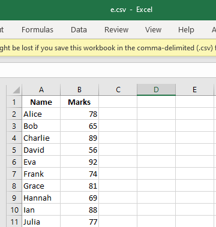

## code
```python
import numpy as np
import csv

# Read names and marks from CSV file (with header)
def read_data_from_csv(file_path):
    names = []
    marks = []
    with open(file_path, 'r') as csvfile:
        csvreader = csv.DictReader(csvfile)
        print("Student Data:")
        print("{:<10} {:>5}".format("Name", "Marks"))
        print("-" * 20)
        for row in csvreader:
            name = row['Name']
            mark = float(row['Marks'])
            names.append(name)
            marks.append(mark)
            print("{:<10} {:>5}".format(name, mark))
    return np.array(marks)

# Main program
file_path = 'e.csv'  # Path to your CSV file
marks = read_data_from_csv(file_path)

mean = np.mean(marks)
std_dev = np.std(marks)

print("\nStatistics:")
print(f"Mean (Average) = {mean}")
print(f"Standard Deviation = {std_dev}")

```
## output
 
```bash
 C:\A5EV5C\app\templates> python ee.py
Student Data:
Name       Marks
--------------------
Alice       78.0
Bob         65.0
Charlie     89.0
David       56.0
Eva         92.0
Frank       74.0
Grace       81.0
Hannah      69.0
Ian         88.0
Julia       77.0

Statistics:
Mean (Average) = 76.9
Standard Deviation = 10.793053321465617

```