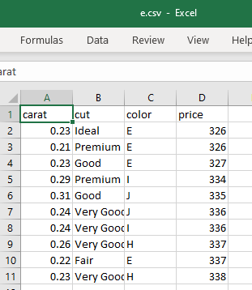

## code
```python
import pandas as pd
from sklearn.linear_model import LinearRegression

df = pd.read_csv('e.csv')

print("First 5 rows of the dataset:")
print(df.head())

features = ['carat', 'cut', 'color']
target = 'price'

# One-hot encode only 'cut' and 'color'
df_encoded = pd.get_dummies(df[features], columns=['cut', 'color'], drop_first=True)

X = df_encoded
y = df[target]

model = LinearRegression()
model.fit(X, y)

avg_values = df_encoded.mean().to_dict()

carat_input = float(input("Enter carat value (e.g. 0.23): "))

input_data = avg_values.copy()
input_data['carat'] = carat_input

input_df = pd.DataFrame([input_data], columns=X.columns)

predicted_price = model.predict(input_df)[0]

print(f"\nPredicted Diamond Price for carat {carat_input}: ${predicted_price:.2f}")

```
## output
 
```bash
PS C:\A5EV5C\app\templates> python ee.py
First 5 rows of the dataset:
   carat      cut color  price
0   0.23    Ideal     E    326
1   0.21  Premium     E    326
2   0.23     Good     E    327
3   0.29  Premium     I    334
4   0.31     Good     J    335
Enter carat value (e.g. 0.23): 0.30

Predicted Diamond Price for carat 0.3: $331.40
PS C:\A5EV5C\app\templates> 

```