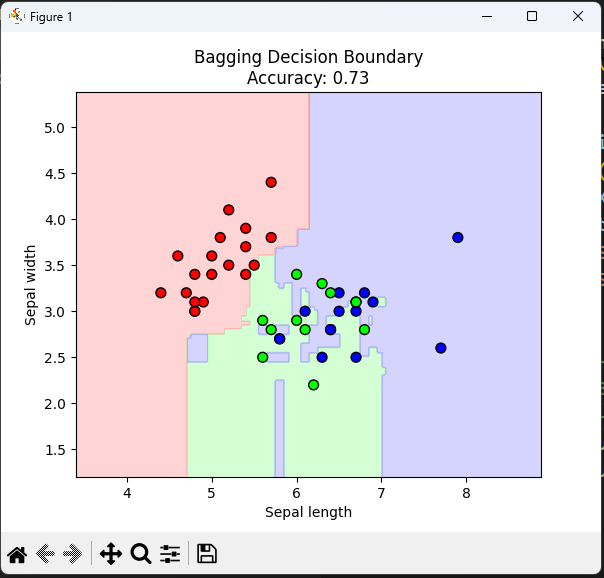
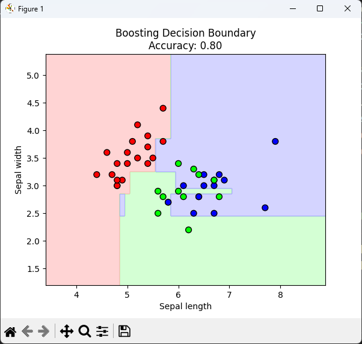

## MLT Bagging and Boostng


### CODE : 

```py
import pandas as pd
import numpy as np
import matplotlib.pyplot as plt
from sklearn.model_selection import train_test_split
from sklearn.tree import DecisionTreeClassifier
from sklearn.ensemble import BaggingClassifier, AdaBoostClassifier
from sklearn.metrics import accuracy_score
from sklearn.preprocessing import LabelEncoder
from matplotlib.colors import ListedColormap

headers = ["sepal_length","sepal_width","petal_length","petal_width","target"]
df = pd.read_csv("iris.csv", header=None, names=headers)

X = df[["sepal_length", "sepal_width"]]
y = df["target"]

le = LabelEncoder()
y_encoded = le.fit_transform(y)

X_train, X_test, y_train, y_test = train_test_split(
    X, y_encoded, test_size=0.3, random_state=42
)

bagging = BaggingClassifier(
    estimator=DecisionTreeClassifier(),
    n_estimators=50,
    max_samples=0.8,
    random_state=42
)
bagging.fit(X_train, y_train)
y_pred_bag = bagging.predict(X_test)
bag_acc = accuracy_score(y_test, y_pred_bag)

boosting = AdaBoostClassifier(
    estimator=DecisionTreeClassifier(max_depth=1),
    n_estimators=50,
    learning_rate=1.0,
    random_state=42
)
boosting.fit(X_train, y_train)
y_pred_boost = boosting.predict(X_test)
boost_acc = accuracy_score(y_test, y_pred_boost)

print("Bagging Accuracy :", bag_acc)
print("Boosting Accuracy:", boost_acc)

def plot_decision_boundary(model, X, y, title):
    cmap_light = ListedColormap(['#FFAAAA', '#AAFFAA', '#AAAAFF'])
    cmap_bold  = ListedColormap(['#FF0000', '#00FF00', '#0000FF'])
    
    x_min, x_max = X.iloc[:, 0].min() - 1, X.iloc[:, 0].max() + 1
    y_min, y_max = X.iloc[:, 1].min() - 1, X.iloc[:, 1].max() + 1
    xx, yy = np.meshgrid(np.arange(x_min, x_max, 0.02),
                         np.arange(y_min, y_max, 0.02))
    
    mesh_df = pd.DataFrame(np.c_[xx.ravel(), yy.ravel()], columns=X.columns)
    Z = model.predict(mesh_df)
    Z = Z.astype(float)
    Z = Z.reshape(xx.shape)
    
    plt.figure(figsize=(6,5))
    plt.contourf(xx, yy, Z, cmap=cmap_light, alpha=0.5)
    plt.scatter(X.iloc[:, 0], X.iloc[:, 1], c=y, cmap=cmap_bold, edgecolor='k', s=50)
    plt.title(title)
    plt.xlabel("Sepal length")
    plt.ylabel("Sepal width")
    plt.show()

plot_decision_boundary(bagging, X_test, y_test, f"Bagging Decision Boundary\nAccuracy: {bag_acc:.2f}")
plot_decision_boundary(boosting, X_test, y_test, f"Boosting Decision Boundary\nAccuracy: {boost_acc:.2f}")


```


***

### OUTPUT :
 
```bash
PS E:\Dhruven>  e:; cd 'e:\A017_Dhruven'; & 'c:\Python311\python.exe' 'c:\Users\sbmpc.student\.vscode\extensions\ms-python.debugpy-2025.10.0-win32-x64\bundled\libs\debugpy\launcher' '65292' '--' 'e:\A017_Dhruven\exp 10.py' 
Bagging Accuracy : 0.7333333333333333
Boosting Accuracy: 0.8
PS E:\Dhruven> 

```

 

 


