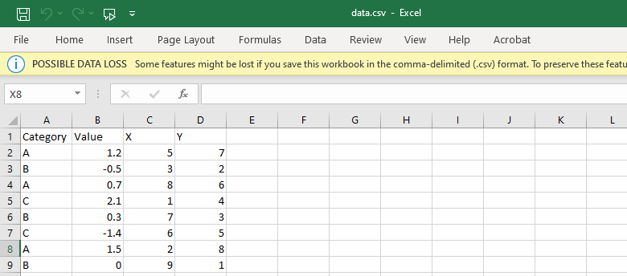
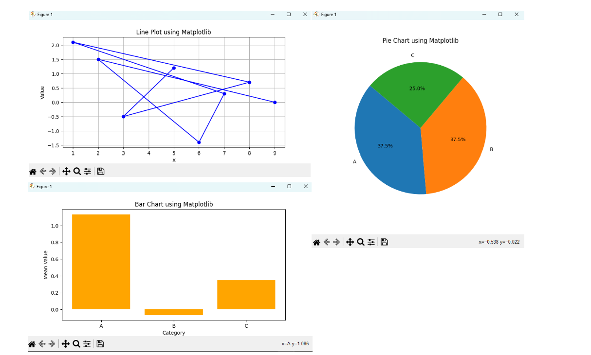
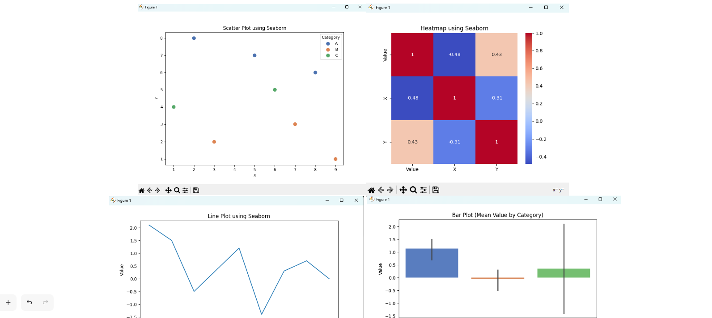
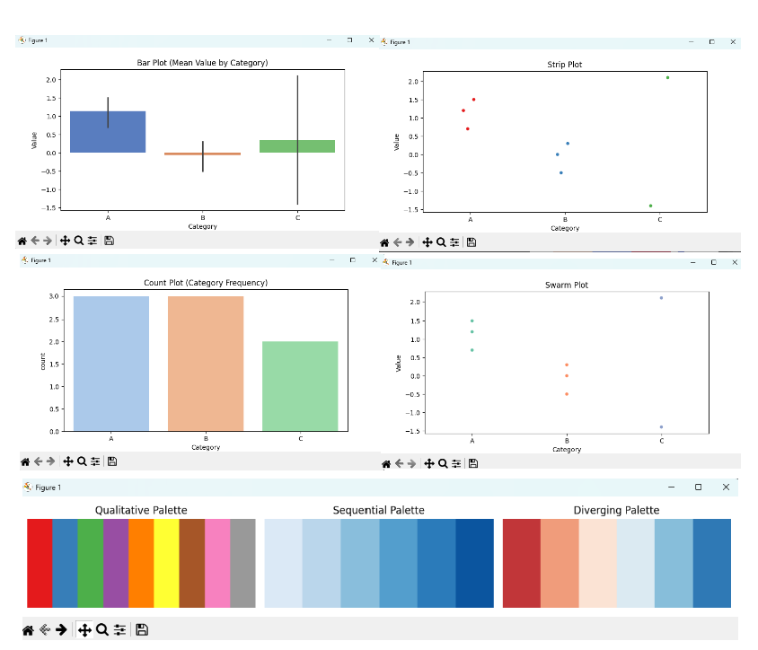

### code
```python
import pandas as pd
import matplotlib.pyplot as plt
import seaborn as sns

# Load the CSV file
df = pd.read_csv('data.csv')

# 1. Line Plot using Matplotlib (X vs Value)
plt.figure(figsize=(8, 4))
plt.plot(df['X'], df['Value'], marker='o', linestyle='-', color='b')
plt.title('Line Plot using Matplotlib')
plt.xlabel('X')
plt.ylabel('Value')
plt.grid(True)
plt.show()
plt.close()

# 2. Bar Chart using Matplotlib (mean Value per Category)
mean_values = df.groupby('Category')['Value'].mean()
plt.figure(figsize=(8, 4))
plt.bar(mean_values.index, mean_values.values, color='orange')
plt.title('Bar Chart using Matplotlib')
plt.xlabel('Category')
plt.ylabel('Mean Value')
plt.show()
plt.close()

# 3. Pie Chart using Matplotlib (Category distribution)
category_counts = df['Category'].value_counts()
plt.figure(figsize=(6, 6))
plt.pie(category_counts.values, labels=category_counts.index, autopct='%1.1f%%', startangle=140)
plt.title('Pie Chart using Matplotlib')
plt.show()
plt.close()

# 4. Scatter Plot using Seaborn (X vs Y colored by Category)
plt.figure(figsize=(8, 6))
sns.scatterplot(data=df, x='X', y='Y', hue='Category', palette='deep', s=100)
plt.title('Scatter Plot using Seaborn')
plt.show()
plt.close()

# 5. Seaborn Line Plot (X vs Value)
plt.figure(figsize=(8, 4))
sns.lineplot(x='X', y='Value', data=df)
plt.title('Line Plot using Seaborn')
plt.show()
plt.close()

# 6. Heatmap using Seaborn (correlation matrix on numeric columns only)
plt.figure(figsize=(6, 5))
numeric_df = df.select_dtypes(include=['number'])
sns.heatmap(numeric_df.corr(), annot=True, cmap='coolwarm')
plt.title('Heatmap using Seaborn')
plt.show()
plt.close()

# 7. Statistical Estimation
# Bar Plot: Mean Value per Category
plt.figure(figsize=(8, 4))
sns.barplot(x='Category', y='Value', data=df, hue='Category', palette='muted', legend=False)
plt.title('Bar Plot (Mean Value by Category)')
plt.show()
plt.close()

# Count Plot: Frequency of Categories
plt.figure(figsize=(8, 4))
sns.countplot(x='Category', data=df, hue='Category', palette='pastel', legend=False)
plt.title('Count Plot (Category Frequency)')
plt.show()
plt.close()

# 8. Categorical Plots
# Stripplot
plt.figure(figsize=(8, 4))
sns.stripplot(x='Category', y='Value', data=df, jitter=True, hue='Category', palette='Set1', legend=False)
plt.title('Strip Plot')
plt.show()
plt.close()

# Swarmplot
plt.figure(figsize=(8, 4))
sns.swarmplot(x='Category', y='Value', data=df, hue='Category', palette='Set2', legend=False)
plt.title('Swarm Plot')
plt.show()
plt.close()

# 9. Color Palettes: qualitative, sequential, diverging
import numpy as np

palettes = ['Set1', 'Blues', 'RdBu']
titles = ['Qualitative Palette', 'Sequential Palette', 'Diverging Palette']

fig, axes = plt.subplots(1, 3, figsize=(12, 2))

for ax, palette_name, title in zip(axes, palettes, titles):
    colors = sns.color_palette(palette_name)
    n = len(colors)
    for i, color in enumerate(colors):
        ax.add_patch(plt.Rectangle((i, 0), 1, 1, color=color))
    ax.set_xlim(0, n)
    ax.set_ylim(0, 1)
    ax.set_xticks([])
    ax.set_yticks([])
    ax.set_title(title)
    ax.axis('off')

plt.tight_layout()
plt.show()
plt.close()
```
<br>
<br><br><br><br><br><br><br><br><br><br><br><br><br>

### outputs
 
 
 
  


***

