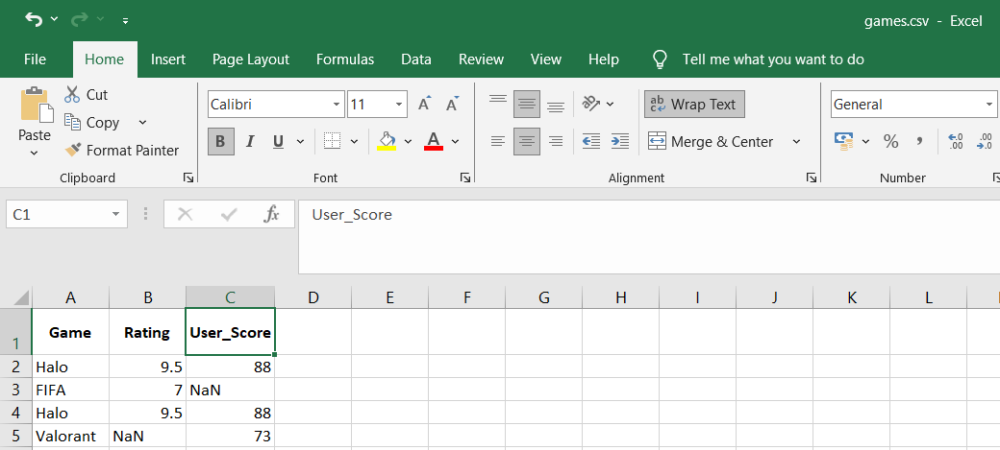

### code

```python
import pandas as pd
import numpy as np

# Step 1: Read from CSV file 
df = pd.read_csv('games.csv')  
print("original dataframe:\n", df)

# Step 2: Detect missing values
print("\nstep 1: detect missing values\n")
print(df.isnull().sum())

# Step 3: Handle missing values (fillna with mean, rounded to 2 decimals)
df['Rating'] = df['Rating'].fillna(round(df['Rating'].mean(), 2))
df['User_Score'] = df['User_Score'].fillna(round(df['User_Score'].mean(), 2))
print("\nstep 2: after handling missing values\n")
print(df)

# Step 4: Replace values
df['Game'] = df['Game'].replace('Valorant', 'Valorant (PC)')
print("\nstep 3: after replacing 'Valorant' with 'Valorant (PC)'\n")
print(df)

# Step 5: Remove duplicates
df.drop_duplicates(inplace=True)
print("\nstep 4: after removing duplicates\n")
print(df)

# Step 6: Type conversion
df['Rating'] = df['Rating'].astype(float)
print("\nstep 5: after type conversion (Rating to float)\n")
print(df.dtypes)

# Step 7: Normalize User_Score and round
df['Normalized_User_Score'] = (
    (df['User_Score'] - df['User_Score'].min()) /
    (df['User_Score'].max() - df['User_Score'].min())
).round(2)

# Optional rounding
df['Rating'] = df['Rating'].round(2)
df['User_Score'] = df['User_Score'].round(2)

print("\nstep 6: after data transformation (normalize user score)\n")
print(df)

```
<br>

### output

```bash
PS E:\Probz> python wow.py
original dataframe:
        Game  Rating  User_Score
0      Halo     9.5        88.0
1      FIFA     7.0         NaN
2      Halo     9.5        88.0
3  Valorant     NaN        73.0

step 1: detect missing values

Game          0
Rating        1
User_Score    1
dtype: int64

step 2: after handling missing values

       Game  Rating  User_Score
0      Halo    9.50        88.0
1      FIFA    7.00        83.0
2      Halo    9.50        88.0
3  Valorant    8.67        73.0

step 3: after replacing 'Valorant' with 'Valorant (PC)'

            Game  Rating  User_Score
0           Halo    9.50        88.0
1           FIFA    7.00        83.0
2           Halo    9.50        88.0
3  Valorant (PC)    8.67        73.0

step 4: after removing duplicates

            Game  Rating  User_Score
0           Halo    9.50        88.0
1           FIFA    7.00        83.0
3  Valorant (PC)    8.67        73.0

step 5: after type conversion (Rating to float)

Game           object
Rating        float64
User_Score    float64
dtype: object

step 6: after data transformation (normalize user score)

            Game  Rating  User_Score  Normalized_User_Score
0           Halo    9.50        88.0                   1.00
1           FIFA    7.00        83.0                   0.67
3  Valorant (PC)    8.67        73.0                   0.00
```
 