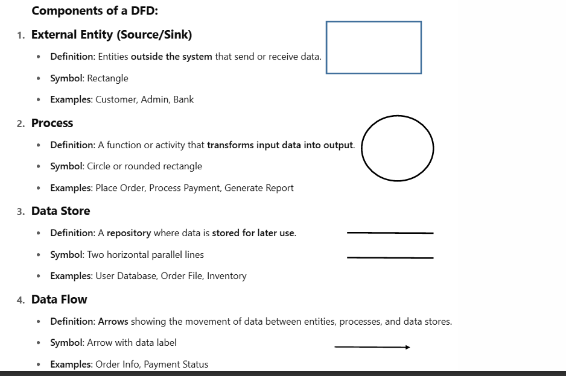
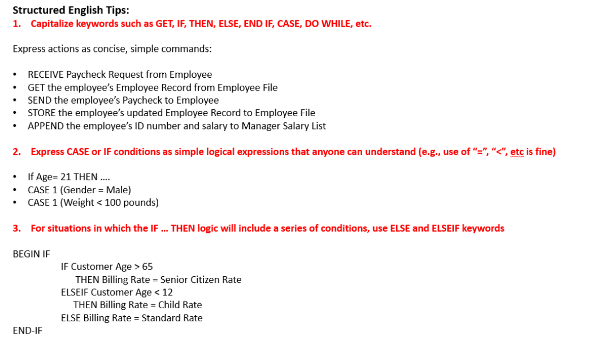
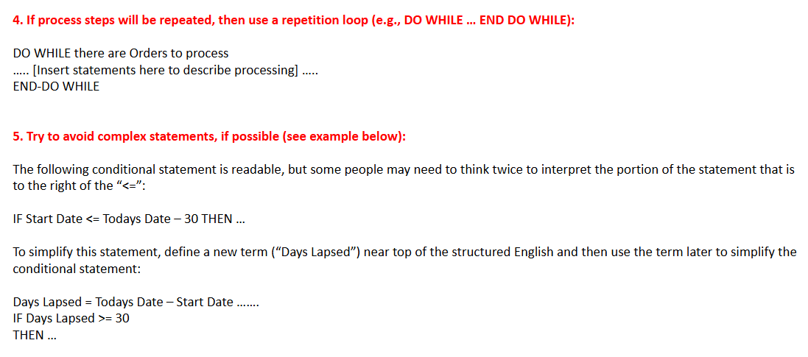
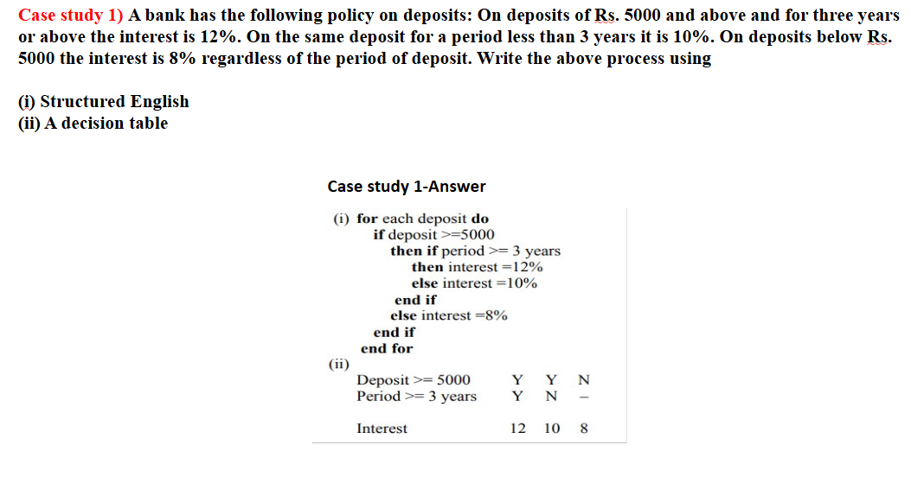
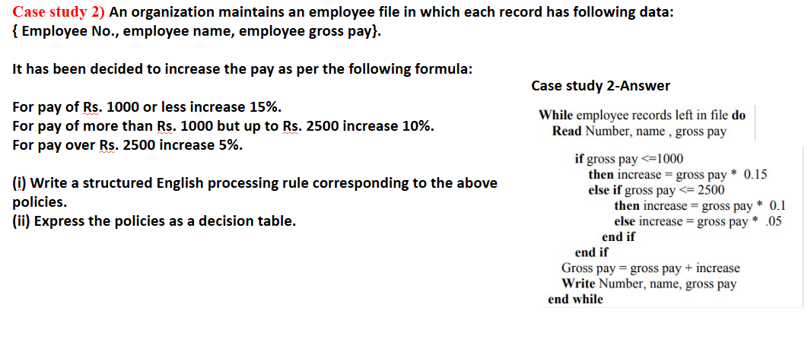
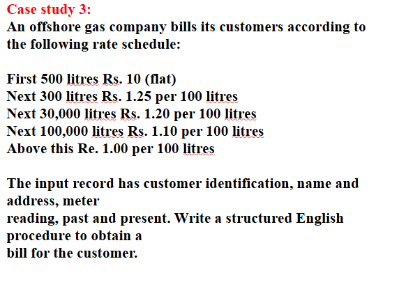
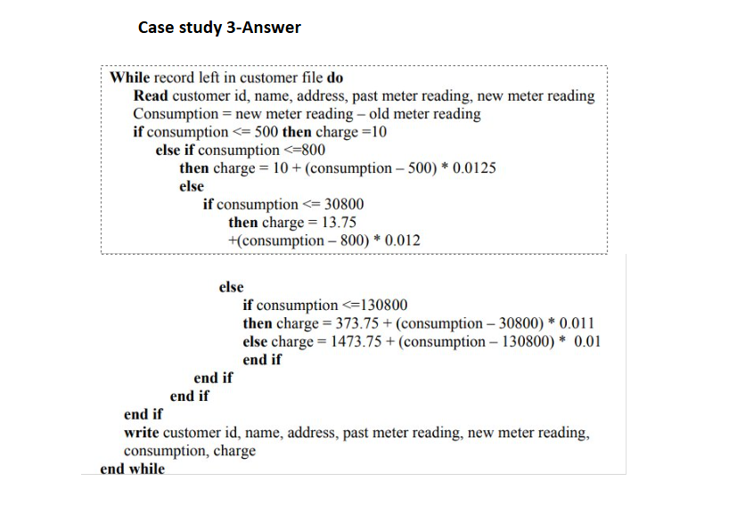
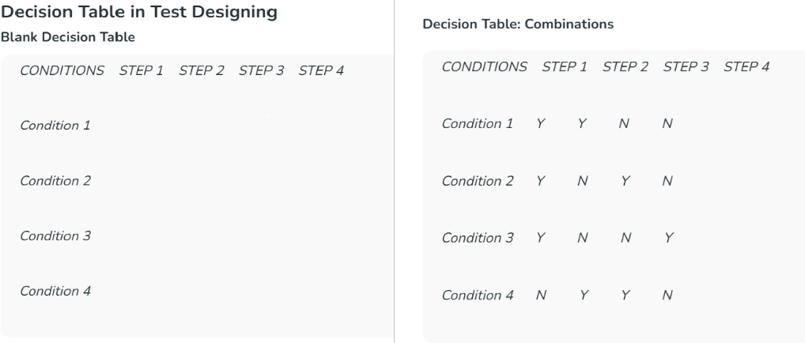
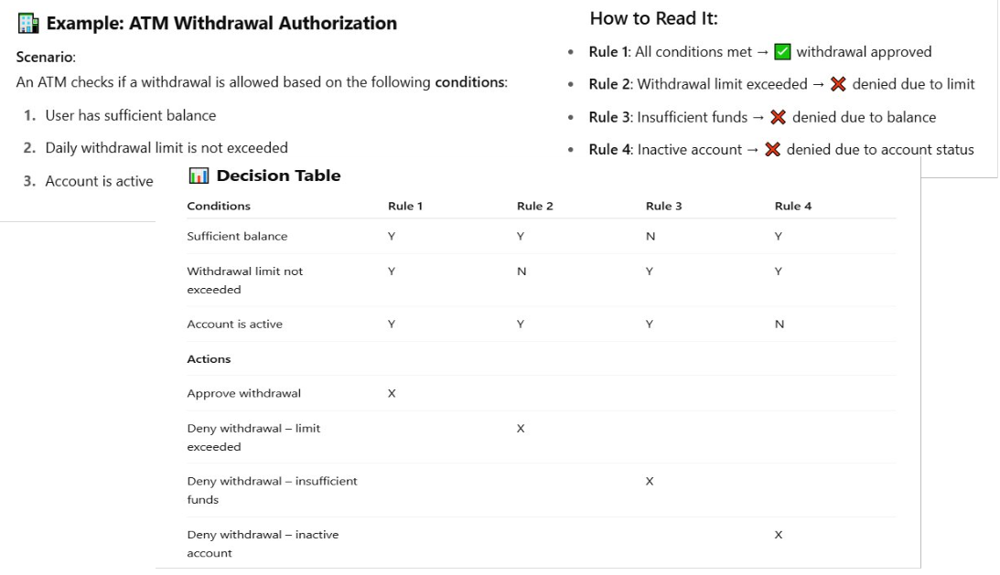
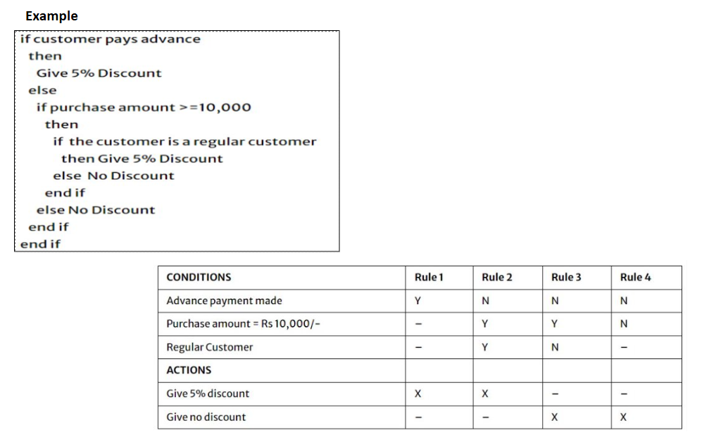

### Define term system analysis with the help of example –  4 Marks
System analysis is the process of **collecting factual data**, understanding how the system works, identifying existing **problems**, and giving **practical suggestions** to improve how the system functions.

It includes:

-   Studying business or working processes
    
-   Collecting operational data and understanding how information flows
    
-   Finding bottlenecks or weak areas in the system
    
-   Suggesting better ways to achieve goals
    

It also involves answering questions like:  
**What** is being done? **How** and **why** is it being done? **Who** is doing it and **when**?

The main aim is to design a **new and efficient system** that meets current needs and allows future improvements. This is a **creative thinking process**, and the result is a **logical system design**.

 **Example:**

In a **school**, if exam results are prepared manually and take a lot of time, system analysis can suggest a **computerized marks entry system** to save time and avoid errors.

******

### Define term Preliminary System Study – 4 Marks

Preliminary System Study is the **first step in the System Development Life Cycle (SDLC)**.  
It is a **quick and basic investigation** of the existing system to understand what it does and what problems need to be solved.

It gives a clear picture of how the **current system works physically** and helps decide if a new system is required.

During this stage, the **System Analyst** prepares a **System Proposal**, which includes:

-   Problem definition
    
-   Objectives of the study
    
-   User requirements
    
-   Constraints and limitations

-   Expected benefits of the new system
    

This proposal is submitted to the **management**, who may accept it, reject it, or ask for changes.

 **Example:**

In a **hospital**, if patient records are kept manually and are hard to retrieve, the preliminary study will identify this issue and suggest moving to a **computerized system**. A proposal is made, and if management agrees, the system development process continues.
***

### Explain Feasibility Study process – 4 Marks
A **feasibility study** is done to check whether a proposed project is **possible and practical**. It helps in deciding whether to move forward with the project or not.

The feasibility study looks at different aspects of the project:

-   **Market Research**: Finds out the demand for the service/product, and checks competition and target customers.
    
-   **Technical Analysis**: Checks if the project is technically possible, including design, resources, and technology.
    
-   **Financial Analysis**: Calculates estimated costs, expected income, and checks whether the project is financially sound.
    
-   **Risk Assessment**: Identifies possible risks (market, legal, financial) and how they might affect the project.
    

The final result is a **feasibility report** that gives a summary of all findings and suggests whether the project should go ahead.

**Example:**

Before launching an **online food delivery app**, a company would do a feasibility study to check if there's enough demand, if the app can be built with available tech, and whether it will make a profit.
***

### Explain types of Feasibility Study with example – 6/8 Marks
A **Feasibility Study** is done to evaluate whether a proposed project can be successfully developed and implemented.

1 . **Technical Feasibility**

Technical feasibility checks whether the **technical resources** (hardware, software, tools) and **skills** required to complete the project are available. It evaluates whether the current system can support the new project or if upgrades are needed.

It also considers:

-   Availability of necessary technology
    
-   Experience and capability of the development team
    
-   Ease of system maintenance and upgrades
    

**Example:** Before developing an AI-based attendance system, an institution must confirm they have trained developers, required servers, and supporting software.

 2. **Economic Feasibility**

Economic feasibility determines whether the **project is financially viable**. It analyses the **development cost, operational cost**, and expected **financial returns or savings**. It ensures that the total investment is justified by the benefits.

It includes:

-   Cost-benefit analysis
    
-   Budget planning
    
-   Analysis of possible funding sources
    
-   Planning for unexpected costs
    

**Example:** A company planning a billing software must compare the cost of development and maintenance with the expected improvement in billing efficiency and cost savings.

 3. **Legal Feasibility**

Legal feasibility ensures that the project follows all **laws, regulations, and legal standards**. It checks for any legal issues that could prevent the project from being implemented.

Key legal considerations include:

-   Data privacy laws
    
-   Intellectual property rights
    
-   Zoning laws (for physical projects)
    
-   Industry-specific regulations
    

**Example:** If a healthcare app is being developed, it must comply with data protection laws and health data handling regulations like HIPAA (in the U.S.) or India's IT Act.

4. **Operational Feasibility**

Operational feasibility checks whether the project will function **smoothly in the real environment**. It looks at how well the system will work within the organization’s current operations and whether users will adopt it.

This includes:

-   Compatibility with existing workflows
    
-   Training needs for staff
    
-   Organizational readiness
    
-   User acceptance and ease of use
    

**Example:** If a university plans to shift from offline to online admission, operational feasibility studies whether staff and students are ready and capable of using the new system.

5. **Scheduling Feasibility**

Scheduling feasibility evaluates if the project can be completed **within a specific time frame**. It ensures that realistic deadlines are set and the project doesn't get delayed due to poor planning.

It considers:

-   Timeline for each phase
    
-   Availability of resources during the project
    
-   External dependencies and risks
    

**Example:** A government exam board launching an online result portal must ensure it is fully functional and tested before result declaration dates.
***

### Define term SRS and list SRS users – 4 Marks

SRS stands for **Software Requirement Specification**. It is a formal document that provides a **complete description** of how a software system should behave. It includes both:

-   **Functional Requirements** – what the system should do
    
-   **Non-Functional Requirements** – how the system should perform (speed, security, usability, etc.)
    

SRS helps both clients and developers clearly understand the system's expectations. It is created during the **requirements engineering phase** and is usually **approved (signed off)** before development starts.

A good SRS should be:

-   **Correct**
    
-   **Complete**
    
-   **Unambiguous**
    
-   **Traceable**
    
-   **Verifiable**
    

***

 **Users of SRS:**

1.  **Client** – To verify if the system meets their needs
    
2.  **Development Team** – To build the system as per requirements
    
3.  **Maintenance Team** – To understand the system for future updates
    
4.  **Technical Writers** – To prepare user manuals and documentation
***

### Explain the need of SRS document – 4 Marks
The **Software Requirement Specification (SRS)** document is important because it acts as the **foundation of the entire software development process**. It clearly defines what the system should do and how it should behave.

***

 **Reasons why SRS is needed:**

1.  **Structures All Requirements**  
    It organizes and formalizes all the customer and system requirements in one place.
    
2.  **Guides the Development Team**  
    It helps developers build the software as per the exact needs of the client and target users.
    
3.  **Avoids Misunderstandings**  
    It reduces confusion between the client and the development team by clearly mentioning expectations.
    
4.  **Defines Scope and Planning**  
    It outlines the project scope, which helps in planning development stages, timelines, and estimating the required budget.
***

### Draw DFD diagram for any system – 6 Marks
[Levels in Data Flow Diagrams (DFD) - CLICK HERE](https://www.geeksforgeeks.org/software-engineering/levels-in-data-flow-diagrams-dfd/)

***

### Draw Use case diagram for any system – 6 Marks
[Use Case Diagram CLICK HERE](https://www.geeksforgeeks.org/system-design/use-case-diagram/)

***

### List and define the role of DFD components with the help of example – 4/6 Marks
 

***

### Problem statement for structured English and decision table – 4/6 Marks
  
        
***

### Define term system analyst with the help of example – 4 Marks
A **System Analyst** is an expert who understands both business needs and technical capabilities, acting as a bridge between users and developers. They analyze, design, and help implement systems that solve problems, improve efficiency, and align with organizational goals.  
They have **technical**, **analytical**, and **interpersonal** skills to:

-   Identify and prioritize user requirements.
    
-   Propose effective, cost-beneficial solutions.
    
-   Create clear specifications for developers.
    
-   Ensure systems are user-friendly, modular, and up-to-date.
    
-   Periodically evaluate and modify systems as needed.
    

**Example – IT Industry (Infosys)**  
A bank’s software crashed during peak hours. The system analyst:

1.  Met with the client to understand issues.
    
2.  Analyzed logs and system architecture.
    
3.  Found database query bottlenecks.
    
4.  Recommended optimizing queries and scaling backend servers.  
    **Result:** System handled peak traffic without crashes.
***

### Define term system analyst and Explain the roles of a systems analyst – 8 Marks
A **system analyst** is a person who understands the working of a system and helps in developing or improving it. They act as a bridge between the users (who need the system) and the programmers (who build it).  
They have **technical**, **analytical**, and **communication** skills to find problems, suggest solutions, and guide the project so that the final system is useful, easy to use, and meets the organization’s goals.

 **Roles of a System Analyst**

1.  **Understand User Requirements** – Meet users and gather information using interviews, surveys, or observation.
    
2.  **Prioritize Needs** – Arrange requirements in order of importance with user agreement.
    
3.  **Suggest Solutions** – Propose different options, choose the best, and compare cost vs. benefit.
    
4.  **Prepare Specifications** – Write clear documents for programmers and users.
    
5.  **Design the System** – Make modular and flexible designs that are easy to maintain.
    
6.  **Guide Development** – Help programmers during coding and testing.
    
7.  **Review and Improve** – Check the system after some time and make changes if needed.
    

**Example:**  
A hospital’s appointment system was slow. The system analyst studied the problem, found that the database design was outdated, suggested a new scheduling system, gave the design to developers, and later tested it to ensure faster bookings.
