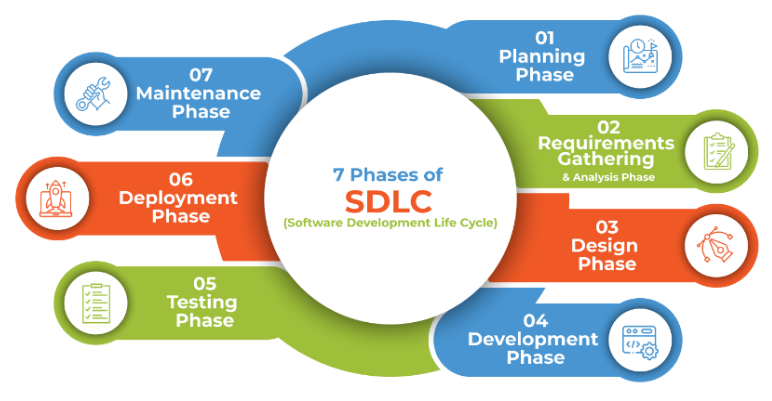
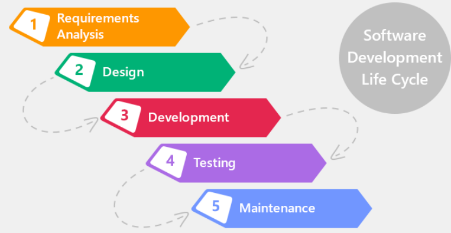

### **Q.1 Define the term Software and list types of software.** (2 Marks)

* **Software** is a collection of instructions, data, or computer programs that are used to run machines and carry out particular activities.
* It is the opposite of hardware, which refers to a computer's physical components.
* A device's running programs, scripts, and applications are collectively referred to as "software" in this context.
* **Types of software:**

  1. **System Software** – It manages hardware and system resources (e.g., Windows OS).
  2. **Application Software** – It helps users perform specific tasks (e.g., MS Word).

***
### **Q.2 Define the term Software Engineering. Explain its need in modern software development.** (4 Marks)

* **Software Engineering** is the process of designing, developing, testing, and maintaining software in a systematic and disciplined manner to ensure high-quality, reliable, and maintainable software.
* It uses various tools, techniques, and methodologies such as requirement analysis, design, testing, and maintenance to manage the software development lifecycle.

**Need in Modern Software Development:**

* Ensures the software is **accurate, reliable**, and completed **on time and within budget**.
* Makes it easier to **handle big and complex projects** through proper planning.
* Improves the **quality and ease of fixing or updating** the software.
* Allows **faster development** using modern tools and technologies.
* Helps reduce mistakes and ensures the software meets the **user’s needs**.

***
### Q.3 Explain any four phases of the Software Development Life Cycle (SDLC) with a neat diagram. (6 marks)

 

 1. **Defining Requirements**

* After analyzing the needs, the next step is to document the software requirements clearly.
* This is done using an **SRS (Software Requirement Specification)** document.
* It includes all features and expectations agreed upon by the stakeholders.

 2. **Designing the Software**

* In this phase, the system architecture and design are prepared based on the requirements.
* It includes the selection of technologies, database design, and system layout.
* It serves as a blueprint for developers to follow.

 3. **Developing the Project**

* Actual coding starts in this phase using the selected programming languages and tools.
* Developers follow coding standards and write the code based on the design.
* Tools like compilers, interpreters, and debuggers are used.

 4. **Testing**

* After development, the software is tested to check if it meets all requirements.
* Various testing methods like **unit testing, integration testing, and system testing** are used.
* This helps find and fix bugs before the final release.

***

### **Q.4 Write the need of SDLC in Software Engineering.** (4 Marks)

**Need of SDLC:**

-   The development team must choose and follow a suitable life cycle model for proper planning.
    
-   Without it, software development becomes unstructured and undisciplined.
    
-   Team members must clearly understand **what to do and when to do it** to avoid confusion.
    
-   Otherwise, if one member starts coding, another writes test cases, and another begins design without coordination, it leads to **chaos and project failure**.
    
-   **This same situation can be avoided by using SDLC**, and in this case, a model like **Waterfall** ensures the team follows a proper sequence — from requirements to design, coding, and testing — for smooth and successful development.
***
###  **Q.5 Role of SDLC and list any four SDLC models** _(4 Marks)_

The Software Development Life Cycle (SDLC) plays a crucial role in guiding the entire software development process in a structured and organized manner.  
It breaks down the project into defined phases such as requirement gathering, design, development, testing, and deployment.  
By following SDLC, development teams can maintain quality, manage time and budget effectively, reduce risks, and ensure the final product meets the required standards and user expectations.

**Any Four SDLC Models:**

1.  Waterfall Model
    
2.  Iterative Model
    
3.  Incremental Model
    
4.  Prototype Model

***
### Q.6 Explain the phases of the Waterfall Model with a neat diagram. (6 marks)
> [!attention] ignore the circle thingy in diagram 

 

 🔹**1. Requirement Analysis:**  
This is the first stage where the team tries to understand what the customer actually needs from the software. All the important functions, features, and performance points are discussed and written down clearly in the form of a **Software Requirement Specification (SRS)** document. This document acts as a reference for the whole project.

🔹 **2. Design Phase:**  
Once the requirements are clear, the next step is to plan how the software will work. This includes deciding the overall structure, database design, and interface layout. All design ideas and technical decisions are documented in the **Software Design Document (SDD)**, which helps developers during coding.

🔹 **3. Development Phase:**  
In this phase, the actual coding work starts. Developers write the program based on the design using suitable programming languages. The software is usually created in parts or modules, and **unit testing** is done to check if each part is working fine on its own.

🔹 **4. Testing Phase:**  
After the development is completed, the full software is tested to make sure it meets the requirements. Testers perform different tests like integration testing and system testing to find bugs or issues. If any problem is found, it’s reported and fixed before the next phase.

🔹 **5. Deployment and Maintenance:**  
Once everything is working fine, the software is given to the client or released in the market. But even after deployment, there may be small issues that come up. The team releases **patches or updates** to fix them. Also, if needed, new features can be added later as part of maintenance.
***
###  Q.7 Explain the Waterfall Model in detail with a diagram. Write any two advantages and disadvantages. (8 marks)
> [!attention] ignore the circle thingy in diagram 

 
**Waterfall Model**

The Waterfall Model is one of the oldest and most widely used software development life cycle (SDLC) models. Introduced by Winston Royce in 1970, it follows a linear and step-by-step process where each phase flows into the next—like water flowing down a waterfall. It is also known as the Linear Sequential Model. The phases include Requirement Analysis, Design, Development, Testing, Deployment, and Maintenance. Each phase must be fully completed before moving on to the next, and the output of one phase becomes the input for the next. This approach ensures structured development and clear documentation at every step.

**When to Use the Waterfall Model**

This model is most suitable when the project requirements are clearly defined and unlikely to change during the development process. It works well for small or simple projects where the scope is fixed, and the development tools and resources are already planned. It is especially useful in government or formal environments where detailed documentation and planning are essential.

**Advantages of Waterfall Model**

-   Easy to understand and use, especially for beginners.
    
-   Each phase is well-documented with clear goals.
    
-   Works well for small-scale projects with stable requirements.
    

**Disadvantages of Waterfall Model**

-   Not ideal for projects where requirements may evolve.
    
-   Once a phase is completed, it's hard to go back and make changes.
    
-   The final product is only seen at the end, so early feedback is limited.
    

**Example – Government Exam Portal**

For example, when developing an online exam portal for a government exam like SSC or UPSC, all features—such as registration, admit card generation, and online testing—are predefined. The project has strict deadlines and no room for major changes during development. Using the Waterfall Model here ensures everything is planned, built, and tested in order, with no surprises before launch. Any improvements or fixes are handled later during the maintenance phase.

***
### Q.8 Describe the working of the Waterfall Model. List any three advantages and three disadvantages. (6 marks)
> [!attention] ignore the circle thingy in diagram 

 

**Working of Waterfall Model:**

The Waterfall Model is a linear and structured approach to software development where each phase is completed before the next one begins. The process starts with **requirement analysis**, where the software’s goals and functions are clearly defined and documented. After that, in the **design phase**, these requirements are converted into a detailed system plan.

Next, in the **development phase**, actual coding is done based on the design. After development, the software goes through **testing** to identify and fix any bugs. Once the testing is successful, the system is **deployed** for use. The final stage is **maintenance**, where updates or patches are made after release. This model ensures that every phase is completed properly before moving to the next, and the output of one becomes the input for the next.

**Advantages:**

1.  Simple and easy to use and understand.
    
2.  Each phase has clear deliverables and documentation.
    
3.  Ideal for smaller projects with fixed requirements.
    

**Disadvantages:**

1.  Not suitable for changing or unclear requirements.
    
2.  Difficult to go back to a previous phase once it's completed.
    
3.  No working software is produced until late in the cycle.
***
### Q.9 When is the Waterfall Model preferred in software development? Give examples of suitable projects. (4 marks)
The Waterfall Model is preferred when the **project requirements are well-defined, fixed, and not expected to change** during development. It works best for **simple or medium-scale projects** where the **development process can follow a clear linear sequence** — from requirement gathering to maintenance — without frequent changes or feedback loops.

 Examples of Suitable Projects:

1.  **Government Exam Portal** – All modules like registration, admit card, and result processing are planned in advance with fixed deadlines.
    
2.  **Library Management System** – Book issuing, return, and fine calculation follow standard, unchanging logic.
    
3.  **Payroll Processing System** – The system works based on fixed tax and salary rules that rarely change during development.
***
### Q.10 Draw and Explain iterative model (6 marks)
 
The **Iterative Model** is an approach to software development where the system is built incrementally through repeated cycles, or _iterations_. Instead of trying to get everything perfect in the first attempt, the software is developed step-by-step — improving and adding features in each version.

-   The SDLC process starts with **initial requirement gathering and analysis**.
    
-   A **basic version of the software is developed** with available requirements.
    
-   Based on **feedback or additional requirements**, the next version is created by refining or adding features.
    
-   This **cycle repeats**, creating multiple versions until the software meets the final expectations.
    
-   Once finalized, the product is **deployed** and moves to the maintenance phase.
    

Each iteration goes through the common SDLC phases: planning, design, development, testing, and evaluation.
***
### Q.11 When is the Iterative model preferred in software development? Explain any two advantages and disadvantages. (6 marks)

**When to Use Iterative Model:**

The Iterative Model is preferred when:

-   The project is **large in size** and requirements may evolve during development.
    
-   There is a **need to accommodate changes or enhancements** in the future.
    
-   The **development team is learning a new technology** while working on the project.
    
-   The project includes **high-risk features or goals** that are not clearly defined in the beginning.
    
-   **User feedback is important**, and the product needs to improve through multiple versions.
    

**Advantages of Iterative Model:**

1.  **Easier testing and debugging:** Since development happens in small cycles, errors are identified early and fixed quickly.
    
2.  **Flexible for changing needs:** New requirements or modifications can be added during iterations without restarting the project.
    
3.  **Risk handling:** High-risk features can be addressed in early iterations, reducing uncertainty later.
    

**Disadvantages of Iterative Model:**

1.  **Not ideal for small projects:** Iterative development may be overkill for simpler or short-term tasks.
    
2.  **Resource intensive:** More effort is needed to manage multiple iterations, which may require more developers or tools.
    
3.  **Uncertain deadlines and costs:** Changing requirements in each iteration can lead to delays and increased budget.
***
### Q.12 Explain the Iterative model in detail with a diagram. Write any two advantages and disadvantages. (8 marks)

 
 **Iterative Model Explanation:**

The Iterative Model is a software development process where the software is built and improved step-by-step through repeated cycles called iterations. Each cycle includes requirement gathering, design, development, and testing. After the first version of the software is developed, it is evaluated. Based on feedback and changes, a new version is created in the next cycle.

This process continues until the complete system is developed. It allows developers to make improvements and add new features based on real-time feedback, which helps handle changing requirements and reduces risks early in the project.

 **Advantages of Iterative Model:**

1.  Testing and debugging during smaller iteration is easy.
    
2.  A parallel development can be planned.
    
3.  It is easily acceptable to ever-changing needs of the project.
    

**Disadvantages of Iterative Model:**

1.  It is not suitable for smaller projects.
    
2.  More resources may be required.
    
3.  Design can be changed again and again because of imperfect requirements.
    

 **Real-World Example:**

Suppose a team is building an **educational learning portal** where features like user login, quizzes, video lectures, and chat support are added over time. Instead of planning everything from the start, they build one feature, get feedback, improve it, and then move to the next. This makes the Iterative Model suitable because changes and improvements are expected at each stage.

***
###  Q.13 Draw and Explain Incremental model (6 marks)

The **Incremental Model** is a software development approach where the project is broken down into small, manageable modules. Each module goes through its own **requirement analysis, design, development, and testing phases** independently. These modules are developed **incrementally**—meaning, each new version of the software adds additional features or functions to the previously developed one.

Initially, only a basic version of the software is developed. Then, in **subsequent increments**, more features are added until the **final complete system is delivered**. This model is useful for projects where the **core requirements are known**, but additional features may evolve over time.

 **Example Scenario:**

An example could be building a **banking app** where the first increment delivers login and balance check, the second adds fund transfer, and the third adds bill payment. Each increment adds a working feature without disrupting previously built modules.

***
### Q.14 When is the Incremental model preferred in software development? Explain any two advantages and disadvantages. (6 marks)

 **When to Use the Incremental Model:**

The Incremental Model is preferred when the software requirements are mostly clear and understood from the beginning. It is useful when the client demands an early working version of the product, especially if some features are more important and can be delivered first. This model also suits long-duration projects where development happens in stages. It is ideal when the development team is not fully skilled or is still adapting to new technologies. In many cases, it is used in web applications or product-based companies where updates are frequent and feature-wise delivery is possible.

 **Advantages of Incremental Model:**

1.  The client gets important functionality delivered early.
    
2.  Errors are easier to recognize and fix at each stage.
    
3.  Easier to test, debug, and manage risks during each increment.
    

**Disadvantages of Incremental Model:**

1.  Requires clearly defined module interfaces from the beginning.
    
2.  Needs good planning and coordination due to continuous iterations.
    
3.  System architecture problems may arise since not all requirements are gathered upfront.

**Example:**  
A railway ticket booking system where the first version allows basic ticket search and booking. Later increments add seat selection, payment gateway integration, and SMS notifications.
***
### Q.15 Explain the Incremental model in detail with a diagram. Write any two advantages and disadvantages. (8 marks)

The **Incremental Model** is a software development process where the overall system is built **in pieces (increments)**. Each increment adds new functionality or features. At the beginning, only basic requirements are implemented. As the project progresses, more features are developed and integrated until the full product is complete.

The process follows multiple **iterations**, and each iteration goes through **Requirement gathering, Design, Development, and Testing** phases. After every increment, the working software is delivered to the client. This model is especially useful when requirements are well understood in the beginning but may evolve later on.

 **Advantages**

1.  Important features are delivered to the client early in the process.
    
2.  Easier to test and debug as smaller modules are handled at a time.
    
3.  Flexible and less costly to change scope or requirements.
    

 **Disadvantages**

1.  Requires well-defined module boundaries and good architecture upfront.
    
2.  A skilled team and proper planning are necessary for smooth iteration handling.
    
3.  Continuous integration of increments can lead to complexity if not managed properly.
    

**Example**

A railway ticket booking system where the first release allows basic ticket search and booking. Later increments add features like seat selection, payment integration, and real-time SMS alerts.
***
###  Q.16 Draw and Explain Prototype model (6 marks)

 

The Prototype Model is used when the customer’s requirements are not clearly understood. Instead of developing the final product immediately, a basic working model (prototype) of the software is created to demonstrate its functionality.

This model involves an **iterative process** where developers build a prototype, present it to the user, and improve it based on feedback. Once the user is satisfied with the prototype, the actual software is developed.

This approach helps in **clarifying vague requirements** and reduces chances of rework in later stages.

 **Example Scenario:**

A client wants a **custom event management app**, but isn't sure how the UI or booking flow should work. Developers create a prototype with dummy screens and sample actions. The client reviews it, suggests changes, and once finalized, the actual system is developed.

***
### Q.17 When is the Prototype model preferred in software development? Explain any two advantages and disadvantages. (6 marks)

 **When to Use:**

The Prototype Model is preferred when the **requirements of the system are unclear or incomplete** at the beginning of the project. It is especially useful when clients are not sure about what they want, or when the product involves a lot of user interaction. This model is also suitable for **complex and innovative projects** where trial-and-error helps refine features, layout, and overall system flow.

**Advantages:**

1.  Customers are actively involved in development, which increases satisfaction and ensures the product meets their needs.
    
2.  Errors and misunderstandings can be identified early, saving time and effort later.
    
3.  Design is flexible and can be modified easily based on feedback.
    

 **Disadvantages:**

1.  Development may take more time and cost due to continuous feedback and changes.
    
2.  Frequent changes can disturb the development rhythm and delay the final product.
    
3.  Documentation is often poor, as requirements change frequently and are hard to track.
    

 **Example Scenario:**

A startup wants to build a **new food delivery app**, but isn’t clear on how the interface should look or what features users will prefer. A prototype helps the team get feedback and make changes before starting actual development.
***
### Q.18 Explain the Prototype model in detail with a diagram. Write any two advantages and disadvantages. (8 marks)

The **Prototype Model** is a software development method where an early, rough version of the system is built first to understand user requirements more clearly. It acts like a sample or mock version of the final product and is improved in multiple iterations based on user feedback. Once all major requirements are confirmed, the actual development begins using those finalized expectations.

This approach is ideal when requirements are unclear or expected to change, and it allows clients to interact with the system early in the process.

**Advantages:**

1.  Clients can see the system early, which helps clarify expectations.
    
2.  Requirements are better understood through feedback on the prototype.
    
3.  Reduces chances of major changes late in the development phase.
    

**Disadvantages:**

1.  Too many changes in the prototype can delay actual development.
    
2.  It may lead to poor documentation due to frequent updates.
    
3.  Can become expensive if many prototypes are made or discarded.
    

**Example Case:**  
A startup wants to build an AI-powered job recommendation app but isn't sure about the UI or core features. The developers first build a prototype with sample screens and logic. After user feedback, they refine the design and finalize the real product flow.
***
### Q.19 Draw and Explain Spiral model (6 marks)

The **Spiral Model**, proposed by _Barry Boehm in 1986_, is a **risk-driven process model** used in software development. It combines the strengths of the **Waterfall**, **Prototyping**, and **Iterative** models. The software is developed in repeated cycles or "spirals", where each spiral results in a more complete version of the software.

Each spiral (cycle) is divided into **four major phases**:

 

1.  **Planning** – Define objectives, constraints, and alternatives.
    
2.  **Risk Analysis** – Identify potential risks and find solutions.
    
3.  **Engineering & Execution** – Actual development, coding, and testing.
    
4.  **Customer Evaluation** – Client reviews the current version and gives feedback.
    

This cycle is repeated with refinements until the final product is developed.

 **Example Case:**

Suppose a company is building a **new operating system**. Due to complexity, changing needs, and potential technical risks, the Spiral Model suits well. Each version of the OS is released in iterations, and risks like hardware compatibility or security flaws are addressed early in each spiral.

***
### Q.20 When is the Spiral model preferred in software development? Explain any two advantages and disadvantages. (6 marks)

The **Spiral Model** is preferred when the project is **large-scale, complex, and involves high risks**. It is suitable when requirements are not well understood at the beginning, and the project demands **frequent evaluation and adaptation**. This model fits projects that need **continuous customer involvement**, regular feedback, and **prototyping for better understanding**.

It is especially used when:

-   There is a need for **frequent risk assessment**.
    
-   The budget is high and the timeline is long.
    
-   Changes may occur at any stage due to evolving requirements or economic shifts.
    
**Advantages of Spiral Model:**

1.  Encourages **early identification and resolution of risks**, which reduces failure chances.
    
2.  It supports **customer feedback** and changing requirements during development.
    
3.  Suitable for **large and mission-critical projects** where constant evolution is needed.
    
 **Disadvantages of Spiral Model:**

1.  Requires **skilled experts for risk analysis**, which can be difficult to manage.
    
2.  It may become **expensive and time-consuming** for smaller projects.
    
3.  The process can be **complex and hard to manage** due to its iterative and cyclic nature.
    
 **Example Case:**

A **defense system software** project with high-security needs and unclear initial requirements can follow the Spiral Model. Its complexity, criticality, and risks make the model a perfect fit.
***
### Q.21 Explain the Spiral model in detail with a diagram. Write any two advantages and disadvantages. (8 marks)

The **Spiral Model** is a **risk-based software development approach** that combines elements of the **Waterfall**, **Iterative**, and **Prototyping** models. It is mainly used when the project is large, complex, and requirements are unclear or expected to change. The development progresses in **repeating spirals**, where each spiral adds more features and refinements based on feedback and risk evaluation.

 

Each spiral follows four key phases:

1.  **Planning** – Set goals, identify alternatives, and note constraints.
    
2.  **Risk Analysis** – Detect risks and explore possible solutions.
    
3.  **Engineering** – Perform development and testing of the product.
    
4.  **Customer Evaluation** – Take feedback from the client for improvements.
    

This loop continues until the final version of the software is complete.

 **Advantages:**

1.  Supports **risk analysis at every stage**, which reduces the chances of major failure.
    
2.  Allows **changes in requirements** even in later stages of development.
    
3.  Helps deliver **prototypes early**, improving communication with the client.
    

 **Disadvantages:**

1.  Needs **experienced project managers** and skilled risk analysts.
    
2.  **Not suitable for small or low-budget projects** due to cost and complexity.
    
3.  Can be **difficult to manage** as it may involve many cycles and documentation.
    
 **Example Case:**
A **defense system software** project with high-security needs and unclear initial requirements can follow the Spiral Model. Its complexity, criticality, and risks make the model a perfect fit.
***
### Q.22 Problem statements based on SDLC models (each for 1 mark) (2/4 marks)

> [!abstract] Answers mentioned in end 
> Excercise

1.  A software product is to be developed **feature by feature**, with each completed part delivered to the client for use before moving to the next.
    
2.  The customer is **unsure about the exact UI design** and needs to see a **visual working demo** before finalizing requirements.
    
3.  The project is **large, has critical goals**, and involves **continuous risk analysis** at every stage of development.
    
4.  A small team works in **short sprints (2 weeks)**, conducts **daily meetings**, and delivers working code frequently for early feedback.
    
5.  All requirements are **well-defined and fixed upfront**, and the team wants to follow a **step-by-step plan without overlapping phases**.
    
6.  The software is developed in **time-boxed iterations**, and the client is actively involved in reviewing and suggesting changes every few weeks.
    
7.  The development process is divided into **multiple versions**, where each version includes **user-prioritized features** delivered incrementally.
    
8.  Developers are unclear about the **client’s expectations**, so they decide to first build a **basic mock-up** to get approval.
    
9.  A banking application is being developed where **any failure is unacceptable**, so risks must be evaluated and handled **before each phase**.
    
10.  The development team wants to **release each module separately**, and each new module builds on the previous one.
    
11.  The software is expected to go through **several build-feedback-improve cycles**, refining features after each version is tested by users.
    
12.  A **government contract** software has clearly written specifications. The team must follow **strict sequence** from design to delivery.
    
13.  The client provides **partial requirements** and is ready to explore and refine the idea **after seeing early working modules**.
    
14.  An app is built in **iterative loops**, with each loop representing a phase like planning, development, and review.
    
15.  The team starts by creating a **rough prototype** so the client can better understand and finalize what they need.
    
16.  Requirements are **uncertain**, and there is a need for **constant feedback and regular updates** to adapt to changing needs.
    
17.  A project has **tight deadlines** and the customer wants to **receive working parts** of the software as early as possible.
    
18.  The client needs a **mock system** to interact with and suggest design changes before the actual code is developed.
    

 **Answers with Justifications:**

| #   | Model | Justification |
| ---: | --- | --- |
| 1   | Incremental | Step-by-step feature delivery. |
| 2   | Prototype | Early UI demo for unclear design. |
| 3   | Spiral | Risk-driven large project. |
| 4   | Agile | Sprint-based with daily standups. |
| 5   | Waterfall | Fixed requirements + linear process. |
| 6   | Agile | Time-boxed sprints + regular feedback. |
| 7   | Incremental | Prioritized features released in parts. |
| 8   | Prototype | Mock-up to clarify client expectations. |
| 9   | Spiral | Risk handling critical at every stage. |
| 10  | Incremental | Modules built one after another. |
| 11  | Iterative | Multiple feedback-and-refine cycles. |
| 12  | Waterfall | Government, fixed-specs, linear flow. |
| 13  | Prototype | Partial requirements → early demo → refinement. |
| 14  | Spiral | Loops with planning + risk + review = Spiral. |
| 15  | Prototype | Early basic build to understand needs. |
| 16  | Agile | Changing needs + continuous feedback = Agile. |
| 17  | Incremental | Tight deadlines + early parts delivered. |
| 18  | Prototype | Dummy/mock system to finalize requirements. |

***
###  Q.23 Define term agile and write any four principles of agile manifesto (4 marks)

**Agile** is a flexible and collaborative **software development methodology** that emphasizes **iterative progress**, **customer feedback**, and **rapid delivery** of working software. It helps teams adapt to changing requirements and maintain continuous improvement throughout the project lifecycle.

 **Any Four Agile Principles:**

1.  **Customer satisfaction** is the highest priority through early and continuous software delivery.
    
2.  **Welcome changing requirements**, even late in development.
    
3.  **Deliver working software frequently**, with a preference for shorter timescales.

4.  **Face-to-face communication** is the most efficient and effective method of conveying information.

 **Example:**

A **food delivery app** team uses Agile to release small updates weekly, like adding new features or fixing bugs, based on user feedback.
  ***
### Q.24 Define following terms of agile model: 1. Sprint  2. Scrum  3. Daily Scrum  4. Sprint Backlog (each 2 marks)

 **1. Sprint:**

A **Sprint** is a short, fixed time-box (usually 1–4 weeks) where a specific portion of the project is developed, tested, and reviewed. It ends with a working product increment.

> **Example:** A mobile app team completes the “login and registration” feature in a 2-week Sprint.

**2. Scrum:**

**Scrum** is an **Agile framework** that breaks the project into small iterations (Sprints) with roles like Scrum Master, Product Owner, and Development Team collaborating to deliver value.

> **Example:** A software company uses Scrum to manage weekly progress and reviews for its e-commerce project.

**3. Daily Scrum:**

The **Daily Scrum** is a quick 15-minute meeting each day where team members share what they did yesterday, what they plan today, and any blockers.

> **Example:** A team member reports a bug that blocked yesterday’s task and asks for help during the daily stand-up.

 **4. Sprint Backlog:**

The **Sprint Backlog** is a selected set of user stories or tasks from the Product Backlog that the team commits to complete in the current Sprint.

> **Example:** The Sprint Backlog includes “profile update feature,” “settings UI,” and “unit testing for login module” for this week’s Sprint.
***
  
### Q.25 Draw and explain Scrum process of Agile model (6 marks)

The **Scrum process** is a part of Agile development. It helps teams build software in **short cycles** (called **Sprints**) that usually last **1 to 3 weeks**. Each Sprint delivers a **working product** and allows for regular feedback and improvement.
 
 🌀 **Scrum Workflow Steps (Based on the Diagram):**
 
-   **Product Backlog**  
    A full list of features, updates, and fixes that the product needs. This list is made and managed by the **Product Owner**, and keeps changing as new ideas come up.
    
-   **Sprint Planning**  
    Before each Sprint starts, the team discusses and picks items from the Product Backlog that they will work on. Goals are set, and work is planned.
    
-   **Sprint Backlog**  
    A smaller, clear to-do list created from the planning meeting. It includes all tasks the team will finish during the Sprint.
    
-   **Sprint (1 to 3 weeks)**  
    The actual work period where the team builds the features, fixes bugs, and tests.  
    🔁 **Daily Scrum** – A short 15-minute daily meeting where team members quickly share progress, problems, and what they’ll do next.
    
-   **Potentially Shippable Product**  
    At the end of the Sprint, the team has a small working part of the product. It is ready to show or release if needed.
    
-   **Sprint Review**  
    The team shows what they built during the Sprint to the clients or stakeholders. They collect feedback and suggestions.
    
-   **Sprint Retrospective**  
    The team sits together and discusses what went well, what didn’t, and how to improve in the next Sprint.

***
### Q.26 Differentiate between SDLC models (any 2) (4/6 marks)
 
***
# by PR7BZ (github.com/p7xckd/nf)
