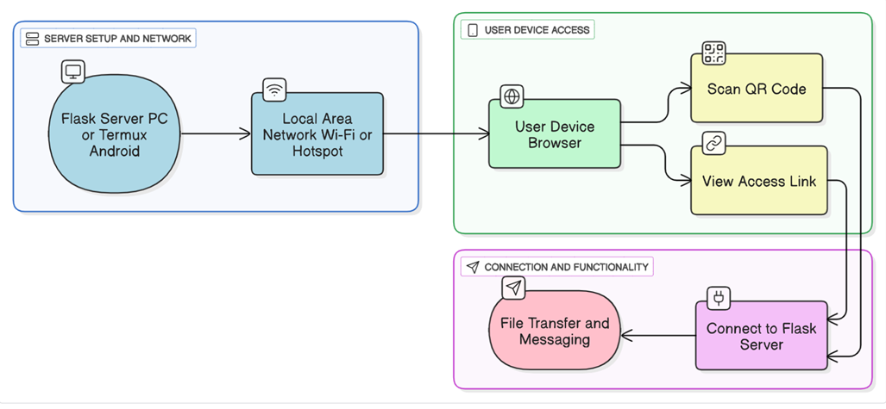

# SDM **Experiment No: 05**

## **Aim**

To develop a Timeline Chart, Gantt Chart, and PERT Chart for tracking the progress of project modules.

***

## **Theory**

### **Progress Tracking**

In any project, especially those with multiple modules and interdependent tasks, effective tracking of progress is essential to ensure timely completion and efficient use of resources.

Visual scheduling tools like **Timeline Charts**, **Gantt Charts**, and **PERT Charts** are powerful aids in project management. They help in breaking down the project into manageable activities, assigning durations, identifying dependencies, and providing a clear visual representation of the overall workflow.

These charts not only guide the **planning stage** but also act as **monitoring tools** during execution, allowing managers to compare actual progress with planned schedules, detect delays early, and take corrective actions.

***

## **Timeline & Gantt Chart**
 
 
The **Timeline and Gantt Chart** for the **LANVAN** project (as shown in the provided image) together give both a high-level and detailed view of the development schedule from **06-07-25** to **01-11-25**.

The **Timeline aspect** presents each phase — from **Phase 1: Core Setup** to **Phase 4: Finalization & Submission** — in sequential order along a horizontal time axis. This shows the start and end dates of every module, highlighting overlaps and the overall chronological flow.

The **Gantt Chart aspect** adds structure by listing all modules vertically and plotting their durations as horizontal bars against the calendar. It clearly visualizes task overlaps, phase boundaries, and milestones, with color coding (green, yellow, red) to differentiate phases and status. For example, backend optimizations in Phase 1 run in parallel with Android automation, while Phase 2’s security features overlap with UI fixes and bug resolution.

-   **Purpose:** Together, the Timeline and Gantt Chart provide a comprehensive schedule view — the Timeline gives a quick chronological snapshot, while the Gantt offers a detailed, task-level breakdown for progress tracking, resource allocation, and deadline monitoring.

***
     
     
### **3. PERT Chart**
 
The **Program Evaluation and Review Technique (PERT)** is a network-based diagram showing the sequence, dependencies, and estimated completion times of project tasks. It focuses on identifying the **critical path** — the sequence of dependent tasks that determines the minimum time needed for project completion.

-   **Features:**
    
    -   Uses nodes (events/tasks) and arrows (dependencies).
        
    -   Can use three-time estimates: _optimistic_, _pessimistic_, and _most likely_.
        
    -   Highlights bottlenecks in advance.
        

## **Conclusion**

Hence, we develop a Timeline Chart, Gantt Chart, and PERT Chart for tracking the progress of project modules