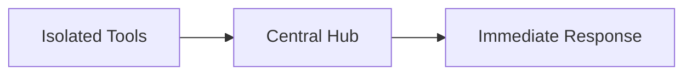
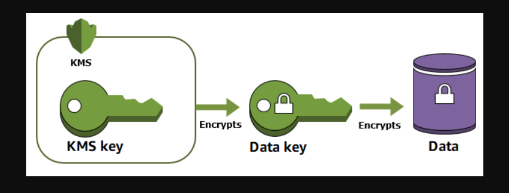
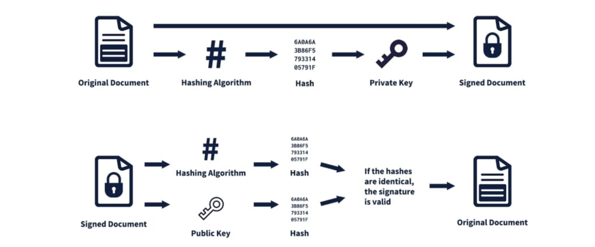
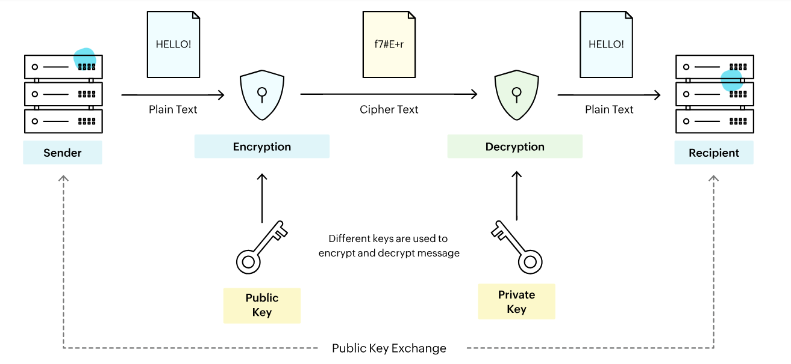
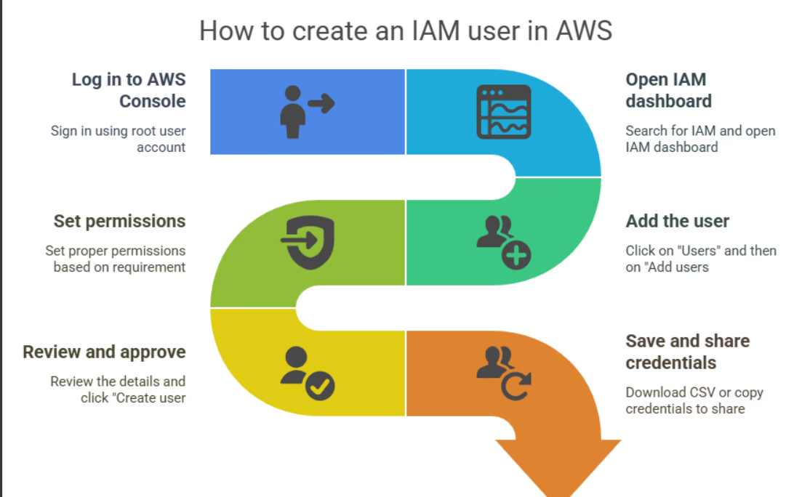
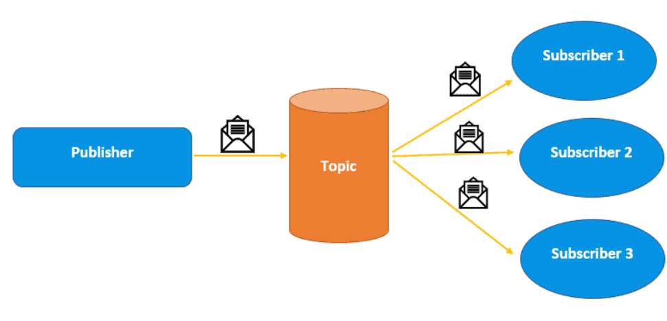
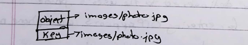
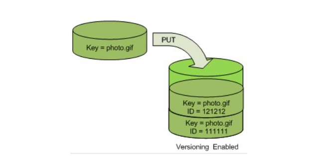
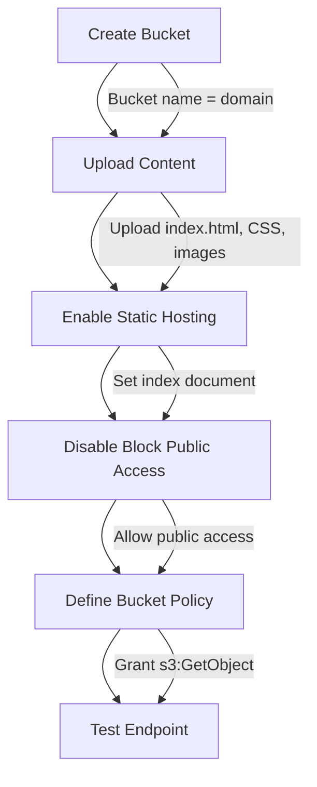

## Chapter 3-4
-   [x] 1
    

### Describe in brief IAM Identities – 4 Marks

**IAM (Identity and Access Management) Identities** are the **people or services** that are given permission to use resources in the cloud. They answer the question: **"Who or what is asking for access?"**

> [!hint] Main Types of IAM Identities
> 
> 1.  **Users:** A single **person** who needs long-term, fixed access to the cloud.
>     
> 2.  **Groups:** A collection of Users. Permissions are applied to the Group, making it easy to manage permissions for **many users at once**.
>     
> 3.  **Roles:** An identity that provides **temporary permissions** when assumed by a service (like an application) or a User.
>     

> [!abstract] Single Line Example
> 
> A **User** (Alice) in a **Group** (Developers) can temporarily assume an **IAM Role** to read the database.

***
```
-   [ ] 2
    

### Explain the term Security Hub Integration – 4 Marks

**Security Hub Integration** means connecting all your security tools (like vulnerability scanners and firewalls) to one central place (the Hub) to manage and respond to all security alerts.

> [!hint] Integrated Security Pipeline
> 
> 1.  **Unified Gathering:** The system collects security findings from many different sources (GuardDuty, Inspector, third-party tools) and pushes them into the central **Security Hub**.
>     
> 2.  **Single View:** The Hub acts as the **main control center**, combining all these scattered alerts into a **single, organized list**.
>     
> 3.  **Automated Action:** This centralized view immediately triggers automated processes (like running code or updating a security system/SIEM).
>     
> 
**Example:** If a vulnerability scanner detects a serious issue on a server, the Hub sees that alert instantly and automatically runs code to **isolate the server** or **block the affected user**.



***


-   [x] 3
    

### Explain Datadog service along with its features – 4 Marks
**Datadog** is a single platform for **monitoring cloud applications**. It combines all performance data (**metrics, logs, and traces**) into one dashboard to help teams quickly find and fix software problems.

> [!abstract] Key Features
> 
> 1.  **Infrastructure:** Tracks the health and performance of all servers and cloud services.
>     
> 2.  **APM (Code Tracing):** Measures how fast your application code runs and helps find performance bottlenecks.
>     
> 3.  **Log Management:** Collects, analyzes, and searches all system logs in real-time.
>     
> 4.  **Alerting:** Provides intelligent alerts and custom dashboards to quickly notify teams of problems.
>     

> [!check] Simple Example
> 
>If sales drop, **Metrics** show a high CPU alert. Datadog instantly links this alert with **Traces** and **Logs** to find the root cause (like a database error) instead of just checking the slow server.

***

```
-   [ ] 4
    

### Explain CloudTrail service along with its features – 4 Marks

**CloudTrail** is an essential **security and audit service**. It acts as the "flight recorder" for your cloud, continuously recording **all actions and API calls** to show exactly **who** did **what** and **when**.
> [!abstract] Key Features
> 1.  **Event History:** Shows a searchable, chronological list of **recent actions** (e.g., user login, server launch).
>     
> 2.  **Trails:** Captures and delivers all event logs to secure storage for **long-term audit** and analysis.
>     
> 3.  **Log File Integrity:** Guarantees that the log files have **not been tampered with** after they were delivered.
>
>     

> [!check] Simple Example
> 
> If a critical database is suddenly deleted, CloudTrail immediately shows **which user** logged in, **when** they logged in, and **which API call** they executed to perform the deletion, allowing for instant accountability.
```
***

- [x] 5
### Explain CloudWatch service along with its features – 4 Marks

**CloudWatch** is the main service that **watches your cloud** to track performance and health. It takes all the raw data and turns it into readable **metrics** and **logs** to ensure your operations run efficiently.

> [!abstract] Key Features
>
> 1.  **Metrics:** Tracks resource performance data (like CPU usage).
> 2.  **Logs:** Centralizes system and application records for real-time troubleshooting.
> 3.  **Alarms:** Automatically alerts you when a metric hits a bad level.
> 4.  **Events:** Triggers automated actions (like running code) based on resource changes.

> [!check] Simple Example
>
> You set a CloudWatch **Alarm** on your server's **CPU Metric**. If the CPU hits $80\%$ for five minutes, the Alarm automatically triggers a scaling action to **launch a second server**.

***

-   [ ] 6
    

### Explain CloudZero service along with its features – 4 Marks

**CloudZero** is a cloud cost intelligence platform that maps your total cloud spending directly back to **specific features, teams, or code**, enabling engineers to optimize their usage.

> [!abstract] Key Features
> 
> 1.  **Cost Allocation:** Maps specific cloud spend directly to the responsible team or feature.
>     
> 2.  **Anomaly Detection:** Instantly alerts teams to sudden, unexpected cost spikes.
>     
> 3.  **Cost Per Unit:** Tracks spending per business metric (e.g., cost per customer).
>     
> 4.  **Proactive Budgeting:** Sets real-time budgets and alerts teams before they overspend.
>     

> [!check] Simple Example
> 
> The platform instantly changes the cloud bill from a general alert like "High Server Costs" to: "The **Image Upload Feature** caused a **$5,000 spike** this week."

***

-   [ ] 7
    
```
### Describe in brief KMS and its advantages – 4 Marks

**KMS (Key Management Service)** is a managed cloud service that allows you to easily **create and control the encryption keys** used to secure your data. It provides a central point to manage these keys, which are protected by highly secure hardware.


> [!abstract] Key Advantages
> 
> 1.  **Central Control:** Provides one single place to manage all key permissions and security across your cloud.
>     
> 2.  **Full Auditing:** Automatically records exactly who used which encryption key and when they used it.
>

> [!check] Simple Example
>  
> When you encrypt a file in cloud storage, KMS provides the key to lock the file and ensures only your account, through KMS permissions, has the power to unlock it.
Understood completely. Thank you for clarifying that rule one last time.

***
- [ ] 8  

### Define the terms:   6 Marks  
1) Encryption  
2) Hashing  
3) SSO  
4) IAM

#### 1) Encryption (1.5 Marks)

> [!hint] Definition (1 Mark)
> 
> Encryption is the process of converting readable data (plaintext) into an unreadable, scrambled form (ciphertext) using a secret key. This secures data by making it inaccessible to unauthorized users.

> [!check] Simple Example (0.5 Marks)
> 
> Locking a private email message with a digital key before sending it over the internet.

#### 2) Hashing (1.5 Marks)

> [!hint] Definition (1 Mark)
> 
> Hashing is a process that converts data of any size into a fixed-size, unique string of characters (a hash value). Hashing is always a one-way process used to verify data integrity.

> [!check] Simple Example (0.5 Marks)
> 
> Turning a 10-page document into a unique, 64-character fingerprint to verify it hasn't been tampered with.

#### 3) SSO (Single Sign-On) (1.5 Marks)

> [!hint] Definition (1 Mark)
> 
> SSO (Single Sign-On) is an authentication mechanism that allows a user to log in once with a single set of credentials and then securely access multiple independent applications without needing to log in again.

> [!check] Simple Example (0.5 Marks)
> 
> Logging into your company's network once and automatically getting access to all cloud applications (e.g., Slack or Confluence).

#### 4) IAM (Identity and Access Management) (1.5 Marks)

> [!hint] Definition (1 Mark)
> 
> IAM (Identity and Access Management) is a framework that manages digital identities and controls who (Users, Groups, or Roles) is authorized to perform what actions on which cloud resources.

> [!check] Simple Example (0.5 Marks)
> 
> Granting the 'Developer' role permission to launch new servers but strictly prohibiting them from deleting any databases.
```
***

- [x] 9  
### Explain the working of Digital Signature – 6 Marks  
A **Digital Signature** verifies the **authenticity** and **integrity** of a document, acting like a digital replacement for a handwritten signature.

> [!hint] Purpose (Authentication and Integrity)
> 
> Digital Signatures use a pair of keys (**Private Key** for signing, **Public Key** for verifying) and **Hashing** to guarantee **non-repudiation**—meaning the sender can't deny they sent the message.
 

> [!abstract] Creation Process (Sender)
> 
> The sender creates the signature in three simple steps:
> 
> 1.  **Hashing:** The original document is run through a Hashing Algorithm to create a unique **Hash** (a digital "fingerprint").
>     
> 2.  **Signing:** The sender uses their secret **Private Key** to **encrypt this Hash**. This encrypted Hash is the Digital Signature.
>     
> 3.  **Sending:** The sender attaches the signature to the original document and sends it.
>     

> [!hint] Verification Process (Receiver)
> 
> The receiver verifies the signature in a comparison process:
> 
> 1.  **Hash A (Unlock):** The receiver uses the sender's open **Public Key** to **decrypt** the Digital Signature, recovering the sender's original **Hash (Hash A)**.
>     
> 2.  **Hash B (Generate):** The receiver independently runs the **received document** through the **same Hashing Algorithm** to create a fresh Hash (Hash B).
>     
> 3.  **Validation:** If **Hash A matches Hash B**, the signature is valid, proving the document hasn't been changed and came from the authentic sender.
>     

***

-   [ ] 10
    
```
### Explain the working of PKI – 6 Marks

**Public Key Infrastructure (PKI)**  main goal is to securely bind a **Public Key** to a known **identity** (like a person or a server) using digital certificate.

> [!hint] The Working: Secure Communication (1-2 Marks)
> 
> PKI enables the secure exchange of information using Asymmetric Cryptography:
> 
> 1.  **Encryption:** The Sender uses the Recipient's public **Key** (from the certificate) to scramble the message into unreadable Cipher Text.
>     
> 2.  **Decryption:** Only the Recipient's secret **Private Key** can unscramble the message back into Plain Text.
>     
> 
> **PKI is the system that ensures these keys are trusted and valid.**

 

> [!abstract] Key Components (Organizational Info)
> 
> 1.  **Certificate Authority (CA):** The trusted entity that **issues, signs, and manages** all digital certificates.
>     
> 2.  **Registration Authority (RA):** **Verifies the identity** of the user requesting a certificate.
>     
> 3.  **End-Entity:** The actual **users or servers** that utilize the certificates for secure access.
>     
> 4.  **Certificate Revocation List (CRL):** A public list of certificates that have been **compromised or made invalid**.
>
***
```
-   [x] 11
    

### Explain in brief Serverless functions in AWS (Any 1) – 4/6 Marks

The primary serverless function service in AWS is **AWS Lambda**.

**AWS Lambda** is a cloud service that lets you run your code **without managing any servers**. Your code only runs when it's needed and automatically scales to handle any amount of demand.

> [!abstract] Working and Key Features (write any 2 for 4 marks)
> 
> 1.  **Event-Driven:** Your code only runs when a **specific event** (like a file upload or database change) instantly triggers it.
>     
> 2.  **Auto-Scaling:** The service handles all scaling automatically, instantly running your code on as many instances as necessary, with **zero configuration** required from you.
>     
> 3.  **No Server Management:** AWS manages all server maintenance, patching, and capacity planning for you.
>     

     

> [!check] Simple Example
> 
> You upload a large video file to cloud storage (the **event**). Lambda automatically runs a function to resize the video thumbnail and save it, completing the task within seconds without needing a dedicated server running 24/7.

> [!abstract] Key Benefits (write this if 6 marks)
> 
> 1.  **Cost Efficiency:** You pay **only** for the time your code is actively running (down to the millisecond), making it very cheap for workloads that run infrequently.
>     
> 2.  **Faster Development:** Developers focus solely on writing application logic instead of spending time setting up or maintaining infrastructure.
>
***
-   [x] 12
    

### Enlist any 4 benefits of IAM user. Write down steps to create an IAM user in AWS – 6 Marks

IAM (Identity and Access Management) Users represent the human identity accessing the AWS environment, providing a secure and accountable method for managing access.


> [!abstract] 4 Benefits of Using IAM Users
> 
> 1.  **Auditing:** All user actions are logged (via CloudTrail), ensuring **full accountability**.
>     
> 2.  **Least Privilege:** Users get **only the permissions they absolutely need** for their job (minimal access).
>     
> 3.  **Granular Control:** Allows for **highly specific rules**  (e.g., User Alice can only read files from Folder A, but not delete them).
>     
> 4.  **Unique Credentials:** Stops the dangerous practice of sharing passwords, making security **much safer**.
>
 
   
> [!example] Example
> When a **new developer** is onboarded, the **IAM Creation Steps** are followed to give them access keys. By setting the permissions to the **'ReadOnly' group** in Step 4, they can view files but are physically prevented from accidentally deleting anything crucial.

***
-   [ ] 13
    

### Differentiate between Dockerfile and Docker-Compose.yml with suitable example – 4/6 Marks

**Dockerfile** and **Docker-Compose.yml** are both crucial files, but one is used to build a single component, while the other is used to run the entire system.

| Feature | Dockerfile | Docker-Compose.yml |
| --- | --- | --- |
| **1. Primary Goal** | To **build ONE single container image** (the blueprint). | To **define and run MULTIPLE container services** (the whole application). |
| **2. Scope / Focus** | Deals with what's **INSIDE** a container (software, files, commands). | Deals with how containers **CONNECT** to each other (networks, volumes, dependencies). |
| **3. Command Used** | `docker build` (Creates the static image). | `docker compose up` (Runs the dynamic system). |
| **4. Dependencies** | Manages dependencies **inside** the image (e.g., install Python). | Manages dependencies **between** containers (e.g., web app relies on database). |

> [!check] Example (E-commerce Scenario)
> 
> **Dockerfile** is the **recipe** used to **build the individual Web Store image** and the **Database image**. 
>
>**Docker-Compose.yml** is the **launch system** that defines the network and starts both images together so the entire E-commerce site runs as one single application.


***

-   [ ] 14
    

### Write down the procedure of creating a public subnet in user defined VPC with attachment of security group, routing table and gateway – 6/8 Marks

> [!attention] i am not sure about this one
> skipping this one

> [!abstract] Part 1: Subnet Creation and Internet Door
> 
> 1.  **Create Subnet:** Go to the VPC dashboard and create a new Subnet. Define its **IP address range** (CIDR block) and choose an **Availability Zone**.
>     
> 2.  **Create Internet Gateway (IGW):** Create the IGW (this acts as the main door for the internet) and **attach it to your VPC**.
>     
> 3.  **Enable Public IP:** Edit the Subnet's settings to **automatically assign a public IP** to any resource launched inside it. (This is critical for being truly public).
>     

> [!abstract] Part 2: Routing and Security Configuration
> 
> 4.  **Create Route Table:** Create a new Route Table (e.g., `Public-RT`).
>     
> 5.  **Add Internet Route:** Edit this new Route Table's settings to tell it: **"Send all public traffic (`0.0.0.0/0`) to the Internet Gateway (IGW)."**
>     
> 6.  **Associate Subnet:** Explicitly link your new Subnet to this `Public-RT` to activate the internet access.
>     
> 7.  **Security Group:** Create a **Security Group** (virtual firewall) with rules to allow public traffic (e.g., port 80/443), and attach it directly to the resources (like your EC2 instance) launched in this new subnet.
>     

***

-   [x] 15
    

### State and explain the commands for the following Docker operations – 6 Marks


> [!abstract] (i) Building an Image (3 Marks)
> 
> **Command:** `docker build`
> 
> **Purpose:** This command reads the instructions from a **Dockerfile** to create a new, reusable Docker image.
> 
> **Syntax:**
> 
> ```
> docker build -t <image-name>:<tag> <path-to-dockerfile>
> ```
> 
> **Explanation:** The `-t` flag tags the image with a name and version (e.g., `my-app:v1`), and the final argument (`.`) specifies the build context (usually the current directory where the Dockerfile resides).
> 
> **Example:** `docker build -t my-app:latest .`

> [!abstract] (ii) Getting Status of Up and Down Containers (3 Marks)
> 
> **Command:** `docker ps`
> 
> **Purpose:** This command lists the status of running containers. It is primarily used for monitoring operational containers.
> 
> **Syntax:**
> 
> ```
> docker ps -a
> ```
> 
> **Explanation:**
> 
> -   **`docker ps`** by itself only shows containers that are currently **running (Up)**.
>     
> -   The **`-a` (all)** flag is essential, as it lists **all containers**—those that are currently **running (Up)**, those that have **exited (Down)**, and those that are paused.
>     
> 
> **Example:** Running `docker ps -a` will show containers with Status: Up, Exited, or Paused.

***
-   [x] 16
    

### Describe the working of AWS SimpleDB service with any 3 characteristics in brief – 4 Marks

**Amazon SimpleDB** is an easy **NoSQL database** where AWS handles all the difficult database administration work. It stores your data in flexible **Items** (rows) inside **Domains** (tables).

> [!abstract] 3 Key Characteristics
> 
> 1.  **Zero Maintenance:** AWS automatically manages all server maintenance, indexing, and infrastructure tasks for you.
>     
> 2.  **Always Available:** Creates multiple copies of your data across different locations for maximum reliability and uptime.
>     
> 3.  **Schema-Free:** You can easily add new data fields (attributes) to any item whenever you want without planning ahead.
>     

> [!check] Simple Example
> 
> If you query a `Product_Catalog` for items where the attribute **'Color' = 'Red'**, SimpleDB instantly returns the result because all attributes are automatically indexed.

***


- [x] 17
### Describe the following terms in brief with suitable examples – 6/8 Marks

(i) Image  
(ii) Container  
(iii) Dockerfile  
(iv) Docker-Compose.yml  

#### (i) Image (2 Marks)

> [!hint] Definition (1 Mark)
> An **Image** is a lightweight, executable software package that includes everything needed to run an application (code, runtime, libraries, and settings). It is a **static blueprint**.

> [!check] Command Usage (1 Mark)
> **Command:** The `docker run <image-name>` command is used to turn the static Image into a live **Container**.

#### (ii) Container (2 Marks)

> [!hint] Definition (1 Mark)
> A **Container** is a live, isolated, and running instance of a Docker Image. It runs the application securely and reliably across different computing environments.

> [!check] Command Usage (1 Mark)
> **Command:** The `docker ps` command shows the status (Up, Exited) of all running and stopped **Containers**.

#### (iii) Dockerfile (2 Marks)

> [!hint] Definition (1 Mark)
> A **Dockerfile** is a simple text file containing the sequential commands needed to automatically **build a new Docker Image**.

> [!check] Command Usage (1 Mark)
> **Command:** The `docker build -t my-app:latest .` command is used to process the **Dockerfile** and create the image blueprint.

#### (iv) Docker-Compose.yml (2 Marks)

> [!hint] Definition (1 Mark)
> A **Docker-Compose.yml** file is a configuration file used to define and run **multi-container Docker applications**, orchestrating how separate services connect and interact.

> [!check] Command Usage (1 Mark)
> **Command:** The `docker compose up` command reads the **Docker-Compose.yml** file to launch the entire multi-container system (e.g., web app + database).

***
-   [x] 18
    

### Describe FaaS in brief with its design principles – 4 Marks

**FaaS (Function as a Service)** is a **serverless compute model** where code runs automatically only when triggered by an **event**, with the cloud vendor managing all infrastructure.

> [!abstract] Design Principles
> 
> 1.  **Stateless:** Functions are **temporary** and cannot save data for the next time they run.
>     
> 2.  **Event-Driven:** Code **only runs** when a specific trigger (like a file upload or HTTP request) instantly starts it.
>     
> 3.  **Auto-Scaling:** The vendor instantly handles all **scaling** from zero to thousands of instances automatically.
>     
> 4.  **Micro-Billing:** You pay **only for the exact time** your code is active, measured down to the millisecond.
>     

> [!check] Simple Example
> 
> A user uploads a profile picture (**Event**). The FaaS function starts, resizes the image, saves the result, and then immediately shuts down, with the user paying only for the few milliseconds of processing time.

***
```
-   [ ] 19
    

### Define the term Containerization and describe any 2 benefits of it in brief – 4 Marks

**Containerization** is a virtualization technology that bundles an application and all its necessary dependencies (libraries, settings, runtime) into a single, isolated, executable package called a **container**.
> [!abstract] 2 Key Benefits
> 
> 1.  **Portability (Run Anywhere):** The application runs **exactly the same way everywhere** (laptop, server, cloud) because the container packages everything it needs.
>     
> 2.  **Efficiency and Speed:** They are very **lightweight** and **start instantly** (seconds), using much less overhead than a traditional virtual machine (VM).
>     

> [!check] Simple Example
> 
> It eliminates the problem of "it works on my machine!" because the **code runs identically** in development, testing, and production environments.
***

-   [ ] 20
    

### Describe AWS RDS along with its components – 4 Marks

**AWS RDS (Relational Database Service)** is a managed cloud service that runs relational databases (like MySQL, PostgreSQL) for you. It automatically handles the tough jobs like patching, backups, and scaling, so you don't have to.

> [!abstract] Key Components
> 
> 1.  **DB Instance:** This is the virtual server in the cloud that runs your chosen database engine.
>     
> 2.  **DB Parameter Group:** The main configuration file that sets the specific rules and settings for your database engine (e.g., cache sizes).
>     
> 3.  **DB Subnet Group:** Defines the network locations within your VPC where the database is allowed to run, which is key for failover and high availability.
>     

> [!check] Simple Example
> 
> **RDS is like a rented house for your database:** You choose the size (instance) and set the rules (parameter group), and AWS handles all the maintenance, plumbing, and security patches.

***
-   [ ] 21
    

### Draw & explain the working of Event Driven Architecture with its applications – 4 Marks

**Event-Driven Architecture (EDA)** is a software design pattern where services communicate by publishing and subscribing to **events** (changes in state). This keeps services separate and highly responsive.

> [!abstract] Working and Diagram
> 
> Logical Diagram:
> 
> `Event Producer→Event Bus→Event Consumers`
> 
> 1.  **Event Producer:** A service (e.g., Order Service) **publishes** an event (e.g., "Order Placed").
>     
> 2.  **Event Bus/Broker:** A central channel receives the event and instantly **routes** it to interested services.
>     
> 3.  **Event Consumers:** Multiple services (e.g., Shipping, Billing) **react simultaneously** upon receiving the event.
>     

> [!abstract] Applications and Value
> 
> -   **Primary Application (E-commerce):** When a user submits an order, the Order Service publishes a "New Order" **event**. The Billing Service, Inventory Service, and Shipping Service **all react at the same time** without waiting for each other.
>     
> -   **Value:** This parallel processing is essential for **Real-Time Analytics** and highly scalable systems.
>     
```
***


-   [x] 22
    

### Explain the working of Simple Notification Service (SNS). Enlist the steps of creating an email or SMS notification service – 6 Marks

**Simple Notification Service (SNS)** is a fully managed, highly available **publish/subscribe (Pub/Sub) messaging service**. It works by using a central channel, called a **Topic**, to instantly send messages to a large number of subscribers (endpoints) simultaneously.
 
> [!abstract] Working Mechanism (Pub/Sub and Fan-out)
> 
> 1.  **Topic:** A Topic acts as a communication channel that decouples the sender (Publisher) from the receivers (Subscribers).
>     
> 2.  **Publisher:** A system (application or event) sends a **single message** to the Topic.
>     
> 3.  **Fan-out:** SNS instantly delivers that message to **all confirmed Subscribers** simultaneously (Subscriber 1, Subscriber 2, etc.), as shown in the diagram.
>     

> [!abstract] Steps to Create an Email or SMS Notification Service
> 
> 1.  **Create Topic:** Navigate to the SNS console and **Create topic**. Give it a name (e.g., `Alert_Topic`).
>     
> 2.  **Create Subscription:** Select the new Topic and click **Create subscription**.
>     
> 3.  **Select Protocol:** Choose the **Protocol**—select **Email** (for email alerts) or **SMS** (for text message alerts).
>     
> 4.  **Define Endpoint:** Enter the **Endpoint** (the exact email address or phone number) that will receive the notification.
>     
> 5.  **Confirmation (Email Only):** For email, the recipient must click a confirmation link sent to their inbox before the subscription becomes active.
>     
> 6.  **Test:** The publisher sends a test message to the Topic to verify that SNS delivers the message to the confirmed endpoint.
>     

****

- [ ] 23  
### Briefly describe the following building blocks of VPC with their significance – 8 Marks  
i. VPC CIDR block  
ii. Subnet  
iii. Security Group  
iv. Routing Table  
v. Gateway  


#### i. VPC CIDR Block (1.6 Marks)

> [!hint] Description
> 
> The **VPC CIDR block** is the primary private IP address range (e.g., `10.0.0.0/16`) that defines your entire VPC network.
> 
> **Significance:** It sets the **boundaries and maximum size** of your virtual network, determining the total number of IP addresses available for all your subnets and resources.

#### ii. Subnet (1.6 Marks)

> [!hint] Description
> 
> A **Subnet** is a smaller division of the main VPC IP range, tied to a single Availability Zone (AZ).
> 
> **Significance:** It is used to **organize and isolate resources** based on security needs (e.g., putting public web servers in one subnet and highly private databases in another).

#### iii. Security Group (SG) (1.6 Marks)

> [!hint] Description
> 
> A **Security Group** acts as a virtual, stateful firewall that controls traffic directly to a single resource (like an EC2 instance).
> 
> **Significance:** It is the primary layer of security, acting as a **bouncer** to specifically control all incoming (ingress) and outgoing (egress) traffic, ensuring only necessary communication is allowed.

#### iv. Routing Table (1.6 Marks)

> [!hint] Description
> 
> A **Routing Table** contains a set of rules that act as the **GPS or map** for your network traffic.
> 
> **Significance:** It determines the path traffic must take. For a Public Subnet, the table must explicitly tell the data to leave the VPC and go to the Internet Gateway.

#### v. Gateway (1.6 Marks)

> [!hint] Description
> 
> A **Gateway** is a network component that serves as the **door or bridge** connecting your VPC to the outside world. The most common type is the Internet Gateway (IGW).
> 
> **Significance:** The **Internet Gateway (IGW)** is essential for a Public Subnet, as it is the only component that enables resources to communicate directly with the public internet.

***


- [ ] 24  
### `One problem statement on VPC i.e. creation of private/public subnet with attachment of security group, subnet, routing table, gateway (Experiment No.3)` – 6 Marks  

***

-   [x] 25
    

### State the importance of AWS Lambda Service. Write a Python Lambda function to perform arithmetic operations (+, -, * & /) and enlist the steps to execute the same – 8 Marks

AWS Lambda llows developers to run code without managing servers.

> [!abstract] Importance of AWS Lambda (2 Marks)
> 
> 1.  **No Server Management:** AWS fully manages all servers, patching, and security, letting developers focus only on writing code.
>     
> 2.  **Pay Per Use:** You pay **only** for the milliseconds your code runs, which makes the service highly cost-effective.
>     


***


```Python
import json

# Define operations as lambdas
ops = {
    '+': lambda x, y: x + y,
    '-': lambda x, y: x - y,
    '*': lambda x, y: x * y,
    '/': lambda x, y: x / y if y != 0 else "Error"
}

def lambda_handler(event, context):
    n1 = event['num1']
    n2 = event['num2']
    op = event['operation']

    # Compute result using dictionary of lambdas
    result = ops.get(op, lambda x, y: "Invalid")(n1, n2)

    return {
        'statusCode': 200,
        'body': json.dumps({'result': result})
    }

```
***

> [!abstract] Steps to Execute the Function (Deployment Workflow) (3 Marks)
> 
> 1.  **Create and Deploy:** Navigate to the Lambda Console, click **Create function** (Runtime: Python 3.x), paste the code, and click **Deploy**.
>     
> 2.  **Configure Test Event:** Select **Configure new test event** and create a JSON test payload matching the function's required input (e.g., `{"operation": "+", "num1": 10, "num2": 5}`).
>     
> 3.  **Run Test:** Save the test event and click the **Test** button. Lambda will execute the code and display the final output.
>     

***

***

- [ ] 26  
### Write entire procedure to create an API for generating random password/OTP using AWS API Gateway with AWS Lambda Service – 6 Marks  
### skipping to maintain sanity
***

## S3 stuffs 
- [x] 1  
### Write S3 commands to perform the following operations – 6 Marks  
(i) Creating a bucket  
(ii) Deleting a bucket  
(iii) Copying a bucket  
(iv) Syncing a bucket  


| Operation | AWS CLI Command (Syntax) | Example (Specific Usage) | Purpose |
| --- | --- | --- | --- |
| **(i) Creating a bucket** | `aws s3 mb s3://<bucket-name>` | `aws s3 mb s3://my-new-project-data` | Creates a new, globally unique S3 bucket in your specified AWS region. **(mb = make bucket)** |
| **(ii) Deleting a bucket** | `aws s3 rb s3://<bucket-name>` | `aws s3 rb s3://my-old-project-data` | Deletes an existing S3 bucket. **NOTE:** The bucket must be empty before it can be deleted. **(rb = remove bucket)** |
| **(iii) Copying a file/object** | `aws s3 cp <source> <destination>` | `aws s3 cp s3://src-bucket/img.jpg s3://dest-bucket/img.jpg` | Copies a single file or object from a source location to a destination (local or S3). |
| **(iv) Syncing a directory/bucket** | `aws s3 sync <source-path> <destination-path>` | `aws s3 sync ./local-files s3://my-backup-bucket` | Synchronizes the contents of a local directory with an S3 bucket (or vice versa), copying only new or modified files. |

***


- [x] 3  
### Explain the working of the following S3 blocks with suitable examples & diagrams – 4 Marks  
(i) Object & Key  
(ii) Bucket  
(iii) Versioning  
the foundation of how Amazon S3 stores and manages data.

> [!abstract] (i & ii) Object & Key, and Bucket
>
> 1.  **Bucket:** This is the **top-level container** for data. It must have a globally unique name and is associated with a specific AWS region.
>     
> 2.  **Object:** The **data entity** that is stored in S3. This is the actual file (e.g., an image, video, document, or backup).
>       
> 3.  **Key:** The **unique identifier or name** for the Object within a Bucket. The Key includes the full path to the object.
>     
> 
> **Example:** If you upload a file named `photo.jpg` to a bucket named `my-photos-2025`, the **Bucket** is `my-photos-2025` and the **Key** is `photo.jpg`.

> [!abstract] (iii) Versioning
> 
> **Definition:** Versioning is a feature that keeps **multiple versions** of an Object in the same Bucket, even when the Object is modified or deleted.
> 
> **Significance:** It acts as a safety net, allowing you to easily **recover previous states** of a file or restore a deleted file, protecting against unintended changes or deletions.
>  
> **Diagram Concept:** S3 stores the original file, and each subsequent overwrite creates a new version with a unique **Version ID**, rather than replacing the original.

***
```

-   [ ] 4
    

### Enlist and describe any 2 storage classes of S3 – 4 Marks


> [!abstract] 1. S3 Standard
> 
> **Purpose:** This is the default storage class, designed for **frequently accessed data** that requires fast, millisecond access time and high availability.
> 
> -   **Best For:** Content delivery, cloud applications, dynamic websites, and data used for general computing needs.
>     
> -   **Cost Structure:** Higher storage cost per GB, but very low cost for retrieval (reading) of data.
>     

> [!abstract] 2. S3 Standard - Infrequent Access (IA)
> 
> **Purpose:** Designed for **long-lived data** that is accessed **less frequently**, but still requires fast retrieval when needed.
> 
> -   **Best For:** Backups, disaster recovery files, and older log data that must be instantly available if an event occurs.
>     
> -   **Cost Structure:** Lower storage cost per GB than S3 Standard, but you pay a higher retrieval fee (charge for reading) each time you access the data.
>     

***

-   [ ] 5
    

### Explain Simple Storage Service (S3) along with its terminology – 4 Marks

**Simple Storage Service (S3)** is the cloud's highly reliable, massive **object storage service**. It's built to store and retrieve any amount of data (files) from anywhere on the internet.

> [!abstract] Core Terminology
> 
> 1.  **Bucket:** The **main folder or container** that holds your data. It must have a globally unique name.
>     
> 2.  **Object:** The **actual file** (e.g., image, document, backup) that you store in S3.
>     
> 3.  **Key:** The **unique name or path** used to identify and retrieve the Object within its Bucket.
>     

> [!check] Simple Example
> 
> If you save a file named `report.pdf`, the **Bucket** is the folder it lives in, the **Object** is the PDF file, and the **Key** is the unique name used to find it.

***

-   [ ] 6
    

### Explain S3 Versioning in brief – 4 Marks

**S3 Versioning** is a powerful feature that allows you to keep **multiple variants** (versions) of an object in the same S3 bucket, providing robust protection against accidental data loss.

> [!abstract] Core Mechanism and Significance
>   
> 1.  **Safety Net:** Versioning acts as a safety net, allowing you to easily **recover previous states** of a file or restore a deleted file, protecting against unintended changes or deletions.
>     
> 2.  **Immutability:** When an object is overwritten or deleted, S3 does **not** replace the original. Instead, it assigns a unique **Version ID** to the modified file and preserves the previous version.
>     
> 3.  **Storage:** The diagram concept shows that each subsequent overwrite creates a new version with a unique **Version ID**, rather than destroying the data.
>     

***

-   [ ] 7
    

### Write down stepwise procedure for deploying a static website on S3 – 4/6 Marks


```
> [!abstract] Deployment Procedure (6 Steps)
> 
> 1.  **Create Bucket:** Navigate to the S3 Console and **Create a new bucket**. For best practice, name the bucket exactly the same as your domain name (e.g., `my-website.com`).
>     
> 2.  **Upload Content:** Upload all your static website files (e.g., `index.html`, `styles.css`, images) directly to the root of the bucket.
>     
> 3.  **Enable Static Hosting:** Go to the bucket's **Properties** tab, select **Static website hosting**, and choose **Enable**. Specify your main landing page file (e.g., `index.html`) as the **Index document**.
>     
> 4.  **Block Public Access:** Go to the **Permissions** tab and ensure the **Block Public Access** settings are **disabled** for the bucket so that outside users can view the content.
>     
> 5.  **Define Bucket Policy:** Still in the **Permissions** tab, add a **Bucket Policy** to grant public read access to all the objects in your bucket (i.e., allow `s3:GetObject` for the principal `*`).
>     
> 6.  **Test Endpoint:** Navigate back to the **Static website hosting** section in **Properties** and click the provided **Endpoint URL** to verify that your website is publicly accessible.
>     

***
```


## Chapter 5

- [ ] 1  
### State the meaning of “Ubiquitous Cloud Computing” with suitable example – 4 Marks  

***

- [ ] 2  
### Discuss the case study of Cloud with IoT in “Smart Buildings/Smart Homes” – 4 Marks  

***

- [ ] 3  
### Discuss the case study of Cloud with IoT in “Health Care” – 4 Marks  

***

- [ ] 4  
### `Define Pervasive Computing and state its Pervasive Computing devices – 4 Marks  `

***

- [ ] 5  
### `Describe the terms: Energy Aware Cloud Computing, Smart Power Grid and GPS – 4/6 Marks  `

***

- [ ] 6  
### Explain RFID technology with suitable diagram along with merits and demerits – 4/8 Marks  

***

- [ ] 7  
### Explain ZigBee technology with suitable diagram and applications – 4/8 Marks  

***

- [ ] 8  
### `Explain the terms Smart Healthcare / Smart Homes – 4 Marks `

***

- [ ] 9  
### Discuss the case study of Cloud with IoT in “Health Care” – 4 Marks  

***

- [ ] 10  
### Explain the working of Sensor Networks technology with suitable diagram – 6 Marks  

***

- [ ] 11  
### Explain RFID tags and receivers –4/6 Marks  

***

- [ ] 12  
### `Describe the following cloud applications with their technological working compared to traditional systems – 4/6 Marks  `
(i) Smart Healthcare  
(ii) Smart Power Grid  

***

- [ ] 13  
### Design an IoT based cloud application i.e. Home Automation using ZigBee technology and describe the same in brief. Also state its applications – 6 Marks  

***