# MLT PT 2 QB SOLUTION
> [!checklist] notes 
> #p - partially done
> `red` type questions  = sums type so not included in solving


> [!attention] questions which are not solved in here
> **Unanswered Questions EXCLUDING SUMS**
>-   **Chapter 3:** , 22, 23    
>-   **Chapter 4:** 11   
>-   **Chapter 5:** 12 ~ similar to sum and idk

## Chapter 3: Supervised Learning – CO2  

- [x] 20  
### k-Nearest Neighbour (kNN) – Working / ``sums`` – 4/6 Marks  

***


-   [ ] 21
    

### Define Information Gain and Gini Index (with formulas), Pruning – 4 Marks

These are key measures used in **Decision Trees**.

> [!hint] 1. Information Gain (IG)
>
> **Definition:** Information Gain measures the **reduction in uncertainty** (entropy) when splitting data by a feature. We aim to **maximize IG**.
>
> **Formula:**
> $$IG(T, a) = \text{Entropy}(T) - \sum_{v \in \text{Values}(a)} \frac{|T_v|}{|T|} \cdot \text{Entropy}(T_v)$$
>
> **Simple Example:**
> Suppose a node has 4 points: 2 **Yes**, 2 **No**.
>
> * **Entropy before split:**
>     $$\text{Entropy}(T) = -((2/4)\log_2(2/4) + (2/4)\log_2(2/4)) = \mathbf{1}$$
>
> * **Weighted entropy after split (if pure):**
>     * Node 1: 2 Yes $\rightarrow$ Entropy $= 0$
>     * Node 2: 2 No $\rightarrow$ Entropy $= 0$
>     * Weighted Entropy: $$(2/4)\cdot 0 + (2/4)\cdot 0 = \mathbf{0}$$
>
> * **Information Gain:**
>     $$IG = 1 - 0 = \mathbf{1}$$

> [!hint] 2. Gini Index
>
> **Definition:** Gini Index measures the chance of **misclassifying a random point** in a dataset. We aim to **minimize** it.
>
> **Formula:**
> $$\text{Gini}(T) = 1 - \sum_{i=1}^{c} (P_i)^2$$
>
> **Simple Example:**
> A node has 4 points: 3 **Yes**, 1 **No**.
>
> * **Probabilities:** $P(\text{Yes})=0.75$, $P(\text{No})=0.25$
> * **Calculation:**
>     $$\text{Gini} = 1 - (0.75^2 + 0.25^2) = 1 - (0.5625 + 0.0625) = \mathbf{0.375}$$

> [!hint] 3. Pruning
>
> **Definition:** Pruning removes parts of a Decision Tree that **don’t help classify well**.
>
> * **Goal:** Simplify the tree and prevent **overfitting**.
> * **Example:** If a branch splits only 1 or 2 points in the training set and doesn’t improve accuracy much, it can be pruned.

***

> [!check]  Original Decision Tree


***

> [!check]  Pruned Decision Tree


***
> [!check]   Explanation of Pruning

In the **original decision tree**, the root splits on **Feature X**, and then the “Yes” branch further splits on **Feature Y**, giving two extra leaves (Class A and Class B).

When we **prune the tree**, we **remove the small branch** that adds little predictive value (the Feature Y split). This results in:

-   A **simpler tree** with fewer nodes.
    
-   **Leaves represent broader decisions** (keeping only the most important split).
    
-   **Reduced overfitting**, because the tree no longer tries to fit tiny variations in the training data.
    

**In short:** Pruning trims unnecessary branches, making the model simpler and more generalizable.

***


- [ ] 22  
### `Find out Root Node using Gini Index and Information Gain for Classification (ID3 and CART)` – 6/8 Marks  

***

- [ ] 23  
### Support Vector Machines – 4/6 Marks  
### skipped since hard
---

## Chapter 4: Unsupervised Learning – CO3 (Marks: 16)  

- [x] 1  
### Define Clustering. Give Example of Clustering – 4 Marks  

**Clustering** is an **unsupervised learning** technique used to **group data points based on similarity**.


> 
 It is used to discover patterns when the data is **unlabeled** (no target variable). The core idea is:
> 
> 1.  **Similar** data points are put **together** in one cluster.
>     
> 2.  **Dissimilar** data points are kept **separate** in different clusters.
>     

 

In this example, Clustering takes **Raw Data** for example: (a mix of apples, pears, and strawberries) and groups them based on their visual similarities (color, shape).
> [!abstract] Examples of Clustering in Real Life
> 
> -   **Netflix:** Groups movies and users for personalized content **recommendations**.
>  -   **Customer Segmentation:** Groups customers by shopping habits to send **targeted ads**.


***
-   [x] 2
    

### Define Types of Clustering (Hard and Soft) – 4 Marks

Clustering algorithms are categorized into two main types based on membership: **Hard** (exclusive) and **Soft** (probabilistic).

> [!hint] Hard Clustering (Exclusive)
> 
> In hard clustering, a data point belongs **entirely** to exactly **one** cluster. There is no shared membership.
> 
> -   **Principle:** Membership is binary (either **1** or **0**).
>     
> -   **Example:** Each data point is assigned fully to one cluster only.
>     

| Data Point | Cluster |
| --- | --- |
| D1  | C1  |
| D2  | C1  |
| D3  | C2  |
| D4  | C2  |

> [!hint] Soft Clustering (Fuzzy/Probabilistic)
> 
> In soft clustering, a data point can belong to **multiple clusters** simultaneously, each with a **probability** of membership.
> 
> -   **Principle:** The algorithm assigns a **likelihood score** (0 to 1) for every cluster.
>     
> -   **Example:** A point is given a probability for both C1 and C2, showing partial belonging.
>     

| Data Point | Probability of C1 | Probability of C2 |
| --- | --- | --- |
| D1  | 0.91 | 0.09 |
| D2  | 0.30 | 0.70 |
| D3  | 0.83 | 0.17 |
| D4  | 0.15 | 0.85 |


***
-   [x] 3
    

### Explain Types of Clustering Methods – 4 Marks #p

Clustering methods are categorized into different types based on how they define and find groups in the data.

> [!hint] 1. Centroid-based Clustering
> 
> -   **Key Idea:** It partitions data by minimizing the **distance** between data points and the cluster's **center (centroid)**.
>  
> -   **Example:** K-Means algorithm, where every cluster has one clear center point.
>     

> [!hint] 2. Hierarchical Clustering
> 
> -   **Key Idea:** It builds a tree-like hierarchy of clusters based on the **proximity** or **connectivity** of data points to one another.
>      
> -   **Process:** It either starts with all points separate and merges them (bottom-up) or starts with one large cluster and splits it (top-down).
>     

> [!hint] 3. Density-based Clustering
> 
> -   **Key Idea:** It detects clusters as areas where data points are **highly concentrated (dense)**, separated by sparse or empty space.
>       
> -   **Advantage:** It can find clusters of **arbitrary shapes**. (e.g., DBSCAN).
>     

> [!hint] 4. Distribution-based Clustering
> 
> -   **Key Idea:** It assumes that the data points within a cluster follow the same statistical **probability distribution** (like a normal distribution).
>     
> -   **Grouping:** Data points are grouped based on the likelihood of belonging to the same distribution. (e.g., Gaussian Mixture Model - GMM).
>     

***

- [ ] 4
### Formulas on Different Types of Distance Metrics with Example – 4 Marks

Distance metrics are essential for measuring the similarity between two data points ($P_1$) and ($P_2$).

> [!hint] Solved Example 
(Using $P_1=(1, 5)$ and $P_2=(4, 1)$)
>
> 1.  **Euclidean Distance (Straight Line):**
>     $$\mathbf{d} = \sqrt{\sum_{i=1}^{n} (x_{1i} - x_{2i})^2}$$
>     * **Calculation:** $$\mathbf{d} = \sqrt{(4 - 1)^2 + (1 - 5)^2} = \sqrt{3^2 + (-4)^2} = \sqrt{25} = \mathbf{5}$$
>     * **Example:** Measures the **straight-line distance** between two points.
>
> 2.  **Manhattan Distance (City Block):**
>     $$\mathbf{d} = \sum_{i=1}^{n} |x_{1i} - x_{2i}|$$
>     * **Calculation:** $$\mathbf{d} = |4 - 1| + |1 - 5| = 3 + 4 = \mathbf{7}$$
>     * **Example:** Measures distance along axes, like **walking on city streets**.
>
> 3.  **Minkowski Distance (General Form):**
>     $$\mathbf{d} = \left( \sum_{i=1}^{n} |x_{1i} - x_{2i}|^p \right)^{\frac{1}{p}}$$
>     * **Note:** This is the **general formula**. It becomes **Euclidean** when $p=2$ and **Manhattan** when $p=1$.
***


- [ ] 5  
### K-Means Clustering – Process and s`sums` – 4/6/8 Marks  

***

- [ ] 6  
### K-Medoids – `sums`, Advantages and Disadvantages – 4/6/8 Marks  

***
-   [x] 7
    

### Define Hierarchical Clustering – 4 Marks

**Hierarchical Clustering** is a method that builds a **tree-like nested structure** of clusters without needing to specify the number of clusters beforehand.
 
> [!hint] Core Concept
> 
> 1.  **Output:** The result is visualized as a **Dendrogram** (a tree diagram) that shows the entire hierarchy of clusters, from individual points to one single cluster.
>     
> 2.  **Mechanism:** Clusters are defined by being **nested** inside one another, creating a clear relationship between the groups.
>     
> 3.  **Types:** It can be performed in two ways:
>     
>     -   **Agglomerative (Bottom-Up):** Starts with individual points and merges them.
>         
>     -   **Divisive (Top-Down):** Starts with one cluster and splits it apart.
>         


***
-   [x] 8
    

### Explain Dendrogram with Graphical Representation and Example – 4 Marks

A **Dendrogram** is a tree-like diagram that visually shows the entire hierarchy of clusters. It reveals the **exact sequence** of merging or splitting, where the **vertical length** of the lines represents the distance or dissimilarity between the clusters when they are joined.
 
> [!abstract] Example (Progressive Merging)
> ***
> The diagram shows a dendrogram where the merging process starts with every point separate (P, Q, R, S, T, U):
> 
> -   **Process:** The closest pairs, like **P and Q**, are merged first at the lowest level. These groups then merge with other close points or groups at higher levels.
>     
> -   **Outcome:** The entire progressive merging process is shown visually until all points are connected in one final cluster.
>     


***

-   [x] 9
    

### Types of Hierarchical Clustering – 4 Marks

**Hierarchical Clustering** organizes data into a tree-like structure called a **Dendrogram**. It is primarily done in two different ways: Agglomerative (Bottom-Up) or Divisive (Top-Down).

> [!hint] 1. Agglomerative Clustering (Bottom-Up)
> 
> Agglomerative clustering is a **"bottom-up"** approach.
> 
> -   **Start:** Every data point begins as its own individual cluster.
>     
> -   **Process:** The algorithm continually **merges** the two closest clusters step by step until only one final cluster remains.
>     
> -   **Linear Example:** Starts with **individual students** who merge into study groups, which merge into a class, and finally become a whole **school**.
>     

> [!abstract] 2. Divisive Clustering (Top-Down)
> 
> Divisive clustering is a **"top-down"** approach.
> 
> -   **Start:** All data points begin in one single cluster.
>     
> -   **Process:** The algorithm continually **splits** the cluster into smaller sub-clusters until every point is in its own separate cluster.
>     
> -   **Linear Example:** Starts with one **whole school**, which is split into different grades, then split into smaller classes, and finally results in **individual students**.
>     

***

-   [x] 10
    

### Explain Hierarchical Agglomerative Clustering and Hierarchical Divisive Clustering with Suitable Diagram (Workflow) – 4/6 Marks
> [!attention] just to be safe verify this answer 
> Noname this one

**Hierarchical Clustering** organizes data into a **tree-like structure** called a **Dendrogram**. It can be done in two ways: **Agglomerative (Bottom-Up)** or **Divisive (Top-Down)**.

> [!hint] 1. Agglomerative Clustering (Bottom-Up)
> 
> **Definition (1 Mark):** Agglomerative clustering is a **bottom-up method**. Each data point starts as its **own cluster**, and the **closest clusters are merged step by step** until there is one final cluster.
> 
> **Workflow (1 Mark):** Clusters **grow bigger** as you move **up the Dendrogram**, showing each merge.
> 
> **Example (1 Mark):** Imagine starting with 5 people (5 separate clusters). The 2 closest people join, then that new group joins the next closest point, until everyone is in one large group.

***



```mermaid
flowchart TB
    A([👤1])
    B([👤2])
    C([👤3])
    D([👤4])
    E([👤5])

    AB[Cluster AB]
    AB --> A
    AB --> B

    ABC[Cluster ABC]
    ABC --> AB
    ABC --> C

    ABCDE[Cluster ABCDE]
    ABCDE --> ABC
    ABCDE --> D
    ABCDE --> E



```

> [!hint] 2. Divisive Clustering (Top-Down)
> 
> **Definition (1 Mark):** Divisive clustering is a **top-down method**. It starts with **all points in one cluster** and **splits it step by step** into smaller clusters until each point is separate.
> 
> **Workflow (1 Mark):** Clusters **break apart** as you move **down the Dendrogram**, showing each split.
> 
> **Example (1 Mark):** Imagine starting with a whole company (one cluster). You split it into two main departments, then split those departments into smaller teams, continuing until you reach individual employees.

```mermaid
flowchart TB
    ALL[Cluster ABCDE]

    AB[Cluster AB]
    DE[Cluster DE]
    ALL --> AB
    ALL --> DE
    ALL --> C([👤3])

    A([👤1])
    B([👤2])
    AB --> A
    AB --> B

    D([👤4])
    E([👤5])
    DE --> D
    DE --> E



```

***

- [ ] 11  
### Explain DBSCAN with Terminology (Core, Border, Noise Point, Density Edge, Density Connected Points) with Example – 4/6 Marks  
## skipped cause too difficult
***

- [ ] 12  
### `sums` based on Agglomerative Clustering – 4/6/8 Marks  

***

---

## Chapter 5: Ensemble Learning – CO4 (Marks: 10)  

-   [x] 1
    

### Explain Ensemble Learning – 4 Marks

**Ensemble Learning** is a machine learning technique that combines the predictions of **multiple models** (called "weak learners" or "base models") to make a stronger, more reliable prediction.

> [!hint] Core Idea
> 
> The primary goal of ensemble learning is to **reduce errors** and **improve performance**. The idea is that by combining multiple models, each with its own strengths and weaknesses, the ensemble achieves **better results** than any single model alone.
> 
>
>     

```mermaid
flowchart LR
    WL1(["🤖 Weak Learner 1"])
    WL2(["🤖 Weak Learner 2"])
    WL3(["🤖 Weak Learner 3"])
    WL4(["🤖 Weak Learner 4"])
    WL5(["🤖 Weak Learner 5"])
    
    SL([" Strong Learner"])
    
    WL1 --> SL
    WL2 --> SL
    WL3 --> SL
    WL4 --> SL
    WL5 --> SL


```

> [!abstract] Key Techniques and Applications
> 
> 1.  **Techniques:** Common ensemble learning methods include **Bagging**, **Boosting**, and **Stacking**.
>     
> 2.  **Applications:** It can be applied to various tasks, including **classification, regression, and clustering**.
>     

***


-   [x] 2
    

### Explain Bagging – Working, Benefits, Applications with Suitable Diagram – 4/6 Marks
**Bagging** is an **ensemble learning** method that trains **multiple independent models in parallel**. It primarily reduces **variance** (overfitting) by creating diverse data subsets through **Bootstrap Sampling** (sampling with replacement). The final, stable prediction is achieved by **averaging** the results of all these parallel models.
> [!abstract] Working (Parallel Training)
>  
> 1.  **Bootstrap Sampling:** The original training data is sampled **with replacement** to create multiple random subsets (Bootstrap Samples, B1, B2, B3).
>     
> 2.  **Parallel Model Training:** A separate, independent model (M1, M2, M3) is trained on **each** of these bootstrap samples simultaneously.
>     
> 3.  **Aggregation:** The predictions from all individual models are combined (Agg./Vote) to produce the final result:
>     
>     -   **Classification:** Final result is decided by **majority vote**.
>         
>     -   **Regression:** Final result is the **average** of all model predictions.
>         

> [!check] Benefits and Applications (6 Marks Content)


| Feature | Benefit / Application |
| --- | --- |
| **Primary Benefit** | **Reduces Variance** (Overfitting) and stabilizes sensitive models. |
| **Model Stability** | Provides highly **stable and reliable** predictions. |
| **Key Algorithms** | **Random Forest** and Bagged Decision Trees. |
| **Applications** | Improves accuracy and consistency of **high-variance models**. |
***
- [x] 3
### Explain Boosting – Working, Benefits, Applications with Suitable Diagram – 4/6 Marks


**Boosting** is an ensemble method where models are trained **sequentially**. Each new model corrects the errors of the previous one by placing a higher focus (weight) on the difficult, misclassified data points, effectively combining weak learners into one strong learner.

> [!abstract] Working (Sequential Correction)
>
> Boosting trains **sequential models**, where each new model tries to correct the errors made by the previous ones. It focuses on difficult data points, which reduces **bias**.
>  
> -   **Key Idea:** Models focus on the **false predictions** of the prior model to improve accuracy.
>
> -   Example (Sequential Correction):   
>
> 1.  **Model 1** trains on data $[1, 2, 3]$ and incorrectly predicts $3$.
> 2.  **Model 2** focuses on that incorrect point $3$ (using a new subset $[3, 4, 5]$) to learn how to classify it correctly.
> 3.  This continues sequentially for an overall improved final prediction.
>
> 

> [!check] Benefits and Applications (6 Marks Content)
>
| Feature | Benefit / Application |
| --- | --- |
| **Primary Benefit** | **Reduces Bias** (Underfitting) to create complex, accurate models. |
| **Accuracy** | **High Accuracy**, often better than many other algorithms. |
| **Key Algorithms** | **AdaBoost**, **GBM**, and **XGBoost**. |
| **Applications** | **Search Ranking** and **Credit Scoring** (complex predictive problems). |

***

-   [x] 4
    

### Write Short Note on Subbagging – 4 Marks

**Subbagging** (or Subsampled Bagging) is an ensemble technique used to build multiple models efficiently, differing from standard Bagging in its data sampling method.

> [!hint] Core Mechanism
> 
> Subbagging trains multiple models on subsets of the data that are sampled **without replacement**.
> 
> -   **No Duplicates:** This ensures that all samples within each subset are **unique**.
>     
> -   **Smaller Size:** The subsets created are typically **smaller** than the original dataset size (m < N).
>     

> [!abstract] Key Characteristics and Benefits
> 
> 1.  **Lower Bias:** Leads to slightly **lower bias** because subsets use unique data (no duplicates).
>     
> 2.  **Lower Cost:** It is **faster** and uses **less memory** as models train on smaller data subsets.
>
>     


> [!check] Linear Example (Sampling)
> 
> Imagine you have 10 unique data points.
> 
> -   **Standard Bagging:** When creating a subset, you use replacement, so a data point (e.g., Data Point #1) can appear **multiple times** in the subset.
>     
> -   **Subbagging:** When creating a subset, you use sampling **without replacement**, so a data point (e.g., Data Point #1) can appear **only once** in the subset.
>
***

-   [x] 5
    

### Difference between Bagging and Subbagging – 4 Marks

 
-   [ ] 6
    

### Explain Working of Random Forest Algorithm with Advantages and Disadvantages – 6 Marks

**Random Forest** is a powerful, highly accurate **ensemble learning** method that combines multiple Decision Trees to achieve a final result. It is a type of **Bagging** algorithm.

> [!hint] Core Concept
> 
> Random Forest reduces the problem of high **variance** (overfitting) found in single Decision Trees. It does this by introducing **two levels of randomness** when building the trees, ensuring each tree is diverse.

> [!abstract] Working (Two Levels of Randomness)
>  
> 1.  **Data Randomization (Row Sampling):** The algorithm uses **Bootstrap Aggregating (Bagging)** to create multiple random subsets of the training data. Each subset trains one independent **Decision Tree**.
>     
> 2.  **Feature Randomization (Column Sampling):** When building each individual tree, only a **random subset of features** is considered at every split. This adds diversity.
>     
> 3.  **Prediction:** The final prediction is determined by combining the output of all individual trees (as shown in the diagram):
>     
>     -   **Classification:** Final prediction is by **majority vote**.
>         
>     -   **Regression:** Final value is the **average** of all tree predictions.
>         

> [!abstract] Advantages
> 
> 1.  **High Accuracy:** Generally delivers very high accuracy due to the ensemble of models.
>     
> 2.  **Prevents Overfitting:** Effectively reduces **variance** (model sensitivity) better than a single Decision Tree.
>     
> 3.  **Handles Large Data:** Can handle large datasets and missing values quite well.
>     

> [!abstract] Disadvantages
> 
> 1.  **Computational Cost:** Training many trees simultaneously is slower and computationally expensive.
>     
> 2.  **Black Box Model:** It's hard to understand _why_ the model made a certain decision because it combines hundreds of trees, making it impossible to trace the logic.
>

***
```
- [ ] 7  
### `sums` based on Decision Tree Regression – 6/8 Marks  
```
***
-   [ ] 8
    

### Define Cross Validation. Importance of Cross Validation – 4 Marks

**Cross Validation** is a model evaluation technique used to check how well a machine learning model will **generalize** to new, unseen data.

> [!hint] Definition
> 
> Cross Validation works by splitting the dataset into smaller subsets (folds) and then performing multiple rounds of training and testing.
> 
> -   **Goal:** To get a fair, reliable estimate of the model's performance before using it in the real world.
>     
> -   **Check:** It helps detect if a model is **overfitting** to the specific training data it was given.
>     

> [!abstract] Importance of Cross Validation
> 
> 1.  **Reliable Accuracy:** Provides a more accurate and robust estimate of the model's true accuracy than relying on a single train/test split.
>     
> 2.  **Prevents Overfitting:** The primary way to verify that the model has learned the patterns, rather than just memorizing the noise in the training data.
>     

> [!abstract] Short Example (Accuracy Scores)
> 
> -   **Problem:** A single test set gives the model a fantastic 99% accuracy (a "lucky" split).
>     
> -   **Cross Validation:** Running the model on multiple test folds shows the average accuracy is only 70%.
>     
> -   **Conclusion:** This large drop proves the model was **overfitting** to the first test set, highlighting why Cross Validation is essential for reliable results.
>     

***
-   [ ] 9
    

### Explain K-Fold Cross Validation with Example – 4/6 Marks

**K-Fold Cross Validation** is a  technique used to evaluate models by splitting the dataset into several parts to ensure every data point is tested fairly.
 
> [!hint] Definition
> 
> In K-Fold Cross Validation, we split the dataset into **K number of subsets** (known as **folds**). We then perform training on the **K subsets** but leave one subset for the evaluation of the trained model. This method iterates K times, with a different subset reserved for testing each time.
>    
> -   **Example:** If you choose K to be 5, it is called 5-fold cross-validation.
>     


> [!abstract] Purpose (6 Marks Content)
> 
> K-Fold is better than a simple train/test split for these reasons:
> 
> 1.  **Reduces Bias:** Testing the model K times and averaging the results ensures the final accuracy is **not dependent** on one single, random split, providing a reliable performance estimate.
>     
> 2.  **Better Data Use:** Every data point is used in the **test set exactly once**, which maximizes the use of small or limited datasets.
>     
> 3.  **Choosing K:** The choice of K involves a **Bias-Variance trade-off**. A typical choice is **K=10** because it offers a good balance between reliable accuracy and acceptable computation time.
>
>
***

- [ ] 10  
### Explain Leave-One-Out Cross-Validation with Example – 4 Marks  
**Leave-One-Out Cross-Validation (LOOCV)** means the number of test rounds (k) is **equal to the number of data points** (N) in your entire dataset.

> [!hint] Definition (Process)
> 
> LOOCV is the most exhaustive way to test a model. The process is simple:
> 
> 1.  **Test Set Size:** Exactly **one** data point is held out for testing.
>     
> 2.  **Training Set:** The model is trained on the remaining **N−1** data points.
>     
> 3.  **Repetition:** This is repeated until **every single data point** has been tested once.
>     
> 4.  **Final Score:** All the resulting error scores are **averaged**.
>     

> [!abstract] Example (Student Analogy)
> 
> Imagine a class with N students. To fairly evaluate the teacher (model), every student is tested individually in N separate rounds.

| Round   | Training Data                 | Testing Data   |
|---------|-------------------------------|----------------|
| 1       | All students except Student 1 | Student 1      |
| 2       | All students except Student 2 | Student 2      |
| ...     | ...                           | ...            |
| n       | All students except Student n | Student n      |

***
```
-   [ ] 11
    

### Define Variance, Variance Reduction – 4 Marks

**Variance** and **Variance Reduction** are crucial concepts that relate to a machine learning model's **consistency** and sensitivity to the training data.

> [!hint] Variance (Model Sensitivity)
> 
> Variance measures how much a machine learning model's performance and structure would **change** if it were trained on a **different subset** of the training data.
> 
> -   **High Variance:** The model is overly sensitive. It performs well on training data but poorly on new data. This is **Overfitting**.
>     
> -   **Low Variance:** The model is stable and gives similar results regardless of the training data subset.
>

> [!check] Simpler Example (Student Analogy)
> 
> Imagine a student studying for an exam:
> 
> -   **High Variance:** The student **memorizes** only one practice test perfectly. They will fail the real exam if the questions are slightly changed (**Overfitting**).
   
> [!abstract] Variance Reduction
> 
> Variance Reduction is the process of using techniques to make a model less sensitive to the noise in the training data, leading to a more consistent and better performance on unseen data.
> 
> -   **Goal:** To prevent overfitting and improve generalization.
>     
> -   **Key Method:** **Bagging** (Bootstrap Aggregating).
>     

> [!check] Simpler Example (Student Analogy)
> 
> Imagine a student studying for an exam:
> 
> -   **Variance Reduction:** The student studies **many different** practice tests (like **Bagging**) and averages their knowledge. This leads to consistent, good performance on any new, unseen exam.
>     
```
***

- [ ] 12  
### `Find out Root Node using Standard Deviation Reduction for Regression– 4/6 Marks  `   NOT IN EXAM 

***


-   [ ] 13
    

### Examples of Bagging and Boosting – 4 Marks

Bagging and Boosting are two primary techniques in ensemble learning, which combines multiple models to improve overall performance.

> [!abstract] Bagging (Bootstrap Aggregating)
> 
> Bagging focuses on training **many independent models** in parallel using different subsets of the data (created through sampling with replacement). This reduces **variance** and helps prevent **overfitting**.
>  
> -   **Key Idea:** Training Data is used to create multiple **Bootstrap Samples** (B1, B2, B3).
>     
> -   **Process:** Each sample trains a separate **Model** (M1, M2, M3) simultaneously. Their predictions are then combined through **Aggregation/Voting** for the final output.
>     

> [!abstract] Boosting
> 
> Boosting trains **sequential models**, where each new model tries to correct the errors made by the previous ones. It focuses on difficult data points, which reduces **bias**.
> 
> -   **Key Idea:** Models focus on the **false predictions** of the prior model to improve accuracy.
>     
> -   Example (Sequential Correction):
>      
>     1. Model 1 trains on data [1,2,3] and incorrectly predicts 3.
>     
>     2. Model 2 focuses on that incorrect point 3 (using a new subset [3,4,5]) to learn how to classify it correctly.
>     
>     3. This continues sequentially for an overall improved final prediction.
>     

***

-   [ ] 14
    

### Importance of random_state – 4 Marks

The **`random_state`** parameter is crucial in machine learning because it ensures your results are **repeatable** every time you run the code.

> [!hint] Definition (2-3 Marks)
> 
> `random_state` is a fixed number (a seed) used to control the random choices made by an algorithm.
> 
> -   **What it does:** It makes sure that random operations (like splitting data or picking starting points) always happen in the **exact same way**.
>     
> -   **Why it's important:** If you don't set it, your results will change every time you run the program, making it impossible to check or share your work consistently.
>     

> [!abstract] Example (1 Mark)
> 
> Setting `random_state=0` means the data will be split the same way every time.


```Python
# CASE 1: random_state IS set (e.g., to 0)
from sklearn.model_selection import train_test_split
data = [1, 2, 3, 4, 5, 6]

# Output for 'train' and 'test' is ALWAYS the same.
train_set_1, test_set_1 = train_test_split(data, test_size=0.5, random_state=0)

# Example Output (Consistent):
# train_set_1: [4, 6, 1]
# test_set_1:  [2, 3, 5]
```
```python
# CASE 2: random_state IS NOT set
from sklearn.model_selection import train_test_split
data = [1, 2, 3, 4, 5, 6]
# Output for 'train' and 'test' will be DIFFERENT every time the code runs.
train_set_2, test_set_2 = train_test_split(data, test_size=0.5)

# Example Output (Run 1):
# train_set_2: [2, 5, 3] 
# test_set_2:  [1, 4, 6]
#
# Example Output (Run 2 - Different):
# train_set_2: [1, 3, 5]
# test_set_2:  [2, 4, 6]
```
***
# by PR7BZ