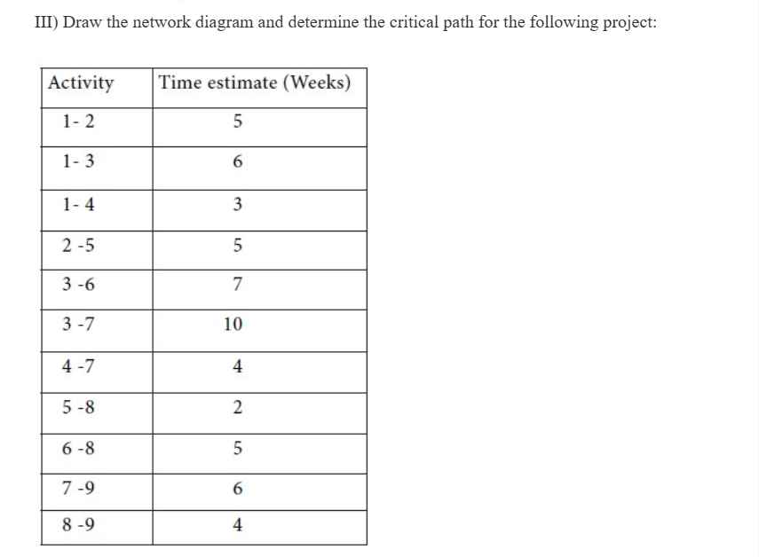
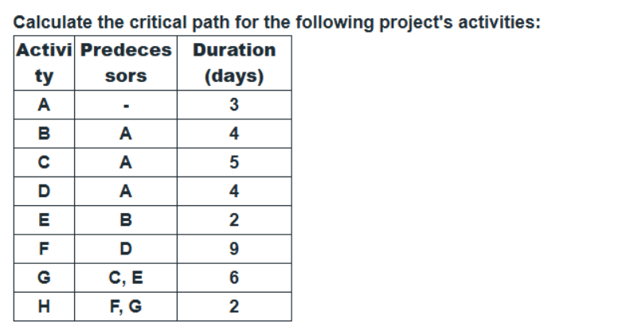

## Chapter 4: Software Testing  

- [ ] 1  
### Differentiate between Manual Testing and Automation Testing – 4 Marks  

***

- [ ] 2  
### Write any Four Advantages of Automation Testing – 4 Marks  

***

- [ ] 3  
### Define the Relationship between Bugs, Faults, and Failures (Diagram + Definition) – 4 Marks  

***

- [ ] 4  
### Define the Term Software Testing and Enlist its Purpose – 4 Marks  

***

- [ ] 5  
### Define the Role of BRD and TRD with Example – 4 Marks  

***

- [ ] 6  
### Explain Testing with Example: Unit, Integration, System, Acceptance, Regression (Each for 2 Marks) – 4 Marks  

***

- [ ] 7  
### Write any Four Characteristics of Software Testing with Example – 4 Marks  

***

- [ ] 8  
### Differentiate between Testing and Debugging – 4 Marks  

***

- [ ] 9  
### Explain Calculated Metrics with Example – 4/6/8 Marks  

***

- [ ] 10  
### Explain Functional and Non-Functional Testing with Example – 6 Marks  

***

- [ ] 11  
### Explain Black Box Testing with Suitable Example – 6 Marks  

***

- [ ] 12  
### Explain Principles of Software Testing – 6 Marks  

***

- [ ] 13  
### Explain Functional Testing Techniques with Example:  – 8 Marks   
1. Boundary Value Analysis  
2. Equivalence Partitioning

***

- [ ] 14  
### Explain any Two White Box Testing Techniques with Example OR Problem Statements (Each for 3/4 Marks) – 8 Marks  

***

- [ ] 15  
### Differentiate between Black Box, White Box, and Grey Box Testing (Any 2, Each for 1 Mark) – 6 Marks  

***

- [ ] 16  
### Explain Psychology of Software Testing – 8 Marks  

***

- [ ] 17  
### Define RTM and Describe Steps to Create RTM with Example – 6/8 Marks  

***

---

## Chapter 5: Software Documentation & UML  

- [ ] 1  
### Role / Need of Software Documentation (With Example) – 4 Marks  

***

- [ ] 2  
### List Different Types of Software Documentation and Explain – 4/6/8 Marks  

***

- [ ] 3  
### Differentiate between Different Types of Software Documentation – 4 Marks  

***

- [ ] 4  
### Define the Role of UML and List Different Types of UML – 4 Marks  

***

- [ ] 5  
### Fundamental Difference between Deliverable-Based WBS and Phase-Based WBS – 4 Marks  

***

- [ ] 6  
### Numerical Task (Forward Pass): Calculate ES and EF for Activity C (Preceded by A with Duration 5 Weeks; C Duration 5 Weeks) – 4 Marks  

***

- [ ] 7  
### Numerical Task on CPM – 6 Marks  

***

- [ ] 8  
### Draw Class Diagram for any System – 6 Marks  

***

- [ ] 9  
### Explain Different Types of Relationships in Class Diagram – 4/6 Marks  

***

- [ ] 10  
### Object Diagram – 6 Marks  

***

- [ ] 11  
### Outline Seven Major Sections of Design Documentation Structure;  **providing a description of the content covered in the Architectural Design and Detailed Design sections** – 8 Marks  

***
- [ ] 12 
### **Describe the function of UML Behavioral Diagrams. Detail the components of a Use Case Diagram, including use cases, actors, and the specialized include and extends relationships** – 8 Marks  

***

- [ ] 13
### **Numerical Task (Complete Critical Path Method - CPM): Determine the Critical Path for the following activities by calculating the Earliest Start (ES), Earliest Finish (EF), Latest Start (LS), Latest Finish (LF), and Float (F) for each task**– 8 Marks  
 

**II) Find out the completion time and the critical activities for the following project:**
 

 
**iv)**
 
***

