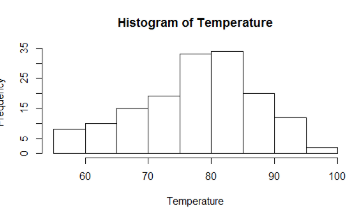
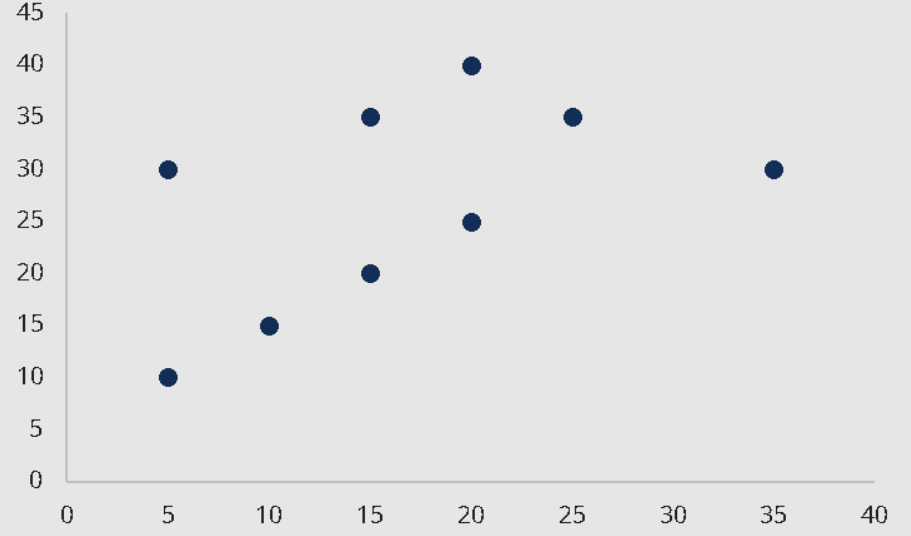
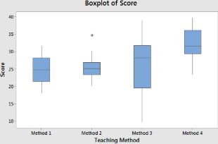
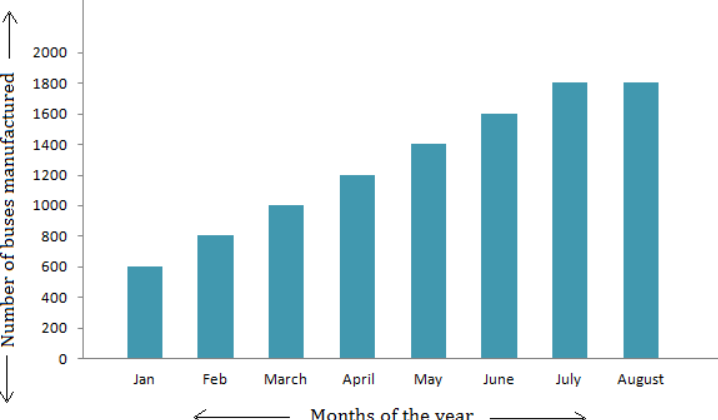

## **Chapter 4: Data Analytics and Visualization with R – CO4**


- [x] 1  

### Explain Data Frames with suitable example program (create, access & update) – 6/8 Marks  #p

**Definition:**  
A **Data Frame** is a rectangular data structure in R that stores data in rows and columns, similar to a spreadsheet or SQL table.  
- Each **column** represents a variable.  
- Each **row** represents an observation.  
- Columns can hold **different data types** (numeric, character, logical, etc.).  
- Created using the **`data.frame()`** function.

---

> [!abstract] R Program Example (3 Marks)

```r
# 1. Create a simple Data Frame with 3 columns and 2 rows
student_data <- data.frame(
  Name = c("Amy", "Ben"),       # Column 1: Character
  Score = c(95, 88),            # Column 2: Numeric
  Passed = c(TRUE, TRUE)        # Column 3: Logical
)

# 2. Access specific element (row 2, column 2)
# Accesses Ben's Score (88) using the [row, column] syntax
high_score <- student_data[2, 2]

# 3. Update: Change Amy's Score from 95 to 98
student_data[1, 2] <- 98


# Display the data and the accessed value
print(student_data)
print(high_score)
````

***

```bash
   Name Score Passed
1   Amy    98   TRUE
2   Ben    88   TRUE
[1] 88
```

***

> [!abstract] Program Explanation (3 Marks)

1.  **Creation:**  
    The `data.frame()` function combines multiple equal-length vectors (`Name`, `Score`, `Passed`) into a structured table.
    
    -   **Syntax:** `data.frame(Column1 = values, Column2 = values, ...)`
        
    -   **Example:** `data.frame(Name = c("A", "B"), Age = c(21, 22))` creates a 2×2 data frame.
        
2.  **Access:**  
    You can retrieve specific data using index positions or column names.
    
    -   **Syntax:** `data_frame[row, column]` or `data_frame$ColumnName`
        
    -   **Example:** `student_data[2, 2]` → retrieves **Ben’s Score (88)**.
        
3.  **Update:**  
    You can modify an element or entire column using indexing or `$` operator.
    
    -   **Syntax:** `data_frame$ColumnName[row_index] <- new_value`
        
    -   **Example:** `student_data$Score[1] <- 98` → updates **Amy’s Score** to 98.
        

***


- [x]    2
    

### Explain Matrices with suitable example program (create, access & update) – 6/8 Marks #p

**Definition:**  
A **Matrix** in R is a **two-dimensional array** that contains elements of the **same data type** (numeric, character, or logical).

-   Data is arranged in **rows and columns**.
    
-   Created using the **`matrix()`** function.
    
-   Can be **accessed and updated** using **row and column indices**.
    

***

> [!abstract] R Program Example (2 Marks)

```r
# Create a 2x2 matrix
m <- matrix(c(10, 20, 30, 40), nrow = 2)

# Access element (row 2, column 1)
x <- m[2, 1]

# Update element (row 1, column 2)
m[1, 2] <- 25

# Display results
print(m)
print(x)

```

***

```bash
     [,1] [,2]
[1,]   10   25
[2,]   30   40
[1] 30

```


> [!abstract] Program Explanation (2 Marks)

1.  **Creation:**
    
    -   The `matrix()` function creates a 2D table from a vector of values.
        
    -   **Syntax:** `matrix(data, nrow, ncol, byrow = TRUE/FALSE)`
        
    -   **Example:** `matrix(c(1,2,3,4), nrow=2)` → creates a 2×2 numeric matrix.
        
2.  **Access:**
    
    -   Use `[row, column]` to get a specific element.
        
    -   **Example:** `m[2,1]` → retrieves **30** (row 2, column 1).
        
3.  **Update:**
    
    -   Use `[row, column] <- value` to modify a specific element.
        
    -   **Example:** `m[1,2] <- 25` → changes the first row, second column value from 20 → 25.
        

***


-  [x]   3
    

### Explain Factors with suitable example program (create, access & update) – 6/8 Marks


A **Factor** in R is used to represent **categorical data**, which consists of different groups or categories. It is useful for statistical analysis and plotting. Factors are created using the **`factor()`** function, and individual elements can be **accessed or updated** using indexing.


    

***

> [!abstract] R Program Example (2 Marks)

```r
# 1. Create a factor for student grades
grades <- factor(c("A", "B", "A", "C", "B"))

# 2. Access the 3rd element
third_grade <- grades[3]

# 3. Update the 4th element from "C" to "B"
grades[4] <- "B"

# 4. Display the factor and accessed element
print(grades)
print(third_grade)
```

***

```bash
[1] A B A B B
Levels: A B C
[1] A
```

***

> [!abstract] Program Explanation (2 Marks)

1.  **Creation:**
    
    -   The `factor()` function converts a vector into a categorical variable.
        
    -   **Syntax:** `factor(vector)`
        
    -   **Example:** `factor(c("Yes", "No", "Yes"))` → creates a factor with categories Yes and No.
        
2.  **Access:**
    
    -   Use indexing `[i]` to retrieve an element.
        
    -   **Example:** `grades[3]` → retrieves the 3rd element (**A**).
        
3.  **Update:**
    
    -   Use `[i] <- value` to modify an element.
        
    -   **Example:** `grades[4] <- "B"` → changes the 4th element from **C** to **B**.
        

***


-   [x] 4
    

### Data Import and Export functions in R – 4/6 Marks

In R, data can be **imported from external files** (CSV, TXT, or Excel) and **exported** for further use. This allows R to read raw data, perform analysis, and save results. 
***

> [!abstract] R Program Example (2 Marks)

```r
# 1. Import data from a CSV file
data_csv <- read.csv("data.csv")   # Reads CSV file into a data frame

# 2. Export data to a CSV file
write.csv(data_csv, "output.csv")  # Writes data frame to CSV

# 3. Import data from a TXT file
data_txt <- read.table("data.txt", header = TRUE, sep = "\t")

# 4. Export data to a TXT file
write.table(data_txt, "output.txt", sep = "\t", row.names = FALSE)

# 5. Import data from an Excel file (requires 'readxl' package)
install.packages("readxl")  # Uncomment if package not installed
library(readxl)
data_excel <- read_excel("data.xlsx")


# 6. Export data to an Excel file (requires 'writexl' package)
install.packages("writexl") # Uncomment if package not installed
library(writexl)
write_xlsx(data_excel, "output.xlsx")
```

***


-   [x] 5
    

### Write short note on graphical representation of R programming – 4 Marks

R provides diverse and powerful tools (like **Base Graphics** and **ggplot2**) for **data visualization**, which helps to interpret and communicate complex data insights effectively.

> [!abstract] Common Types of Plots (draw the diagrams roughly as per u from below example)
> 
> R is used to generate visualizations that include:
> 
> -   **Histograms:** Show **how data is spread out (distribution)**.
>      
> -   **Scatter Plots:** Show the **relationship** between two variables.
>      
> -   **Box Plots:** Display data **distribution** and help find **outliers**.
>      
> -   **Bar/Line Graphs:** Show **comparisons** and **trends over time**.
>      

***

-   [x] 6
    

### Enlist and explain any four packages for Data loading, Data Manipulation & Data Visualization – 4/6 Marks


| Package Name | Primary Role | Explanation and Key Function |
| --- | --- | --- |
| **1. readr** | **Data Loading** | Quickly reads all common rectangular data files (like **CSV and TSV**) into R for analysis in a fast, efficient way. |
| **2. dplyr** | **Data Manipulation** | Uses simple, verb-like functions (e.g., `filter()`, `select()`) to easily **transform and manipulate** data frames (data wrangling). |
| **3. tidyr** | **Data Manipulation** | Focuses on **tidying and reshaping** data (e.g., using `pivot_wider()` or `pivot_longer()`) to make complex datasets easier to analyze. |
| **4. ggplot2** | **Data Visualization** | This is the industry-standard package for creating highly **professional, customized statistical graphics** and visualizations. |

***


-   [x] 7
    

### Discuss the transformation of Data frame using Separate and Unite functions along with suitable example in R programming – 4 Marks

The **`separate()`** and **`unite()`** functions (from the `tidyr` package) are essential for data cleaning and transforming character columns in R.

#### 1. Separate Function

> [!hint] Role and Purpose
> 
> The `separate()` function **splits one single column** into two or more new columns based on a delimiter (like an underscore or comma).
> 
> **Action:** Used when a column contains multiple pieces of information (e.g., splitting "Full Name" into "First" and "Last").

> [!abstract] Snippet and Output
> 
> **Snippet (Action):**
> 
> 
> 
> ```r
> data_sep <- separate(data, Full_Name, into = 
>c("First", "Last"), sep = "_") # write this along with the firstline
> print(data_sep[, 1:3]) #in exam , to ensure its visible i written in 2nd
> ```
> 
> **Output (Result):**
> 
>   ```
>   ID    First    Last
> 1     John   Smith
> 2    Alice   Jones
> ```

#### 2. Unite Function

> [!hint] Role and Purpose
> 
> The `unite()` function performs the reverse operation: it **joins two or more existing columns** into one single column, using a specified separator.
> 
> **Action:** Used to combine related fields (e.g., merging "City" and "Country" into "Location").

> [!abstract] Snippet and Output
> 
> **Snippet (Action):**
> 
> 
> 
> ```r
> data_unite <- unite(data_sep, Location, City, Country, sep = ", ")
> print(data_unite[, c(1, 4)])
> ```
> 
> **Output (Result):**
> 
>   ```
>   ID      Location
>  1   Mumbai, India
>  2    Paris, France
> ```

***

- [x] 8  
### Explain how to import, clean and transform raw data using R – 4/6 Marks

The process of preparing raw data for analysis in R follows three main sequential stages to ensure the data is accurate, consistent, and ready for modeling.

#### 1. Importing/Loading Data

> [!abstract] Action and Tool
> 
> Action: Read the raw data file (typically CSV or JSON) directly into an R Data Frame.
> 
> Tools: Use built-in functions like read.csv() or functions from the readr package (e.g., read_csv()).

> [!abstract] Snippet and Output
> 
> **Snippet:** `sales_data <- read.csv("quarterly_report.csv")`
> 
> **Output:** `A new Data Frame named 'sales_data' is created with the file contents.`

#### 2. Cleaning Data (Pre-processing)

> [!abstract] Action and Tool
> 
> **Handle Flaws:** Identify and fix issues like **missing values** (NA) by removing rows or replacing them. Also, detect and remove **duplicate records** and correct **outlier** values.

> [!abstract] Snippet and Output
> 
> **Snippet:** `clean_data <- na.omit(sales_data)`
> 
> **Output:** `Rows containing missing values (NA) are automatically removed from the Data Frame.`

#### 3. Transforming Data (Wrangling)

> [!abstract] Action and Tool
> 
> **Manipulation:** Use the **`dplyr`** package to perform core tasks like **filtering** rows and **selecting** relevant columns. Use **`tidyr`** to reshape the data.

> [!abstract] Snippet and Output
> 
> **Snippet:** `students_passed <- filter(data, Score >= 50)`
> 
> **Output:** `The new Data Frame 'students_passed' contains only rows where the student's 'Score' is 50 or higher.`

***
-   [ ] 9
    

### Write steps to perform data manipulation using dplyr library of R – 4/6 Marks

The **`dplyr`** package is the most essential tool for data manipulation in R, providing a concise and consistent set of functions (often called "verbs") to process data frames.


> [!abstract] Steps to Perform Data Manipulation (5 Key Verbs)
> 
> 1.  **Filter Rows (`filter()`):** Used to **select a subset of rows** based on logical conditions.
>     
>     -   _Example:_ Selecting only the data where `Age > 30` or `City == "New York"`.
>         
> 2.  **Select Columns (`select()`):** Used to **choose columns** by name to work with, removing unnecessary variables from the data frame.
>     
>     -   _Example:_ Keeping only the `Name`, `Score`, and `Date` columns.
>         
> 3.  **Create/Modify Columns (`mutate()`):** Used to **add new variables** to the data frame or modify existing ones.
>     
>     -   _Example:_ Calculating a `Profit_Margin` column by dividing `Revenue` by `Cost`.
>         
> 4.  **Sort Data (`arrange()`):** Used to **reorder rows** by the values of specified columns (ascending or descending).
>     
>     -   _Example:_ Sorting the data frame by `Sales` in descending order.
>         
> 5.  **Aggregate Data (`group_by()` and `summarize()`):** Used together to group data by category and then **calculate summary statistics** (e.g., mean, median, count) for each group.
>     
>     -   _Example:_ Grouping data by `Region` and finding the total `Average_Sales` for each region.
>         

***

-   [ ] 10
    

### Write steps to perform data visualization with ggplot2 – 4/6 Marks

The **`ggplot2`** package for R is the industry standard for data visualization, based on the **"grammar of graphics,"** meaning plots are built layer by layer.

> [!abstract] Core Workflow (Layered Approach)
> 
> Data visualization with `ggplot2` requires three essential components that are combined using the addition operator (`+`):
> 
> 1.  **Initialize (`ggplot()`):** **Define the Data** by starting the plot and specifying the data frame to be used.
>     
>     -   **Example:** `ggplot(data = my_data_frame)`
>         
> 2.  **Map Aesthetics (`aes()`):** **Assign Variables** to visual properties (such as the x-axis, y-axis, color, or size).
>     
>     -   **Example:** `+ aes(x = Sales, y = Profit, color = Region)`
>         
> 3.  **Add Geometries (`geom_...()`):** **Choose the Graph Type** (the geometric object) to display the data visually.
>     
>     -   **Example:** `+ geom_point()` (to create a scatter plot) or `+ geom_bar()` (to create a bar chart)
>         

> [!abstract] Complete Code Example
> 
> 
> 
> 
> ```r
> library(ggplot2)
> # (Assumes 'data' is loaded)
> plot_object <- ggplot(data) + 
>   aes(x = Price, y = Demand) + 
>   geom_line()
> print(plot_object)
> ```

***

- [ ] 11  
### Write use of following functions: – 4 Marks   i) geom_point ii) geom_bar 

#### i) `geom_point()` (2 Marks)

> [!hint] Purpose and Syntax
> 
> 1.  **Purpose:** Used to create **scatter plots**. It renders each row of data as a single visual point.
>     
> 2.  **Syntax Flow:** The geometry uses the x and y aesthetics to map two continuous variables.
>     
> 
> **Code Snippet (Syntax & Example):**
> 
> 
> 
> ```r
> # Syntax: + geom_point(aes(color = <variable>))
> + geom_point(aes(x=Height, y=Weight, color=Gender))
> ```

#### ii) `geom_bar()` (2 Marks)

> [!hint] Purpose and Syntax
> 
> 1.  **Purpose:** Used to create **bar charts**. It renders data as rectangular bars, typically showing counts or totals.
>     
> 2.  **Syntax Flow:** The geometry requires an x aesthetic for the categorical variable and is often paired with a 'fill' aesthetic for comparisons.
>     
> 
> **Code Snippet (Syntax & Example):**
> 
> 
> 
> ```r
> # Syntax: + geom_bar(aes(x = <category>))
> + geom_bar(aes(x=Product_Category, fill=Region))
> ```

***


-   [ ] 12
    

### Explain how to make Line graph in R – 4 Marks

Creating a line graph is best done using the **`ggplot2`** package, which builds the plot layer by layer based on the **grammar of graphics**.

> [!abstract] Explanation (2 Marks)
> 
> 1.  **Define Data:** Start the plot using the `ggplot()` function to specify the data frame.
>     
> 2.  **Map Axes (`aes()`):** Assign the variables to the visual properties (the X-axis, typically time, and the Y-axis, the measured value).
>     
> 3.  **Add Line (`geom_line()`):** Use the `geom_line()` function to connect the mapped data points sequentially, which renders the visible graph.
>     

> [!abstract] Code Snippet (2 Marks)
> 
> 
> 
>```r
># 1. Load Package and Create Sample Data
>library(ggplot2)
>sales_data <- data.frame(Month = 1:5, Revenue = c(50, 70, 65, 80, 90))
>
># 2. Create Line Graph
>ggplot(data = sales_data, aes(x = Month, y = Revenue)) +
>  geom_line(color = "blue") +
>  geom_point(color = "red") +
>  labs(title = "Monthly Revenue", x = "Month", y = "Revenue")
>


***

- [ ] 13  
### ` Program on any one data structure `– 6/8 Marks  
## skip
***
### EXTRA programs 


## 1. Create Data Frame for Student Details

**Code:**

```r
student_details <- data.frame(
  Name = c("Amy", "Ben", "Charlie"),
  Score = c(95, 88, 76),
  Grade = factor(c("A", "B", "C")),
  Is_Enrolled = c(TRUE, TRUE, FALSE)
)

print(student_details)
```

**Output:**

```bash
     Name Score Grade Is_Enrolled
1     Amy    95     A        TRUE
2     Ben    88     B        TRUE
3 Charlie    76     C       FALSE
```

***

## 2. Change the Order of Factor Levels

**Code:**

```r
ratings <- factor(c("Low", "Medium", "High", "Low"))
print("Default Levels:")
print(levels(ratings))

# Custom order
ratings <- factor(ratings, levels = c("Low", "Medium", "High"))
print("Custom Levels:")
print(levels(ratings))
```

**Output:**

```bash
[1] "Default Levels:"
[1] "High"   "Low"    "Medium"
[1] "Custom Levels:"
[1] "Low"    "Medium" "High"
```

***

## 3. Generate Factor Levels Using `gl()`

**Code:**

```r
groups <- gl(n = 3, k = 2, labels = c("A", "B", "C"))
print(groups)
```

**Output:**

```bash
[1] A A B B C C
Levels: A B C
```

***

## 4. Convert List to Matrix

**Code:**

```r
my_list <- list(1, 2, 3, 4, 5, 6)
my_matrix <- matrix(unlist(my_list), nrow = 3)
print(my_matrix)
```

**Output:**

```bash
     [,1] [,2]
[1,]    1    4
[2,]    2    5
[3,]    3    6
```

***

## 5. Create Data Frame from Matrix

**Code:**

```r
mat <- matrix(1:6, nrow = 3)
df <- data.frame(mat)
print(df)
```

**Output:**

```bash
  X1 X2
1  1  4
2  2  5
3  3  6
```

***

## 6. Create a Matrix and Perform Operations

**Code:**

```r
mat <- matrix(c(2,5,8, 4,1,9, 6,3,7), nrow = 3, byrow = TRUE,
              dimnames = list(NULL, c("Col1","Col2","Col3")))
print("--- Original Matrix ---")
print(mat)

# i. Rows where Col2 > 3
print("--- Rows with Col2 > 3 ---")
print(mat[mat[, "Col2"] > 3, ])

# ii. Convert to vector
print("--- 1D Vector ---")
print(as.vector(mat))

# iii. Matrix to list of columns
print("--- List of Columns ---")
print(as.list(mat))
```

**Output:**

```bash
--- Original Matrix ---
     Col1 Col2 Col3
[1,]    2    5    8
[2,]    4    1    9
[3,]    6    3    7

--- Rows with Col2 > 3 ---
     Col1 Col2 Col3
[1,]    2    5    8

--- 1D Vector ---
[1] 2 5 8 4 1 9 6 3 7

--- List of Columns ---
$Col1
[1] 2 4 6

$Col2
[1] 5 1 3

$Col3
[1] 8 9 7
```

***


## **Chapter 5: Business Intelligence with Power BI – CO5**


-  [x]  1
    

### Why choose Power BI over Excel? Justify – 4 Marks


***

> [!abstract] Key Justifications (Single-line + Example)
> 
> 1.  **Massive Data Scalability:** Power BI can efficiently handle **millions of rows** from multiple sources without slowing down.  
>     _Example:_ Import 10M sales records and perform aggregations instantly, whereas Excel may crash.
>     
> 2.  **Dynamic Visualization:** It enables **interactive dashboards and reports** that allow filtering, drilling down, and exploring data in real-time.  
>     _Example:_ Drill-down monthly sales by region and visualize trends dynamically.
>     
> 3.  **Relational Data Modeling:** Power BI can **connect and model multiple related tables** with relationships, hierarchies, and calculated columns.  
>     _Example:_ Link Customers and Orders tables to analyze customer purchase patterns.
>     
> 4.  **Secure Collaboration:** Reports can be **shared securely across teams** with automatic data refresh and cloud accessibility.  
>     _Example:_ Publish monthly KPI dashboard to Power BI Service for company-wide access.
>     


> [!check] Hence**Power BI** is better than Excel because it handles **large datasets, interactive dashboards, relational modeling, and secure sharing**, which Excel struggles with.


***

-   [x] 2
    

### Enlist any six data sources connected in Power BI – 4 Marks

Power BI is designed to connect to nearly any data source across cloud services, on-premise servers, and local files. Six primary types of connectable data sources include:

1.  **Files:** Local or cloud-stored files, such as **Excel workbooks (.xlsx)** and **CSV files**.
    
2.  **Relational Databases:** Enterprise databases like **SQL Server**, **MySQL**, and **PostgreSQL**.
    
3.  **Web:** Direct connections to data available on the web via **OData feeds** or **Web URLs**.
    
4.  **Cloud Data Warehouses:** Services like **Azure SQL Database** or **Amazon Redshift**.
    
5.  **Big Data Platforms:** Data stored in platforms like **Hadoop/Spark** or **Google BigQuery**.
    
6.  **Online Services:** Business applications and platforms such as **Salesforce** and **SharePoint Lists**.
    

***
-   [x] 3
    

### Differentiate between Dashboard and Report – 4 Marks

A **Dashboard** and a **Report** are both methods of data visualization, but they serve different business purposes based on data scope and level of detail.

| Feature | Dashboard | Report |
| --- | --- | --- |
| **1. Primary Goal** | To **monitor Key Performance Indicators (KPIs)** and current status at a single glance (Quick Check). | To perform **detailed analysis** and answer specific business questions (Deep Dive). |
| **2. Data Scope** | Presents **real-time, summarized metrics** aggregated from various sources. | Presents **historical, detailed data** that is usually static and specific to one area. |
| **3. Format** | Always a **single screen** for immediate visibility. | Can be **multi-page** and is often exported in static formats (PDF, PPT). |
| **4. Interactivity** | Highly **dynamic** and interactive (allows drill-downs). | Often **static** or requires specific user interaction to update. |
| **5. Ideal Audience** | Executives and Managers who need a **high-level overview**. | Analysts and Operational Staff who need **in-depth data tables**. |
| **6. Data Granularity** | Low granularity (mostly aggregated data). | High granularity (detailed transactional data). |

***

-   [x] 4
    

### Define Data visualization. Write any two business use cases for data visualization – 4/6 Marks


**Data Visualization** is the process of showing data in **charts, graphs, or dashboards** to make trends and patterns easy to see and understand, helping in quicker decision-making.


> [!abstract] Two Business Use Cases (1 Mark Each)
> 
> 1.  **Customer Segmentation:** Helps marketing teams divide customers into groups based on behavior.
>     
>     -   _Example:_ Scatter plot showing “High-Value Loyal” vs. “Low-Value New” customers for targeted campaigns.
>         
> 2.  **Supply Chain Optimization:** Helps identify bottlenecks or delays in logistics.
>     
>     -   _Example:_ Heat map showing warehouses with the highest shipping delays or inventory issues.
>
***


***

- [ ] 5
    

### State any two advantages and disadvantages of Power BI – 4 Marks

> [!abstract] Advantages (1 Mark Each)
> 
> 1.  **Interactive Visualizations:** Users can create dynamic dashboards and drill down into data.
>     
>     -   _Example:_ Click on a region in a sales map to see detailed product sales.
>         
> 2.  **Cloud-Based Collaboration:** Share dashboards and reports securely with automatic updates.
>     
>     -   _Example:_ Publish monthly KPI reports to Power BI Service for team access.
>         

> [!abstract] Disadvantages (1 Mark Each)
> 
> 1.  **Limited Free Version Features:** Some advanced features require a paid Pro license.
>     
>     -   _Example:_ Row-level security and larger dataset capacity are restricted.
>         
> 2.  **Learning Curve for Beginners:** Users need time to learn data modeling and DAX formulas.
>     
>     -   _Example:_ Creating calculated measures may be confusing initially.
>         

***


- [ ]   6
    

### Enlist any four business applications of Power BI – 4 Marks

Power BI helps organizations **turn complex data into actionable insights** for better decision-making.

> [!abstract] Four Key Business Applications
> 
> 1.  **Sales & Revenue Analysis:** Track revenue, quotas, and pipeline health.
>     
>     -   _Example:_ Dashboard showing monthly sales by region.
>         
> 2.  **Financial Reporting:** Visualize P&L, budgets, and expenditure trends.
>     
>     -   _Example:_ Compare actual vs. budgeted expenses in charts.
>         
> 3.  **Marketing Performance:** Measure ROI, conversions, and campaign effectiveness.
>     
>     -   _Example:_ Bar chart showing channel-wise campaign success.
>         
> 4.  **Supply Chain & Operations:** Monitor inventory, logistics, and production bottlenecks.
>     
>     -   _Example:_ Heat map of warehouse efficiency or delays.
>         

***

-   [x] 7
    

### Describe the purpose of Power Query Editor. Explain how it helps in data preparation and transformation – 6 Marks

The **Power Query Editor** is the primary **ETL (Extract, Transform, Load) tool** within Power BI, providing a graphical environment to clean, shape, and restructure data. Its underlying scripting engine is the **M Language**.

> [!abstract] Purpose and Mechanism
> 
> 1.  **Purpose:** To connect to various data sources and prepare data non-destructively by defining a series of repeatable steps (scripts).
>     
> 2.  **Mechanism:** All actions (like clicking filter buttons) are instantly translated into the **M Language** script, ensuring the data refresh process is automated and reproducible.
>     

> [!abstract] Data Shaping: Preparation and Transformation
> 
> **1. Data Preparation (Cleaning Flaws):**
> 
> -   **Quality Control:** Easily identify and manage **missing values** (nulls) by removing or replacing them.
>     
> -   **Data Type Fixes:** Automatically detect or manually correct **data types** (e.g., ensuring a text column containing prices is converted to numeric).
>     
> -   **Filtering:** Quickly **filter out unnecessary rows** or **remove redundant columns** before the final model load.
>     
> 
> **2. Data Transformation (Restructuring):**
> 
> -   **Restructuring:** Key functions like **Pivoting** and **Unpivoting** are used to quickly change the data's layout from a wide, messy format to a tall, tidy format.
>     
> -   **Combining Data:** Allows users to **Merge** (join tables horizontally) or **Append** (stack tables vertically) multiple disparate sources into a single table.
>     
> -   **Custom Logic:** Users can create **Custom Columns** using M Language to calculate new fields (e.g., calculating a profit percentage) based on existing data.
>     

***
-   [ ] 8
    

### Write steps to create dashboard for a business scenario – 6/8 Marks

Creating an effective business dashboard is a structured process that moves sequentially from defining the business problem to publishing the interactive visualization.

> [!abstract] Step-by-Step Procedure (Simplified)
> 
> 1.  **Define the Goal (The WHAT):** Clearly identify the **Key Performance Indicators (KPIs)** and metrics the dashboard must track to solve a specific business problem (e.g., "We need to track daily sales trends").
>     
> 2.  **Acquire and Clean Data:** Connect to all necessary **raw data sources** (e.g., database, Excel). Clean, transform, and **model the data** by fixing missing values and creating table relationships.
>     
> 3.  **Design the Layout and Visuals:** Determine the final look, focusing the design on simplicity. Choose the right charts (e.g., line graph for trends, bar chart for comparison) to represent the KPIs effectively.
>     
> 4.  **Validate and Refine:** Check the dashboard's results against existing **trusted reports** to ensure accuracy. Gather feedback from the business team and make necessary adjustments and improvements.
>     
> 5.  **Publish and Automate:** Deploy the finalized dashboard to a secure cloud platform (like Power BI Service). Set up **automated data refresh schedules** and manage user permissions for ongoing consumption.
>     

***

-   [x] 9
    

### Explain the purpose of using Slicer & its types – 4/6 Marks

A **Slicer** is an interactive, on-canvas filter component used in data visualization tools (like Power BI or Excel) that allows users to quickly and visually refine the data shown on a report page.

> [!abstract] Purpose and Significance
> 
> 1.  **Interactive Filtering:** The primary purpose is to provide an **immediate and intuitive way** for end-users to filter data without interacting with complex filter panes or report settings.
>     
> 2.  **Visualization:** Slicers use visual buttons, lists, or sliders, making it clear to the user what data selections are currently being applied.
>     
> 3.  **Cross-Filtering:** A single slicer can be set up to filter **multiple charts and tables** simultaneously across the entire report page.
>     

> [!abstract] Main Types of Slicers
> 
> -   **List/Button Slicer:** Displays categories as selectable buttons or a vertical list (e.g., selecting 'North' or 'South' Region).
>     
> -   **Range Slider Slicer:** Displays a slider bar used to filter data based on a range of continuous values (e.g., filtering sales data between $10,000 and $50,000).
>     
> -   **Date/Timeline Slicer:** Provides controls for filtering data based on specific dates, months, or years.
>     

***
-   [x] 10
    

### Explain the types of Map visualizations available in Power BI. Explain what type of data is best represented using map visualizations – 4/6 Marks

Map visualizations are powerful tools in Power BI for analyzing data that has a geographic component.

> [!hint] Data Requirement
> 
> Map visualizations are best used for **geospatial data**, meaning the data must contain location information that Power BI can recognize, such as:
> 
> -   **Coordinates:** Latitude and Longitude values.
>     
> -   **Names:** Full street addresses, city names, states/provinces, or country names.
>     

> [!abstract] Types of Map Visualizations in Power BI
> 
> 1.  **Point (or Bubble) Map:**
>     
>     -   **Purpose:** Plots data as **circles or bubbles** over specific coordinates or city locations on a map.
>         
>     -   **Use:** The size and/or color of the bubble typically represents a numerical measure (e.g., population, total sales amount).
>         
> 2.  **Filled Map (or Choropleth Map):**
>     
>     -   **Purpose:** Colors entire **regions** (e.g., countries, states, counties) based on a measure.
>         
>     -   **Use:** Ideal for visualizing density, proportions, or rates of a measure across defined geographical boundaries (e.g., coloring states based on infection rate or profit margin).
>         

***
-   [x] 11
    

### Write an example of a scenario where a Line chart would be the most appropriate – 6/8 Marks

A Line Chart is the most appropriate visualization whenever the analysis requires showing the **trend, change, or continuity** of a variable over a clearly **ordered sequence**, such as time.

> [!abstract] Scenario: Monitoring E-commerce Revenue Trend
> 
> **Business Problem:** An e-commerce company needs to assess the effectiveness of its marketing spend by tracking monthly revenue and identifying seasonal trends or the impact of a major holiday promotion.
> 
> **Data Required:**
> 
> -   **X-Axis:** A clear time variable (e.g., Month, Quarter, or Day).
>     
> -   **Y-Axis:** A continuous measure (e.g., Total Revenue).
>     
> 
> **Justification (Why a Line Chart is Essential):**
> 
> 1.  **Emphasizes Continuity:** A line chart emphasizes the continuous movement of the metric across time, allowing stakeholders to easily track the revenue's growth or decline rate (the slope).
>     
> 2.  **Identifies Trends:** It makes long-term trends (upward growth, recessionary periods) and cyclical patterns (e.g., sales spikes every December) immediately obvious.
>     
> 3.  **Comparative Analysis (Optional):** By adding multiple lines (e.g., Revenue vs. Cost), the chart allows for instant comparison of the performance gap over the same period.
>     

***

-   [x] 12
    

### Explain when to use custom visual over a built-in visual – 4 Marks

Custom visuals are used to **extend the capabilities** of a visualization tool when the standard, built-in charts are insufficient for the specific analytic or business need.

> [!abstract] Key Reasons to Choose a Custom Visual
> 
> 1.  **Unique Visualization Type:** When the analytical need requires a highly specific, niche chart that is not available by default.
>     
>     -   **Example:** Using a **Sankey diagram** to visualize the flow of users between web pages, or a **Gantt chart** to track project scheduling.
>         
> 2.  **Advanced Data Requirements:** When the built-in visual cannot handle the specific data binding, formatting, or custom calculations required by your business logic.
>     
> 3.  **Specialized Interactivity:** When the visual requires specific, advanced interactivity or custom drill-down features that the default charts lack.
>     

***

-   [x] 13
    

### Explain the process of importing a custom visual from the Power BI – 4 Marks

Importing a custom visual allows you to extend the default visualization options in Power BI Desktop by adding specialized charts or graphics tailored to unique data needs.

> [!abstract] Step-by-Step Procedure
> 
> 1.  **Access Visuals:** Open Power BI Desktop and navigate to the **Visualizations pane**.
>     
> 2.  **Initiate Import:** Click the three dots (ellipsis) next to the default visualization icons and select **"Get more visuals"** (or "Import a visual from a file").
>     
> 3.  **Choose Source:** You will typically be taken to **AppSource** (Microsoft's online store) where certified and custom visuals are available, or you select a local `.pbiviz` file.
>     
> 4.  **Select and Add:** Search for the required visual (e.g., a Sankey diagram), click on it, and then click the **"Add"** or **"Import"** button.
>     
> 5.  **Confirmation:** Power BI notifies you once the import is successful. The new custom visual icon will now appear in your **Visualizations pane**, ready for use in your report.
>     

***

-   [ ] 14
    

### Write short note on “Environmental factors affecting Business Intelligence” – 4/6 Marks

Environmental factors are the external and internal forces that significantly influence the success, adoption, and scope of a Business Intelligence (BI) initiative within an organization.

> [!abstract] Key Environmental Factors
> 
> 1.  **Organizational Culture:** The willingness of leadership and employees to adopt data-driven decision-making. A culture resistant to change or lacking data literacy hinders BI success.
>     
> 2.  **Regulatory and Legal Environment:** Strict data privacy laws (e.g., GDPR) and industry-specific regulations dictate how data must be collected, stored, and analyzed, directly limiting BI scope.
>     
> 3.  **Market Dynamics:** Economic downturns or rapid market shifts can change the focus of BI, forcing quick adaptation (e.g., shifting from long-term planning to immediate cost optimization).
>     
> 4.  **Technological Infrastructure:** The availability, quality, and integration of existing IT infrastructure (data warehouses, network speed, old systems) determine how easily new BI tools can be implemented.
>     

***

-   [ ] 15
    

### Write short note on “Recent trends in Business Intelligence & applications” – 4/6 Marks

Business Intelligence is constantly evolving, with recent trends focusing on making data analysis more automated, accessible, and integrated with core operations.

> [!abstract] Recent Trends and Applications
> 
> 1.  **AI and Machine Learning Integration:** Using AI/ML models to automate the discovery of complex insights, perform predictive analysis, and forecast future trends (e.g., predicting customer churn).
>     
> 2.  **Augmented Analytics:** Automation of key BI tasks, such as automated data preparation, automated insight generation, and natural language querying (users typing questions instead of clicking).
>     
> 3.  **Cloud BI:** The massive migration of BI platforms (e.g., Power BI, Tableau) and data storage to the cloud (AWS, Azure) to enable high scalability, real-time collaboration, and lower maintenance costs.
>     
> 4.  **Data Storytelling and Mobile BI:** Focus on creating clear, narrative-driven visualizations that are easily consumable and instantly accessible on mobile devices for decision-makers on the go.
>     

***

---

## **Chapter 6: Industry Applications of Business Analytics – CO6**

- [ ] 1  
### State any six use cases of Business Analytics – 4/6 Marks  

***

- [ ] 2  
### Write the importance of Forecasting in business. Enlist any 4 examples of time series forecasting – 4 Marks  

***

- [ ] 3  
### Explain any six common mistakes in implementing Business Intelligence – 4/6 Marks  

***

- [ ] 4  
### Explain any four existing BI systems used in business – 4/6 Marks  

***

- [ ] 5  
### Explain any six Business Intelligence applications – 4/6 Marks  

***

- [ ] 6  
### Write short note on “Ethical & Legal Considerations in Business Analytics” – 6/8 Marks  

***

- [ ] 7  
### Explain the role of Business Analytics in Operations and Supply Chain – 6/8 Marks  

***

- [ ] 8  
### Explain the role of Business Analytics in Finance and Risk Management – 6/8 Marks  

***

- [ ] 9  
### Explain the role of Business Analytics in Marketing and Sales – 6/8 Marks  

***
