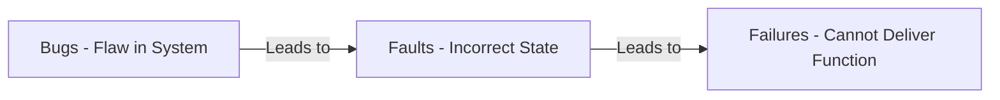
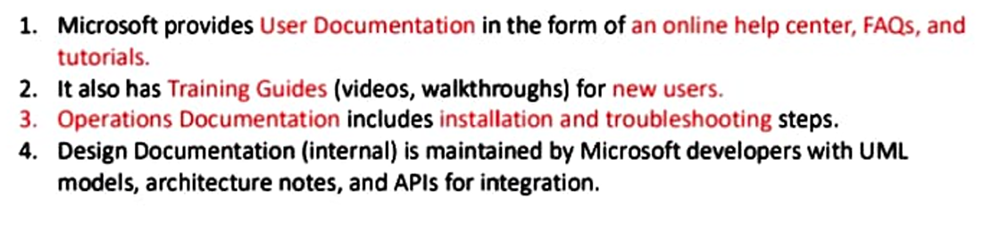
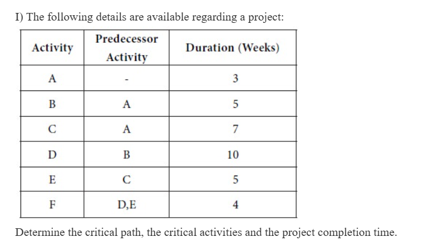
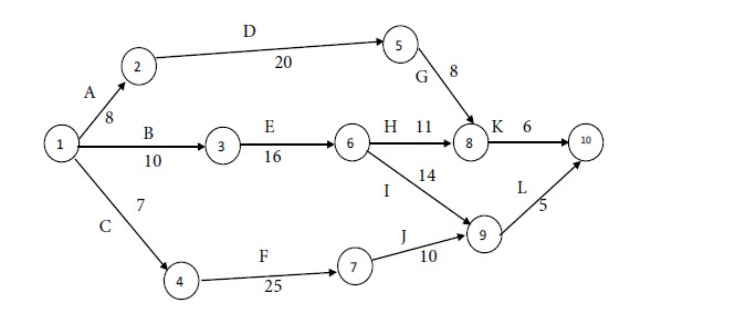
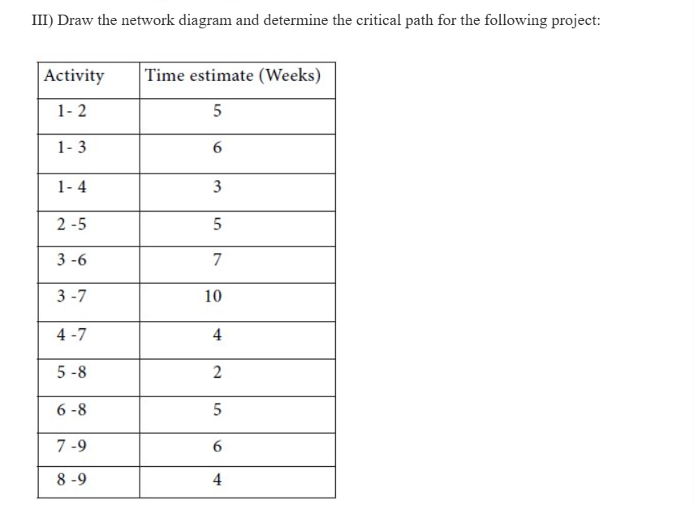
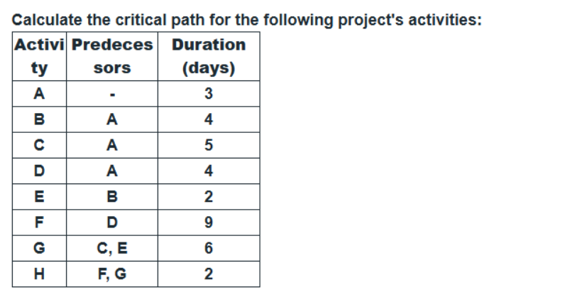

## Chapter 4: Software Testing  

-   [x] 1
    

### Differentiate between Manual Testing and Automation Testing – 4 Marks


| Feature | Manual Testing | Automation Testing |
| --- | --- | --- |
| **Execution** | Tests are executed **by a human tester** without the aid of scripts or tools. | Tests are executed by **automation tools** using pre-written test scripts. |
| **Investment** | Low initial investment, but high long-term **labor costs**. | High initial investment (tools, training), but low **long-term costs**. |
| **Reliability** | **Less reliable** due to human error, fatigue, and monotony. | **Highly reliable and accurate**, as execution is precise and repeatable. |
| **Best Suited For** | Usability testing, ad-hoc testing, exploratory testing, and complex visual checks. | Regression testing, load testing, performance testing, and repetitive tasks. |
| **Feedback Speed** | Slower and more time-consuming, especially for large test suites. | **Extremely fast** and provides immediate feedback. |
| **Scenario Example** | Checking website login on one browser takes 2 minutes. | Running **10,000 login checks** across 50 different devices and browsers in under 15 minutes. |

***
-   [x] 2
    

### Write any Four Advantages of Automation Testing – 4 Marks #p

> [!abstract] Four Key Advantages
> 
> 1.  **Speed and Time Savings:** Provides the fast delivery of results, which saves a significant amount of time in every release cycle.
>     
> 2.  **Faster Feedback:** Helps in the quicker delivery of feedback to developers and product owners, as test suites can be run immediately after every new release.
>     
> 3.  **Reliability and Quality:** Improves the efficiency of an application by providing quality and highly reliable results.
>     
> 4.  **Higher Test Coverage:** Allows for greater test coverage, which helps cover all test scenarios and reduces the chances of missing bugs.
>     

> [!check] example
> **Time Savings:** Running a large suite of **100 repetitive login tests** can be completed automatically in **20 seconds**, a task that would take a human tester **4 hours** to perform manually.
***

- [x] 3
### Define the Relationship between Bugs, Faults, and Failures (Diagram + Definition) – 4 Marks


> [!hint] The Chain of Events
> 
> 1.  **Bug (The Mistake/Cause):** The initial **human mistake** or oversight made by a developer while writing the code.
>     
> 2.  **Fault (The Defect/State):** The **incorrect state**  in the software code caused by the Bug.
>     
> 3.  **Failure (The Result/Symptom):** The **visible event** where the software stops performing its required function because the Fault was activated.
>
> **Diagram:**

>
> **Analogy:** Writing a wrong instruction (Bug) leaves a broken circuit (Fault), which causes the program to crash (Failure).

***

-   [x] 4
    

### Define the Term Software Testing and Enlist its Purpose – 4 Marks #p

**Software Testing** is a set of activities conducted with the dual intent of **finding errors in software** and **verifying that the set of programs collectively functions correctly** according to requirement  including functional, performance, reliability, security, and usability, ensuring that "we are building the system right."

> [!abstract] Purpose of Software Testing
> 
> 1.  **Finding Defects:** The primary goal is to discover flaws and errors in the software, as "humans are susceptible to produce errors."
>     
> 2.  **Requirements Verification:** Verifies that the system meets all specified requirements (functional, performance, reliability, security, usability, and so on).
>     
> 3.  **Quality Improvement:** Contributes directly to improving the overall quality of the product.
>     

***

-   [x] 5
    

### Define the Role of BRD and TRD with Example – 4 Marks #p

The **BRD** and **TRD** are sequential documents that define a project first from the business viewpoint and then detail the technical solution.

| Feature | BRD (Business Requirements Document) | TRD (Technical Requirements Document) |
| --- | --- | --- |
| **Role** | Defines the **"WHAT"** and **"WHY"** (User needs and business goals). | Defines the **"HOW"** (System architecture, code structure, and design). |
| **Audience** | **Business** Leaders, Stakeholders, and Product Managers. | **Technical** Teams, Developers, and System Architects. |
| **Content** | High-level business goals and acceptance criteria. | Database schema, API specifications, and component integration. |

> [!check] Example (User Login)
> 
> -   **BRD:** Focuses on **What** the user needs: "Users must be able to log in securely using two-factor authentication (2FA)."
>     
> -   **TRD:** Focuses on **How** it's built: "The login process will use the OAuth 2.0 protocol, and the 2FA codes will be managed by the AWS Cognito service."
>
***

-   [x] 6
    

### Explain Testing with Example: Unit, Integration, System, Acceptance, Regression (Each for 2 Marks) – 4 Marks

These five levels of testing cover the full quality assurance cycle, from the smallest code unit to the full end-user experience.

#### 1. Unit Testing

> [!hint] Definition
> 
> Tests the **smallest individual function or component** of the code in isolation.
> 
> **Example:** Checking that the specific function which **validates the password length** returns the correct true/false result.

#### 2. Integration Testing

> [!hint] Definition
> 
> Tests how **two or more related modules** or components communicate and work together.
> 
> **Example:** Checking that the **Login Form** successfully connects to and verifies the credentials against the **Database Module**.

#### 3. System Testing

> [!hint] Definition
> 
> Tests the **entire, fully integrated application** (end-to-end) against all original technical and functional requirements.
> 
> **Example:** Running a full scenario to ensure a user can **successfully log in**, access their main dashboard, and then securely **log out**.

#### 4. User Acceptance Testing (UAT)

> [!hint] Definition
> 
> Formal testing done by the **actual end-users or customers** to validate the system meets their specific business needs.
> 
> **Example:** The client formally verifies that all users from the HR department can **successfully log in** and access their assigned roles/permissions.

#### 5. Regression Testing

> [!hint] Definition
> 
> Tests existing, unchanged functionality to ensure that **new code changes** have not introduced new bugs or broken previous features.
> 
> **Example:** After adding a new "Forgot Password" feature, rerunning the **original login test cases** to ensure the standard login still works.

***

-   [x] 7
    

### Write any Four Characteristics of Software Testing with Example – 4 Marks #p


> [!abstract] Four Key Characteristics
> 
> 1.  **Power:** The ability of testing to detect the **maximum possible defects**.
>     
>     -   **Example:** In ATM software, a powerful test case will detect not just wrong PIN errors, but also cases like expired cards, insufficient balance, and server downtime.
>         
> 2.  **Validity:** Test cases should test **what they are intended to test** (align with requirements).
>     
>     -   **Example:** If the requirement is "the system must not accept passwords shorter than 8 characters," the test case must specifically validate short passwords, not unrelated fields like username.
>         
> 3.  **Credibility:** Testing must be **trustworthy and unbiased** so stakeholders believe in the results.
>     
>     -   **Example:** In a medical application (e.g., blood pressure monitoring app), credible testing ensures correct measurement display, allowing doctors and patients to trust the reports.
>         
> 4.  **Repeatability:** A test case should give the **same result every time** it is executed under the same conditions.
>     
>     -   **Example:** Testing a flight booking app for "booking a ticket from Mumbai to Delhi" should always succeed with the same inputs, not fail randomly.
>         

***

-   [x] 8
    

### Differentiate between Testing and Debugging – 4 Marks #p


| Feature | Testing | Debugging |
| --- | --- | --- |
| **1. Primary Goal** | To **show that the program has a bug** or an error; correction is left to developers. | To **find and then correct the bug** that occurs during program execution. |
| **2. Process Start** | Is a **planned activity** with set preconditions (e.g., proper documentation for technical testing). | Starts **as soon as the results are obtained** and can continue irrespective of documentation. |
| **3. Performer** | Functional testing can be done by an **outsider**. | Debugging has necessarily to be done by an **insider**. |
| **4. Automation** | Testing **can be automated**. | Debugging **cannot be automated**. |


> [!check] Simple Example (ADD THIS AS 5TH POINT)
> 
> -   **Testing:** A **tester** executes a test case and reports: "The 'Save' button crashes the app." (Finds the failure).
>     
> -   **Debugging:** A **developer** examines the code line by line to find the wrong variable assignment and fixes the fault. (Corrects the defect).
>
***

- [ ] 9  
### `Explain Calculated Metrics with Example – 4/6/8 Marks  `


### skipping
***

- [x] 10  

### Explain Functional and Non-Functional Testing with Example – 6 Marks  #p

Software testing is categorized into two types based on the characteristics being verified: the **features (Functional)** or the **quality (Non-Functional)**.  

#### Functional Testing  

> [!hint] Definition and Focus  
> Functional testing verifies that **product features work according to requirements**, identifying areas where results don’t meet expectations.  
> It focuses on the **behavior/execution** of the software system, answering the question:  
> **What does the system do?**  
>   
> **Methods:** Unit, Integration, System, and Acceptance Testing  
>   
> **Measurement:** Pass/Fail based on expected output for a given input  

> [!check] Example  
> Clicking the **"Submit Order"** button should successfully **process payment** and **update inventory count**.  

#### Non-Functional Testing  

> [!hint] Definition and Focus  
> Non-functional testing verifies **quality aspects** such as usability, performance, and compliance.  
> It focuses on the **performance/usability** of the software system, answering the question:  
> **How well does the system do it?**  
>   
> **Methods:** Performance, Load, Stress, and Security Testing  
>   
> **Measurement:** Metrics like response time, throughput, and CPU usage  

> [!check] Example  
> The website should **load in under 3 seconds** and remain stable with **1,000 concurrent users** (Load Testing).  

***

- [x] 11  

### Explain Black Box Testing with Suitable Example – 6 Marks  
**Black Box Testing** (or **Behavioral Testing**) checks the **software's behavior** without looking at its **internal code or structure**.  
It tests from an **end-user perspective**, verifying that the **inputs from the software produce the correct outputs** while treating it as a *"black box"*.


> [!abstract] Steps to Perform Black Box Testing
> 
> 1.  **Understand:** Read the system requirements and specifications.
>     
> 2.  **Select Inputs:** Choose both good data (valid inputs) and bad data (invalid inputs) for testing.
>     
> 3.  **Predict Output:** Decide what the correct result should be for each input.
>     
> 4.  **Test & Check:** Run the test and compare the actual result with your prediction (expected output).
>     
> 5.  **Fix & Re-test:** Report any failures (defects) and re-test the software after the code is fixed.
>

> [!check] Example (Login Screen – Boundary Value Analysis)  
> * **Scenario:** A password field accepts 8 to 16 characters.  
> * **Testing:** Inputs tested – **8 characters** (min), **16 characters** (max), **7 characters** (min-1), **17 characters** (max+1).  
> * **Result:** System should accept valid inputs and show correct error messages for invalid inputs, without needing source code access.  

***


-   [ ] 12
    

### Explain Principles of Software Testing – 6 Marks

Software testing is guided by several universal principles that define its scope, effectiveness, and limitations.

> [!abstract] Six Key Principles
> 
> 1.  **Exhaustive Testing is Impossible:** Testing every combination of inputs is not possible; instead, testing must be based on **risk assessment**.
>     
>     -   **Example:** You cannot test all possible scenarios for logging in and clicking every button simultaneously.
>         
> 2.  **Defect Clustering:** A small number of modules usually contain the majority of defects (approx. **80% of problems in 20% of modules**).
>     
>     -   **Example:** Focus testing effort on the high-risk payment or security module where most bugs are likely to be found.
>         
> 3.  **Pesticide Paradox:** Running the **same tests repeatedly** will eventually stop finding new bugs. Test cases must be regularly reviewed and revised.
>     
>     -   **Example:** New bugs are found only after creating new, different test cases and adding fresh data.
>         
> 4.  **Testing Shows Presence of Defects:** Testing can only prove that defects **exist**, but it can never prove the system is **perfect** (absence of bugs).
>     
>     -   **Example:** Passing 1,000 successful tests does not guarantee the 1,001st test won't crash the system.
>         
> 5.  **Absence of Error is a Fallacy:** Fixing all bugs does not help if the software is **unusable** or was built for the **wrong requirement**.
>     
>     -   **Example:** A bug-free application is considered a failure if its user interface is so confusing that no one can use it.
>         
> 6.  **Early Testing Saves Time and Money:** Testing should start **as early as possible** in the SDLC.
>     
>     -   **Example:** Fixing a flaw found in the requirements phase costs significantly less than fixing the same flaw after the code has been written.
>         


***

-   [x] 13
    

### Explain Functional Testing Techniques with Example – 8 Marks #p

#### 1. Equivalence Partitioning (EP) – 4 Marks

**Equivalence Partitioning (EP)** is a technique used to **reduce the number of test cases** by splitting all possible inputs into small, manageable groups (**partitions**).

> [!hint] Core Principle
> 
> **Partitioning:** This method creates distinct groups: **valid** (should work) and **invalid** (should fail). The main goal is to save time by **only testing one sample** from each partition, as all values in that group are expected to behave the same way.

Example (Username Input):

Requirement: A username field accepts 5–10 characters.

| Partition | Range | Test Case (Sample) | Expected Result |
| --- | --- | --- | --- |
| Valid | 5–10 characters | “Alice9” | Accept Username |
| Invalid | < 5 characters | “Al” | Reject Username |
| Invalid | > 10 characters | “Alice123456” | Reject Username |

***

#### 2. Boundary Value Analysis (BVA) – 4 Marks

**Boundary Value Analysis (BVA)** is a technique that focuses your testing efforts specifically on the **edges or boundary conditions** of the input ranges, as this is where developers often make mistakes.

> [!hint] Core Principle
> 
> **Focus:** The method tests values **at the boundary**, **just above**, and **just below** the boundary limits. The goal is to **catch subtle bugs** that often occur right at the transition points (e.g., Min and Max values) of a range.

Example (Password Input):

Requirement: A password field requires 8–12 characters (Min = 8, Max = 12).

| Boundary Case | Value | Status |
| --- | --- | --- |
| Minimum (on boundary) | 8   | Valid |
| Minimum - 1 (below boundary) | 7   | Invalid |
| Maximum (on boundary) | 12  | Valid |
| Maximum + 1 (above boundary) | 13  | Invalid |

***

-   [x] 14
    

### Explain any Two White Box Testing Techniques with Example OR Problem Statements (Each for 3/4 Marks) – 8 Marks #p

**White Box Testing** is a technique that tests the **internal structure, design, and code** of the software system. It requires the tester to have full knowledge of the source code.

#### 1. Statement Coverage – 4 Marks

> [!hint] Definition and Goal
> 
> **Definition:** Statement Coverage is a testing metric that ensures every single **executable statement** in the source code has been executed at least once during the testing process.
> 
> **Goal:** The goal is to verify that there is no dead or redundant code and that every line of logic has been activated.

> [!abstract] Problem Statement Example
> 
> **Code Block:**
> 
> ```
> 1. IF (Age >= 18) THEN
> 2.   PRINT "Adult";
> 3. ELSE
> 4.   PRINT "Minor";
> 5. ENDIF
> ```
> 
> **Test Case (T1):** Input `Age = 20`.
> 
> **Coverage Result:** The test T1 executes statements 1, 2, and 5. This achieves **60% coverage** (3 out of 5 statements executed), as statements 3 and 4 were missed.

***

#### 2. Decision/Branch Coverage – 4 Marks

> [!hint] Definition and Goal
> 
> **Definition:** Decision Coverage (or Branch Coverage) ensures that every possible **decision outcome** in the code has been evaluated to both a **True** and a **False** result at least once.
> 
> **Goal:** The goal is to test all branches or paths that originate from conditional statements (`if`, `while`, `case`, etc.).

> [!abstract] Problem Statement Example
> 
> **Code Block:** (Same `IF` statement from above)
> 
> ```
> IF (Age >= 18) ...
> ```
> 
> **Required Test Cases:**
> 
> 1.  **T1 (True Branch):** Input `Age = 20`. (Executes the `IF` part).
>     
> 2.  **T2 (False Branch):** Input `Age = 17`. (Executes the `ELSE` part).
>     
> 
> **Coverage Result:** Both T1 and T2 must be executed to achieve **100% Decision Coverage**, as they cover both the True and False outcomes of the condition.

***

-   [ ] 15
    

### Differentiate between Black Box, White Box, and Grey Box Testing – 6 Marks


| Feature | Black Box Testing | White Box Testing | Grey Box Testing |
| --- | --- | --- | --- |
| **1. Knowledge Required** | **Zero Knowledge.** Tester sees only the interface. | **Full Knowledge.** Tester sees all source code and structure. | **Partial Knowledge.** Tester knows system architecture and data flow. |
| **2. Primary Focus** | **External Behavior:** Verifies functionality from the **end-user perspective** (What the system _does_). | **Internal Logic:** Verifies code paths, security, and optimization (How the system _works_). | **Data Flow & Security:** Tests modules with **limited insight** to find deeper defects than black-box testing alone. |
| **3. Performer** | Independent Testers or End-Users. | Developers or dedicated programming specialists. | Testers and Developers working together (Hybrid team). |
| **4. Techniques** | Equivalence Partitioning, Boundary Value Analysis (BVA), and Exploratory Testing. | Statement Coverage, Decision/Branch Coverage, and Path Testing. | Combination of Black Box (UI) and White Box (Code review) techniques. |
| **5. Testing Phase** | Primarily performed at the **Higher Levels** (System and Acceptance Testing). | Primarily performed at the **Lower Levels** (Unit and Integration Testing). | Primarily performed at the **Integration Level**. |
| **6. Real-Life Example** | Testing a **checkout process** completely from the user interface to ensure the "Buy" button works. | Testing the **internal validation code** of a form to ensure every line of logic runs. | Testing the **connection between a web service and its database** using limited query access. |

***

- [ ] 16  
### `Explain Psychology of Software Testing` – 8 Marks  
### skipping, human psychology is enough pain, not gonna do software one for now
***

- [ ] 17  
### `Define RTM and Describe Steps to Create RTM with Example` – 6/8 Marks  
### skip
***

---

## Chapter 5: Software Documentation & UML  


-    [x] 1
    

### Role / Need of Software Documentation (With Example) – 4 Marks

**Software Documentation** is the written text, illustrations, or manuals that describe the design, functionality, operation, and use of a software system. 

It serves as a **reference** for developers, testers, users, and maintainers to understand, use, and manage the software effectively.

> [!abstract] Key Examples of Documentation 
>     

***


-   [x] 2
    

### List Different Types of Software Documentation and Explain – 4/6/8 Marks

Software documentation is categorized based on its target audience (user vs. internal staff) and its purpose (training vs. maintenance).

#### 1. Design Documentation (2 Marks)

> [!hint] Definition (1 Mark)
> 
> This is purely **internal** documentation that describes the system's architecture, data flow, and code structure.
> 
> **Goal:** To allow developers to understand **how the system is built** and make maintenance easier.

> [!check] Simple Example (1 Mark)
> 
> **UML models**, database schema diagrams, and technical **API specifications** for integration.

#### 2. User Documentation for Training (2 Marks)

> [!hint] Definition (1 Mark)
> 
> This documentation is aimed at new users to provide a **step-by-step learning experience** for the system.
> 
> **Goal:** To guide users from novice to proficient operation through simple tutorials.

> [!check] Simple Example (1 Mark)
> 
> **Video tutorials**, **walkthroughs**, and **"Getting Started" guides** that teach a new user how to log in and use the main features.

#### 3. Operations Documentation (2 Marks)

> [!hint] Definition (1 Mark)
> 
> This documentation is for IT and system administrators and details how to **install, maintain, and troubleshoot** the software in a live environment.
> 
> **Goal:** To ensure the system runs smoothly and can be recovered quickly in case of failure.

> [!check] Simple Example (1 Mark)
> 
> **Installation guides**, **server configuration manuals**, and detailed **disaster recovery plans**.

#### 4. User Reference Documentation (2 Marks)

> [!hint] Definition (1 Mark)
> 
> This documentation is for experienced users and serves as an **on-demand resource** for looking up specific information quickly.
> 
> **Goal:** To provide precise, non-tutorial answers for a user who knows the system.

> [!check] Simple Example (1 Mark)
> 
> Searchable **FAQs (Frequently Asked Questions)** or detailed **Help Manuals** that users consult for a single command or feature detail.

***
-   [x] 3
    

### Differentiate between Different Types of Software Documentation – 4 Marks


| Feature | Design Documentation | Operations Documentation | User Documentation for Training | User Reference Documentation |
| --- | --- | --- | --- | --- |
| **1. Primary Purpose** | Explains **HOW the system is built** and structured. | Details **HOW to install and manage** the system in production. | Provides **step-by-step guidance** for learning the system. | Offers an **on-demand resource** for quick lookup of specific facts. |
| **2. Target Audience** | Developers and System Architects | IT Administrators and Maintenance Teams | New End-Users (Novices) | Experienced Users (Look-up) |
| **3. Direction** | **Internal** (Code/Architecture Focus) | **Internal** (System Maintenance Focus) | **External** (Usage Focus) | **External** (Self-Service Help Focus) |
| **4. Content Example** | API specifications and data flow diagrams. | Installation guides and disaster recovery plans. | Video tutorials and "Getting Started" guides. | FAQs and searchable help manuals. |
| **5. Key Action** | **Build & Modify** | **Monitor & Maintain** | **Learn & Use** | **Consult & Resolve** |
| **6. Usage Frequency** | Used during development and major updates. | Used only during setup, monitoring, or failures. | Used once by new users. | Used frequently by experienced users for quick reference. |

***

- [x] extra
###  Identify type of software document for a given real word scenario (each for 1 mark)  

Identify the type of software documentation for each real-world scenario:

| No. | Scenario |
| --- | --- |
| 1   | A developer needs to understand the structure of the database and how the main components of the software interact. |
| 2   | A new end-user needs step-by-step guidance to master the process of creating a new sales order in the system. |
| 3   | A system administrator is preparing to move the application to a new server and needs the precise command line instructions for the installation and configuration. |
| 4   | A customer service representative is on a call and needs to quickly find the meaning of an error code displayed to the user. |
| 5   | The Quality Assurance (QA) team is reviewing the system's architecture to ensure test cases cover all major data flows. |
| 6   | A new employee is required to watch a video tutorial showing how to use the time-off request feature for the first time. |
| 7   | The DevOps team is setting up automated alerts and needs the procedure for checking the system logs when an application crash occurs. |
| 8   | An experienced user is performing a less common task and needs to look up a keyboard shortcut or a quick guide for a specific feature. |
| 9   | A software architect is detailing the **flowcharts** for a complex transaction process. |
| 10  | The IT support team needs the complete, authorized procedure for performing the weekly **database backup**. |
| 11  | A new manager is given a comprehensive, structured course manual to learn all features of the management dashboard. |
| 12  | A user forgot their password and is using the 'Forgot Password' link, which provides an **FAQ** section and troubleshooting tips on common login errors. |
| 13  | A programmer is writing a new feature and needs to review the existing data schema (e.g., **ER Diagrams**) to ensure proper integration. |
| 14  | The operations team is performing a routine maintenance patch and needs the full instructions on how to **restart the application** without affecting user sessions. |
| 15  | A user is having trouble with a non-standard task and uses the application's built-in help function to get a **glossary** definition of a technical term. |
| 16  | The system development team requires documentation that explains **how the software is built**, including its algorithms and architecture. |
| 17  | New hires are attending a **workshop** focused on teaching them how to execute their most common daily tasks in the new software. |
| 18  | The operations manager is writing a plan to **monitor the software's performance** and needs the deployment details. |
| 19  | A project manager is reading a document that describes the high-level **system architecture** to understand the feasibility of a future feature. |
| 20  | An end-user is looking for the application's **quick reference guide** to check the steps for adding a new record. |

***

### Answers and Justifications

| No. | Document Type | Justification |
| --- | --- | --- |
| **1** | **Design Documentation** | The audience is the **developer**, and the purpose is to explain **how the software is built**, including its **architecture** and data **flow**. |
| **2** | **User Documentation for Training** | The scenario involves **step-by-step guidance** and helping a **new end-user master a process**, which is the purpose of training documentation. |
| **3** | **Operations Documentation** | The audience is the **system administrator**, and the task is related to **deployment** and **installation** instructions, aligning with Operations Documentation's purpose. |
| **4** | **User Reference Documentation** | The need is for a **quick reference** to **troubleshoot** an issue (error code) during an interaction, which is the key purpose of reference guides. |
| **5** | **Design Documentation** | The audience includes **testers**, and they are reviewing the system's **architecture** and data **flows**, which are elements of Design Documentation. |
| **6** | **User Documentation for Training** | The scenario involves a **video tutorial** for a **new employee** to **learn to use the software**, which falls under **structured instructions or training sessions**. |
| **7** | **Operations Documentation** | The audience is the **DevOps team**, and the scenario covers checking **logs** and handling system **crashes**, which are tasks for maintaining and monitoring the software. |
| **8** | **User Reference Documentation** | An experienced user needs a **quick reference** for a specific feature (shortcut), indicating a need for a **permanent guide to perform tasks**. |
| **9** | **Design Documentation** | The scenario explicitly mentions detailing **flowcharts**, which is an example of Design Documentation used to explain the software's internal **flow**. |
| **10** | **Operations Documentation** | The task involves the **database backup** procedure, which is a key example of how to **maintain** the software for **IT support staff**. |
| **11** | **User Documentation for Training** | The manual is a **comprehensive, structured course** intended to help the user **learn to use the software**, which is the definition of training documentation. |
| **12** | **User Reference Documentation** | The document offers **troubleshooting** tips and **FAQs** for common errors, serving as a **permanent guide** to help users fix problems **without training**. |
| **13** | **Design Documentation** | The programmer needs to review **ER diagrams** (data design) to ensure proper **integration**, which explains **how the software is built**. |
| **14** | **Operations Documentation** | The instructions detail how to **restart the application**, a process for **deploying/maintaining** the system, aimed at the operations team. |
| **15** | **User Reference Documentation** | Using the help function for a **glossary** definition is a need for **quick reference** while using the system, falling under reference documentation. |
| **16** | **Design Documentation** | The documentation's purpose is to explain **how the software is built**, specifically mentioning **algorithms** and **architecture**. |
| **17** | **User Documentation for Training** | A **workshop** for new hires is a form of **structured instruction or training session** to help them **learn to use the software**. |
| **18** | **Operations Documentation** | The plan covers how to **monitor the software** and uses **deployment** details, which is the core function of Operations Documentation. |
| **19** | **Design Documentation** | Reviewing the **system architecture** for feasibility is a task for developers/maintainers, detailing **how the software is built**. |
| **20** | **User Reference Documentation** | The **quick reference guide** is used by an **end-user** for **quick reference** while actively using the system. |

# NOT SOLVING REST SINCE am lazy
- [ ] 4  
### Define the Role of UML and List Different Types of UML – 4 Marks  

***

- [ ] 5  
### ` Fundamental Difference between Deliverable-Based WBS and Phase-Based WBS – 4 Marks  `

***

- [ ] 6  
### `Numerical Task (Forward Pass): Calculate ES and EF for Activity C (Preceded by A with Duration 5 Weeks; C Duration 5 Weeks) – 4 Marks  `

***

- [ ] 7  
### `Numerical Task on CPM – 6 Marks`  

***

- [ ] 8  
### Draw Class Diagram for any System – 6 Marks  

***

- [ ] 9  
### Explain Different Types of Relationships in Class Diagram – 4/6 Marks  

***

- [ ] 10  
### Object Diagram – 6 Marks  

***

- [ ] 11  
### ` Outline Seven Major Sections of Design Documentation Structure;  **providing a description of the content covered in the Architectural Design and Detailed Design sections** – 8 Marks`  

***
- [ ] 12 
### `**Describe the function of UML Behavioral Diagrams. Detail the components of a Use Case Diagram, including use cases, actors, and the specialized include and extends relationships** – 8 Marks ` 

***

- [ ] 13
### **Numerical Task (Complete Critical Path Method - CPM): Determine the Critical Path for the following activities by calculating the Earliest Start (ES), Earliest Finish (EF), Latest Start (LS), Latest Finish (LF), and Float (F) for each task**– 8 Marks
 

**II) Find out the completion time and the critical activities for the following project:**
 

 
**iv)**
 
***

