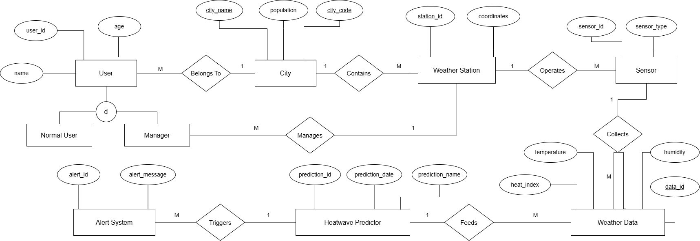

### copy below content and save the file as .xml file and then import it from draw.io
> [!check] output
>  
```xml
<mxfile host="app.diagrams.net">
  <diagram name="Page-1" id="JfxlX96EwChoTIHDk4v0">
    <mxGraphModel dx="3121" dy="1178" grid="1" gridSize="10" guides="1" tooltips="1" connect="1" arrows="1" fold="1" page="1" pageScale="1" pageWidth="850" pageHeight="1100" math="0" shadow="0">
      <root>
        <mxCell id="0" />
        <mxCell id="1" parent="0" />
        <mxCell id="rU-iaDdNUpnblvAC4TOK-1" parent="1" style="whiteSpace=wrap;html=1;rounded=0;fillColor=#ffffff;strokeColor=#000000;fontSize=16;" value="User" vertex="1">
          <mxGeometry height="65" width="150" x="90" y="177.5" as="geometry" />
        </mxCell>
        <mxCell id="rU-iaDdNUpnblvAC4TOK-2" parent="1" style="whiteSpace=wrap;html=1;rounded=0;fillColor=#ffffff;strokeColor=#000000;fontSize=16;" value="City" vertex="1">
          <mxGeometry height="65" width="150" x="530" y="177.5" as="geometry" />
        </mxCell>
        <mxCell id="rU-iaDdNUpnblvAC4TOK-3" parent="1" style="whiteSpace=wrap;html=1;rounded=0;fillColor=#ffffff;strokeColor=#000000;fontSize=16;" value="Weather Station" vertex="1">
          <mxGeometry height="65" width="190" x="930" y="170" as="geometry" />
        </mxCell>
        <mxCell id="rU-iaDdNUpnblvAC4TOK-4" parent="1" style="whiteSpace=wrap;html=1;rounded=0;fillColor=#ffffff;strokeColor=#000000;fontSize=16;" value="Sensor" vertex="1">
          <mxGeometry height="65" width="150" x="1415" y="170" as="geometry" />
        </mxCell>
        <mxCell id="rU-iaDdNUpnblvAC4TOK-5" parent="1" style="whiteSpace=wrap;html=1;rounded=0;fillColor=#ffffff;strokeColor=#000000;fontSize=16;" value="Normal User" vertex="1">
          <mxGeometry height="55" width="160" x="-30" y="335" as="geometry" />
        </mxCell>
        <mxCell id="rU-iaDdNUpnblvAC4TOK-6" parent="1" style="whiteSpace=wrap;html=1;rounded=0;fillColor=#ffffff;strokeColor=#000000;fontSize=16;" value="Manager" vertex="1">
          <mxGeometry height="55" width="160" x="210" y="335" as="geometry" />
        </mxCell>
        <mxCell id="rU-iaDdNUpnblvAC4TOK-7" parent="1" style="whiteSpace=wrap;html=1;rounded=0;fillColor=#ffffff;strokeColor=#000000;fontSize=16;" value="Alert System" vertex="1">
          <mxGeometry height="65" width="200" x="85" y="545" as="geometry" />
        </mxCell>
        <mxCell id="rU-iaDdNUpnblvAC4TOK-8" parent="1" style="whiteSpace=wrap;html=1;rounded=0;fillColor=#ffffff;strokeColor=#000000;fontSize=16;" value="Heatwave Predictor" vertex="1">
          <mxGeometry height="65" width="280" x="630" y="545" as="geometry" />
        </mxCell>
        <mxCell id="rU-iaDdNUpnblvAC4TOK-9" parent="1" style="whiteSpace=wrap;html=1;rounded=0;fillColor=#ffffff;strokeColor=#000000;fontSize=16;" value="Weather Data" vertex="1">
          <mxGeometry height="65" width="230" x="1305" y="545" as="geometry" />
        </mxCell>
        <mxCell id="rU-iaDdNUpnblvAC4TOK-10" parent="1" style="ellipse;whiteSpace=wrap;html=1;fillColor=#ffffff;strokeColor=#000000;fontSize=14;fontStyle=4;" value="user_id" vertex="1">
          <mxGeometry height="50" width="105" x="-60" y="80" as="geometry" />
        </mxCell>
        <mxCell id="rU-iaDdNUpnblvAC4TOK-11" parent="1" style="ellipse;whiteSpace=wrap;html=1;fillColor=#ffffff;strokeColor=#000000;fontSize=14;" value="name" vertex="1">
          <mxGeometry height="50" width="105" x="-95" y="185" as="geometry" />
        </mxCell>
        <mxCell id="rU-iaDdNUpnblvAC4TOK-12" parent="1" style="ellipse;whiteSpace=wrap;html=1;fillColor=#ffffff;strokeColor=#000000;fontSize=14;" value="age" vertex="1">
          <mxGeometry height="50" width="105" x="145" y="70" as="geometry" />
        </mxCell>
        <mxCell id="rU-iaDdNUpnblvAC4TOK-13" parent="1" style="ellipse;whiteSpace=wrap;html=1;fillColor=#ffffff;strokeColor=#000000;fontSize=14;fontStyle=4;" value="city_name" vertex="1">
          <mxGeometry height="50" width="115" x="385" y="30" as="geometry" />
        </mxCell>
        <mxCell id="rU-iaDdNUpnblvAC4TOK-14" parent="1" style="ellipse;whiteSpace=wrap;html=1;fillColor=#ffffff;strokeColor=#000000;fontSize=14;fontStyle=4;" value="city_code" vertex="1">
          <mxGeometry height="50" width="115" x="680" y="30" as="geometry" />
        </mxCell>
        <mxCell id="rU-iaDdNUpnblvAC4TOK-15" parent="1" style="ellipse;whiteSpace=wrap;html=1;fillColor=#ffffff;strokeColor=#000000;fontSize=14;" value="population" vertex="1">
          <mxGeometry height="50" width="120" x="540" y="30" as="geometry" />
        </mxCell>
        <mxCell id="rU-iaDdNUpnblvAC4TOK-16" parent="1" style="ellipse;whiteSpace=wrap;html=1;fillColor=#ffffff;strokeColor=#000000;fontSize=14;fontStyle=4;" value="station_id" vertex="1">
          <mxGeometry height="50" width="120" x="900" y="45" as="geometry" />
        </mxCell>
        <mxCell id="rU-iaDdNUpnblvAC4TOK-17" parent="1" style="ellipse;whiteSpace=wrap;html=1;fillColor=#ffffff;strokeColor=#000000;fontSize=14;" value="coordinates" vertex="1">
          <mxGeometry height="50" width="130" x="1050" y="45" as="geometry" />
        </mxCell>
        <mxCell id="rU-iaDdNUpnblvAC4TOK-18" parent="1" style="ellipse;whiteSpace=wrap;html=1;fillColor=#ffffff;strokeColor=#000000;fontSize=14;fontStyle=4;" value="sensor_id" vertex="1">
          <mxGeometry height="50" width="120" x="1295" y="70" as="geometry" />
        </mxCell>
        <mxCell id="rU-iaDdNUpnblvAC4TOK-19" parent="1" style="ellipse;whiteSpace=wrap;html=1;fillColor=#ffffff;strokeColor=#000000;fontSize=14;" value="sensor_type" vertex="1">
          <mxGeometry height="50" width="125" x="1440" y="70" as="geometry" />
        </mxCell>
        <mxCell id="rU-iaDdNUpnblvAC4TOK-20" parent="1" style="ellipse;whiteSpace=wrap;html=1;fillColor=#ffffff;strokeColor=#000000;fontSize=14;fontStyle=4;" value="alert_id" vertex="1">
          <mxGeometry height="50" width="105" x="45" y="435" as="geometry" />
        </mxCell>
        <mxCell id="rU-iaDdNUpnblvAC4TOK-21" parent="1" style="ellipse;whiteSpace=wrap;html=1;fillColor=#ffffff;strokeColor=#000000;fontSize=14;" value="alert_message" vertex="1">
          <mxGeometry height="50" width="135" x="200" y="435" as="geometry" />
        </mxCell>
        <mxCell id="rU-iaDdNUpnblvAC4TOK-22" parent="1" style="ellipse;whiteSpace=wrap;html=1;fillColor=#ffffff;strokeColor=#000000;fontSize=14;fontStyle=4;" value="prediction_id" vertex="1">
          <mxGeometry height="50" width="125" x="615" y="435" as="geometry" />
        </mxCell>
        <mxCell id="rU-iaDdNUpnblvAC4TOK-23" parent="1" style="ellipse;whiteSpace=wrap;html=1;fillColor=#ffffff;strokeColor=#000000;fontSize=14;" value="prediction_date" vertex="1">
          <mxGeometry height="50" width="135" x="755" y="435" as="geometry" />
        </mxCell>
        <mxCell id="rU-iaDdNUpnblvAC4TOK-24" parent="1" style="ellipse;whiteSpace=wrap;html=1;fillColor=#ffffff;strokeColor=#000000;fontSize=14;" value="prediction_name" vertex="1">
          <mxGeometry height="50" width="135" x="915" y="435" as="geometry" />
        </mxCell>
        <mxCell id="rU-iaDdNUpnblvAC4TOK-25" parent="1" style="ellipse;whiteSpace=wrap;html=1;fillColor=#ffffff;strokeColor=#000000;fontSize=14;" value="temperature" vertex="1">
          <mxGeometry height="50" width="130" x="1190" y="380" as="geometry" />
        </mxCell>
        <mxCell id="rU-iaDdNUpnblvAC4TOK-26" parent="1" style="ellipse;whiteSpace=wrap;html=1;fillColor=#ffffff;strokeColor=#000000;fontSize=14;" value="humidity" vertex="1">
          <mxGeometry height="50" width="120" x="1500" y="380" as="geometry" />
        </mxCell>
        <mxCell id="rU-iaDdNUpnblvAC4TOK-27" parent="1" style="ellipse;whiteSpace=wrap;html=1;fillColor=#ffffff;strokeColor=#000000;fontSize=14;" value="heat_index" vertex="1">
          <mxGeometry height="50" width="125" x="1130" y="460" as="geometry" />
        </mxCell>
        <mxCell id="rU-iaDdNUpnblvAC4TOK-28" parent="1" style="rhombus;whiteSpace=wrap;html=1;fillColor=#ffffff;strokeColor=#000000;fontSize=15;" value="Belongs To" vertex="1">
          <mxGeometry height="90" width="120" x="350" y="165" as="geometry" />
        </mxCell>
        <mxCell id="rU-iaDdNUpnblvAC4TOK-29" parent="1" style="rhombus;whiteSpace=wrap;html=1;fillColor=#ffffff;strokeColor=#000000;fontSize=15;" value="Contains" vertex="1">
          <mxGeometry height="90" width="120" x="725" y="165" as="geometry" />
        </mxCell>
        <mxCell id="rU-iaDdNUpnblvAC4TOK-30" parent="1" style="rhombus;whiteSpace=wrap;html=1;fillColor=#ffffff;strokeColor=#000000;fontSize=15;" value="Operates" vertex="1">
          <mxGeometry height="90" width="120" x="1200" y="157.5" as="geometry" />
        </mxCell>
        <mxCell id="rU-iaDdNUpnblvAC4TOK-31" parent="1" style="rhombus;whiteSpace=wrap;html=1;fillColor=#ffffff;strokeColor=#000000;fontSize=15;" value="Collects" vertex="1">
          <mxGeometry height="90" width="120" x="1360" y="315" as="geometry" />
        </mxCell>
        <mxCell id="rU-iaDdNUpnblvAC4TOK-32" parent="1" style="rhombus;whiteSpace=wrap;html=1;fillColor=#ffffff;strokeColor=#000000;fontSize=15;" value="Manages" vertex="1">
          <mxGeometry height="90" width="120" x="605" y="317.5" as="geometry" />
        </mxCell>
        <mxCell id="rU-iaDdNUpnblvAC4TOK-33" parent="1" style="rhombus;whiteSpace=wrap;html=1;fillColor=#ffffff;strokeColor=#000000;fontSize=15;" value="Triggers" vertex="1">
          <mxGeometry height="90" width="120" x="385" y="532.5" as="geometry" />
        </mxCell>
        <mxCell id="rU-iaDdNUpnblvAC4TOK-34" parent="1" style="rhombus;whiteSpace=wrap;html=1;fillColor=#ffffff;strokeColor=#000000;fontSize=15;" value="Feeds" vertex="1">
          <mxGeometry height="90" width="120" x="995" y="532.5" as="geometry" />
        </mxCell>
        <mxCell id="rU-iaDdNUpnblvAC4TOK-35" parent="1" style="ellipse;whiteSpace=wrap;html=1;fillColor=#ffffff;strokeColor=#000000;fontSize=16;" value="d" vertex="1">
          <mxGeometry height="50" width="50" x="140" y="280" as="geometry" />
        </mxCell>
        <mxCell id="rU-iaDdNUpnblvAC4TOK-36" edge="1" parent="1" source="rU-iaDdNUpnblvAC4TOK-1" style="edgeStyle=orthogonalEdgeStyle;rounded=0;orthogonalLoop=1;jettySize=auto;html=1;endArrow=none;startArrow=none;strokeColor=#000000;" target="rU-iaDdNUpnblvAC4TOK-28">
          <mxGeometry relative="1" as="geometry" />
        </mxCell>
        <mxCell id="rU-iaDdNUpnblvAC4TOK-37" edge="1" parent="1" source="rU-iaDdNUpnblvAC4TOK-28" style="edgeStyle=orthogonalEdgeStyle;rounded=0;orthogonalLoop=1;jettySize=auto;html=1;endArrow=none;startArrow=none;strokeColor=#000000;" target="rU-iaDdNUpnblvAC4TOK-2">
          <mxGeometry relative="1" as="geometry" />
        </mxCell>
        <mxCell id="rU-iaDdNUpnblvAC4TOK-38" edge="1" parent="1" source="rU-iaDdNUpnblvAC4TOK-2" style="edgeStyle=orthogonalEdgeStyle;rounded=0;orthogonalLoop=1;jettySize=auto;html=1;endArrow=none;startArrow=none;strokeColor=#000000;" target="rU-iaDdNUpnblvAC4TOK-29">
          <mxGeometry relative="1" as="geometry" />
        </mxCell>
        <mxCell id="rU-iaDdNUpnblvAC4TOK-39" edge="1" parent="1" source="rU-iaDdNUpnblvAC4TOK-29" style="edgeStyle=orthogonalEdgeStyle;rounded=0;orthogonalLoop=1;jettySize=auto;html=1;endArrow=none;startArrow=none;strokeColor=#000000;" target="rU-iaDdNUpnblvAC4TOK-3">
          <mxGeometry relative="1" as="geometry">
            <Array as="points">
              <mxPoint x="910" y="210" />
              <mxPoint x="910" y="210" />
            </Array>
          </mxGeometry>
        </mxCell>
        <mxCell id="rU-iaDdNUpnblvAC4TOK-40" edge="1" parent="1" source="rU-iaDdNUpnblvAC4TOK-3" style="edgeStyle=orthogonalEdgeStyle;rounded=0;orthogonalLoop=1;jettySize=auto;html=1;endArrow=none;startArrow=none;strokeColor=#000000;" target="rU-iaDdNUpnblvAC4TOK-30">
          <mxGeometry relative="1" as="geometry" />
        </mxCell>
        <mxCell id="rU-iaDdNUpnblvAC4TOK-41" edge="1" parent="1" source="rU-iaDdNUpnblvAC4TOK-30" style="edgeStyle=orthogonalEdgeStyle;rounded=0;orthogonalLoop=1;jettySize=auto;html=1;endArrow=none;startArrow=none;strokeColor=#000000;" target="rU-iaDdNUpnblvAC4TOK-4">
          <mxGeometry relative="1" as="geometry" />
        </mxCell>
        <mxCell id="rU-iaDdNUpnblvAC4TOK-42" edge="1" parent="1" source="rU-iaDdNUpnblvAC4TOK-4" style="edgeStyle=orthogonalEdgeStyle;rounded=0;orthogonalLoop=1;jettySize=auto;html=1;endArrow=none;startArrow=none;strokeColor=#000000;" target="rU-iaDdNUpnblvAC4TOK-31">
          <mxGeometry relative="1" as="geometry" />
        </mxCell>
        <mxCell id="rU-iaDdNUpnblvAC4TOK-43" edge="1" parent="1" source="rU-iaDdNUpnblvAC4TOK-6" style="edgeStyle=orthogonalEdgeStyle;rounded=0;orthogonalLoop=1;jettySize=auto;html=1;endArrow=none;startArrow=none;strokeColor=#000000;" target="rU-iaDdNUpnblvAC4TOK-32">
          <mxGeometry relative="1" as="geometry" />
        </mxCell>
        <mxCell id="rU-iaDdNUpnblvAC4TOK-44" edge="1" parent="1" source="rU-iaDdNUpnblvAC4TOK-32" style="edgeStyle=orthogonalEdgeStyle;rounded=0;orthogonalLoop=1;jettySize=auto;html=1;endArrow=none;startArrow=none;strokeColor=#000000;" target="rU-iaDdNUpnblvAC4TOK-3">
          <mxGeometry relative="1" as="geometry" />
        </mxCell>
        <mxCell id="rU-iaDdNUpnblvAC4TOK-45" edge="1" parent="1" source="rU-iaDdNUpnblvAC4TOK-7" style="edgeStyle=orthogonalEdgeStyle;rounded=0;orthogonalLoop=1;jettySize=auto;html=1;endArrow=none;startArrow=none;strokeColor=#000000;" target="rU-iaDdNUpnblvAC4TOK-33">
          <mxGeometry relative="1" as="geometry" />
        </mxCell>
        <mxCell id="rU-iaDdNUpnblvAC4TOK-46" edge="1" parent="1" source="rU-iaDdNUpnblvAC4TOK-33" style="edgeStyle=orthogonalEdgeStyle;rounded=0;orthogonalLoop=1;jettySize=auto;html=1;endArrow=none;startArrow=none;strokeColor=#000000;" target="rU-iaDdNUpnblvAC4TOK-8">
          <mxGeometry relative="1" as="geometry" />
        </mxCell>
        <mxCell id="rU-iaDdNUpnblvAC4TOK-47" edge="1" parent="1" source="rU-iaDdNUpnblvAC4TOK-8" style="edgeStyle=orthogonalEdgeStyle;rounded=0;orthogonalLoop=1;jettySize=auto;html=1;endArrow=none;startArrow=none;strokeColor=#000000;" target="rU-iaDdNUpnblvAC4TOK-34">
          <mxGeometry relative="1" as="geometry" />
        </mxCell>
        <mxCell id="rU-iaDdNUpnblvAC4TOK-48" edge="1" parent="1" source="rU-iaDdNUpnblvAC4TOK-34" style="edgeStyle=orthogonalEdgeStyle;rounded=0;orthogonalLoop=1;jettySize=auto;html=1;endArrow=none;startArrow=none;strokeColor=#000000;" target="rU-iaDdNUpnblvAC4TOK-9">
          <mxGeometry relative="1" as="geometry" />
        </mxCell>
        <mxCell id="rU-iaDdNUpnblvAC4TOK-49" edge="1" parent="1" source="rU-iaDdNUpnblvAC4TOK-1" style="edgeStyle=orthogonalEdgeStyle;rounded=0;orthogonalLoop=1;jettySize=auto;html=1;endArrow=none;startArrow=none;strokeColor=#000000;" target="rU-iaDdNUpnblvAC4TOK-35">
          <mxGeometry relative="1" as="geometry" />
        </mxCell>
        <mxCell id="rU-iaDdNUpnblvAC4TOK-50" edge="1" parent="1" source="rU-iaDdNUpnblvAC4TOK-35" style="edgeStyle=orthogonalEdgeStyle;rounded=0;orthogonalLoop=1;jettySize=auto;html=1;endArrow=none;startArrow=none;strokeColor=#000000;" target="rU-iaDdNUpnblvAC4TOK-5">
          <mxGeometry relative="1" as="geometry" />
        </mxCell>
        <mxCell id="rU-iaDdNUpnblvAC4TOK-51" edge="1" parent="1" source="rU-iaDdNUpnblvAC4TOK-35" style="edgeStyle=orthogonalEdgeStyle;rounded=0;orthogonalLoop=1;jettySize=auto;html=1;endArrow=none;startArrow=none;strokeColor=#000000;" target="rU-iaDdNUpnblvAC4TOK-6">
          <mxGeometry relative="1" as="geometry" />
        </mxCell>
        <mxCell id="rU-iaDdNUpnblvAC4TOK-52" edge="1" parent="1" source="rU-iaDdNUpnblvAC4TOK-10" style="edgeStyle=orthogonalEdgeStyle;rounded=0;orthogonalLoop=1;jettySize=auto;html=1;endArrow=none;startArrow=none;strokeColor=#000000;" target="rU-iaDdNUpnblvAC4TOK-1">
          <mxGeometry relative="1" as="geometry">
            <Array as="points">
              <mxPoint x="110.06" y="105.06" />
            </Array>
          </mxGeometry>
        </mxCell>
        <mxCell id="rU-iaDdNUpnblvAC4TOK-53" edge="1" parent="1" source="rU-iaDdNUpnblvAC4TOK-11" style="edgeStyle=orthogonalEdgeStyle;rounded=0;orthogonalLoop=1;jettySize=auto;html=1;endArrow=none;startArrow=none;strokeColor=#000000;" target="rU-iaDdNUpnblvAC4TOK-1">
          <mxGeometry relative="1" as="geometry" />
        </mxCell>
        <mxCell id="rU-iaDdNUpnblvAC4TOK-54" edge="1" parent="1" style="edgeStyle=orthogonalEdgeStyle;rounded=0;orthogonalLoop=1;jettySize=auto;html=1;endArrow=none;startArrow=none;strokeColor=#000000;exitX=0.5;exitY=1;exitDx=0;exitDy=0;">
          <mxGeometry relative="1" as="geometry">
            <Array as="points">
              <mxPoint x="195" y="170" />
            </Array>
            <mxPoint x="195" y="120" as="sourcePoint" />
            <mxPoint x="197.57999999999993" y="170" as="targetPoint" />
          </mxGeometry>
        </mxCell>
        <mxCell id="rU-iaDdNUpnblvAC4TOK-55" edge="1" parent="1" source="rU-iaDdNUpnblvAC4TOK-13" style="edgeStyle=orthogonalEdgeStyle;rounded=0;orthogonalLoop=1;jettySize=auto;html=1;endArrow=none;startArrow=none;strokeColor=#000000;exitX=0.5;exitY=1;exitDx=0;exitDy=0;" target="rU-iaDdNUpnblvAC4TOK-2">
          <mxGeometry relative="1" as="geometry">
            <Array as="points">
              <mxPoint x="442.5" y="100" />
              <mxPoint x="560" y="100" />
            </Array>
          </mxGeometry>
        </mxCell>
        <mxCell id="rU-iaDdNUpnblvAC4TOK-56" edge="1" parent="1" source="rU-iaDdNUpnblvAC4TOK-14" style="edgeStyle=orthogonalEdgeStyle;rounded=0;orthogonalLoop=1;jettySize=auto;html=1;endArrow=none;startArrow=none;strokeColor=#000000;exitX=0.5;exitY=1;exitDx=0;exitDy=0;" target="rU-iaDdNUpnblvAC4TOK-2">
          <mxGeometry relative="1" as="geometry">
            <Array as="points">
              <mxPoint x="650" y="95" />
            </Array>
          </mxGeometry>
        </mxCell>
        <mxCell id="rU-iaDdNUpnblvAC4TOK-57" edge="1" parent="1" source="rU-iaDdNUpnblvAC4TOK-15" style="edgeStyle=orthogonalEdgeStyle;rounded=0;orthogonalLoop=1;jettySize=auto;html=1;endArrow=none;startArrow=none;strokeColor=#000000;exitX=0.5;exitY=1;exitDx=0;exitDy=0;" target="rU-iaDdNUpnblvAC4TOK-2">
          <mxGeometry relative="1" as="geometry">
            <Array as="points">
              <mxPoint x="600" y="100" />
              <mxPoint x="600" y="100" />
            </Array>
          </mxGeometry>
        </mxCell>
        <mxCell id="rU-iaDdNUpnblvAC4TOK-58" edge="1" parent="1" source="rU-iaDdNUpnblvAC4TOK-16" style="edgeStyle=orthogonalEdgeStyle;rounded=0;orthogonalLoop=1;jettySize=auto;html=1;endArrow=none;startArrow=none;strokeColor=#000000;" target="rU-iaDdNUpnblvAC4TOK-3">
          <mxGeometry relative="1" as="geometry">
            <Array as="points">
              <mxPoint x="960" y="150" />
              <mxPoint x="960" y="150" />
            </Array>
          </mxGeometry>
        </mxCell>
        <mxCell id="rU-iaDdNUpnblvAC4TOK-59" edge="1" parent="1" source="rU-iaDdNUpnblvAC4TOK-17" style="edgeStyle=orthogonalEdgeStyle;rounded=0;orthogonalLoop=1;jettySize=auto;html=1;endArrow=none;startArrow=none;strokeColor=#000000;" target="rU-iaDdNUpnblvAC4TOK-3">
          <mxGeometry relative="1" as="geometry">
            <Array as="points">
              <mxPoint x="1115" y="150" />
              <mxPoint x="1115" y="150" />
            </Array>
          </mxGeometry>
        </mxCell>
        <mxCell id="rU-iaDdNUpnblvAC4TOK-60" edge="1" parent="1" source="rU-iaDdNUpnblvAC4TOK-18" style="edgeStyle=orthogonalEdgeStyle;rounded=0;orthogonalLoop=1;jettySize=auto;html=1;endArrow=none;startArrow=none;strokeColor=#000000;" target="rU-iaDdNUpnblvAC4TOK-4">
          <mxGeometry relative="1" as="geometry">
            <Array as="points">
              <mxPoint x="1355" y="132.5" />
              <mxPoint x="1430" y="132.5" />
            </Array>
          </mxGeometry>
        </mxCell>
        <mxCell id="rU-iaDdNUpnblvAC4TOK-61" edge="1" parent="1" source="rU-iaDdNUpnblvAC4TOK-19" style="edgeStyle=orthogonalEdgeStyle;rounded=0;orthogonalLoop=1;jettySize=auto;html=1;endArrow=none;startArrow=none;strokeColor=#000000;" target="rU-iaDdNUpnblvAC4TOK-4">
          <mxGeometry relative="1" as="geometry">
            <Array as="points">
              <mxPoint x="1507.5" y="150" />
              <mxPoint x="1507.5" y="150" />
            </Array>
          </mxGeometry>
        </mxCell>
        <mxCell id="rU-iaDdNUpnblvAC4TOK-62" edge="1" parent="1" source="rU-iaDdNUpnblvAC4TOK-20" style="edgeStyle=orthogonalEdgeStyle;rounded=0;orthogonalLoop=1;jettySize=auto;html=1;endArrow=none;startArrow=none;strokeColor=#000000;" target="rU-iaDdNUpnblvAC4TOK-7">
          <mxGeometry relative="1" as="geometry">
            <Array as="points">
              <mxPoint x="97.48" y="525" />
              <mxPoint x="97.48" y="525" />
            </Array>
          </mxGeometry>
        </mxCell>
        <mxCell id="rU-iaDdNUpnblvAC4TOK-63" edge="1" parent="1" source="rU-iaDdNUpnblvAC4TOK-21" style="edgeStyle=orthogonalEdgeStyle;rounded=0;orthogonalLoop=1;jettySize=auto;html=1;endArrow=none;startArrow=none;strokeColor=#000000;" target="rU-iaDdNUpnblvAC4TOK-7">
          <mxGeometry relative="1" as="geometry">
            <Array as="points">
              <mxPoint x="267.5" y="535" />
              <mxPoint x="267.5" y="535" />
            </Array>
          </mxGeometry>
        </mxCell>
        <mxCell id="rU-iaDdNUpnblvAC4TOK-64" edge="1" parent="1" source="rU-iaDdNUpnblvAC4TOK-22" style="edgeStyle=orthogonalEdgeStyle;rounded=0;orthogonalLoop=1;jettySize=auto;html=1;endArrow=none;startArrow=none;strokeColor=#000000;exitX=0.5;exitY=1;exitDx=0;exitDy=0;" target="rU-iaDdNUpnblvAC4TOK-8">
          <mxGeometry relative="1" as="geometry">
            <Array as="points">
              <mxPoint x="675" y="485.03" />
            </Array>
          </mxGeometry>
        </mxCell>
        <mxCell id="rU-iaDdNUpnblvAC4TOK-65" edge="1" parent="1" source="rU-iaDdNUpnblvAC4TOK-23" style="edgeStyle=orthogonalEdgeStyle;rounded=0;orthogonalLoop=1;jettySize=auto;html=1;endArrow=none;startArrow=none;strokeColor=#000000;entryX=0.366;entryY=0;entryDx=0;entryDy=0;entryPerimeter=0;" target="rU-iaDdNUpnblvAC4TOK-8">
          <mxGeometry relative="1" as="geometry">
            <Array as="points">
              <mxPoint x="822.49" y="545.03" />
            </Array>
          </mxGeometry>
        </mxCell>
        <mxCell id="rU-iaDdNUpnblvAC4TOK-66" edge="1" parent="1" source="rU-iaDdNUpnblvAC4TOK-24" style="edgeStyle=orthogonalEdgeStyle;rounded=0;orthogonalLoop=1;jettySize=auto;html=1;endArrow=none;startArrow=none;strokeColor=#000000;exitX=0.5;exitY=1;exitDx=0;exitDy=0;entryX=0.917;entryY=0.015;entryDx=0;entryDy=0;entryPerimeter=0;" target="rU-iaDdNUpnblvAC4TOK-8">
          <mxGeometry relative="1" as="geometry">
            <mxPoint x="967.5" y="640" as="sourcePoint" />
            <mxPoint x="815" y="610" as="targetPoint" />
          </mxGeometry>
        </mxCell>
        <mxCell id="rU-iaDdNUpnblvAC4TOK-67" edge="1" parent="1" source="rU-iaDdNUpnblvAC4TOK-25" style="edgeStyle=orthogonalEdgeStyle;rounded=0;orthogonalLoop=1;jettySize=auto;html=1;endArrow=none;startArrow=none;strokeColor=#000000;" target="rU-iaDdNUpnblvAC4TOK-9">
          <mxGeometry relative="1" as="geometry">
            <Array as="points">
              <mxPoint x="1360" y="500" />
              <mxPoint x="1360" y="500" />
            </Array>
          </mxGeometry>
        </mxCell>
        <mxCell id="rU-iaDdNUpnblvAC4TOK-68" edge="1" parent="1" source="rU-iaDdNUpnblvAC4TOK-26" style="edgeStyle=orthogonalEdgeStyle;rounded=0;orthogonalLoop=1;jettySize=auto;html=1;endArrow=none;startArrow=none;strokeColor=#000000;" target="rU-iaDdNUpnblvAC4TOK-9">
          <mxGeometry relative="1" as="geometry">
            <Array as="points">
              <mxPoint x="1480" y="510" />
              <mxPoint x="1480" y="510" />
            </Array>
          </mxGeometry>
        </mxCell>
        <mxCell id="rU-iaDdNUpnblvAC4TOK-69" edge="1" parent="1" source="rU-iaDdNUpnblvAC4TOK-27" style="edgeStyle=orthogonalEdgeStyle;rounded=0;orthogonalLoop=1;jettySize=auto;html=1;endArrow=none;startArrow=none;strokeColor=#000000;" target="rU-iaDdNUpnblvAC4TOK-9">
          <mxGeometry relative="1" as="geometry">
            <Array as="points">
              <mxPoint x="1320" y="485" />
            </Array>
          </mxGeometry>
        </mxCell>
        <mxCell id="rU-iaDdNUpnblvAC4TOK-70" parent="1" style="text;html=1;strokeColor=none;fillColor=none;align=center;verticalAlign=middle;fontSize=14;" value="M" vertex="1">
          <mxGeometry height="30" width="35" x="280" y="185" as="geometry" />
        </mxCell>
        <mxCell id="rU-iaDdNUpnblvAC4TOK-71" parent="1" style="text;html=1;strokeColor=none;fillColor=none;align=center;verticalAlign=middle;fontSize=14;" value="1" vertex="1">
          <mxGeometry height="30" width="35" x="480" y="177.5" as="geometry" />
        </mxCell>
        <mxCell id="rU-iaDdNUpnblvAC4TOK-72" parent="1" style="text;html=1;strokeColor=none;fillColor=none;align=center;verticalAlign=middle;fontSize=14;" value="1" vertex="1">
          <mxGeometry height="30" width="35" x="685" y="177.5" as="geometry" />
        </mxCell>
        <mxCell id="rU-iaDdNUpnblvAC4TOK-73" parent="1" style="text;html=1;strokeColor=none;fillColor=none;align=center;verticalAlign=middle;fontSize=14;" value="M" vertex="1">
          <mxGeometry height="30" width="35" x="865" y="177.5" as="geometry" />
        </mxCell>
        <mxCell id="rU-iaDdNUpnblvAC4TOK-74" parent="1" style="text;html=1;strokeColor=none;fillColor=none;align=center;verticalAlign=middle;fontSize=14;" value="1" vertex="1">
          <mxGeometry height="30" width="35" x="1143" y="177.5" as="geometry" />
        </mxCell>
        <mxCell id="rU-iaDdNUpnblvAC4TOK-75" parent="1" style="text;html=1;strokeColor=none;fillColor=none;align=center;verticalAlign=middle;fontSize=14;" value="M" vertex="1">
          <mxGeometry height="30" width="35" x="1350" y="177.5" as="geometry" />
        </mxCell>
        <mxCell id="rU-iaDdNUpnblvAC4TOK-76" parent="1" style="text;html=1;strokeColor=none;fillColor=none;align=center;verticalAlign=middle;fontSize=14;" value="1" vertex="1">
          <mxGeometry height="30" width="35" x="1387.5" y="260" as="geometry" />
        </mxCell>
        <mxCell id="rU-iaDdNUpnblvAC4TOK-77" parent="1" style="text;html=1;strokeColor=none;fillColor=none;align=center;verticalAlign=middle;fontSize=14;" value="M" vertex="1">
          <mxGeometry height="30" width="35" x="1380" y="450" as="geometry" />
        </mxCell>
        <mxCell id="rU-iaDdNUpnblvAC4TOK-78" parent="1" style="text;html=1;strokeColor=none;fillColor=none;align=center;verticalAlign=middle;fontSize=14;" value="M" vertex="1">
          <mxGeometry height="30" width="35" x="515" y="330" as="geometry" />
        </mxCell>
        <mxCell id="rU-iaDdNUpnblvAC4TOK-79" parent="1" style="text;html=1;strokeColor=none;fillColor=none;align=center;verticalAlign=middle;fontSize=14;" value="1" vertex="1">
          <mxGeometry height="30" width="35" x="900" y="330" as="geometry" />
        </mxCell>
        <mxCell id="rU-iaDdNUpnblvAC4TOK-80" parent="1" style="text;html=1;strokeColor=none;fillColor=none;align=center;verticalAlign=middle;fontSize=14;" value="M" vertex="1">
          <mxGeometry height="30" width="35" x="320" y="545" as="geometry" />
        </mxCell>
        <mxCell id="rU-iaDdNUpnblvAC4TOK-81" parent="1" style="text;html=1;strokeColor=none;fillColor=none;align=center;verticalAlign=middle;fontSize=14;" value="1" vertex="1">
          <mxGeometry height="30" width="35" x="545" y="545" as="geometry" />
        </mxCell>
        <mxCell id="rU-iaDdNUpnblvAC4TOK-82" parent="1" style="text;html=1;strokeColor=none;fillColor=none;align=center;verticalAlign=middle;fontSize=14;" value="1" vertex="1">
          <mxGeometry height="30" width="35" x="935" y="545" as="geometry" />
        </mxCell>
        <mxCell id="rU-iaDdNUpnblvAC4TOK-83" parent="1" style="text;html=1;strokeColor=none;fillColor=none;align=center;verticalAlign=middle;fontSize=14;" value="M" vertex="1">
          <mxGeometry height="30" width="35" x="1200" y="545" as="geometry" />
        </mxCell>
        <mxCell id="rU-iaDdNUpnblvAC4TOK-84" edge="1" parent="1" source="rU-iaDdNUpnblvAC4TOK-31" style="edgeStyle=orthogonalEdgeStyle;rounded=0;orthogonalLoop=1;jettySize=auto;html=1;endArrow=none;startArrow=none;strokeColor=#000000;exitX=0.5;exitY=1;exitDx=0;exitDy=0;entryX=0.582;entryY=-0.008;entryDx=0;entryDy=0;entryPerimeter=0;" target="rU-iaDdNUpnblvAC4TOK-9">
          <mxGeometry relative="1" as="geometry">
            <Array as="points">
              <mxPoint x="1433.9" y="405" />
            </Array>
            <mxPoint x="1425" y="290" as="sourcePoint" />
            <mxPoint x="1433.4" y="545" as="targetPoint" />
          </mxGeometry>
        </mxCell>
        <mxCell id="rU-iaDdNUpnblvAC4TOK-85" edge="1" parent="1" source="rU-iaDdNUpnblvAC4TOK-31" style="edgeStyle=orthogonalEdgeStyle;rounded=0;orthogonalLoop=1;jettySize=auto;html=1;endArrow=none;startArrow=none;strokeColor=#000000;exitX=0.5;exitY=1;exitDx=0;exitDy=0;entryX=0.5;entryY=0;entryDx=0;entryDy=0;" target="rU-iaDdNUpnblvAC4TOK-9">
          <mxGeometry relative="1" as="geometry">
            <Array as="points">
              <mxPoint x="1410" y="405" />
            </Array>
            <mxPoint x="1430" y="415" as="sourcePoint" />
            <mxPoint x="1443.4" y="555" as="targetPoint" />
          </mxGeometry>
        </mxCell>
        <mxCell id="rU-iaDdNUpnblvAC4TOK-86" parent="1" style="ellipse;whiteSpace=wrap;html=1;fillColor=#ffffff;strokeColor=#000000;fontSize=14;" value="&lt;u&gt;data_id&lt;/u&gt;" vertex="1">
          <mxGeometry height="50" width="120" x="1500" y="465" as="geometry" />
        </mxCell>
        <mxCell id="rU-iaDdNUpnblvAC4TOK-87" edge="1" parent="1" source="rU-iaDdNUpnblvAC4TOK-86" style="edgeStyle=orthogonalEdgeStyle;rounded=0;orthogonalLoop=1;jettySize=auto;html=1;endArrow=none;startArrow=none;strokeColor=#000000;exitX=0.5;exitY=1;exitDx=0;exitDy=0;entryX=0.996;entryY=0.56;entryDx=0;entryDy=0;entryPerimeter=0;" target="rU-iaDdNUpnblvAC4TOK-9">
          <mxGeometry relative="1" as="geometry">
            <Array as="points">
              <mxPoint x="1560" y="577.5" />
              <mxPoint x="1534.1" y="577.5" />
            </Array>
            <mxPoint x="1550" y="600" as="sourcePoint" />
            <mxPoint x="1600" y="635" as="targetPoint" />
          </mxGeometry>
        </mxCell>
      </root>
    </mxGraphModel>
  </diagram>
</mxfile>
