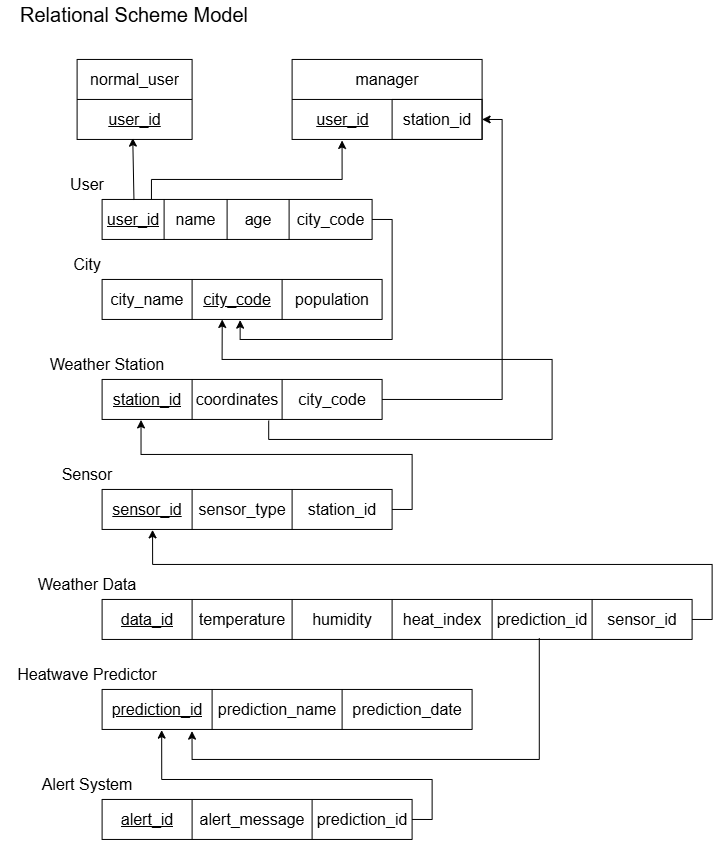

## copy below and save as .xml and import in draw.io
> [!abstract] Output
>  
```xml
<?xml version="1.0" encoding="UTF-8"?>
<mxfile host="app.diagrams.net">
  <diagram name="Relational Schema Model" id="JfxlX96EwChoTIHDk4v0">
    <mxGraphModel dx="705" dy="389" grid="1" gridSize="10" guides="1" tooltips="1" connect="1" arrows="1" fold="1" page="1" pageScale="1" pageWidth="850" pageHeight="1100" math="0" shadow="0">
      <root>
        <mxCell id="0" />
        <mxCell id="1" parent="0" />
        <object label="" eee="ee" id="rU-iaDdNUpnblvAC4TOK-269">
          <mxCell parent="1" style="shape=table;startSize=0;container=1;collapsible=0;childLayout=tableLayout;fontSize=16;" vertex="1">
            <mxGeometry height="40" width="270" x="110" y="200" as="geometry" />
          </mxCell>
        </object>
        <mxCell id="rU-iaDdNUpnblvAC4TOK-270" parent="rU-iaDdNUpnblvAC4TOK-269" style="shape=tableRow;horizontal=0;startSize=0;swimlaneHead=0;swimlaneBody=0;strokeColor=inherit;top=0;left=0;bottom=0;right=0;collapsible=0;dropTarget=0;fillColor=none;points=[[0,0.5],[1,0.5]];portConstraint=eastwest;fontSize=16;" value="" vertex="1">
          <mxGeometry height="40" width="270" as="geometry" />
        </mxCell>
        <mxCell id="rU-iaDdNUpnblvAC4TOK-271" parent="rU-iaDdNUpnblvAC4TOK-270" style="shape=partialRectangle;html=1;whiteSpace=wrap;connectable=0;strokeColor=inherit;overflow=hidden;fillColor=none;top=0;left=0;bottom=0;right=0;pointerEvents=1;fontSize=16;" value="&lt;u&gt;user_id&lt;/u&gt;" vertex="1">
          <mxGeometry height="40" width="62" as="geometry">
            <mxRectangle height="40" width="62" as="alternateBounds" />
          </mxGeometry>
        </mxCell>
        <mxCell id="rU-iaDdNUpnblvAC4TOK-272" parent="rU-iaDdNUpnblvAC4TOK-270" style="shape=partialRectangle;html=1;whiteSpace=wrap;connectable=0;strokeColor=inherit;overflow=hidden;fillColor=none;top=0;left=0;bottom=0;right=0;pointerEvents=1;fontSize=16;" value="name" vertex="1">
          <mxGeometry height="40" width="63" x="62" as="geometry">
            <mxRectangle height="40" width="63" as="alternateBounds" />
          </mxGeometry>
        </mxCell>
        <mxCell id="rU-iaDdNUpnblvAC4TOK-273" parent="rU-iaDdNUpnblvAC4TOK-270" style="shape=partialRectangle;html=1;whiteSpace=wrap;connectable=0;strokeColor=inherit;overflow=hidden;fillColor=none;top=0;left=0;bottom=0;right=0;pointerEvents=1;fontSize=16;" value="age" vertex="1">
          <mxGeometry height="40" width="62" x="125" as="geometry">
            <mxRectangle height="40" width="62" as="alternateBounds" />
          </mxGeometry>
        </mxCell>
        <mxCell id="rU-iaDdNUpnblvAC4TOK-294" parent="rU-iaDdNUpnblvAC4TOK-270" style="shape=partialRectangle;html=1;whiteSpace=wrap;connectable=0;strokeColor=inherit;overflow=hidden;fillColor=none;top=0;left=0;bottom=0;right=0;pointerEvents=1;fontSize=16;" value="city_code" vertex="1">
          <mxGeometry height="40" width="83" x="187" as="geometry">
            <mxRectangle height="40" width="83" as="alternateBounds" />
          </mxGeometry>
        </mxCell>
        <object label="" eee="ee" id="rU-iaDdNUpnblvAC4TOK-295">
          <mxCell parent="1" style="shape=table;startSize=0;container=1;collapsible=0;childLayout=tableLayout;fontSize=16;" vertex="1">
            <mxGeometry height="40" width="280" x="110" y="280" as="geometry" />
          </mxCell>
        </object>
        <mxCell id="rU-iaDdNUpnblvAC4TOK-296" parent="rU-iaDdNUpnblvAC4TOK-295" style="shape=tableRow;horizontal=0;startSize=0;swimlaneHead=0;swimlaneBody=0;strokeColor=inherit;top=0;left=0;bottom=0;right=0;collapsible=0;dropTarget=0;fillColor=none;points=[[0,0.5],[1,0.5]];portConstraint=eastwest;fontSize=16;" value="" vertex="1">
          <mxGeometry height="40" width="280" as="geometry" />
        </mxCell>
        <mxCell id="rU-iaDdNUpnblvAC4TOK-297" parent="rU-iaDdNUpnblvAC4TOK-296" style="shape=partialRectangle;html=1;whiteSpace=wrap;connectable=0;strokeColor=inherit;overflow=hidden;fillColor=none;top=0;left=0;bottom=0;right=0;pointerEvents=1;fontSize=16;align=center;" value="city_name" vertex="1">
          <mxGeometry height="40" width="90" as="geometry">
            <mxRectangle height="40" width="90" as="alternateBounds" />
          </mxGeometry>
        </mxCell>
        <mxCell id="rU-iaDdNUpnblvAC4TOK-298" parent="rU-iaDdNUpnblvAC4TOK-296" style="shape=partialRectangle;html=1;whiteSpace=wrap;connectable=0;strokeColor=inherit;overflow=hidden;fillColor=none;top=0;left=0;bottom=0;right=0;pointerEvents=1;fontSize=16;" value="&lt;u&gt;city_code&lt;/u&gt;" vertex="1">
          <mxGeometry height="40" width="90" x="90" as="geometry">
            <mxRectangle height="40" width="90" as="alternateBounds" />
          </mxGeometry>
        </mxCell>
        <mxCell id="rU-iaDdNUpnblvAC4TOK-299" parent="rU-iaDdNUpnblvAC4TOK-296" style="shape=partialRectangle;html=1;whiteSpace=wrap;connectable=0;strokeColor=inherit;overflow=hidden;fillColor=none;top=0;left=0;bottom=0;right=0;pointerEvents=1;fontSize=16;" value="population" vertex="1">
          <mxGeometry height="40" width="100" x="180" as="geometry">
            <mxRectangle height="40" width="100" as="alternateBounds" />
          </mxGeometry>
        </mxCell>
        <object label="" eee="ee" id="rU-iaDdNUpnblvAC4TOK-303">
          <mxCell parent="1" style="shape=table;startSize=0;container=1;collapsible=0;childLayout=tableLayout;fontSize=16;" vertex="1">
            <mxGeometry height="40" width="280" x="110" y="380" as="geometry" />
          </mxCell>
        </object>
        <mxCell id="rU-iaDdNUpnblvAC4TOK-304" parent="rU-iaDdNUpnblvAC4TOK-303" style="shape=tableRow;horizontal=0;startSize=0;swimlaneHead=0;swimlaneBody=0;strokeColor=inherit;top=0;left=0;bottom=0;right=0;collapsible=0;dropTarget=0;fillColor=none;points=[[0,0.5],[1,0.5]];portConstraint=eastwest;fontSize=16;" value="" vertex="1">
          <mxGeometry height="40" width="280" as="geometry" />
        </mxCell>
        <mxCell id="rU-iaDdNUpnblvAC4TOK-305" parent="rU-iaDdNUpnblvAC4TOK-304" style="shape=partialRectangle;html=1;whiteSpace=wrap;connectable=0;strokeColor=inherit;overflow=hidden;fillColor=none;top=0;left=0;bottom=0;right=0;pointerEvents=1;fontSize=16;align=center;" value="&lt;u&gt;station_id&lt;/u&gt;" vertex="1">
          <mxGeometry height="40" width="90" as="geometry">
            <mxRectangle height="40" width="90" as="alternateBounds" />
          </mxGeometry>
        </mxCell>
        <mxCell id="rU-iaDdNUpnblvAC4TOK-306" parent="rU-iaDdNUpnblvAC4TOK-304" style="shape=partialRectangle;html=1;whiteSpace=wrap;connectable=0;strokeColor=inherit;overflow=hidden;fillColor=none;top=0;left=0;bottom=0;right=0;pointerEvents=1;fontSize=16;" value="coordinates" vertex="1">
          <mxGeometry height="40" width="90" x="90" as="geometry">
            <mxRectangle height="40" width="90" as="alternateBounds" />
          </mxGeometry>
        </mxCell>
        <mxCell id="rU-iaDdNUpnblvAC4TOK-307" parent="rU-iaDdNUpnblvAC4TOK-304" style="shape=partialRectangle;html=1;whiteSpace=wrap;connectable=0;strokeColor=inherit;overflow=hidden;fillColor=none;top=0;left=0;bottom=0;right=0;pointerEvents=1;fontSize=16;" value="city_code" vertex="1">
          <mxGeometry height="40" width="100" x="180" as="geometry">
            <mxRectangle height="40" width="100" as="alternateBounds" />
          </mxGeometry>
        </mxCell>
        <object label="" eee="ee" id="rU-iaDdNUpnblvAC4TOK-310">
          <mxCell parent="1" style="shape=table;startSize=0;container=1;collapsible=0;childLayout=tableLayout;fontSize=16;" vertex="1">
            <mxGeometry height="40" width="290" x="110" y="490" as="geometry" />
          </mxCell>
        </object>
        <mxCell id="rU-iaDdNUpnblvAC4TOK-311" parent="rU-iaDdNUpnblvAC4TOK-310" style="shape=tableRow;horizontal=0;startSize=0;swimlaneHead=0;swimlaneBody=0;strokeColor=inherit;top=0;left=0;bottom=0;right=0;collapsible=0;dropTarget=0;fillColor=none;points=[[0,0.5],[1,0.5]];portConstraint=eastwest;fontSize=16;" value="" vertex="1">
          <mxGeometry height="40" width="290" as="geometry" />
        </mxCell>
        <mxCell id="rU-iaDdNUpnblvAC4TOK-312" parent="rU-iaDdNUpnblvAC4TOK-311" style="shape=partialRectangle;html=1;whiteSpace=wrap;connectable=0;strokeColor=inherit;overflow=hidden;fillColor=none;top=0;left=0;bottom=0;right=0;pointerEvents=1;fontSize=16;align=center;" value="&lt;u&gt;sensor_id&lt;/u&gt;" vertex="1">
          <mxGeometry height="40" width="90" as="geometry">
            <mxRectangle height="40" width="90" as="alternateBounds" />
          </mxGeometry>
        </mxCell>
        <mxCell id="rU-iaDdNUpnblvAC4TOK-313" parent="rU-iaDdNUpnblvAC4TOK-311" style="shape=partialRectangle;html=1;whiteSpace=wrap;connectable=0;strokeColor=inherit;overflow=hidden;fillColor=none;top=0;left=0;bottom=0;right=0;pointerEvents=1;fontSize=16;" value="sensor_type" vertex="1">
          <mxGeometry height="40" width="100" x="90" as="geometry">
            <mxRectangle height="40" width="100" as="alternateBounds" />
          </mxGeometry>
        </mxCell>
        <mxCell id="rU-iaDdNUpnblvAC4TOK-314" parent="rU-iaDdNUpnblvAC4TOK-311" style="shape=partialRectangle;html=1;whiteSpace=wrap;connectable=0;strokeColor=inherit;overflow=hidden;fillColor=none;top=0;left=0;bottom=0;right=0;pointerEvents=1;fontSize=16;" value="station_id" vertex="1">
          <mxGeometry height="40" width="100" x="190" as="geometry">
            <mxRectangle height="40" width="100" as="alternateBounds" />
          </mxGeometry>
        </mxCell>
        <object label="" eee="ee" id="rU-iaDdNUpnblvAC4TOK-315">
          <mxCell parent="1" style="shape=table;startSize=0;container=1;collapsible=0;childLayout=tableLayout;fontSize=16;" vertex="1">
            <mxGeometry height="40" width="590" x="110" y="600" as="geometry" />
          </mxCell>
        </object>
        <mxCell id="rU-iaDdNUpnblvAC4TOK-316" parent="rU-iaDdNUpnblvAC4TOK-315" style="shape=tableRow;horizontal=0;startSize=0;swimlaneHead=0;swimlaneBody=0;strokeColor=inherit;top=0;left=0;bottom=0;right=0;collapsible=0;dropTarget=0;fillColor=none;points=[[0,0.5],[1,0.5]];portConstraint=eastwest;fontSize=16;" value="" vertex="1">
          <mxGeometry height="40" width="590" as="geometry" />
        </mxCell>
        <mxCell id="rU-iaDdNUpnblvAC4TOK-317" parent="rU-iaDdNUpnblvAC4TOK-316" style="shape=partialRectangle;html=1;whiteSpace=wrap;connectable=0;strokeColor=inherit;overflow=hidden;fillColor=none;top=0;left=0;bottom=0;right=0;pointerEvents=1;fontSize=16;align=center;" value="&lt;u&gt;data_id&lt;/u&gt;" vertex="1">
          <mxGeometry height="40" width="90" as="geometry">
            <mxRectangle height="40" width="90" as="alternateBounds" />
          </mxGeometry>
        </mxCell>
        <mxCell id="rU-iaDdNUpnblvAC4TOK-318" parent="rU-iaDdNUpnblvAC4TOK-316" style="shape=partialRectangle;html=1;whiteSpace=wrap;connectable=0;strokeColor=inherit;overflow=hidden;fillColor=none;top=0;left=0;bottom=0;right=0;pointerEvents=1;fontSize=16;" value="temperature" vertex="1">
          <mxGeometry height="40" width="100" x="90" as="geometry">
            <mxRectangle height="40" width="100" as="alternateBounds" />
          </mxGeometry>
        </mxCell>
        <mxCell id="rU-iaDdNUpnblvAC4TOK-319" parent="rU-iaDdNUpnblvAC4TOK-316" style="shape=partialRectangle;html=1;whiteSpace=wrap;connectable=0;strokeColor=inherit;overflow=hidden;fillColor=none;top=0;left=0;bottom=0;right=0;pointerEvents=1;fontSize=16;" value="humidity" vertex="1">
          <mxGeometry height="40" width="100" x="190" as="geometry">
            <mxRectangle height="40" width="100" as="alternateBounds" />
          </mxGeometry>
        </mxCell>
        <mxCell id="rU-iaDdNUpnblvAC4TOK-320" parent="rU-iaDdNUpnblvAC4TOK-316" style="shape=partialRectangle;html=1;whiteSpace=wrap;connectable=0;strokeColor=inherit;overflow=hidden;fillColor=none;top=0;left=0;bottom=0;right=0;pointerEvents=1;fontSize=16;" value="heat_index" vertex="1">
          <mxGeometry height="40" width="100" x="290" as="geometry">
            <mxRectangle height="40" width="100" as="alternateBounds" />
          </mxGeometry>
        </mxCell>
        <mxCell id="rU-iaDdNUpnblvAC4TOK-321" parent="rU-iaDdNUpnblvAC4TOK-316" style="shape=partialRectangle;html=1;whiteSpace=wrap;connectable=0;strokeColor=inherit;overflow=hidden;fillColor=none;top=0;left=0;bottom=0;right=0;pointerEvents=1;fontSize=16;" value="prediction_id" vertex="1">
          <mxGeometry height="40" width="100" x="390" as="geometry">
            <mxRectangle height="40" width="100" as="alternateBounds" />
          </mxGeometry>
        </mxCell>
        <mxCell id="rU-iaDdNUpnblvAC4TOK-403" parent="rU-iaDdNUpnblvAC4TOK-316" style="shape=partialRectangle;html=1;whiteSpace=wrap;connectable=0;strokeColor=inherit;overflow=hidden;fillColor=none;top=0;left=0;bottom=0;right=0;pointerEvents=1;fontSize=16;" value="sensor_id" vertex="1">
          <mxGeometry height="40" width="100" x="490" as="geometry">
            <mxRectangle height="40" width="100" as="alternateBounds" />
          </mxGeometry>
        </mxCell>
        <object label="" eee="ee" id="rU-iaDdNUpnblvAC4TOK-328">
          <mxCell parent="1" style="shape=table;startSize=0;container=1;collapsible=0;childLayout=tableLayout;fontSize=16;" vertex="1">
            <mxGeometry height="40" width="310" x="110" y="800" as="geometry" />
          </mxCell>
        </object>
        <mxCell id="rU-iaDdNUpnblvAC4TOK-329" parent="rU-iaDdNUpnblvAC4TOK-328" style="shape=tableRow;horizontal=0;startSize=0;swimlaneHead=0;swimlaneBody=0;strokeColor=inherit;top=0;left=0;bottom=0;right=0;collapsible=0;dropTarget=0;fillColor=none;points=[[0,0.5],[1,0.5]];portConstraint=eastwest;fontSize=16;" value="" vertex="1">
          <mxGeometry height="40" width="310" as="geometry" />
        </mxCell>
        <mxCell id="rU-iaDdNUpnblvAC4TOK-330" parent="rU-iaDdNUpnblvAC4TOK-329" style="shape=partialRectangle;html=1;whiteSpace=wrap;connectable=0;strokeColor=inherit;overflow=hidden;fillColor=none;top=0;left=0;bottom=0;right=0;pointerEvents=1;fontSize=16;align=center;" value="&lt;u&gt;alert_id&lt;/u&gt;" vertex="1">
          <mxGeometry height="40" width="90" as="geometry">
            <mxRectangle height="40" width="90" as="alternateBounds" />
          </mxGeometry>
        </mxCell>
        <mxCell id="rU-iaDdNUpnblvAC4TOK-331" parent="rU-iaDdNUpnblvAC4TOK-329" style="shape=partialRectangle;html=1;whiteSpace=wrap;connectable=0;strokeColor=inherit;overflow=hidden;fillColor=none;top=0;left=0;bottom=0;right=0;pointerEvents=1;fontSize=16;" value="alert_message" vertex="1">
          <mxGeometry height="40" width="120" x="90" as="geometry">
            <mxRectangle height="40" width="120" as="alternateBounds" />
          </mxGeometry>
        </mxCell>
        <mxCell id="rU-iaDdNUpnblvAC4TOK-332" parent="rU-iaDdNUpnblvAC4TOK-329" style="shape=partialRectangle;html=1;whiteSpace=wrap;connectable=0;strokeColor=inherit;overflow=hidden;fillColor=none;top=0;left=0;bottom=0;right=0;pointerEvents=1;fontSize=16;" value="prediction_id" vertex="1">
          <mxGeometry height="40" width="100" x="210" as="geometry">
            <mxRectangle height="40" width="100" as="alternateBounds" />
          </mxGeometry>
        </mxCell>
        <mxCell id="rU-iaDdNUpnblvAC4TOK-333" edge="1" parent="1" source="rU-iaDdNUpnblvAC4TOK-270" style="endArrow=classic;html=1;rounded=0;exitX=0.118;exitY=0.014;exitDx=0;exitDy=0;exitPerimeter=0;entryX=0.484;entryY=0.967;entryDx=0;entryDy=0;entryPerimeter=0;" target="rU-iaDdNUpnblvAC4TOK-337" value="">
          <mxGeometry height="50" relative="1" width="50" as="geometry">
            <mxPoint x="280" y="260" as="sourcePoint" />
            <mxPoint x="141.86" y="160" as="targetPoint" />
          </mxGeometry>
        </mxCell>
        <mxCell id="rU-iaDdNUpnblvAC4TOK-334" parent="1" style="shape=table;startSize=0;container=1;collapsible=0;childLayout=tableLayout;fixedHeader=1;fontSize=16;" value="" vertex="1">
          <mxGeometry height="80" width="115" x="85" y="60" as="geometry" />
        </mxCell>
        <mxCell id="rU-iaDdNUpnblvAC4TOK-335" parent="rU-iaDdNUpnblvAC4TOK-334" style="shape=tableRow;horizontal=0;startSize=0;swimlaneHead=0;swimlaneBody=0;strokeColor=inherit;top=0;left=0;bottom=0;right=0;collapsible=0;dropTarget=0;fillColor=none;points=[[0,0.5],[1,0.5]];portConstraint=eastwest;fixedHeader=1;fontSize=16;" value="" vertex="1">
          <mxGeometry height="40" width="115" as="geometry" />
        </mxCell>
        <mxCell id="rU-iaDdNUpnblvAC4TOK-336" parent="rU-iaDdNUpnblvAC4TOK-335" style="shape=partialRectangle;html=1;whiteSpace=wrap;connectable=0;strokeColor=inherit;overflow=hidden;fillColor=none;top=0;left=0;bottom=0;right=0;pointerEvents=1;fontSize=16;" value="normal_user" vertex="1">
          <mxGeometry height="40" width="115" as="geometry">
            <mxRectangle height="40" width="115" as="alternateBounds" />
          </mxGeometry>
        </mxCell>
        <mxCell id="rU-iaDdNUpnblvAC4TOK-337" parent="rU-iaDdNUpnblvAC4TOK-334" style="shape=tableRow;horizontal=0;startSize=0;swimlaneHead=0;swimlaneBody=0;strokeColor=inherit;top=0;left=0;bottom=0;right=0;collapsible=0;dropTarget=0;fillColor=none;points=[[0,0.5],[1,0.5]];portConstraint=eastwest;fixedHeader=1;fontSize=16;" value="" vertex="1">
          <mxGeometry height="40" width="115" y="40" as="geometry" />
        </mxCell>
        <mxCell id="rU-iaDdNUpnblvAC4TOK-338" parent="rU-iaDdNUpnblvAC4TOK-337" style="shape=partialRectangle;html=1;whiteSpace=wrap;connectable=0;strokeColor=inherit;overflow=hidden;fillColor=none;top=0;left=0;bottom=0;right=0;pointerEvents=1;fontSize=16;" value="&lt;u&gt;user_id&lt;/u&gt;" vertex="1">
          <mxGeometry height="40" width="115" as="geometry">
            <mxRectangle height="40" width="115" as="alternateBounds" />
          </mxGeometry>
        </mxCell>
        <mxCell id="rU-iaDdNUpnblvAC4TOK-339" parent="1" style="shape=table;startSize=0;container=1;collapsible=0;childLayout=tableLayout;fixedHeader=1;fontSize=16;" value="" vertex="1">
          <mxGeometry height="80" width="190" x="300" y="60" as="geometry" />
        </mxCell>
        <mxCell id="rU-iaDdNUpnblvAC4TOK-340" parent="rU-iaDdNUpnblvAC4TOK-339" style="shape=tableRow;horizontal=0;startSize=0;swimlaneHead=0;swimlaneBody=0;strokeColor=inherit;top=0;left=0;bottom=0;right=0;collapsible=0;dropTarget=0;fillColor=none;points=[[0,0.5],[1,0.5]];portConstraint=eastwest;fixedHeader=1;fontSize=16;" value="" vertex="1">
          <mxGeometry height="40" width="190" as="geometry" />
        </mxCell>
        <mxCell id="rU-iaDdNUpnblvAC4TOK-341" parent="rU-iaDdNUpnblvAC4TOK-340" style="shape=partialRectangle;html=1;whiteSpace=wrap;connectable=0;strokeColor=inherit;overflow=hidden;fillColor=none;top=0;left=0;bottom=0;right=0;pointerEvents=1;fontSize=16;" value="manager" vertex="1">
          <mxGeometry height="40" width="190" as="geometry">
            <mxRectangle height="40" width="190" as="alternateBounds" />
          </mxGeometry>
        </mxCell>
        <mxCell id="rU-iaDdNUpnblvAC4TOK-342" parent="rU-iaDdNUpnblvAC4TOK-339" style="shape=tableRow;horizontal=0;startSize=0;swimlaneHead=0;swimlaneBody=0;strokeColor=inherit;top=0;left=0;bottom=0;right=0;collapsible=0;dropTarget=0;fillColor=none;points=[[0,0.5],[1,0.5]];portConstraint=eastwest;fixedHeader=1;fontSize=16;" value="" vertex="1">
          <mxGeometry height="40" width="190" y="40" as="geometry" />
        </mxCell>
        <mxCell id="rU-iaDdNUpnblvAC4TOK-343" parent="rU-iaDdNUpnblvAC4TOK-342" style="shape=partialRectangle;html=1;whiteSpace=wrap;connectable=0;strokeColor=inherit;overflow=hidden;fillColor=none;top=0;left=0;bottom=0;right=0;pointerEvents=1;fontSize=16;align=left;" value="&amp;nbsp; &amp;nbsp; &amp;nbsp;&lt;u&gt;user_id&lt;/u&gt;" vertex="1">
          <mxGeometry height="40" width="190" as="geometry">
            <mxRectangle height="40" width="190" as="alternateBounds" />
          </mxGeometry>
        </mxCell>
        <mxCell id="rU-iaDdNUpnblvAC4TOK-362" edge="1" parent="1" source="rU-iaDdNUpnblvAC4TOK-304" style="edgeStyle=orthogonalEdgeStyle;rounded=0;orthogonalLoop=1;jettySize=auto;html=1;exitX=1;exitY=0.5;exitDx=0;exitDy=0;entryX=1;entryY=0.5;entryDx=0;entryDy=0;" target="rU-iaDdNUpnblvAC4TOK-342">
          <mxGeometry relative="1" as="geometry" />
        </mxCell>
        <mxCell id="rU-iaDdNUpnblvAC4TOK-363" edge="1" parent="1" source="rU-iaDdNUpnblvAC4TOK-270" style="edgeStyle=orthogonalEdgeStyle;rounded=0;orthogonalLoop=1;jettySize=auto;html=1;exitX=1;exitY=0.5;exitDx=0;exitDy=0;entryX=0.493;entryY=1.017;entryDx=0;entryDy=0;entryPerimeter=0;" target="rU-iaDdNUpnblvAC4TOK-296">
          <mxGeometry relative="1" as="geometry">
            <Array as="points">
              <mxPoint x="400" y="220" />
              <mxPoint x="400" y="340" />
              <mxPoint x="248" y="340" />
            </Array>
          </mxGeometry>
        </mxCell>
        <object label="" eee="ee" id="rU-iaDdNUpnblvAC4TOK-322">
          <mxCell parent="1" style="shape=table;startSize=0;container=1;collapsible=0;childLayout=tableLayout;fontSize=16;" vertex="1">
            <mxGeometry height="40" width="370" x="110" y="690" as="geometry" />
          </mxCell>
        </object>
        <mxCell id="rU-iaDdNUpnblvAC4TOK-323" parent="rU-iaDdNUpnblvAC4TOK-322" style="shape=tableRow;horizontal=0;startSize=0;swimlaneHead=0;swimlaneBody=0;strokeColor=inherit;top=0;left=0;bottom=0;right=0;collapsible=0;dropTarget=0;fillColor=none;points=[[0,0.5],[1,0.5]];portConstraint=eastwest;fontSize=16;" value="" vertex="1">
          <mxGeometry height="40" width="370" as="geometry" />
        </mxCell>
        <mxCell id="rU-iaDdNUpnblvAC4TOK-324" parent="rU-iaDdNUpnblvAC4TOK-323" style="shape=partialRectangle;html=1;whiteSpace=wrap;connectable=0;strokeColor=inherit;overflow=hidden;fillColor=none;top=0;left=0;bottom=0;right=0;pointerEvents=1;fontSize=16;align=center;" value="&lt;u&gt;prediction_id&lt;/u&gt;" vertex="1">
          <mxGeometry height="40" width="110" as="geometry">
            <mxRectangle height="40" width="110" as="alternateBounds" />
          </mxGeometry>
        </mxCell>
        <mxCell id="rU-iaDdNUpnblvAC4TOK-325" parent="rU-iaDdNUpnblvAC4TOK-323" style="shape=partialRectangle;html=1;whiteSpace=wrap;connectable=0;strokeColor=inherit;overflow=hidden;fillColor=none;top=0;left=0;bottom=0;right=0;pointerEvents=1;fontSize=16;" value="prediction_name" vertex="1">
          <mxGeometry height="40" width="130" x="110" as="geometry">
            <mxRectangle height="40" width="130" as="alternateBounds" />
          </mxGeometry>
        </mxCell>
        <mxCell id="rU-iaDdNUpnblvAC4TOK-326" parent="rU-iaDdNUpnblvAC4TOK-323" style="shape=partialRectangle;html=1;whiteSpace=wrap;connectable=0;strokeColor=inherit;overflow=hidden;fillColor=none;top=0;left=0;bottom=0;right=0;pointerEvents=1;fontSize=16;" value="prediction_date" vertex="1">
          <mxGeometry height="40" width="130" x="240" as="geometry">
            <mxRectangle height="40" width="130" as="alternateBounds" />
          </mxGeometry>
        </mxCell>
        <mxCell id="rU-iaDdNUpnblvAC4TOK-370" edge="1" parent="1" source="rU-iaDdNUpnblvAC4TOK-304" style="endArrow=classic;html=1;rounded=0;exitX=0.595;exitY=1.029;exitDx=0;exitDy=0;exitPerimeter=0;entryX=0.429;entryY=1;entryDx=0;entryDy=0;entryPerimeter=0;" target="rU-iaDdNUpnblvAC4TOK-296" value="">
          <mxGeometry height="50" relative="1" width="50" as="geometry">
            <Array as="points">
              <mxPoint x="276.6" y="440" />
              <mxPoint x="560" y="440" />
              <mxPoint x="560" y="360" />
              <mxPoint x="230" y="360" />
            </Array>
            <mxPoint x="330" y="370" as="sourcePoint" />
            <mxPoint x="380" y="320" as="targetPoint" />
          </mxGeometry>
        </mxCell>
        <mxCell id="rU-iaDdNUpnblvAC4TOK-372" edge="1" parent="1" source="rU-iaDdNUpnblvAC4TOK-311" style="edgeStyle=orthogonalEdgeStyle;rounded=0;orthogonalLoop=1;jettySize=auto;html=1;exitX=1;exitY=0.5;exitDx=0;exitDy=0;entryX=0.139;entryY=1.012;entryDx=0;entryDy=0;entryPerimeter=0;" target="rU-iaDdNUpnblvAC4TOK-304">
          <mxGeometry relative="1" as="geometry" />
        </mxCell>
        <mxCell id="rU-iaDdNUpnblvAC4TOK-379" parent="1" style="text;html=1;whiteSpace=wrap;strokeColor=none;fillColor=none;align=center;verticalAlign=middle;rounded=0;fontSize=20;" value="Relational Scheme Model" vertex="1">
          <mxGeometry height="30" width="270" x="7.5" as="geometry" />
        </mxCell>
        <mxCell id="rU-iaDdNUpnblvAC4TOK-381" parent="1" style="text;html=1;whiteSpace=wrap;strokeColor=none;fillColor=none;align=center;verticalAlign=middle;rounded=0;fontSize=16;" value="User" vertex="1">
          <mxGeometry height="30" width="150" x="20" y="170" as="geometry" />
        </mxCell>
        <mxCell id="rU-iaDdNUpnblvAC4TOK-383" parent="1" style="text;html=1;whiteSpace=wrap;strokeColor=none;fillColor=none;align=center;verticalAlign=middle;rounded=0;fontSize=16;" value="City" vertex="1">
          <mxGeometry height="30" width="150" x="20" y="250" as="geometry" />
        </mxCell>
        <mxCell id="rU-iaDdNUpnblvAC4TOK-384" parent="1" style="text;html=1;whiteSpace=wrap;strokeColor=none;fillColor=none;align=center;verticalAlign=middle;rounded=0;fontSize=16;" value="Weather Station" vertex="1">
          <mxGeometry height="30" width="150" x="40" y="350" as="geometry" />
        </mxCell>
        <mxCell id="rU-iaDdNUpnblvAC4TOK-385" parent="1" style="text;html=1;whiteSpace=wrap;strokeColor=none;fillColor=none;align=center;verticalAlign=middle;rounded=0;fontSize=16;" value="Sensor" vertex="1">
          <mxGeometry height="30" width="150" x="20" y="460" as="geometry" />
        </mxCell>
        <mxCell id="rU-iaDdNUpnblvAC4TOK-386" parent="1" style="text;html=1;whiteSpace=wrap;strokeColor=none;fillColor=none;align=center;verticalAlign=middle;rounded=0;fontSize=16;" value="Weather Data" vertex="1">
          <mxGeometry height="30" width="150" x="20" y="570" as="geometry" />
        </mxCell>
        <mxCell id="rU-iaDdNUpnblvAC4TOK-387" edge="1" parent="1" source="rU-iaDdNUpnblvAC4TOK-316" style="edgeStyle=orthogonalEdgeStyle;rounded=0;orthogonalLoop=1;jettySize=auto;html=1;exitX=1;exitY=0.5;exitDx=0;exitDy=0;entryX=0.174;entryY=1.01;entryDx=0;entryDy=0;entryPerimeter=0;" target="rU-iaDdNUpnblvAC4TOK-311">
          <mxGeometry relative="1" as="geometry">
            <mxPoint x="159.9999999999999" y="539.9999999999999" as="targetPoint" />
          </mxGeometry>
        </mxCell>
        <mxCell id="rU-iaDdNUpnblvAC4TOK-390" edge="1" parent="1" source="rU-iaDdNUpnblvAC4TOK-329" style="edgeStyle=orthogonalEdgeStyle;rounded=0;orthogonalLoop=1;jettySize=auto;html=1;exitX=1;exitY=0.5;exitDx=0;exitDy=0;entryX=0.161;entryY=1.017;entryDx=0;entryDy=0;entryPerimeter=0;" target="rU-iaDdNUpnblvAC4TOK-323">
          <mxGeometry relative="1" as="geometry">
            <Array as="points">
              <mxPoint x="440.03" y="820" />
              <mxPoint x="440.03" y="780" />
              <mxPoint x="169.62" y="780" />
            </Array>
          </mxGeometry>
        </mxCell>
        <mxCell id="rU-iaDdNUpnblvAC4TOK-391" parent="1" style="text;html=1;whiteSpace=wrap;strokeColor=none;fillColor=none;align=center;verticalAlign=middle;rounded=0;fontSize=16;" value="Heatwave Predictor" vertex="1">
          <mxGeometry height="30" width="150" x="20" y="660" as="geometry" />
        </mxCell>
        <mxCell id="rU-iaDdNUpnblvAC4TOK-392" parent="1" style="text;html=1;whiteSpace=wrap;strokeColor=none;fillColor=none;align=center;verticalAlign=middle;rounded=0;fontSize=16;" value="Alert System" vertex="1">
          <mxGeometry height="30" width="150" x="20" y="770" as="geometry" />
        </mxCell>
        <mxCell id="rU-iaDdNUpnblvAC4TOK-397" parent="1" style="shape=table;startSize=0;container=1;collapsible=0;childLayout=tableLayout;fixedHeader=1;fontSize=16;" value="" vertex="1">
          <mxGeometry height="40" width="90" x="400" y="100" as="geometry" />
        </mxCell>
        <mxCell id="rU-iaDdNUpnblvAC4TOK-398" parent="rU-iaDdNUpnblvAC4TOK-397" style="shape=tableRow;horizontal=0;startSize=0;swimlaneHead=0;swimlaneBody=0;strokeColor=inherit;top=0;left=0;bottom=0;right=0;collapsible=0;dropTarget=0;fillColor=none;points=[[0,0.5],[1,0.5]];portConstraint=eastwest;fixedHeader=1;fontSize=16;" value="" vertex="1">
          <mxGeometry height="40" width="90" as="geometry" />
        </mxCell>
        <mxCell id="rU-iaDdNUpnblvAC4TOK-399" parent="rU-iaDdNUpnblvAC4TOK-398" style="shape=partialRectangle;html=1;whiteSpace=wrap;connectable=0;strokeColor=inherit;overflow=hidden;fillColor=none;top=0;left=0;bottom=0;right=0;pointerEvents=1;fontSize=16;" value="station_id" vertex="1">
          <mxGeometry height="40" width="90" as="geometry">
            <mxRectangle height="40" width="90" as="alternateBounds" />
          </mxGeometry>
        </mxCell>
        <mxCell id="rU-iaDdNUpnblvAC4TOK-404" edge="1" parent="1" source="rU-iaDdNUpnblvAC4TOK-316" style="endArrow=classic;html=1;rounded=0;exitX=0.741;exitY=0.97;exitDx=0;exitDy=0;exitPerimeter=0;entryX=0.243;entryY=1.042;entryDx=0;entryDy=0;entryPerimeter=0;" target="rU-iaDdNUpnblvAC4TOK-323" value="">
          <mxGeometry height="50" relative="1" width="50" as="geometry">
            <Array as="points">
              <mxPoint x="547.19" y="760" />
              <mxPoint x="200" y="760" />
            </Array>
            <mxPoint x="300" y="690" as="sourcePoint" />
            <mxPoint x="350" y="640" as="targetPoint" />
          </mxGeometry>
        </mxCell>
        <mxCell id="rU-iaDdNUpnblvAC4TOK-405" edge="1" parent="1" style="endArrow=classic;html=1;rounded=0;entryX=0.263;entryY=1.025;entryDx=0;entryDy=0;entryPerimeter=0;" target="rU-iaDdNUpnblvAC4TOK-342" value="">
          <mxGeometry height="50" relative="1" width="50" as="geometry">
            <Array as="points">
              <mxPoint x="159.35" y="180" />
              <mxPoint x="350" y="180" />
            </Array>
            <mxPoint x="159.35" y="200" as="sourcePoint" />
            <mxPoint x="360" y="180" as="targetPoint" />
          </mxGeometry>
        </mxCell>
      </root>
    </mxGraphModel>
  </diagram>
</mxfile>


```