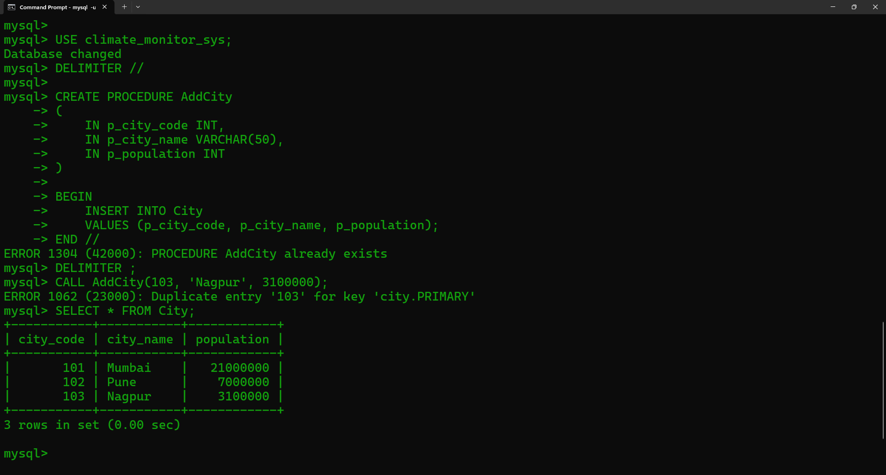
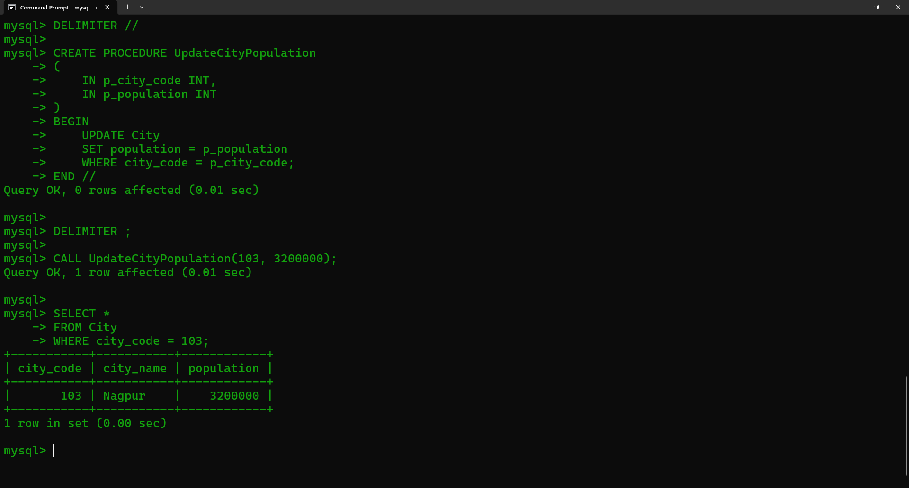
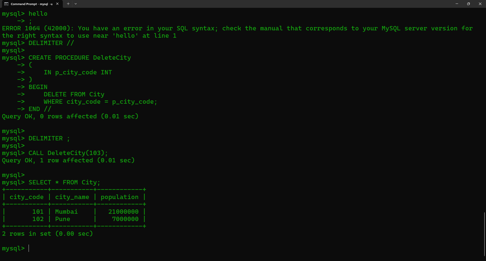
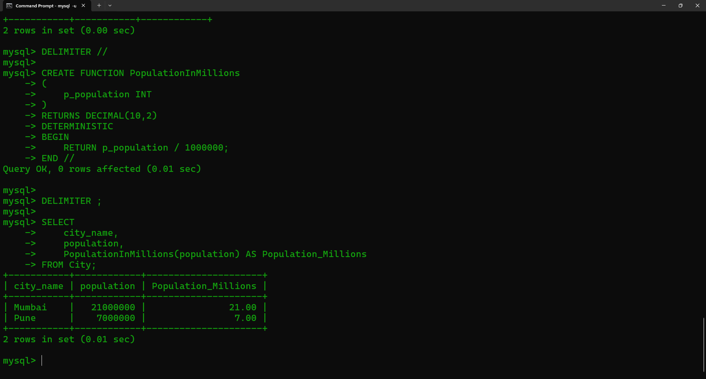
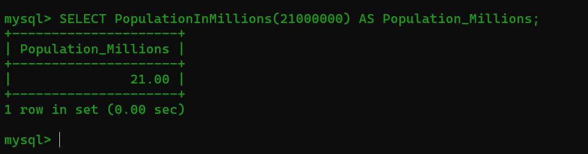
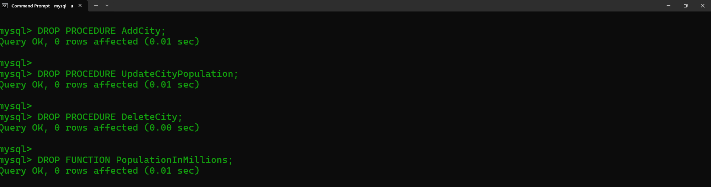

<p>
    <span style="float:left;">
        <h3> SQL Experiment 10
    </span>
    <span style="float:right; text-align:right;"> 
        Name: Dev Mandora<br>
        Roll Number: 62 <br>
        Batch: SB4</h3>
    </span>
</p>

<br clear="both">

### AIM

Implement Stored Procedures and Functions using SQL.

### OBJECTIVE

- To understand the concept of Stored Procedures and Functions.
- To create and execute procedures for INSERT, UPDATE and DELETE operations.
- To create and execute a stored function.
- To understand the use of parameters in procedures and functions.

### SOFTWARE REQUIREMENT

MySQL Server 8.0  
MySQL Shell 8.0

### THEORY

A **Stored Procedure** is a precompiled SQL code that can be saved and reused. A procedure can accept parameters and perform operations based on the values passed.

Stored procedures can be used for INSERT, UPDATE and DELETE operations. They are executed using the `CALL` command.

A **Stored Function** is a set of SQL statements that performs a specific operation and returns a single value. A stored function can be called within an SQL statement.

The `DETERMINISTIC` characteristic is used when a function gives the same output for the same input.

For this experiment, the `City` table is used because it does not contain a Foreign Key. The table contains `city_code`, `city_name` and `population`.

***

### GROUP 1 — STORED PROCEDURE FOR INSERT OPERATION

A stored procedure is created to insert a new city record into the `City` table.

#### Syntax

```sql
DELIMITER //

CREATE PROCEDURE procedure_name
(
    IN parameter datatype,
    IN parameter datatype
)
BEGIN
    INSERT INTO table_name
    VALUES (...);
END //

DELIMITER ;
```

#### Query

```sql
USE climate_monitor_sys;

DELIMITER //

CREATE PROCEDURE AddCity
(
    IN p_city_code INT,
    IN p_city_name VARCHAR(50),
    IN p_population INT
)
BEGIN
    INSERT INTO City
    VALUES (p_city_code, p_city_name, p_population);
END //

DELIMITER ;

CALL AddCity(103, 'Nagpur', 3100000);

SELECT * FROM City;
```

#### Output

 

***

### GROUP 2 — STORED PROCEDURE FOR UPDATE OPERATION

A stored procedure is created to update the population of a city using its city code.

#### Syntax

```sql
DELIMITER //

CREATE PROCEDURE procedure_name
(
    IN parameter datatype,
    IN parameter datatype
)
BEGIN
    UPDATE table_name
    SET column_name = parameter
    WHERE condition;
END //

DELIMITER ;
```

#### Query

```sql
DELIMITER //

CREATE PROCEDURE UpdateCityPopulation
(
    IN p_city_code INT,
    IN p_population INT
)
BEGIN
    UPDATE City
    SET population = p_population
    WHERE city_code = p_city_code;
END //

DELIMITER ;

CALL UpdateCityPopulation(103, 3200000);

SELECT *
FROM City
WHERE city_code = 103;
```

#### Output

 

***

### GROUP 3 — STORED PROCEDURE FOR DELETE OPERATION

A stored procedure is created to delete a city using its city code.

#### Syntax

```sql
DELIMITER //

CREATE PROCEDURE procedure_name
(
    IN parameter datatype
)
BEGIN
    DELETE FROM table_name
    WHERE condition;
END //

DELIMITER ;
```

#### Query

```sql
DELIMITER //

CREATE PROCEDURE DeleteCity
(
    IN p_city_code INT
)
BEGIN
    DELETE FROM City
    WHERE city_code = p_city_code;
END //

DELIMITER ;

CALL DeleteCity(103);

SELECT * FROM City;
```

#### Output

 

***

### GROUP 4 — STORED FUNCTION

A stored function performs a specific operation and returns a single value. Here, the function converts the population of a city into millions.

#### Syntax

```sql
DELIMITER //

CREATE FUNCTION function_name
(
    parameter datatype
)
RETURNS datatype
DETERMINISTIC
BEGIN
    RETURN value;
END //

DELIMITER ;
```

#### Query

```sql
DELIMITER //

CREATE FUNCTION PopulationInMillions
(
    p_population INT
)
RETURNS DECIMAL(10,2)
DETERMINISTIC
BEGIN
    RETURN p_population / 1000000;
END //

DELIMITER ;

SELECT
    city_name,
    population,
    PopulationInMillions(population) AS Population_Millions
FROM City;
```

#### Output

 
***

### GROUP 5 — CALL FUNCTION WITH DIRECT VALUE

A stored function can also be called by passing a direct value.

#### Syntax

```sql
SELECT function_name(value);
```

#### Query

```sql
SELECT PopulationInMillions(21000000) AS Population_Millions;
```

#### Output

 
***

### GROUP 6 — DROP PROCEDURES AND FUNCTION

Stored procedures can be removed using the `DROP PROCEDURE` statement.

#### Syntax

```sql
DROP PROCEDURE procedure_name;

DROP FUNCTION function_name;
```

#### Query

```sql
DROP PROCEDURE AddCity;

DROP PROCEDURE UpdateCityPopulation;

DROP PROCEDURE DeleteCity;

DROP FUNCTION PopulationInMillions;
```

#### Output

 

### OUTCOME

Stored Procedures and Functions were successfully created and executed using SQL. INSERT, UPDATE and DELETE operations were performed using stored procedures, and a stored function was used to calculate and display population in millions.

### CONCLUSION

Thus, Stored Procedures and Functions were successfully implemented in MySQL using basic SQL commands, parameters and return values.
