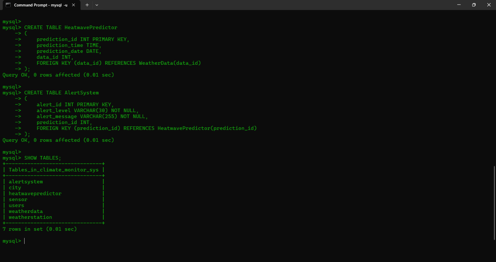
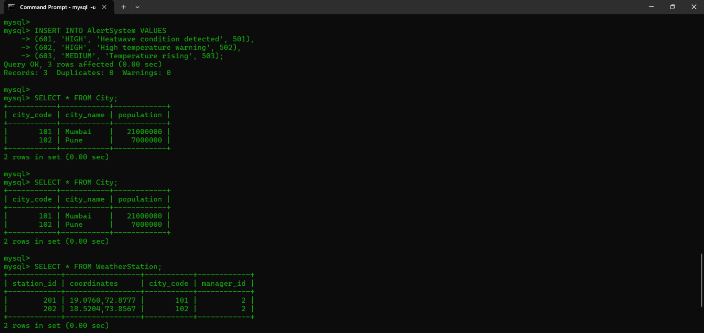
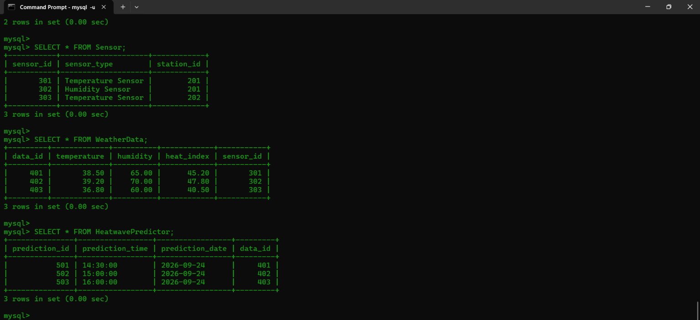
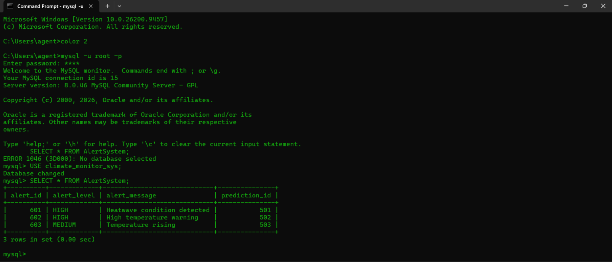
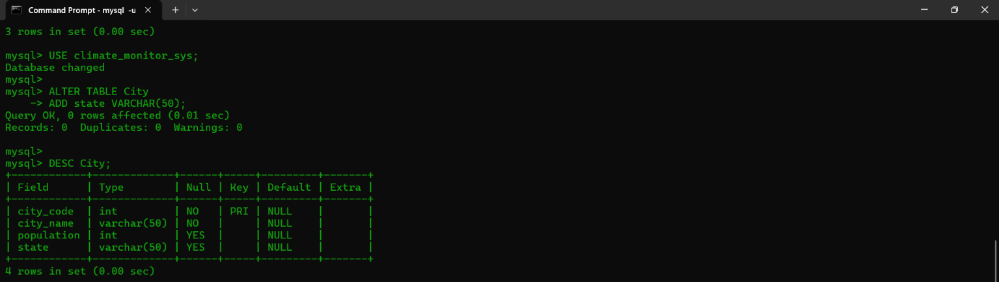
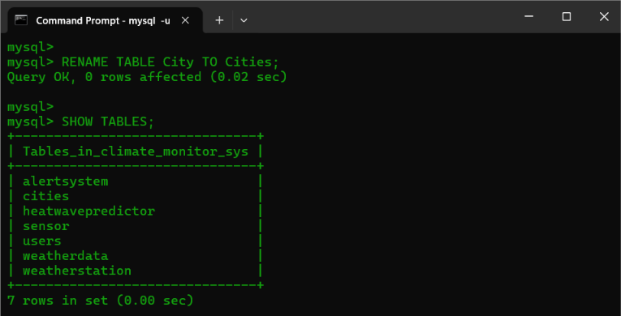
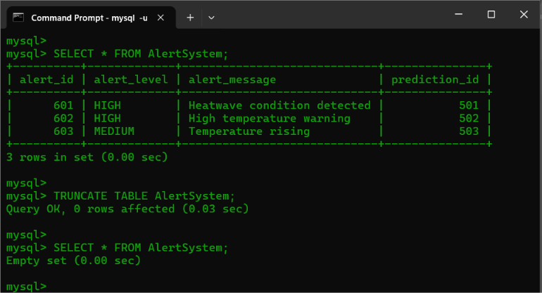
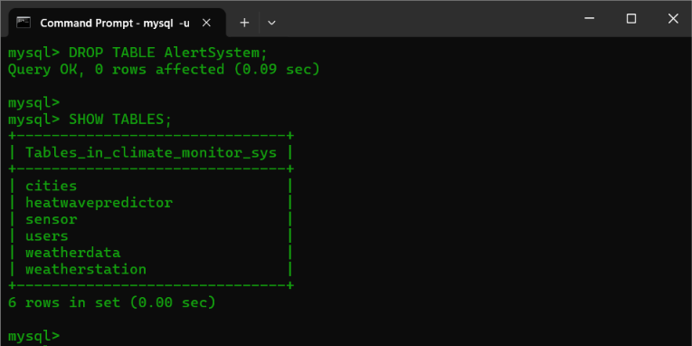

<p>
    <span style="float:left;">
        <h3> SQL Experiment 3
    </span>
    <span style="float:right; text-align:right;"> 
        Name: Dev Mandora<br>
        Roll Number: 62 <br>
        Batch: SB4</h3>
    </span>
</p>

<br clear="both">

### AIM

Create and populate database using Data Definition Language (DDL) Integrity Constraints.

### OBJECTIVE

- To create the Climate Intelligence database and its required tables.
- To apply appropriate integrity constraints such as Primary Key, Foreign Key, NOT NULL and CHECK.
- To populate the tables with sample climate-related data.
- To perform DDL operations such as CREATE, ALTER, RENAME, TRUNCATE and DROP.
- To verify the structure and contents of the created database.

### SOFTWARE REQUIREMENT

MySQL Server 8.0
MySQL Shell 8.0


### THEORY

Data Definition Language (DDL) is used to create and modify the structure of a database. In the Climate Intelligence system, DDL is used to create tables such as Users, City, Weather Station, Sensor, Weather Data, Heatwave Predictor and Alert System.

The main DDL commands used are:

- **CREATE** – Creates databases and tables.
- **ALTER** – Modifies the structure of an existing table.
- **RENAME** – Changes the name of a table.
- **TRUNCATE** – Removes all records from a table while retaining its structure.
- **DROP** – Permanently removes a table and its structure.

Integrity constraints are used to maintain valid and consistent data. PRIMARY KEY uniquely identifies records, FOREIGN KEY maintains relationships between tables, NOT NULL prevents empty values in required fields, and CHECK restricts values according to specified conditions.

Sample climate data is inserted into the tables to populate the database and verify the implemented structure and constraints.

### GROUP 1 — CREATING DATABASE AND TABLES

#### Syntax

```sql
CREATE DATABASE database_name;

USE database_name;

CREATE TABLE table_name
(
    column_name datatype constraint,
    column_name datatype constraint
);

SHOW TABLES;
````

#### Query

```sql
CREATE DATABASE climate_monitor_sys;

USE climate_monitor_sys;

CREATE TABLE City
(
    city_code INT PRIMARY KEY,
    city_name VARCHAR(50) NOT NULL,
    population INT CHECK (population >= 0)
);

CREATE TABLE Users
(
    user_id INT PRIMARY KEY,
    name VARCHAR(50) NOT NULL,
    age INT CHECK (age >= 0),
    city_code INT,
    FOREIGN KEY (city_code) REFERENCES City(city_code)
);

CREATE TABLE WeatherStation
(
    station_id INT PRIMARY KEY,
    coordinates VARCHAR(100) NOT NULL,
    city_code INT,
    manager_id INT,
    FOREIGN KEY (city_code) REFERENCES City(city_code),
    FOREIGN KEY (manager_id) REFERENCES Users(user_id)
);

CREATE TABLE Sensor
(
    sensor_id INT PRIMARY KEY,
    sensor_type VARCHAR(50) NOT NULL,
    station_id INT,
    FOREIGN KEY (station_id) REFERENCES WeatherStation(station_id)
);

CREATE TABLE WeatherData
(
    data_id INT PRIMARY KEY,
    temperature DECIMAL(5,2),
    humidity DECIMAL(5,2) CHECK (humidity >= 0 AND humidity <= 100),
    heat_index DECIMAL(5,2),
    sensor_id INT,
    FOREIGN KEY (sensor_id) REFERENCES Sensor(sensor_id)
);

CREATE TABLE HeatwavePredictor
(
    prediction_id INT PRIMARY KEY,
    prediction_time TIME,
    prediction_date DATE,
    data_id INT,
    FOREIGN KEY (data_id) REFERENCES WeatherData(data_id)
);

CREATE TABLE AlertSystem
(
    alert_id INT PRIMARY KEY,
    alert_level VARCHAR(30) NOT NULL,
    alert_message VARCHAR(255) NOT NULL,
    prediction_id INT,
    FOREIGN KEY (prediction_id) REFERENCES HeatwavePredictor(prediction_id)
);

SHOW TABLES;
```

####  Output

 

### GROUP 2 — INSERTING VALUES AND DISPLAYING THE TABLES

#### Syntax

```sql
INSERT INTO table_name VALUES
(value1, value2, value3);

SELECT * FROM table_name;
```

#### Query

```sql
USE climate_monitor_sys;

INSERT INTO City VALUES
(101, 'Mumbai', 21000000),
(102, 'Pune', 7000000);

INSERT INTO Users VALUES
(1, 'Rahul', 25, 101),
(2, 'Amit', 32, 101),
(3, 'Priya', 28, 102);

INSERT INTO WeatherStation VALUES
(201, '19.0760,72.8777', 101, 2),
(202, '18.5204,73.8567', 102, 2);

INSERT INTO Sensor VALUES
(301, 'Temperature Sensor', 201),
(302, 'Humidity Sensor', 201),
(303, 'Temperature Sensor', 202);

INSERT INTO WeatherData VALUES
(401, 38.50, 65.00, 45.20, 301),
(402, 39.20, 70.00, 47.80, 302),
(403, 36.80, 60.00, 40.50, 303);

INSERT INTO HeatwavePredictor VALUES
(501, '14:30:00', '2026-09-24', 401),
(502, '15:00:00', '2026-09-24', 402),
(503, '16:00:00', '2026-09-24', 403);

INSERT INTO AlertSystem VALUES
(601, 'HIGH', 'Heatwave condition detected', 501),
(602, 'HIGH', 'High temperature warning', 502),
(603, 'MEDIUM', 'Temperature rising', 503);

SELECT * FROM City;

SELECT * FROM City;

SELECT * FROM WeatherStation;

SELECT * FROM Sensor;

SELECT * FROM WeatherData;

SELECT * FROM HeatwavePredictor;

SELECT * FROM AlertSystem;
```

####  Output

**City** + **WeatherStation**
 


**Sensor** + **WeatherData** + **HeatwavePredictor**

 
**AlertSystem**

 

### GROUP 3 — PERFORMING DDL COMMANDS

#### ALTER TABLE

##### Syntax

```sql
ALTER TABLE table_name
ADD column_name datatype;

DESC table_name;
```

##### Query

```sql
USE climate_monitor_sys;

ALTER TABLE City
ADD state VARCHAR(50);

DESC City;
```

#####  Output

 
#### RENAME TABLE

##### Syntax

```sql
RENAME TABLE old_table_name TO new_table_name;

SHOW TABLES;
```

##### Query

```sql
RENAME TABLE City TO Cities;

SHOW TABLES;
```

#####  Output

 

### GROUP 4 — TRUNCATE TABLE

#### Syntax

```sql
SELECT * FROM table_name;

TRUNCATE TABLE table_name;

SELECT * FROM table_name;
```

#### Query

```sql
SELECT * FROM AlertSystem;

TRUNCATE TABLE AlertSystem;

SELECT * FROM AlertSystem;
```

####  Output

 
### GROUP 5 — DROP TABLE

#### Syntax

```sql
DROP TABLE table_name;

SHOW TABLES;
```

#### Query

```sql
DROP TABLE AlertSystem;

SHOW TABLES;
```

####  Output

 

### OUTCOME

The Climate Intelligence database was successfully created and populated with sample data. DDL commands such as CREATE, ALTER, RENAME, TRUNCATE and DROP were successfully performed, and appropriate integrity constraints were applied to maintain data consistency.

### CONCLUSION

Thus, the Climate Intelligence database was successfully implemented using DDL commands and integrity constraints. The database structure can reliably store information related to cities, users, weather stations, sensors, weather data, heatwave predictions and alerts, while maintaining data accuracy and consistency.
