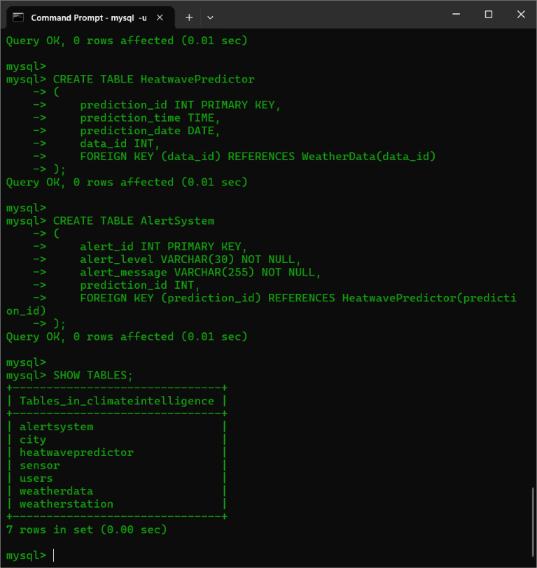
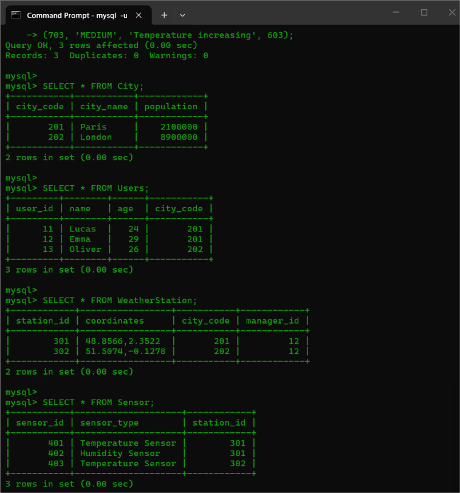
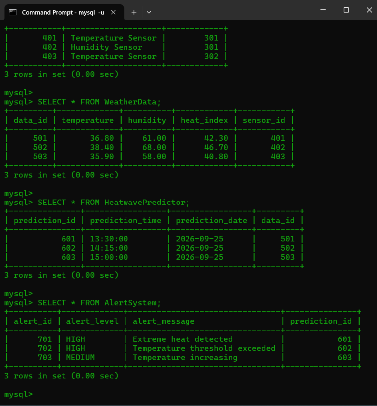
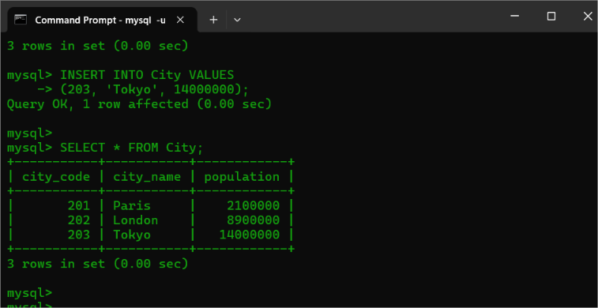
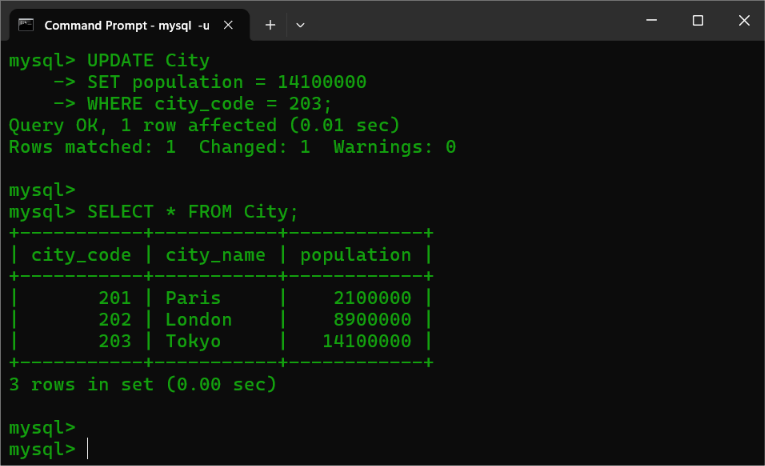
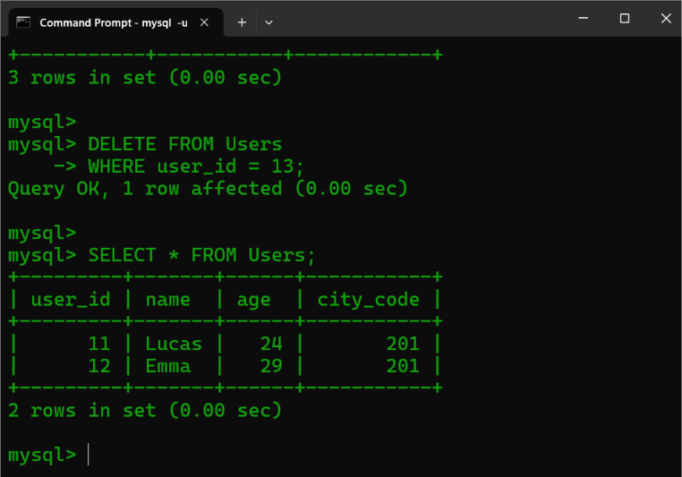
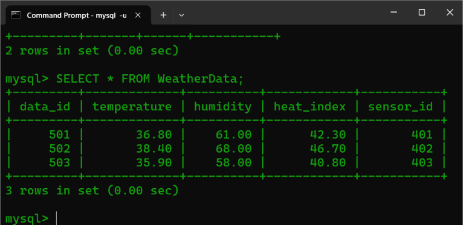

<p>
    <span style="float:left;">
        <h3> SQL Experiment 4
    </span>
    <span style="float:right; text-align:right;"> 
        Name: Dev Mandora<br>
        Roll Number: 62 <br>
        Batch: SB4</h3>
    </span>
</p>

<br clear="both">

### AIM

Create and populate database using Data Manipulation Language (DML) commands.

### OBJECTIVE

- To manage the data stored in the Climate Intelligence database.
- To insert climate-related records into the required tables using the INSERT command.
- To modify existing climate-related records using the UPDATE command.
- To remove unwanted or incorrect records using the DELETE command.
- To retrieve and display stored records using the SELECT command.
- To verify the changes made to the data in the database.

### SOFTWARE REQUIREMENT

MySQL Server 8.0  
MySQL Shell 8.0

### THEORY

Data Manipulation Language (DML) is used to insert, modify, delete and retrieve data stored in the tables of a database. In the Climate Intelligence system, DML commands are used to manage climate-related information stored in tables such as Users, City, Weather Station, Sensor, Weather Data, Heatwave Predictor and Alert System.

The main DML commands used are:

- **INSERT** – Adds new records into an existing table.
- **UPDATE** – Modifies or changes existing records in a table.
- **DELETE** – Removes existing records from a table.
- **SELECT** – Retrieves and displays records from one or more tables.

### GROUP 1 — CREATING DATABASE AND TABLES

#### Syntax

```sql
CREATE DATABASE database_name;

USE database_name;

CREATE TABLE table_name
(
    column_name datatype constraint,
    column_name datatype constraint
);

SHOW TABLES;
```

#### Query

```sql
CREATE DATABASE ClimateIntelligence;

USE ClimateIntelligence;

CREATE TABLE City
(
    city_code INT PRIMARY KEY,
    city_name VARCHAR(50) NOT NULL,
    population INT CHECK (population >= 0)
);

CREATE TABLE Users
(
    user_id INT PRIMARY KEY,
    name VARCHAR(50) NOT NULL,
    age INT CHECK (age >= 0),
    city_code INT,
    FOREIGN KEY (city_code) REFERENCES City(city_code)
);

CREATE TABLE WeatherStation
(
    station_id INT PRIMARY KEY,
    coordinates VARCHAR(100) NOT NULL,
    city_code INT,
    manager_id INT,
    FOREIGN KEY (city_code) REFERENCES City(city_code),
    FOREIGN KEY (manager_id) REFERENCES Users(user_id)
);

CREATE TABLE Sensor
(
    sensor_id INT PRIMARY KEY,
    sensor_type VARCHAR(50) NOT NULL,
    station_id INT,
    FOREIGN KEY (station_id) REFERENCES WeatherStation(station_id)
);

CREATE TABLE WeatherData
(
    data_id INT PRIMARY KEY,
    temperature DECIMAL(5,2),
    humidity DECIMAL(5,2) CHECK (humidity >= 0 AND humidity <= 100),
    heat_index DECIMAL(5,2),
    sensor_id INT,
    FOREIGN KEY (sensor_id) REFERENCES Sensor(sensor_id)
);

CREATE TABLE HeatwavePredictor
(
    prediction_id INT PRIMARY KEY,
    prediction_time TIME,
    prediction_date DATE,
    data_id INT,
    FOREIGN KEY (data_id) REFERENCES WeatherData(data_id)
);

CREATE TABLE AlertSystem
(
    alert_id INT PRIMARY KEY,
    alert_level VARCHAR(30) NOT NULL,
    alert_message VARCHAR(255) NOT NULL,
    prediction_id INT,
    FOREIGN KEY (prediction_id) REFERENCES HeatwavePredictor(prediction_id)
);

SHOW TABLES;
```

#### Output

 


### GROUP 2 — INSERTING VALUES AND DISPLAYING THE TABLES

#### Syntax

```sql
INSERT INTO table_name VALUES
(value1, value2, value3);

SELECT * FROM table_name;
```

#### Query

```sql
USE climateintelligence;

INSERT INTO City VALUES
(201, 'Paris', 2100000),
(202, 'London', 8900000);

INSERT INTO Users VALUES
(11, 'Lucas', 24, 201),
(12, 'Emma', 29, 201),
(13, 'Oliver', 26, 202);

INSERT INTO WeatherStation VALUES
(301, '48.8566,2.3522', 201, 12),
(302, '51.5074,-0.1278', 202, 12);

INSERT INTO Sensor VALUES
(401, 'Temperature Sensor', 301),
(402, 'Humidity Sensor', 301),
(403, 'Temperature Sensor', 302);

INSERT INTO WeatherData VALUES
(501, 36.80, 61.00, 42.30, 401),
(502, 38.40, 68.00, 46.70, 402),
(503, 35.90, 58.00, 40.80, 403);

INSERT INTO HeatwavePredictor VALUES
(601, '13:30:00', '2026-09-25', 501),
(602, '14:15:00', '2026-09-25', 502),
(603, '15:00:00', '2026-09-25', 503);

INSERT INTO AlertSystem VALUES
(701, 'HIGH', 'Extreme heat detected', 601),
(702, 'HIGH', 'Temperature threshold exceeded', 602),
(703, 'MEDIUM', 'Temperature increasing', 603);

SELECT * FROM City;

SELECT * FROM Users;

SELECT * FROM WeatherStation;

SELECT * FROM Sensor;

SELECT * FROM WeatherData;

SELECT * FROM HeatwavePredictor;

SELECT * FROM AlertSystem;
```

#### Output

**City + Users + WeatherStation + Sensor**

 

**WeatherData + HeatwavePredictor + AlertSystem**

 
### GROUP 3 — PERFORMING DML COMMANDS

#### INSERT

##### Syntax

```sql
INSERT INTO table_name
VALUES
(value1, value2, value3);
```

##### Query

```sql
INSERT INTO City VALUES
(203, 'Tokyo', 14000000);

SELECT * FROM City;
```

##### Output


 
#### UPDATE

##### Syntax

```sql
UPDATE table_name
SET column_name = value
WHERE condition;

SELECT * FROM table_name;
```

##### Query

```sql
UPDATE City
SET population = 14100000
WHERE city_code = 203;

SELECT * FROM City;
```

##### Output

 
#### DELETE

##### Syntax

```sql
DELETE FROM table_name
WHERE condition;

SELECT * FROM table_name;
```

##### Query

```sql
DELETE FROM Users
WHERE user_id = 13;

SELECT * FROM Users;
```

##### Output

 
#### SELECT

##### Syntax

```sql
SELECT * FROM table_name;
```

##### Query

```sql
SELECT * FROM WeatherData;
```

##### Output
 
### OUTCOME

The Climate Intelligence database was successfully populated and managed using DML commands. INSERT, UPDATE, DELETE and SELECT operations were successfully performed on the climate-related tables. The inserted data was modified, deleted and retrieved as required, demonstrating the effective management of data stored in the database.

### CONCLUSION

Thus, the Climate Intelligence database was successfully implemented and managed using DML commands. The INSERT, UPDATE, DELETE and SELECT commands were used to manipulate and retrieve information related to cities, users, weather stations, sensors, weather data, heatwave predictions and alerts. DML operations provide an efficient way to maintain, modify and retrieve continuously changing climate-related data while preserving the existing database structure.

