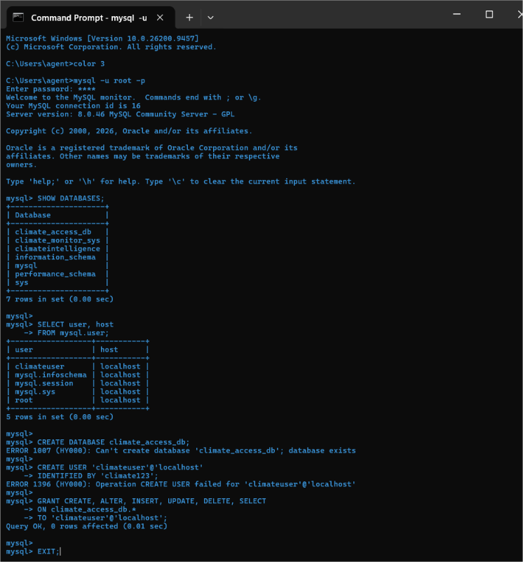
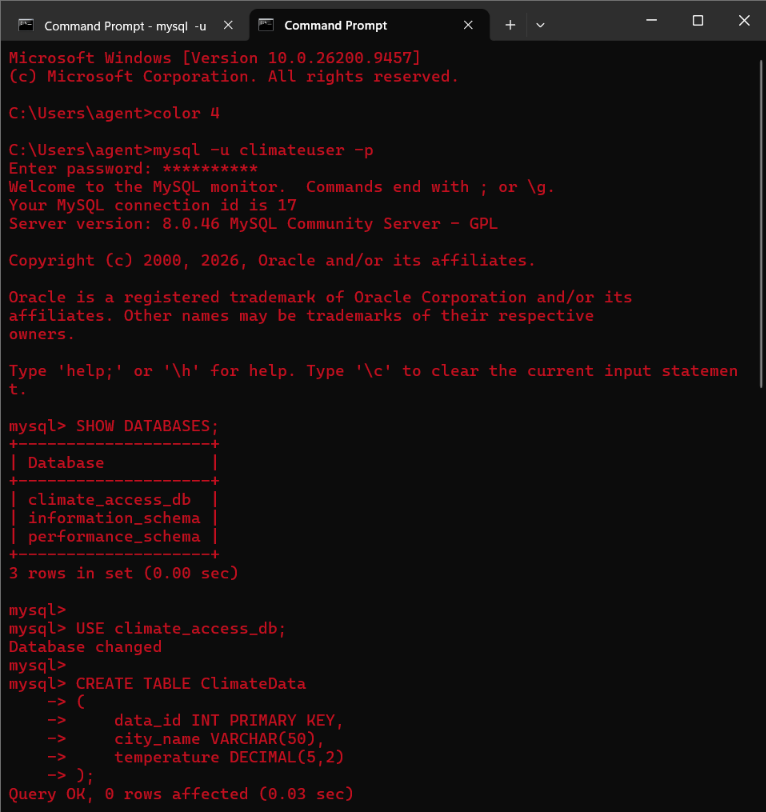
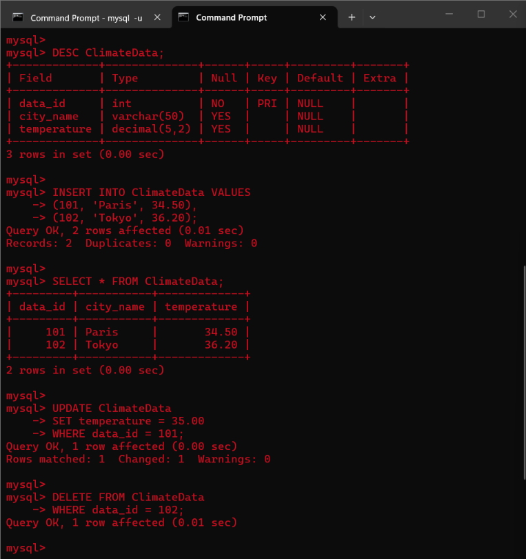
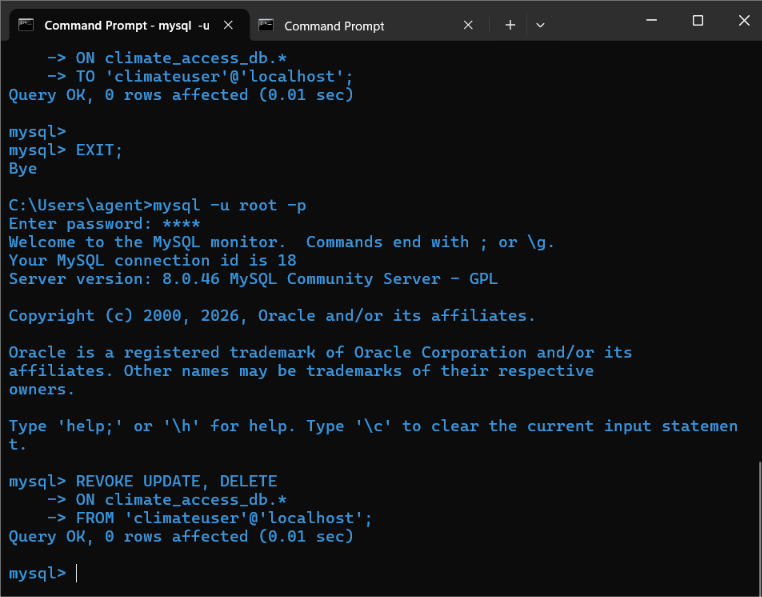
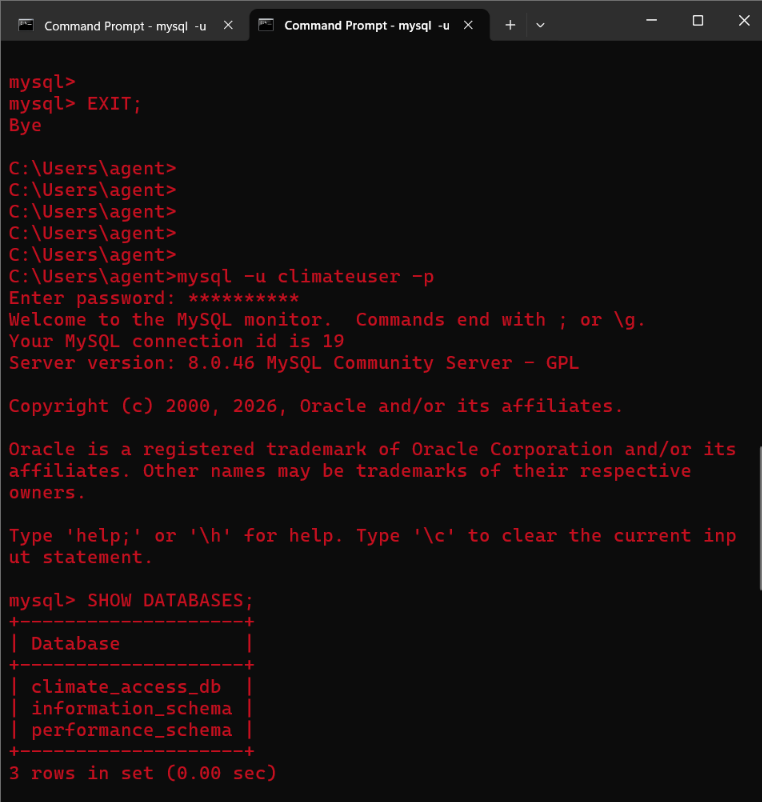
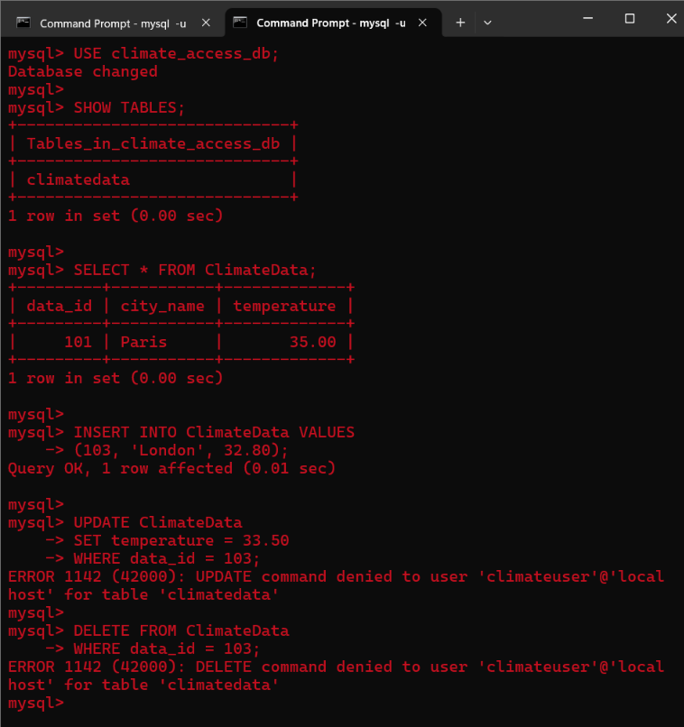

<p>
    <span style="float:left;">
        <h3> SQL Experiment 5
    </span>
    <span style="float:right; text-align:right;"> 
        Name: Dev Mandora<br>
        Roll Number: 62 <br>
        Batch: SB4</h3>
    </span>
</p>

<br clear="both">

### AIM

Perform Authorization using GRANT and REVOKE commands.

### OBJECTIVE

- To understand Data Control Language (DCL).
- To create a new database user.
- To provide permissions to a user using the GRANT command.
- To perform database operations using the authorized user.
- To remove selected permissions using the REVOKE command.
- To verify the effect of authorization and revocation of permissions.

### SOFTWARE REQUIREMENT

MySQL Server 8.0  
MySQL Shell 8.0

### THEORY

Data Control Language (DCL) is used to control access to data stored in a database. DCL commands are responsible for access restrictions and authorization of database users.

The main DCL commands used are:

- **GRANT** – Allows specific users to perform specified database operations.
- **REVOKE** – Removes previously granted permissions from a user.

Authorization helps control which operations a particular user can perform on a database.

### GROUP 1 — LOGIN WITH ROOT USER

#### Syntax

```sql
SHOW DATABASES;

SELECT user, host
FROM mysql.user;

CREATE USER 'username'@'localhost'
IDENTIFIED BY 'password';
```

#### Query

```sql
SHOW DATABASES;

SELECT user, host
FROM mysql.user;

CREATE DATABASE climate_access_db;

CREATE USER 'climateuser'@'localhost'
IDENTIFIED BY 'climate123';

GRANT CREATE, ALTER, INSERT, UPDATE, DELETE, SELECT
ON climate_access_db.*
TO 'climateuser'@'localhost';

EXIT;
```

#### Output

 


### GROUP 2 — LOGIN WITH AUTHORIZED USER

#### Procedure

Login with the newly created user in a new MySQL window.

**Username:** `climateuser`  
**Password:** `climate123`

#### Query

```sql
SHOW DATABASES;

USE climate_access_db;

CREATE TABLE ClimateData
(
    data_id INT PRIMARY KEY,
    city_name VARCHAR(50),
    temperature DECIMAL(5,2)
);

DESC ClimateData;

INSERT INTO ClimateData VALUES
(101, 'Paris', 34.50),
(102, 'Tokyo', 36.20);

SELECT * FROM ClimateData;

UPDATE ClimateData
SET temperature = 35.00
WHERE data_id = 101;

DELETE FROM ClimateData
WHERE data_id = 102;

SELECT * FROM ClimateData;

EXIT;
```

#### Output

 
 
### GROUP 3 — REVOKING PERMISSIONS USING ROOT USER

#### Procedure

Login again with the root user in the first MySQL window.

#### Syntax

```sql
REVOKE permission1, permission2
ON database_name.*
FROM 'username'@'localhost';
```

#### Query

```sql
REVOKE UPDATE, DELETE
ON climate_access_db.*
FROM 'climateuser'@'localhost';
```

#### Output

 
### GROUP 4 — VERIFYING REVOKED PERMISSIONS

#### Procedure

Login with `climateuser` again in the second MySQL window.

#### Query

```sql
SHOW DATABASES;

USE climate_access_db;

SHOW TABLES;

SELECT * FROM ClimateData;

INSERT INTO ClimateData VALUES
(103, 'London', 32.80);

UPDATE ClimateData
SET temperature = 33.50
WHERE data_id = 103;

DELETE FROM ClimateData
WHERE data_id = 103;

SELECT * FROM ClimateData;
```

#### Output


 
 

The `SELECT` and `INSERT` operations can be performed because their permissions are still available.

The `UPDATE` and `DELETE` operations are denied because those permissions were revoked from `climateuser`.
### OUTCOME

Authorization was successfully performed using GRANT and REVOKE commands. A new database user was created and permissions were granted to perform database operations. UPDATE and DELETE permissions were later revoked and their effect was verified using the authorized user.

### CONCLUSION

Thus, Data Control Language was successfully implemented using GRANT and REVOKE commands. User access to the database was controlled by providing and removing specific permissions, demonstrating authorization and access restriction in MySQL.
