<p>
    <span style="float:left;">
        <h3> SQL Experiment 6
    </span>
    <span style="float:right; text-align:right;"> 
        Name: Dev Mandora<br>
        Roll Number: 62 <br>
        Batch: SB4</h3>
    </span>
</p>

<br clear="both">

### AIM

Perform Simple Queries and Complex Queries using SQL.

### OBJECTIVE

- To understand the use of Structured Query Language (SQL).
- To understand various ways to retrieve data using SELECT commands and clauses.
- To perform simple queries using different comparison and logical operators.
- To use clauses such as LIKE, IN, BETWEEN, ORDER BY, DISTINCT and GROUP BY.
- To perform aggregate operations using COUNT(), AVG() and MAX().
- To use the HAVING clause with grouped data.
- To perform complex queries using multiple SQL clauses.

### SOFTWARE REQUIREMENT

MySQL Server 8.0  
MySQL Shell 8.0

### THEORY

Structured Query Language (SQL) is used to store, retrieve and manipulate data in a database. The SELECT command is used to retrieve records from one or more tables.

The basic SELECT commands are:

```sql
SELECT column1, column2
FROM table_name;

SELECT *
FROM table_name;

SELECT column1, column2
FROM table_name
WHERE condition;
````

The **WHERE** clause is used to retrieve only those records which satisfy a specified condition.

Different operators and clauses can be used with SELECT:

-   **Comparison Operators** – `=`, `<>`, `!=`, `>`, `<`, `>=`, `<=`
    
-   **LIKE / NOT LIKE** – Used for string pattern matching.
    
-   **Arithmetic Operators** – `+`, `-`, `*`, `/`, `DIV`, `%`
    
-   **Logical Operators** – `AND`, `OR`, `NOT`, `XOR`
    
-   **IN / NOT IN** – Used to compare values with a set of values.
    
-   **BETWEEN / NOT BETWEEN** – Used to check values within or outside a range.
    
-   **IS NULL / IS NOT NULL** – Used to check for NULL and non-NULL values.
    
-   **ORDER BY** – Used to sort query results.
    
-   **AS** – Used to provide an alias to a column or table.
    
-   **DISTINCT** – Used to display unique values.
    
-   **GROUP BY** – Used to group records for aggregate functions.
    
-   **HAVING** – Used to apply conditions to grouped results.
    

Aggregate functions such as `COUNT()`, `AVG()` and `MAX()` are used to perform calculations on groups of records.

### GROUP 1 — CREATING AND POPULATING THE TABLE

#### Syntax

```sql
CREATE TABLE table_name
(
    column_name datatype constraint,
    column_name datatype constraint
);

INSERT INTO table_name VALUES
(value1, value2, value3);
```

#### Query

```sql
USE climate_monitor_sys;

CREATE TABLE Climate_Data
(
    record_id INT PRIMARY KEY,
    station_name VARCHAR(50),
    city VARCHAR(50),
    observation_date DATE,
    temperature DECIMAL(5,2),
    humidity DECIMAL(5,2),
    rainfall DECIMAL(6,2),
    wind_speed DECIMAL(5,2),
    heat_index DECIMAL(5,2),
    alert_level VARCHAR(20)
);

INSERT INTO Climate_Data VALUES
(101, 'IMD Paris', 'Paris', '2026-09-20', 41.50, 38.00, 12.50, 18.20, 46.80, 'Critical'),
(102, 'IMD London', 'London', '2026-09-20', 34.20, 55.00, 8.20, 15.50, 37.40, 'Normal'),
(103, 'IMD Mumbai', 'Mumbai', '2026-09-21', 42.30, 35.00, NULL, 20.10, 48.50, 'Critical'),
(104, 'IMD Pune', 'Pune', '2026-09-21', 39.80, 42.00, 4.50, 12.80, 43.20, 'Warning'),
(105, 'IMD Nagpur', 'Nagpur', '2026-09-22', 43.10, 32.00, 2.80, 16.40, 49.10, 'Critical'),
(106, 'IMD Tokyo', 'Tokyo', '2026-09-22', 36.70, 48.00, 15.30, 14.20, 41.00, 'Warning'),
(107, 'IMD Paris North', 'Paris', '2026-09-23', 38.40, 45.00, NULL, 10.60, 42.80, 'Normal'),
(108, 'IMD Mumbai East', 'Mumbai', '2026-09-23', 40.20, 39.00, 6.70, 19.30, 45.60, 'Warning');

SELECT * FROM Climate_Data;
```

#### Output
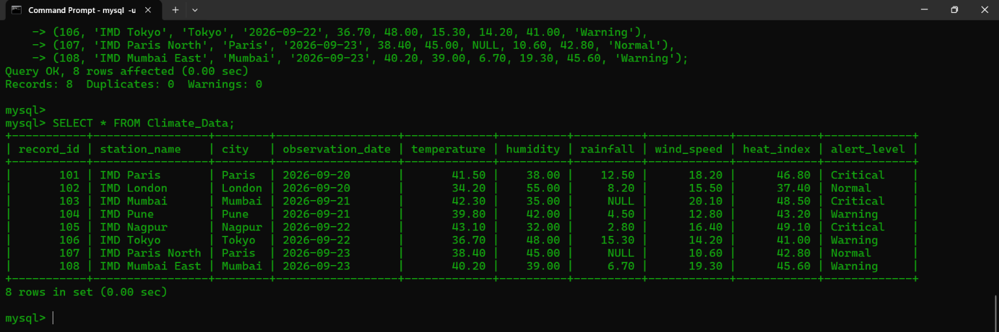 

### GROUP 2 — SELECT QUERIES USING DIFFERENT OPERATORS

#### Comparison Operators

##### Syntax

```sql
SELECT *
FROM table_name
WHERE column_name operator value;
````

##### Query

```sql
-- 1. Temperature greater than 40°C
SELECT *
FROM Climate_Data
WHERE temperature > 40;

-- 2. Temperature equal to 40.5°C
SELECT *
FROM Climate_Data
WHERE temperature = 40.5;

-- 3. Temperature less than 35°C
SELECT *
FROM Climate_Data
WHERE temperature < 35;

-- 4. Heat index greater than or equal to 45°C
SELECT *
FROM Climate_Data
WHERE heat_index >= 45;

-- 5. Records where alert is not Normal
SELECT *
FROM Climate_Data
WHERE NOT alert_level = 'Normal';
```

#### Output
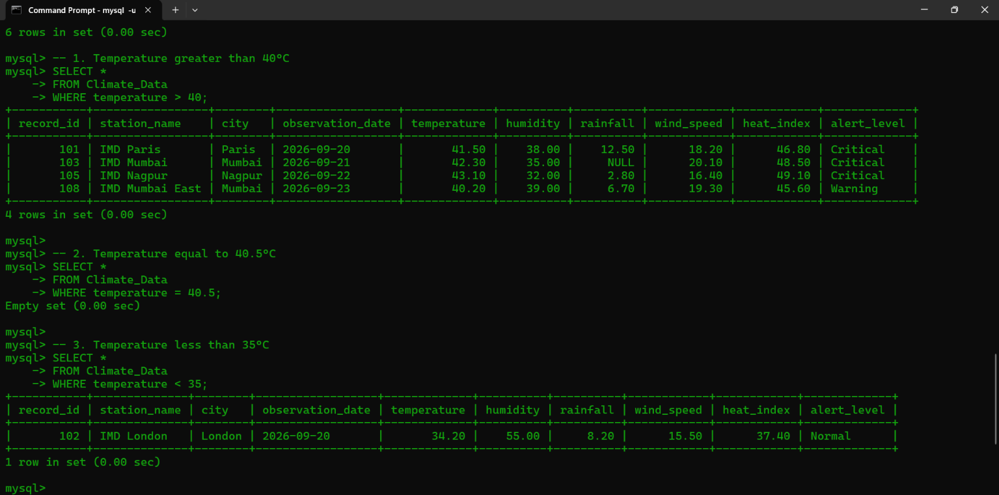 
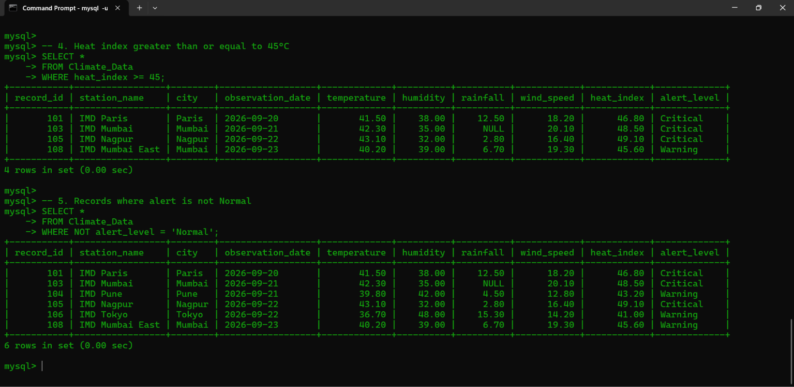 
### GROUP 3 — STRING PATTERN MATCHING

#### Syntax

```sql
SELECT *
FROM table_name
WHERE column_name LIKE 'pattern';

SELECT *
FROM table_name
WHERE column_name NOT LIKE 'pattern';
```

#### Query

```sql
-- 1. Find stations starting with IMD M
SELECT *
FROM Climate_Data
WHERE station_name LIKE 'IMD M%';

-- 2. Find cities ending with pur
SELECT *
FROM Climate_Data
WHERE city LIKE '%pur';

-- 3. Find cities containing a
SELECT *
FROM Climate_Data
WHERE city LIKE '%a%';

-- 4. Find stations not containing Mumbai
SELECT *
FROM Climate_Data
WHERE station_name NOT LIKE '%Mumbai%';
```

#### Output

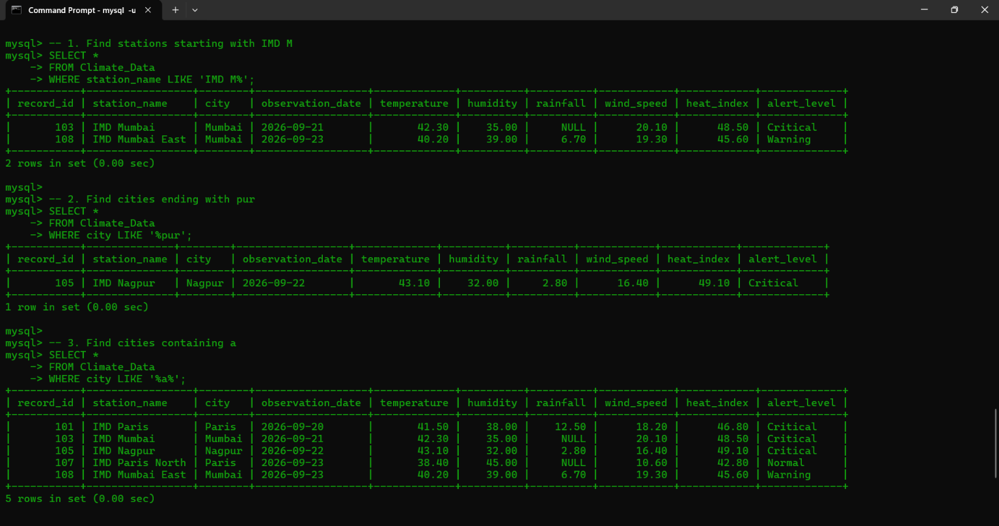 
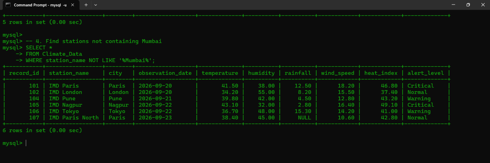 

### GROUP 4 — ARITHMETIC OPERATORS

#### Syntax

```sql
SELECT column_name + value
FROM table_name;

SELECT column_name - value
FROM table_name;
```

#### Query

```sql
-- 1. Increase temperature by 2°C
SELECT station_name, temperature,
       temperature + 2 AS increased_temperature
FROM Climate_Data;

-- 2. Calculate temperature difference from 30°C
SELECT station_name, temperature,
       temperature - 30 AS temperature_difference
FROM Climate_Data;
```

#### Output
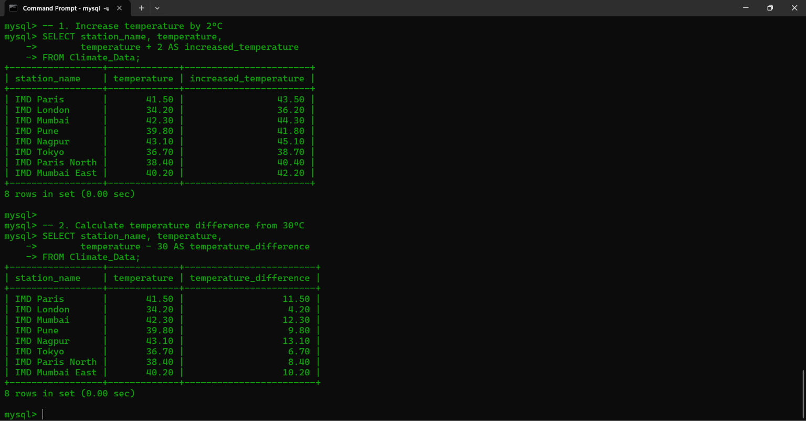 

### GROUP 5 — LOGICAL OPERATORS

#### AND

##### Query

```sql
-- Find records where temperature is above 40°C
-- and humidity is below 40%.
SELECT *
FROM Climate_Data
WHERE temperature > 40
AND humidity < 40;
```

#### OR

##### Query

```sql
-- Find records where temperature is above 42°C
-- or heat index is above 45°C.
SELECT *
FROM Climate_Data
WHERE temperature > 42
OR heat_index > 45;
```

#### NOT

##### Query

```sql
-- Find records that are not Critical.
SELECT *
FROM Climate_Data
WHERE NOT alert_level = 'Critical';
```

#### XOR

##### Query

```sql
-- Find records where either temperature is greater than 40°C
-- or humidity is less than 40%, but not both.
SELECT *
FROM Climate_Data
WHERE temperature > 40
XOR humidity < 40;
```

#### Output

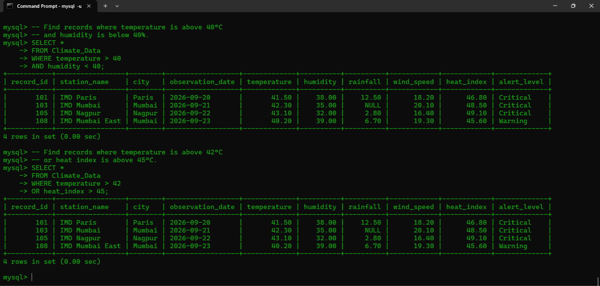 
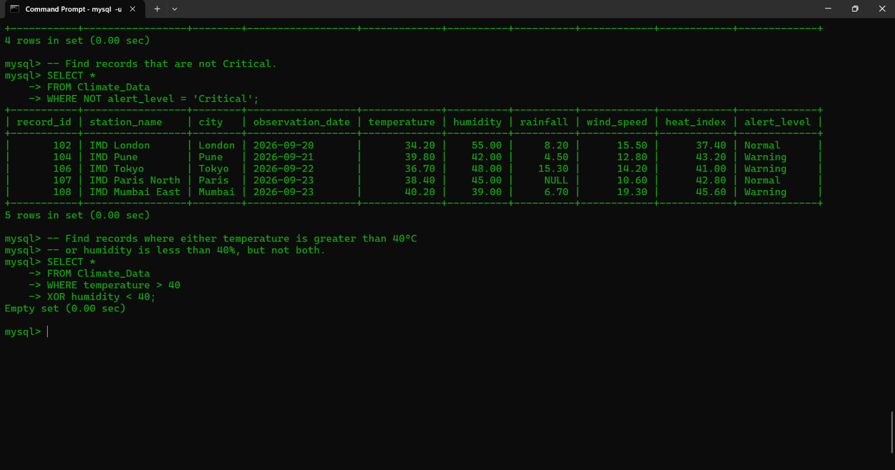 
### GROUP 6 — IN AND NOT IN

#### IN

##### Query

```sql
-- Find observations from Mumbai, Pune, and Nagpur.
SELECT *
FROM Climate_Data
WHERE city IN ('Mumbai', 'Pune', 'Nagpur');
```

#### NOT IN

##### Query

```sql
-- Find observations excluding Mumbai and Pune.
SELECT *
FROM Climate_Data
WHERE city NOT IN ('Mumbai', 'Pune');
```

#### Output

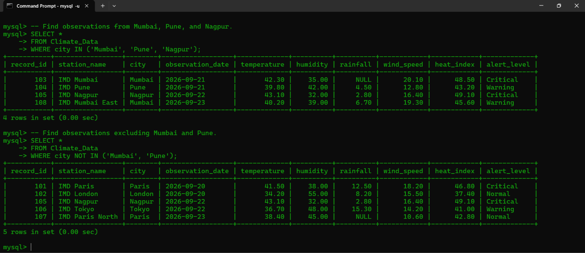 
### GROUP 7 — BETWEEN AND NOT BETWEEN

#### BETWEEN

##### Query

```sql
-- Find temperatures between 35°C and 40°C.
SELECT *
FROM Climate_Data
WHERE temperature BETWEEN 35 AND 40;
```

#### NOT BETWEEN

##### Query

```sql
-- Find temperatures outside the range 35°C–40°C.
SELECT *
FROM Climate_Data
WHERE temperature NOT BETWEEN 35 AND 40;
```

#### Output

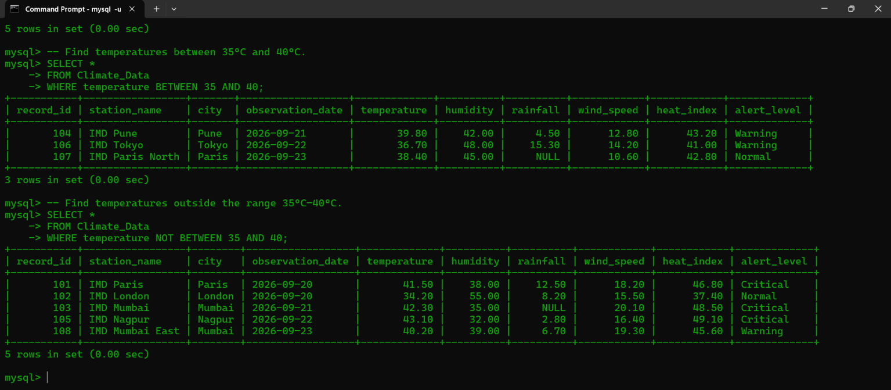 
### GROUP 8 — IS NULL AND IS NOT NULL

#### IS NULL

##### Query

```sql
-- Find NULL rainfall values.
SELECT *
FROM Climate_Data
WHERE rainfall IS NULL;
```

#### IS NOT NULL

##### Query

```sql
-- Find records where rainfall is available.
SELECT *
FROM Climate_Data
WHERE rainfall IS NOT NULL;
```

#### Output

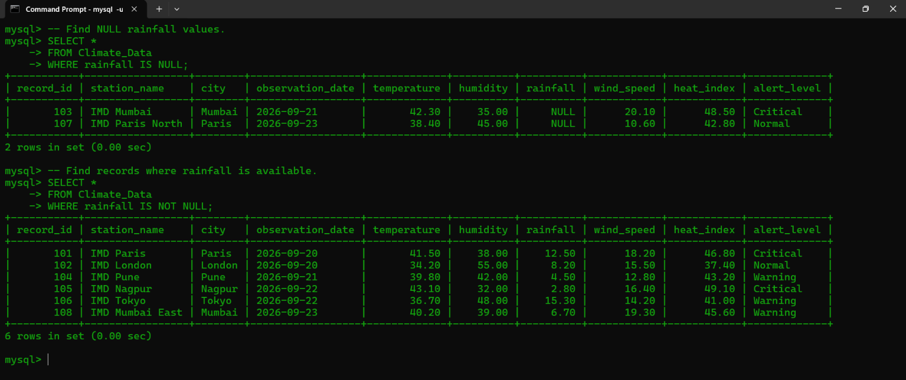 

### GROUP 9 — ORDER BY

#### Syntax

```sql
SELECT *
FROM table_name
ORDER BY column_name ASC;

SELECT *
FROM table_name
ORDER BY column_name DESC;
```

#### Query

```sql
-- A. Sort temperature in ascending order.
SELECT *
FROM Climate_Data
ORDER BY temperature ASC;

-- B. Sort temperature in descending order.
SELECT *
FROM Climate_Data
ORDER BY temperature DESC;
```

#### Output

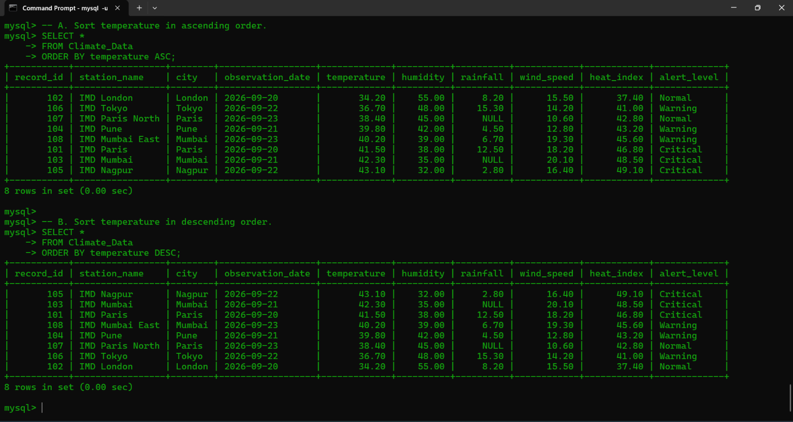 

### GROUP 10 — DISTINCT

#### Syntax

```sql
SELECT DISTINCT column_name
FROM table_name;

SELECT DISTINCT column1, column2
FROM table_name;
```

#### Query

```sql
-- 1. Find unique cities.
SELECT DISTINCT city
FROM Climate_Data;

-- 2. Find unique combinations of city and alert level.
SELECT DISTINCT city, alert_level
FROM Climate_Data;
```

#### Output

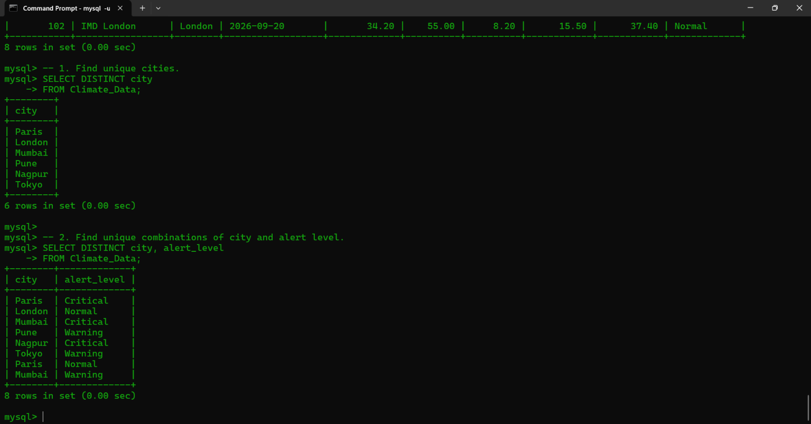 
### GROUP 11 — GROUP BY

#### Syntax

```sql
SELECT column_name, aggregate_function(column_name)
FROM table_name
GROUP BY column_name;
```

#### Query

```sql
-- 1. Count observations for each city.
SELECT city, COUNT(*) AS observation_count
FROM Climate_Data
GROUP BY city;

-- 2. Find average temperature for each city.
SELECT city, AVG(temperature) AS average_temperature
FROM Climate_Data
GROUP BY city;

-- 3. Find maximum temperature for each city.
SELECT city, MAX(temperature) AS maximum_temperature
FROM Climate_Data
GROUP BY city;
```

#### Output

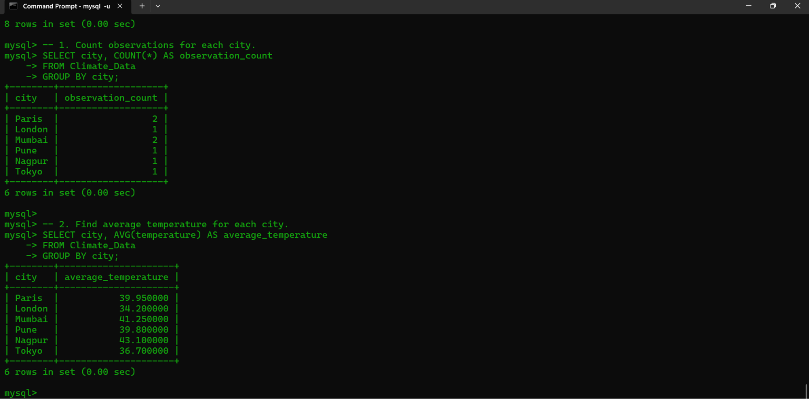 
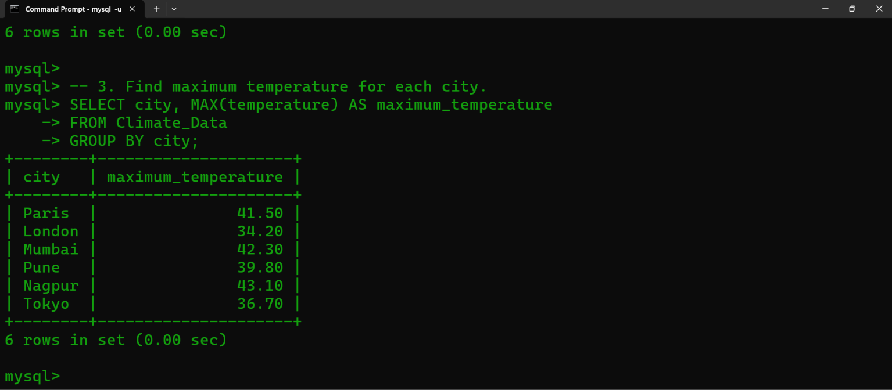 
### GROUP 12 — HAVING

#### Syntax

```sql
SELECT column_name, aggregate_function(column_name)
FROM table_name
GROUP BY column_name
HAVING aggregate_function(column_name) operator value;
```

#### Query

```sql
-- 1. Cities having average temperature greater than 38°C.
SELECT city, AVG(temperature) AS average_temperature
FROM Climate_Data
GROUP BY city
HAVING AVG(temperature) > 38;

-- 2. Alert levels having average heat index above 43°C.
SELECT alert_level, AVG(heat_index) AS average_heat_index
FROM Climate_Data
GROUP BY alert_level
HAVING AVG(heat_index) > 43;
```

#### Output

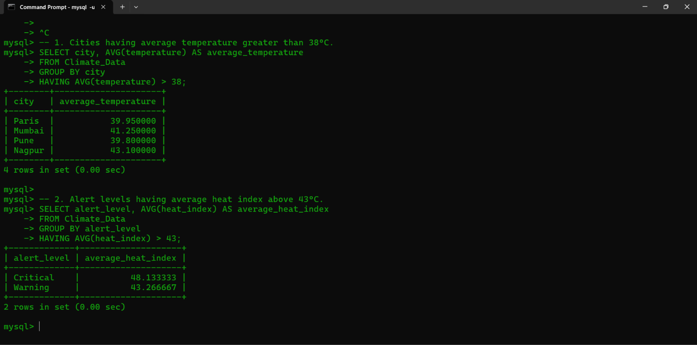 
### GROUP 13 — COMBINED QUERY

#### Syntax

```sql
SELECT column_name,
       aggregate_function(column_name),
       aggregate_function(column_name)
FROM table_name
GROUP BY column_name
HAVING condition
ORDER BY column_name DESC;
```

#### Query

```sql
-- Find cities whose average temperature is greater than 38°C,
-- display the average temperature and maximum heat index,
-- and sort them from highest to lowest average temperature.

SELECT city,
       AVG(temperature) AS average_temperature,
       MAX(heat_index) AS maximum_heat_index
FROM Climate_Data
GROUP BY city
HAVING AVG(temperature) > 38
ORDER BY average_temperature DESC;
```

#### Output

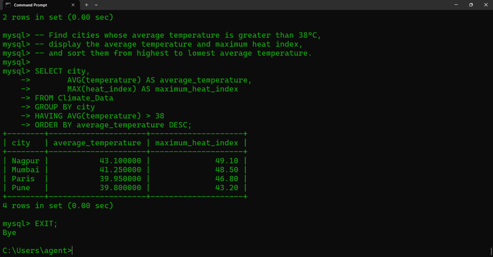 
### OUTCOME

Simple and complex SQL queries were successfully performed on the Climate_Data table. Different SELECT commands, comparison operators, pattern matching, arithmetic operators, logical operators, IN, BETWEEN, NULL checking, ORDER BY, DISTINCT, GROUP BY and HAVING clauses were used to retrieve and analyze climate-related data.

### CONCLUSION

Thus, simple and complex queries were successfully implemented using SQL. The SELECT command and different SQL operators and clauses were used to retrieve, filter, sort and group climate-related records. Aggregate functions and the HAVING clause were also used to perform analysis on the Climate_Data table.


