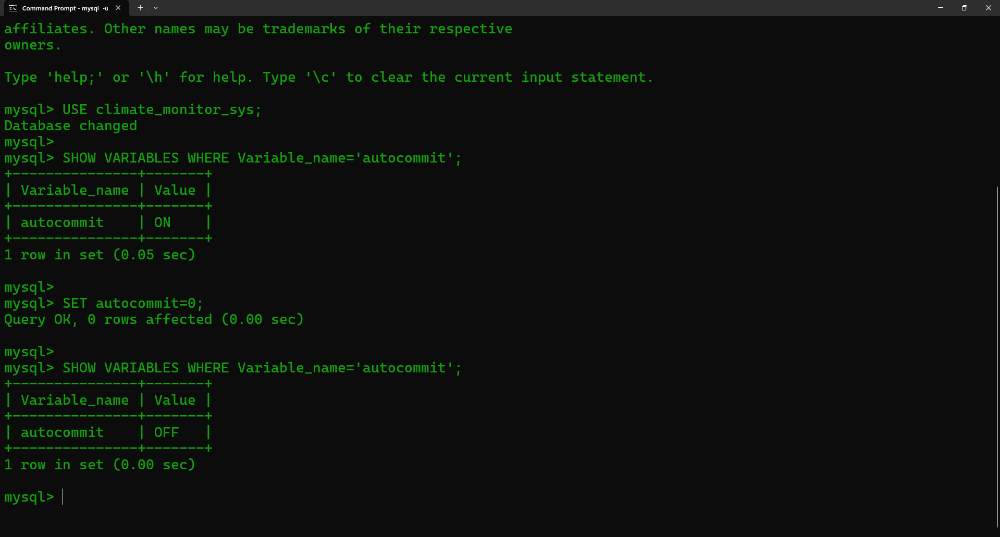
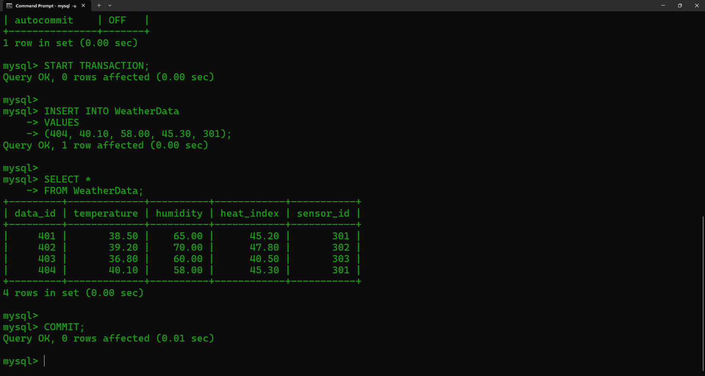
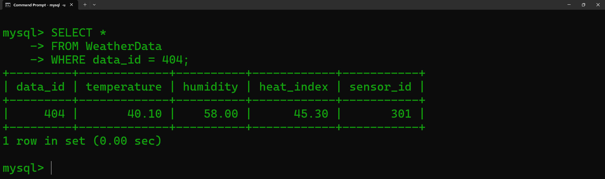
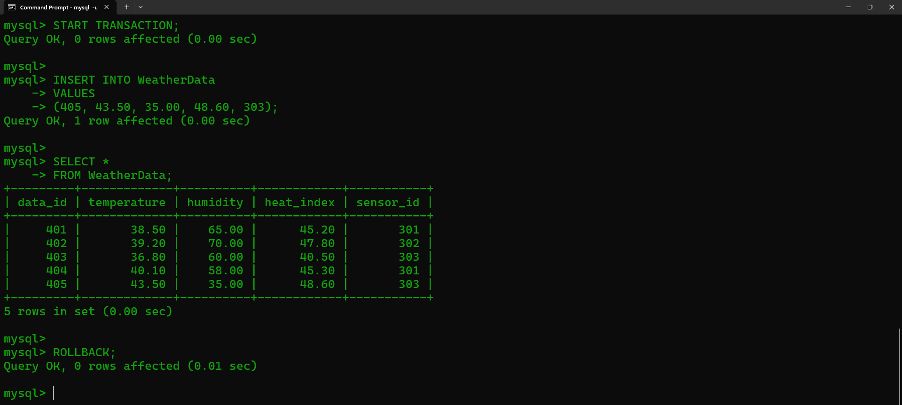
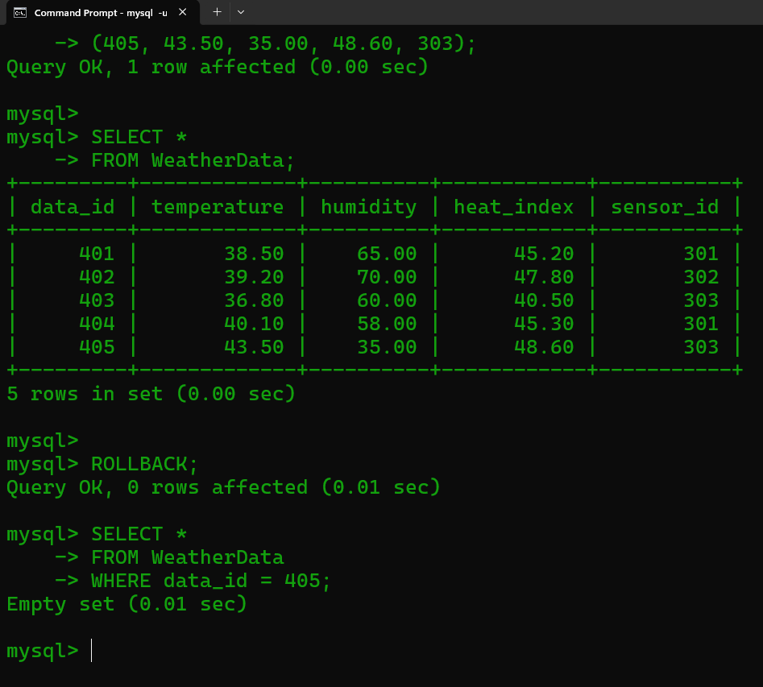
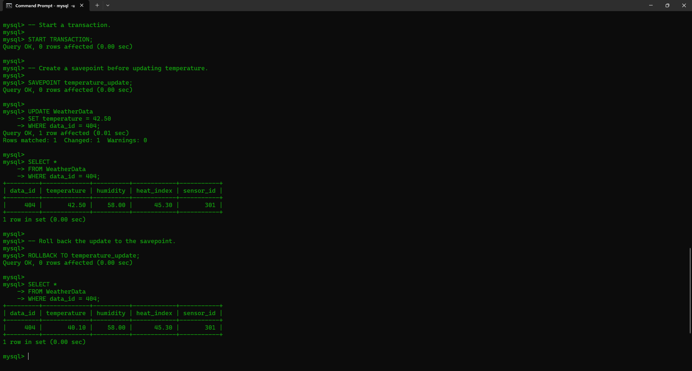
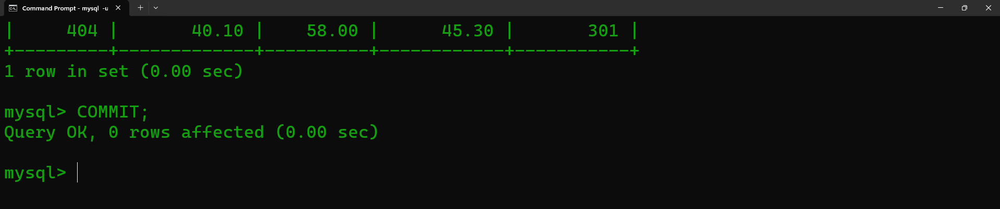
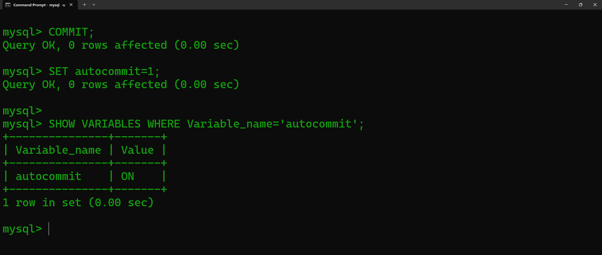

<p>
    <span style="float:left;">
        <h3> SQL Experiment 9
    </span>
    <span style="float:right; text-align:right;"> 
        Name: Dev Mandora<br>
        Roll Number: 62 <br>
        Batch: SB4</h3>
    </span>
</p>

<br clear="both">

### AIM

Perform Transaction Control using SQL commands.

### OBJECTIVE

-   To understand Transaction Control Language (TCL).
    
-   To perform transactions using COMMIT, ROLLBACK and SAVEPOINT.
    
-   To understand the use of AUTOCOMMIT in transactions.
    
-   To permanently save or undo changes made during a transaction.
    
-   To manage climate-related data using transactions.
    

### SOFTWARE REQUIREMENT

MySQL Server 8.0  
MySQL Shell 8.0

### THEORY

Transaction Control Language (TCL) is used to manage transactions in a database. A transaction is a single unit of work formed by the consecutive execution of SQL commands. The commonly used TCL commands are COMMIT, ROLLBACK and SAVEPOINT.

-   **COMMIT** – Saves transaction-related changes permanently.
    
-   **ROLLBACK** – Rolls back a transaction in case of an error.
    
-   **SAVEPOINT** – Divides database operations into parts and allows the transaction to be rolled back to a particular point.
    

### GROUP 1 — AUTOCOMMIT

The `autocommit` setting is checked before performing the transaction. It is then disabled so that changes can be controlled using TCL commands, as demonstrated in the manual.

#### Syntax

```sql
SHOW VARIABLES WHERE Variable_name='autocommit';

SET autocommit=0;

SHOW VARIABLES WHERE Variable_name='autocommit';
```

#### Query

```sql
USE climate_monitor_sys;

SHOW VARIABLES WHERE Variable_name='autocommit';

SET autocommit=0;

SHOW VARIABLES WHERE Variable_name='autocommit';
```

#### Output

 

***

### GROUP 2 — COMMIT

The `COMMIT` command is used to save all transaction-related changes permanently.

#### Syntax

```sql
START TRANSACTION;

INSERT INTO table_name
VALUES (...);

SELECT * FROM table_name;

COMMIT;
```

#### Query

```sql
-- Insert a new temperature record.

START TRANSACTION;

INSERT INTO WeatherData
VALUES
(404, 40.10, 58.00, 45.30, 301);

SELECT *
FROM WeatherData;

COMMIT;
```

#### Output
 

```sql
-- Verify the committed record.

SELECT *
FROM WeatherData
WHERE data_id = 404;
```

#### Output

 

***

### GROUP 3 — ROLLBACK

The `ROLLBACK` command is used to roll back a transaction when an error occurs.

#### Syntax

```sql
SET autocommit=0;

INSERT INTO table_name
VALUES (...);

SELECT * FROM table_name;

ROLLBACK;

SELECT * FROM table_name;
```

#### Query

```sql
-- Insert a temporary temperature record.

START TRANSACTION;

INSERT INTO WeatherData
VALUES
(405, 43.50, 35.00, 48.60, 303);

SELECT *
FROM WeatherData;

ROLLBACK;
```

#### Output

 

```sql
-- Verify that the record was rolled back.

SELECT *
FROM WeatherData
WHERE data_id = 405;
```

#### Output

 

***

### GROUP 4 — SAVEPOINT

A `SAVEPOINT` divides database operations into parts. The transaction can be rolled back to a particular savepoint when required.

#### Syntax

```sql
START TRANSACTION;

SAVEPOINT savepoint_name;

UPDATE table_name
SET column_name = value
WHERE condition;

ROLLBACK TO savepoint_name;

SELECT * FROM table_name;
```

#### Query

```sql
-- Start a transaction.

START TRANSACTION;

-- Create a savepoint before updating temperature.

SAVEPOINT temperature_update;

UPDATE WeatherData
SET temperature = 42.50
WHERE data_id = 404;

SELECT *
FROM WeatherData
WHERE data_id = 404;

-- Roll back the update to the savepoint.

ROLLBACK TO temperature_update;

SELECT *
FROM WeatherData
WHERE data_id = 404;
```

#### Output

 

***

### GROUP 5 — FINAL COMMIT

The remaining transaction can be permanently saved using `COMMIT`, as shown in the manual.

#### Syntax

```sql
COMMIT;
```

#### Query

```sql
COMMIT;
```

#### Output

 

***

### GROUP 6 — RESTORE AUTOCOMMIT

After completing the TCL operations, AUTOCOMMIT is restored to its normal state.

#### Syntax

```sql
SET autocommit=1;

SHOW VARIABLES WHERE Variable_name='autocommit';
```

#### Query

```sql
SET autocommit=1;

SHOW VARIABLES WHERE Variable_name='autocommit';
```

#### Output

 

### OUTCOME

Transaction operations were successfully performed on climate data using COMMIT, ROLLBACK and SAVEPOINT.

### CONCLUSION

Thus, Transaction Control Language commands were successfully implemented to manage and control transactions in the Climate Intelligence database.