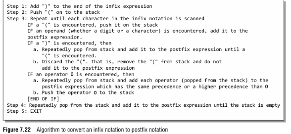

# DSA Experiment 3

### Aim:

To implement conversion of an Infix expression into its equivalent Postfix expression using a stack.

### Theory:

An **Infix expression** is an expression in which the operator is written between the operands. For example, `A+B`.

A **Postfix expression** is an expression in which the operator is written after the operands. For example, `AB+`.

The conversion from Infix to Postfix uses a **stack** to temporarily store operators. Operands are directly added to the Postfix expression, while operators are stored in the stack according to their priority. Parentheses are used to control the order of operations.

For example:

```text
Infix:   A+B*C
Postfix: ABC*+
````

Here, multiplication has higher priority than addition, so `*` is placed before `+` in the Postfix expression.

### Algorithm:

 
     

### Outcome:

The Infix to Postfix expression conversion was successfully implemented using a stack. Operator precedence and parentheses were handled to generate the equivalent Postfix expression.

### Conclusion:

The program demonstrates the use of a stack for converting Infix expressions into Postfix expressions. It helps understand how operators and operands are processed according to their priority and order of evaluation.