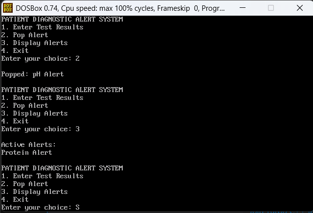

## Experiment No. 1

### Aim:

To implement a Patient Diagnostic Alert System using Stack operations.

### Objective:

To use stack operations such as Push, Pop, and Display to manage active diagnostic alerts based on patient test results.

### Software Used:

-   DOSBox
    
-   Turbo C ++
    

### Theory:

A stack is a linear data structure that follows the **LIFO (Last In First Out)** principle. In this program, abnormal patient test results generate alerts which are stored in a stack using the `Push()` operation. The `Pop()` operation removes the most recent active alert, while `Display()` shows all active alerts. When all test results become normal, all active alerts are removed from the stack.

### Program:

```c
#include <stdio.h>
#include <conio.h>

int stack[100], top = -1;

void Push(int alert)
{
    top++;
    stack[top] = alert;
}

void Pop()
{
    if(top == -1)
    {
        printf("\nNo active alerts.");
    }
    else
    {
        if(stack[top] == 1)
            printf("\nPopped: Glucose Alert");
        else if(stack[top] == 2)
            printf("\nPopped: Protein Alert");
        else if(stack[top] == 3)
            printf("\nPopped: pH Alert");

        top--;
    }
}

void Display()
{
    int i;

    if(top == -1)
    {
        printf("\nNo active alerts.");
    }
    else
    {
        printf("\nActive Alerts:");

        for(i = top; i >= 0; i--)
        {
            if(stack[i] == 1)
                printf("\nGlucose Alert");
            else if(stack[i] == 2)
                printf("\nProtein Alert");
            else if(stack[i] == 3)
                printf("\npH Alert");
        }
    }
}

void main()
{
    int choice;
    double glucose, protein, ph;

    do
    {
        printf("\n\nPATIENT DIAGNOSTIC ALERT SYSTEM");
        printf("\n1. Enter Test Results");
        printf("\n2. Pop Alert");
        printf("\n3. Display Alerts");
        printf("\n4. Exit");

        printf("\nEnter your choice: ");
        scanf("%d", &choice);

        switch(choice)
        {
            case 1:

                printf("\nEnter Glucose Level: ");
                scanf("%lf", &glucose);

                printf("Enter Protein Level: ");
                scanf("%lf", &protein);

                printf("Enter pH Level: ");
                scanf("%lf", &ph);

                if(glucose > 50)
                {
                    printf("\nGlucose Alert");
                    Push(1);
                }

                if(protein > 50)
                {
                    printf("\nProtein Alert");
                    Push(2);
                }

                if(ph < 5 || ph > 7.5)
                {
                    printf("\npH Alert");
                    Push(3);
                }

                if(glucose <= 50 && protein <= 50 &&
                   ph >= 5 && ph <= 7.5)
                {
                    printf("\nAll Test Results are Normal");
                    printf("\nRemoving all active alerts...");

                    while(top != -1)
                    {
                        Pop();
                    }
                }

                break;

            case 2:
                Pop();
                break;

            case 3:
                Display();
                break;

            case 4:
                printf("\nProgram Finished.");
                break;

            default:
                printf("\nInvalid Choice.");
        }

    } while(choice != 4);

    getch();
}
```

### Output:


 
### Outcome:

The Patient Diagnostic Alert System was successfully implemented using stack operations. Abnormal test results were stored as active alerts and removed using the Pop operation.

### Conclusion:

The program demonstrates the use of Stack, Push, Pop, Display, conditional statements, and user input to manage patient diagnostic alerts.### output
