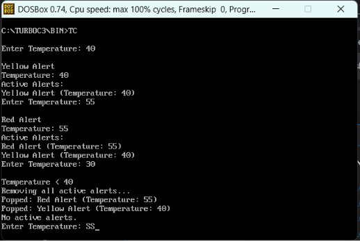

## DSA Experiment No. 1

### Aim:

To implement a **Heatwave Alert System** using Stack operations and an array to generate alerts based on temperature.

### Objective:

-   To implement a stack using an array.
-   To use `Push()` and `Pop()` operations for managing heatwave alerts.
-   To generate Yellow, Orange, and Red alerts based on temperature.
-   To remove all active alerts when the temperature falls below 40.

### Software Used:

-   DOSBox
-   Turbo C++

### Theory:

A stack is a linear data structure that follows the **LIFO (Last In First Out)** principle. In this program, an array is used to implement the stack. Heatwave alerts are stored in the stack using the `Push()` operation. The alert is generated according to the entered temperature: **40 or above gives Yellow Alert, 43 or above gives Orange Alert, and 45 or above gives Red Alert**. When the temperature is below 40, all active alerts are removed using the `Pop()` operation. The program also displays the temperature that triggered each alert.
### Program:

```c
#include <stdio.h>
#include <conio.h>

int stack[100], top = -1;
int temp_stack[100];

void Push(int alert, int temperature)
{
    top++;
    stack[top] = alert;
    temp_stack[top] = temperature;
}

void Pop()
{
    if(top == -1)
    {
        printf("\nNo active alerts.");
    }
    else
    {
        if(stack[top] == 1)
            printf("\nPopped: Yellow Alert (Temperature: %d)", temp_stack[top]);
        else if(stack[top] == 2)
            printf("\nPopped: Orange Alert (Temperature: %d)", temp_stack[top]);
        else if(stack[top] == 3)
            printf("\nPopped: Red Alert (Temperature: %d)", temp_stack[top]);

        top--;
    }
}

void Display()
{
    int i;

    if(top == -1)
    {
        printf("\nNo active alerts.");
    }
    else
    {
        printf("\nActive Alerts:");

        for(i = top; i >= 0; i--)
        {
            if(stack[i] == 1)
                printf("\nYellow Alert (Temperature: %d)", temp_stack[i]);
            else if(stack[i] == 2)
                printf("\nOrange Alert (Temperature: %d)", temp_stack[i]);
            else if(stack[i] == 3)
                printf("\nRed Alert (Temperature: %d)", temp_stack[i]);
        }
    }
}

void main()
{
    int temperature;

    while(1)
    {
        printf("\nEnter Temperature: ");

        if(scanf("%d", &temperature) != 1)
        {
            printf("\nInvalid input. Program Finished.");
            break;
        }

        if(temperature >= 45)
        {
            printf("\nRed Alert");
            printf("\nTemperature: %d", temperature);
            Push(3, temperature);
        }
        else if(temperature >= 43)
        {
            printf("\nOrange Alert");
            printf("\nTemperature: %d", temperature);
            Push(2, temperature);
        }
        else if(temperature >= 40)
        {
            printf("\nYellow Alert");
            printf("\nTemperature: %d", temperature);
            Push(1, temperature);
        }
        else
        {
            printf("\nTemperature < 40");
            printf("\nRemoving all active alerts...");

            while(top != -1)
            {
                Pop();
            }
        }

        Display();
    }

    getch();
}
```

### Output:

 
### Outcome:

The Patient Diagnostic Alert System was successfully implemented using stack operations. Abnormal test results were stored as active alerts and removed using the Pop operation.

### Conclusion:

The program demonstrates the use of Stack, Push, Pop, Display, conditional statements, and user input to manage patient diagnostic alerts.
